## 🤖 프로젝트 소개

기존의 키워드 기반 검색을 넘어서, 사용자의 의도를 이해하고 맥락적으로 관련된 결과를 제공하는 AI 기반 검색 시스템을 구축했습니다.

## 🎯 핵심 기능

### 1. 의미 기반 검색
- **임베딩 모델**: Sentence-BERT를 활용한 문서 벡터화
- **유사도 계산**: 코사인 유사도 기반 관련성 측정
- **다국어 지원**: 한국어, 영어 동시 지원

### 2. 쿼리 의도 파악
```python
class QueryIntentClassifier:
    def __init__(self):
        self.model = AutoModel.from_pretrained('klue/bert-base')
        self.intents = ['factual', 'navigational', 'transactional']
    
    def classify_intent(self, query):
        # 쿼리 의도 분류 로직
        return self.predict_intent(query)
```

### 3. 개인화 추천
- 사용자 행동 패턴 분석
- 검색 기록 기반 선호도 학습
- 실시간 피드백 반영

## 🏗️ 시스템 아키텍처

### Data Pipeline
1. **수집**: 웹 크롤링 및 데이터 정제
2. **전처리**: 토큰화, 정규화, 불용어 제거
3. **벡터화**: 문서를 고차원 벡터로 변환
4. **인덱싱**: FAISS를 활용한 고속 벡터 검색 인덱스 구축

### Search Engine

```mermaid
graph LR
    A[사용자 쿼리] --> B[쿼리 분석]
    B --> C[임베딩 변환]
    C --> D[벡터 검색]
    D --> E[결과 랭킹]
    E --> F[개인화 필터링]
    F --> G[최종 결과]
```


## 📊 성능 지표

### 정확도 개선
- **기존 키워드 검색**: 72% 정확도
- **AI 기반 검색**: 89% 정확도 (+17% 개선)

### 응답 속도
- **평균 응답 시간**: 120ms
- **동시 처리 가능**: 1000+ QPS
- **인덱스 크기**: 100만 문서 기준 2.5GB

### 사용자 만족도
- **클릭률 (CTR)**: 34% → 47% (+13%p)
- **세션 지속 시간**: 평균 3.2분 증가
- **재검색률**: 45% → 28% 감소

## 🛠️ 기술 스택

### Backend
- **FastAPI**: API 서버 프레임워크
- **PostgreSQL**: 메타데이터 저장
- **Redis**: 검색 결과 캐싱
- **Elasticsearch**: 하이브리드 검색 지원

### AI/ML
- **PyTorch**: 딥러닝 프레임워크  
- **Hugging Face Transformers**: 사전 훈련 모델
- **FAISS**: 벡터 유사도 검색
- **Sentence-BERT**: 문장 임베딩

### Infrastructure
- **Docker**: 컨테이너화
- **Kubernetes**: 오케스트레이션
- **Prometheus**: 모니터링
- **Grafana**: 대시보드

## 🔍 구현 세부사항

### 1. 문서 임베딩 생성
```python
from sentence_transformers import SentenceTransformer

class DocumentEmbedder:
    def __init__(self):
        self.model = SentenceTransformer('klue/roberta-large')
    
    def embed_documents(self, documents):
        embeddings = self.model.encode(documents, 
                                     convert_to_tensor=True,
                                     batch_size=32)
        return embeddings
```

### 2. 검색 랭킹 알고리즘
```python
def calculate_relevance_score(query_embedding, doc_embeddings, 
                            doc_metadata):
    # 의미적 유사도 (70%)
    semantic_scores = cosine_similarity(query_embedding, doc_embeddings)
    
    # 인기도 점수 (20%)
    popularity_scores = normalize(doc_metadata['view_counts'])
    
    # 최신성 점수 (10%)
    recency_scores = time_decay(doc_metadata['publish_dates'])
    
    final_scores = (0.7 * semantic_scores + 
                   0.2 * popularity_scores + 
                   0.1 * recency_scores)
    
    return final_scores
```

### 3. 실시간 학습 시스템
```python
class OnlineLearner:
    def __init__(self):
        self.feedback_buffer = deque(maxlen=10000)
    
    def update_from_feedback(self, query, clicked_docs, skipped_docs):
        # 사용자 피드백 기반 모델 업데이트
        positive_samples = [(query, doc) for doc in clicked_docs]
        negative_samples = [(query, doc) for doc in skipped_docs]
        
        self.contrastive_learning(positive_samples, negative_samples)
```

## 📈 A/B 테스트 결과

### 실험 설정
- **기간**: 2024년 12월 - 2025년 1월 (4주)
- **대상**: 일일 활성 사용자 50,000명
- **분할**: 기존 시스템 50% vs AI 시스템 50%

### 주요 결과
| 지표 | 기존 시스템 | AI 시스템 | 개선율 |
|------|------------|-----------|--------|
| 검색 정확도 | 72.3% | 89.1% | +23.2% |
| 사용자 만족도 | 6.8/10 | 8.4/10 | +23.5% |
| 세션당 검색 수 | 2.8회 | 2.1회 | -25.0% |
| 목표 달성률 | 64% | 82% | +28.1% |

## 🚀 최적화 기법

### 1. 모델 경량화
- **지식 증류**: 대형 모델 → 소형 모델
- **양자화**: FP32 → INT8 (3배 속도 개선)
- **프루닝**: 불필요한 가중치 제거

### 2. 인프라 최적화
- **분산 처리**: 멀티 GPU 병렬 처리
- **캐싱 전략**: 3단계 캐시 레이어
- **로드 밸런싱**: 트래픽 분산 처리

### 3. 인덱싱 최적화
```python
# HNSW 알고리즘을 활용한 근사 최근접 이웃 검색
index = faiss.IndexHNSWFlat(embedding_dim)
index.hnsw.efConstruction = 200
index.hnsw.M = 32
```

## 🔐 보안 및 개인정보 보호

### 데이터 보안
- **암호화**: AES-256 데이터 암호화
- **접근 제어**: RBAC 기반 권한 관리
- **감사 로그**: 모든 접근 기록 추적

### 개인정보 보호
- **익명화**: 개인 식별 정보 제거
- **데이터 최소화**: 필요한 데이터만 수집
- **보관 기간 제한**: 자동 데이터 삭제

## 📚 학습 과정에서 배운 점

### 기술적 도전과 해결
1. **대용량 데이터 처리**: 분산 처리 아키텍처 도입
2. **실시간 학습**: 온라인 학습 알고리즘 적용  
3. **다국어 지원**: 언어별 특화 모델 앙상블

### 비즈니스 관점에서의 인사이트
- 사용자 피드백의 중요성
- 점진적 배포의 필요성
- 성능과 정확도의 트레이드오프

## 🔮 향후 발전 방향

### 단기 목표 (3개월)
- [ ] 음성 검색 기능 추가
- [ ] 이미지 검색 통합
- [ ] 검색 결과 개인화 강화

### 중기 목표 (6개월)
- [ ] 멀티모달 검색 (텍스트 + 이미지 + 음성)
- [ ] 대화형 검색 인터페이스
- [ ] 실시간 지식 그래프 구축

### 장기 목표 (1년)
- [ ] AGI 기반 질의응답 시스템
- [ ] 예측 검색 기능
- [ ] 크로스 도메인 지식 연결

## 📄 관련 논문 및 자료

- [Attention Is All You Need](https://arxiv.org/abs/1706.03762)
- [BERT: Pre-training of Deep Bidirectional Transformers](https://arxiv.org/abs/1810.04805)
- [Sentence-BERT: Sentence Embeddings using Siamese BERT-Networks](https://arxiv.org/abs/1908.10084)

## 🏆 수상 및 인정

- **2024 AI 혁신 대상** - 한국AI학회
- **Best Paper Award** - KDD 2024
- **특허 출원** - 3건 (진행 중)