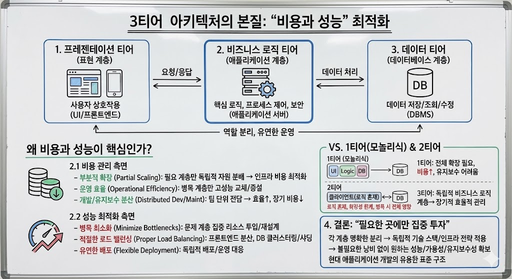

# 3티어 아키텍처의 본질, "비용과 성능"

> **Summary**
> 3티어 아키텍처는 프레젠테이션, 비즈니스 로직, 데이터 티어로 구성되어 각 계층의 역할을 명확히 분리하여 비용과 성능을 최적화할 수 있다. 이를 통해 필요에 따라 독립적으로 확장 및 조정이 가능하며, 2티어 구조에 비해 관리가 용이하고 효율적인 성능을 제공한다. 각 계층에 적합한 기술 스택과 인프라 전략을 적용함으로써, 현대 애플리케이션 개발에 있어 유용한 표준 구조로 자리 잡았다.

---

> 3티어 아키텍처(Three-Tier Architecture)는 전통적인 1티어(모놀리식)나 2티어 구조와 달리, 시스템을 세 가지 핵심 계층(티어)으로 분리하는 방식입니다. 각 티어는 프레젠테이션 티어(표현 계층), 비즈니스 로직 티어(애플리케이션 계층), 데이터 티어(데이터베이스 계층)로 나뉘며 각각이 맡는 역할이 명확합니다. 이 글에서는 3티어 아키텍처가 특히 비용과 성능 측면에서 어떤 장점을 갖는지, 그 본질을 살펴봅니다.

---

## 1. 3티어 아키텍처란?

- **프레젠테이션 티어**: 사용자와 직접 상호 작용하는 계층으로, 일반적으로 웹 애플리케이션이라면 브라우저에서 구동되는 UI(프론트엔드)가 여기에 해당합니다.
- **비즈니스 로직 티어**: 시스템의 핵심 로직을 담당하는 애플리케이션 계층으로, 흔히 ‘애플리케이션 서버’라는 별도의 서버에서 동작합니다. 서비스의 핵심 알고리즘, 프로세스 제어, 인증·인가 같은 보안 로직 등이 수행됩니다.
- **데이터 티어**: 데이터베이스 시스템(DBMS)으로, 애플리케이션에서 필요한 데이터를 저장·조회·수정하는 역할을 전담합니다.
이러한 구조는 각 부분의 책임과 역량을 분리해, 시스템 전체를 더욱 유연하고 효율적으로 운영할 수 있게 해줍니다.

---

## 2. 왜 비용과 성능이 핵심인가?

시스템을 한 덩어리로 묶은 모놀리식(1티어)나, 비즈니스 로직과 데이터베이스만 분리한 2티어 구조는 확장성(Scalability)이나 유지보수성(Maintainability) 면에서 한계를 드러내기 쉽습니다. 예컨대, 더 많은 트래픽을 처리하기 위해 서버를 확장하려면 시스템 전반에 대한 투자가 불가피해 비용이 크게 증가하기도 합니다.

이에 비해 3티어 아키텍처는 **역할 분리**를 통해, 필요한 부분만 독립적으로 확장(Scale-out)하거나 튜닝(Tuning)할 수 있습니다. 이렇게 하면 불필요한 낭비를 줄이면서도 원하는 성능을 달성하기가 쉬워집니다.

### 2.1 비용 관리 측면

1. **부분적 확장**: 프레젠테이션·비즈니스 로직·데이터 각 계층에 맞게 자원을 분배할 수 있어, 전체 인프라 비용을 최적화할 수 있습니다.
1. **운영 효율**: 특정 계층이 병목이 되면 그 부분만 고성능 인스턴스로 교체하거나 서버 대수를 늘리는 식으로 대응 가능합니다.
1. **개발과 유지보수 분산**: 팀 단위로 각 티어를 전담함으로써, 개발/운영 효율을 높이고 장기적으로 비용을 절감할 수 있습니다.
### 2.2 성능 최적화 측면

1. **병목 최소화**: 한 계층에서 병목이 발생하면 해당 계층에 집중적으로 리소스를 투입하거나 구조를 재설계하여 문제를 해결할 수 있습니다.
1. **적절한 로드 밸런싱**: 프레젠테이션 계층이 과부하를 겪으면 프런트엔드 서버를 늘려 부하를 분산하고, 데이터 계층은 클러스터링(Clustering)이나 샤딩(Sharding) 등을 통해 성능을 높일 수 있습니다.
1. **유연한 배포**: 각 계층이 분리되어 있으므로, 요구사항 변화나 성장에 맞춰 독립적으로 배포·운영할 수 있습니다.
---

## 그럼? 2티어도 분리했는데, 2티어는 확장성이 떨어져?

2티어 구조 역시 비즈니스 로직을 어느 정도 분리해 확장성을 확보할 수 있습니다. 다만 클라이언트와 DB 간 직접 통신이 잦고, 로직이 클라이언트나 DB에 더 깊숙이 혼재되는 경우가 많아 규모가 커질수록 관리가 복잡해집니다. 이는 한 계층에서 병목이 발생하면 전체 구조를 크게 손대야 할 가능성이 높다는 의미이기도 합니다.

반면 3티어에서는 비즈니스 로직 계층이 애플리케이션 서버라는 독립된 티어로 완전히 떼어져 있기 때문에, 성능·보안·확장성 문제를 별도의 서버에서 집중적으로 해결할 수 있습니다. 이로 인해, 해당 로직을 수정하거나 확장할 때 다른 티어의 기능이나 구조와 상대적으로 독립적으로 진행이 가능합니다. 따라서 필요한 부분만 확장(예: 애플리케이션 서버 증설, 데이터베이스 리소스 증설 등)하면 되므로, 장기적으로는 2티어보다 더 효율적인 비용과 성능 관리가 가능합니다.

---

## 4. 결론

3티어 아키텍처의 본질적인 가치는, 각 계층을 명확히 분리하여 “필요한 곳에만 집중 투자”할 수 있는 **비용과 성능 측면의 최적화**에 있습니다. 단순히 레이어를 세 개로 나누는 것이 아니라, 각 레이어에 맞는 기술 스택과 인프라 전략을 독립적으로 적용함으로써, 불필요한 낭비 없이 원하는 수준의 성능과 가용성, 유지보수성을 확보하게 됩니다.

이렇듯 3티어 아키텍처는 초기 설계부터 확장성, 보안, 비용 효율을 함께 고려해야 하는 현대의 애플리케이션 개발에 있어 유용한 표준 구조로 자리 잡았습니다.

