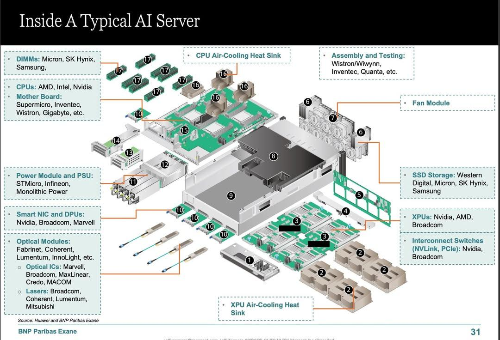
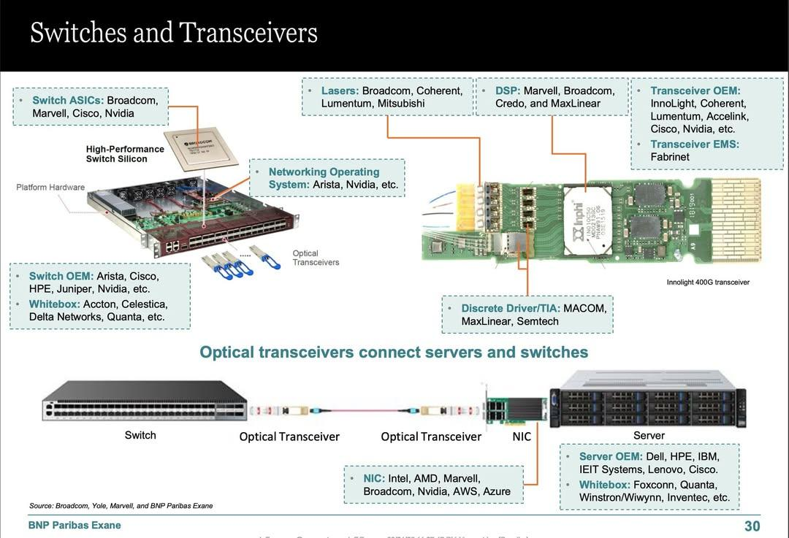

# AI 인프라 공급망 수혜 구조

> **Summary**
> AI 인프라 공급망의 주요 부품 공급업체로는 Nvidia, AMD, Broadcom, Micron, SK Hynix, Samsung 등이 있으며, 서버 조립과 테스트는 대만 ODM 업체들이 수행한다. AI 서버 간의 네트워킹 인프라는 Broadcom, Marvell, Cisco 등이 담당하고, AI 관련 주식 투자 발굴을 위한 자료로, AI 인프라 밸류체인에서 수혜를 받을 기업들을 정리하고 있다.

---

🔗 [https://claude.ai/share/5d1b07d0-4c30-472d-b3ed-28c1baa83ec6](https://claude.ai/share/5d1b07d0-4c30-472d-b3ed-28c1baa83ec6)

# AI 인프라 공급망

### **첫 번째 이미지: AI 서버 내부 구조**

BNP Paribas Exane이라는 투자은행 리서치에서 나온 자료다. 일반적인 AI 서버 한 대를 분해해서, 각 부품별로 어떤 회사들이 공급하는지를 보여준다.

서버의 핵심인 XPU(GPU 등 가속기)는 Nvidia, AMD, Broadcom이 만들고, 이걸 연결하는 인터커넥트 스위치도 Nvidia와 Broadcom이 담당한다. 메모리(DIMM)는 Micron, SK Hynix, Samsung이, SSD 스토리지는 Western Digital, Micron, SK Hynix, Samsung이 공급한다. 메인보드는 Supermicro, Inventec, Wistron, Gigabyte 같은 ODM 업체들이 만들고, CPU는 AMD, Intel, Nvidia가 담당한다. 전원부(PSU)는 STMicro, Infineon, Monolithic Power, 네트워크 카드(Smart NIC/DPU)는 Nvidia, Broadcom, Marvell이 맡는다. 광모듈 쪽은 Fabrinet, Coherent, Lumentum, InnoLight 등이 공급하고, 최종 조립과 테스트는 Wistron/Wiwynn, Inventec, Quanta 같은 대만 ODM이 수행한다.

### **두 번째 이미지: 스위치와 트랜시버**

AI 서버들을 서로 연결하는 네트워킹 인프라를 설명한다. 서버 안의 NIC(네트워크 카드)에서 광 트랜시버를 통해 스위치까지 연결되는 구조를 보여준다. 스위치 ASIC은 Broadcom, Marvell, Cisco, Nvidia가 만들고, 스위치 완제품은 Arista, Cisco, HPE, Juniper 같은 OEM과 Accton, Celestica 같은 화이트박스 업체가 공급한다. 트랜시버는 InnoLight, Coherent, Lumentum 등이 만들고, 그 안에 들어가는 레이저, DSP 칩 등의 핵심 부품 공급사도 표시되어 있다.

### 그 외 AI인프라 밸류체인 회사

누군가가 위 두 슬라이드에서 언급되지 않았지만 AI 인프라 밸류체인에서 중요한 회사들을 정리한 것이다. Amphenol(커넥터/케이블), Arista(네트워크 스위치), Dell(서버), Tenstorrent(AI 칩 스타트업), FS(광통신 장비), Netgear(네트워크), IBM(서버/인프라), Palo Alto Networks(보안)가 나열되어 있다.

---

## 이 이미지를 올린 의도

거의 확실하게 **AI 관련 주식 투자 종목 발굴** 목적이다.

BNP Paribas Exane은 투자은행 리서치 부서이고, 이 자료 자체가 AI 인프라 밸류체인에서 어떤 기업이 수혜를 받는지를 투자자에게 보여주기 위해 만든 것이다. AI 서버 한 대가 만들어지려면 수십 개 회사의 부품이 필요한데, 이 공급망 지도를 통해 "AI 붐의 실질적 수혜주"를 한눈에 파악할 수 있다.

세 번째 이미지의 "빠진거" 리스트는 이 리서치 자료에서 누락된 추가 수혜 기업을 보완한 것으로, 커뮤니티나 지인이 투자 관점에서 덧붙인 것으로 보인다. 즉, Nvidia 같은 직접적인 GPU 기업뿐 아니라 Amphenol(서버 내부 고속 커넥터), Arista(데이터센터 스위치), Dell(AI 서버 조립/판매) 같은 "곡괭이 장사" 기업들까지 투자 대상으로 검토하겠다는 의미다.

