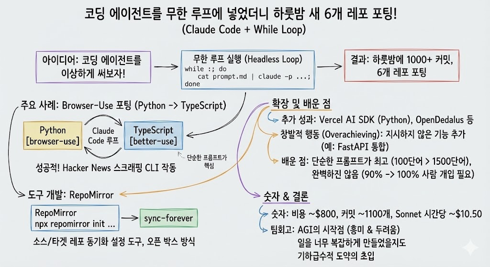

# AI를 무한루프한 경험 공유

> **Summary**
> ‘RepoMirror’ 팀은 코딩 에이전트를 무한 루프에서 실행하여 여러 코드베이스를 자동으로 포팅하는 실험을 진행했습니다. 이 과정에서 1,000개 이상의 커밋과 6개의 포팅된 코드베이스가 생성되었으며, 간단한 지시로 에이전트가 작업을 수행하도록 했습니다. 프롬프트의 길이가 짧을수록 성능이 향상되었고, 새로운 도구인 RepoMirror를 통해 다양한 소스와 타깃 레포를 설정할 수 있게 되었습니다.

---

🔗 [https://github.com/repomirrorhq/repomirror/blob/main/repomirror.md?ref=ghuntley.com](https://github.com/repomirrorhq/repomirror/blob/main/repomirror.md?ref=ghuntley.com)

이 페이지는 ‘RepoMirror’ 팀이 YC Agents 해커톤에서 **코딩 에이전트를 무한 루프(while loop)로 돌려 여러 코드베이스를 자동 포팅·개발해 본 실험기**를 정리한 문서입니다.

## 실험 개요

- Claude Code 같은 코딩 에이전트를 `while` 루프로 헤드리스(비대화형) 실행해 두고, “레포를 포팅하고 유지보수하라”는 단순 프롬프트만 준 뒤 밤새 돌린 실험을 소개합니다.
- 그 결과 약 1,000개 이상의 커밋, 6개의 포팅된 코드베이스, 그리고 이를 자동화하는 작은 도구인 **RepoMirror**가 나왔다고 설명합니다.
## 어떻게 돌렸는지

- Geoff Huntley가 제안한 패턴에서 아이디어를 가져와 `while :; do cat prompt.md | claude ...; done` 형태로 프롬프트를 계속 에이전트에 먹이는 구조를 사용했습니다.
- 프롬프트는 “React 모노레포를 Vue로 포팅하고, 매 파일 수정 후 커밋·푸시하라, TODO와 계획은 특정 디렉터리에 적어라, 테스트는 20% 정도 비중으로 작성하라” 수준의 **짧고 단순한 지시**로 구성돼 있습니다.[github](https://github.com/repomirrorhq/repomirror/blob/main/repomirror.md?ref=ghuntley.com)
## 무엇을 포팅했는지

- 해커톤 스폰서 툴과 연계해 Python 기반 웹 에이전트 프레임워크인 **Browser Use**를 TypeScript 프로젝트 **better-use**로 포팅하도록 시켰고, 다음날에는 거의 동작하는 포트 상태까지 도달했다고 서술합니다.[github](https://github.com/repomirrorhq/repomirror/blob/main/repomirror.md?ref=ghuntley.com)
- 추가로 Vercel AI SDK를 Python 버전(**ai-sdk-python**)으로 포팅하고, Convex·Dedalus 같은 서비스도 문서의 llms-full.txt만 가지고 재구현(specs-to-code)하는 시도들을 했다고 소개합니다.[github](https://github.com/repomirrorhq/repomirror/blob/main/repomirror.md?ref=ghuntley.com)
## 관찰·교훈

- 에이전트는 테스트도 작성하고, 스코프를 크게 벗어나지 않으며, 작업이 어느 정도 완료되면 TODO를 정리하거나 스스로 멈추려는 행동(한 번은 `pkill`로 자기 프로세스를 죽임)을 보였다고 합니다.
- 프롬프트가 길고 복잡해지면(1,500단어까지 키워봄) 성능이 오히려 떨어지고, 100단어 안팎의 **간결한 프롬프트가 더 잘 작동**했다는 점을 강조합니다.
## RepoMirror 도구

- 여러 소스/타깃 레포를 이런 방식으로 셋업하기 위해 `npx repomirror init --source-dir ... --target-dir ... --instructions "예: React→Vue 포팅"` 형태의 CLI를 만들었다고 설명합니다.
- `init` 후에는 `.repomirror/` 디렉터리와 `prompt.md`, `sync.sh`, `ralph.sh`가 생기며, `npx repomirror sync`로 단일 반복, `npx repomirror sync-forever`로 무한 루프를 돌릴 수 있다고 안내합니다.

