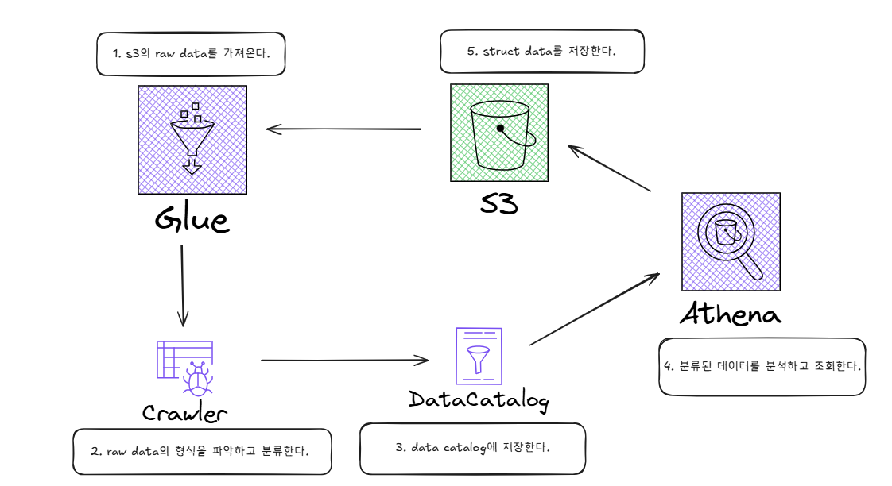

# AWS Lakeformation - 

> **Summary**
> Lake Formation은 S3 데이터 레이크의 접근을 효과적으로 관리하기 위한 솔루션으로, 각 부서에 하나의 IAM을 부여하고 세부적으로 접근 권한을 설정하여 무분별한 접근을 제어한다. Athena와 Glue는 Lake Formation을 통해 S3에 접근하며, 권한이 없으면 접근이 거부된다.

---

원본글

## Lake Formation

- WHAT
  - 한마디로 똑똑한 문지기이다.
- WHY
  - 데이터 레이크인 S3에는 다양한 정보가 담겨있다.

  - 사람들이 무분별하게 접근 하는 게 상식적으로 맞을까?

  - 무분별한 접근을 제어를 위해서 IAM을 부여해야하는데…. 

  - 수많은 부서 서로 다른 직급의 사람들에게 각각 알맞은 역할을 부여하려면 IAM은 엄청 많아지고 정책과 권한은 길어질 것이다.

  - 그래서 부서 또는 팀에게 하나의 IAM를 주고 Lake Formation에서 세분적으로 각 iam의 s3의 어느 부분까지 접근이 가능한지 허락해준다. (예: 다이아 광부는 1층까지, 금 광부는 3층까지…등등)
- HOW?

  Athena도 처리된 쿼리를 S3에 저장할때, Lake Formation을 이용하기 때문에, LakeFormation을 이용해야 한다.
Glue는 애초에 S3의 데이터를 읽어 크롤링 해야 하기에, (s3::get) Lake Formation을 활용한다.

  해당 그림은, 결국 Athena 든 Glue든 결과적으로 s3를 사용해야하기에, 다음과 같은 그림이 그려지는 것이다.
결국에 glue랑 athena는 get, put이든 s3에 접근을 해야한다.
s3에 대한 접근을 lake formation이 갖고 있으면 grant를 안해주면 거부 당한다.

