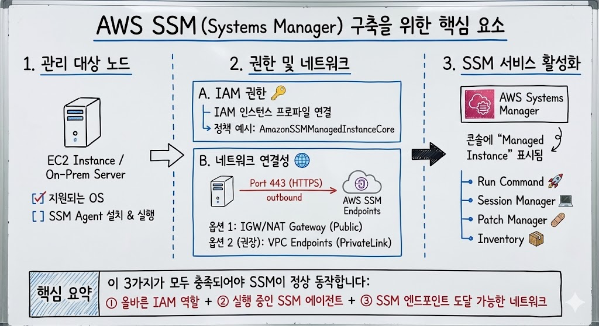

# AWS SSM을 구축하기 위해선, 다음 요소들이 고려되어야한다.

> **Summary**
> AWS SSM 구축을 위해 IAM 역할 추가, 엔드포인트 생성, bastion EC2 설정, RDS 보안 그룹 설정 및 접속 테스트가 필요하다. 엔드포인트는 SSM, EC2 메시징, SSM 메시징 채널을 위해 각각 3개 생성해야 하며, bastion EC2는 Amazon Linux 2를 사용하고 SSH 접근을 허용해야 한다. 접속 테스트는 bastion에서 EC2, EC2에서 RDS로 진행된다.

---



```json
1. ssm 생성
- IAM에서 역할을 추가해줘야한다. 역할은 3가지가 필요하다
	- AmazonEC2FullAccess
	- AmazonEC2RoleforSSM
	- AmazonSSMManagedInstanceCore

2. 엔드포인트 생성
- ssm은 하나의 점프호스트라고 생각해도 좋다. private subnet으로 접근하기 위해 endpoint를 생성해줘야한다
- SSM 서비스 자체 및 관련 서비스들과의 통신을 위해 생성해줘야한다. 일반적으로 프라이빗 서브넷에서 SSM 기능을 사용하려면 다음의 인터페이스 VPC 엔드포인트가 필요합니다.
- 이때, 번거롭지만, 엔드포인트를 총 3개를 만들어줘야한다.
	- **com.amazonaws.<region>.ssm **
		(Systems Manager 서비스용)
	- **com.amazonaws.<region>.ec2messages **
		(SSM 에이전트가 Systems Manager와 통신하기 위해 사용)
	- **com.amazonaws.<region>.ssmmessages**
		(Session Manager, Run Command 등 SSM의 메시징 채널용)
		(선택적으로, SSM 로그나 아티팩트를 S3에 저장하는 경우 com.amazonaws.<region>.s3 게이트웨이 엔드포인트)
- 또한, VPC를 설정할떄, DNS설정이 안되어있으면 생성 안된다.

3. bastion ec2 생성
- Amazon Linux 2 (ssm agent가 설치되어있음)
- 키페어 생성, pem파일은 bastion에도 존재해야한다.
- 보안그룹 생성 (ssh 22 허용해야함)

4. rds 설정
- 보안그룹 생성 (3306 허용해야함)

5. 접속 테스트
- bastion -> ec2
	- bastion에 .pem이 저장되어있다고 가정하고
	- 접속하려는 대상 ec2의 보안그룹 설정에 ssh는 허용되어있어야한다
	- ssh -i "mgz-0523-sbu-sshkey.pem" ec2-user@10.0.154.5
- ec2 -> rds
	- 대상 rds에 보안그룹 설정에 3306이 허용되어있어야한다.
	- mysql -h mgz-sbu-db.c7k48oeqmg0l.us-east-1.rds.amazonaws.com -P 3306 -u admin -p
```

