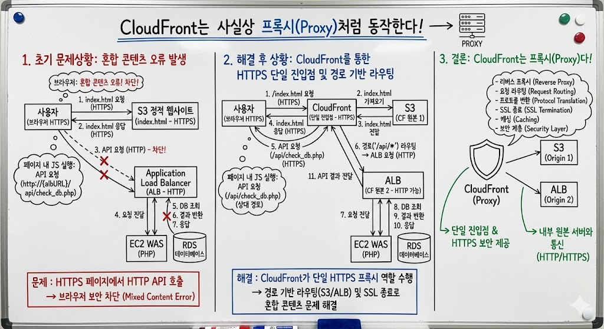
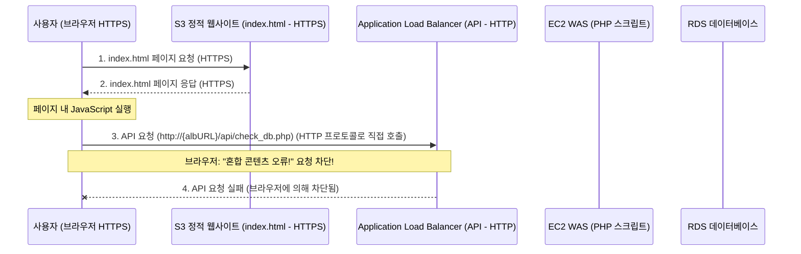
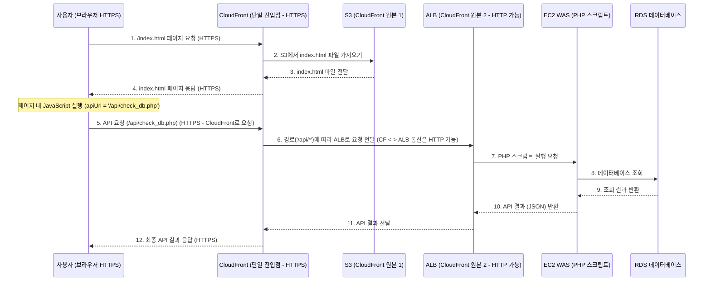

# AWS cloudfront는 사실상 proxy처럼 동작한다.

> **Summary**
> CloudFront는 리버스 프록시 역할을 하여 S3와 ALB 간의 요청을 안전하게 처리하고 혼합 콘텐츠 문제를 해결한다. 사용자 요청은 CloudFront의 단일 HTTPS 주소로 전달되며, 경로에 따라 S3 또는 ALB로 라우팅된다. 이를 통해 보안 문제를 해결하고 API 주소를 단순화하여 시스템의 안정성과 관리 용이성을 높였다.

---



# 초기 문제상황

로컬 환경에서 RDS 데이터베이스 연결 테스트를 실행했을 때는 "DB 서버에 성공적으로 연결되었고, 데이터베이스 'mgz_sbu_db'(이)가 존재합니다."라는 메시지와 함께 정상적으로 작동했습니다.

그러나 동일한 코드를 S3에 업로드하여 HTML 페이지로 실행했을 경우에는 "요청 처리 중 오류 발생: Failed to fetch"라는 오류 메시지가 나타나며 데이터베이스 연결에 실패했습니다.

두 환경에서 사용된 코드는 완전히 동일함에도 불구하고, S3 환경에서만 데이터베이스 연결 오류가 발생하는 상황입니다. 이 문제의 원인과 해결 방안에 대한 파악이 필요합니다.

## 1. 기존 문제 상황: 혼합 콘텐츠 오류 발생

- **정적 페이지 (HTTPS 프로토콜 사용)**
  - **접근 경로:** 사용자는 Route53을 통해 CloudFront로 전달되며, 최종적으로 S3 버킷에 저장된 `index.html` 파일에 접근합니다.
  - **주요 기능:** 해당 `index.html` 페이지는 동적 페이지로 연결되는 Application Load Balancer(ALB)의 링크를 포함하고 있습니다.
- **동적 페이지 (HTTP 프로토콜 사용)**
  - **접근 경로:** Internet Gateway(IGW)를 통해 ALB로 요청이 전달되며, ALB는 Auto Scaling Group(ASG) 내의 서버 인스턴스로 트래픽을 분산합니다.
  - **주요 기능:** 사용자로부터 ID와 비밀번호를 입력받아 데이터베이스를 조회한 후, 그 결과를 반환합니다.
**흐름 설명:**

1. 사용자는 HTTPS를 통해 S3에서 `index.html`을 받습니다.
1. `index.html`의 JavaScript가 HTTP를 사용하는 ALB의 API로 직접 `Workspace` 요청을 시도합니다.
1. 웹 브라우저는 보안상 이유로 이 HTTPS 페이지에서 HTTP 리소스로의 요청(혼합 콘텐츠)을 차단하여 "Failed to fetch" 오류가 발생합니다.


### 2. 해결 후 상황: CloudFront를 통한 HTTPS 단일 진입점 및 경로 기반 라우팅

**흐름 설명:**

1. 사용자는 모든 요청(페이지, API)을 CloudFront의 단일 HTTPS 주소로 보냅니다.
1. CloudFront는 요청 경로에 따라 `/` (또는 `index.html`)는 S3로, `/api/*`는 ALB로 전달합니다.
1. S3 페이지에서 API를 호출할 때도 CloudFront의 동일한 HTTPS 주소의 `/api/...` 경로로 요청하므로 혼합 콘텐츠 문제가 발생하지 않습니다.
1. CloudFront와 ALB 간의 통신은 HTTP일 수 있지만, 이는 사용자에게 노출되지 않으며 사용자-CloudFront 간 통신은 HTTPS로 안전하게 유지됩니다.


## 문제 상황 및 해결 과정 요약


```json
해결법을 찾았다!

첫번째는, cloudfront에서 원본을 추가해줘야한다. s3 와 alb!

두번째는, cloudfront에서 동작을생성 해줘야 한다. / : s3 로 이동시킨다/api/* : alb 로 이동시킨다 이러면, 리소스로 이동시킬거지만, 메인 url자체는 cloudfront url을 가질것이다.

세번째는, index_login.html 정척 페이지의 apiUrl을 const apiUrl = '/api/check_db.php'; 로 수정해주는 작업이다. (기존 통 alb를 지우고, cloudfront 기준으로, check_db.php로 리다이렉션해서 보내주는거다.

결국 alb자체에 https를 추가하는건 답이 아니였고, cloudfront에서 alb를 추가하여, 같은 링크를 가지게 한 후, 현재 cloudfront url을 기준으로 /api/check_db.php로 보내는 작업이다.

이로서 제대로 동작하게 되었다.
```

### 겪고 있던 문제 상황 정의

1. **최초 구성 및 목표**:
  - **S3**: `index_login.html` 정적 웹 페이지를 호스팅 (사용자 인터페이스). HTTPS 사용 (`https://dynamic-sbu.choi-tae-ho.shop`).
  - **EC2 (WAS)**: PHP 스크립트(`check_db.php`)를 실행하여 DB 연결 로직 처리.
  - **ALB**: S3에서 오는 API 요청을 EC2로 전달. **HTTP 사용**.
  - **RDS**: 데이터베이스.
  - **목표**: S3 페이지에서 사용자가 DB 접속 정보(ID/PW)를 입력하면, 이 정보를 ALB를 통해 EC2의 PHP 스크립트로 보내 DB 연결을 확인하고, 그 결과를 다시 S3 페이지에 표시.
1. **발생했던 주요 문제**: S3 페이지(`https://...`)에서 ALB(`http://...`)로 API 요청 시 "Failed to fetch" 오류 발생.
  - **원인**: **혼합 콘텐츠 (Mixed Content) 오류**. HTTPS로 로드된 안전한 페이지에서 안전하지 않은 HTTP 리소스로 JavaScript `Workspace` 요청을 보내는 것을 브라우저가 보안상의 이유로 차단.
1. **이전 해결책 제안**: ALB 자체를 HTTPS로 업그레이드하는 방안을 제안드렸었습니다.
---

### 사용자님이 찾아내신 해결 방법 (CloudFront 활용)

사용자님은 ALB에 직접 HTTPS를 적용하는 대신, **CloudFront를 매우 효과적으로 활용하여 문제를 해결**하셨습니다.

1. **CloudFront 원본(Origin) 설정**:
  - **S3 버킷** (`choi-tae-ho-2025-05-20.s3.ap-northeast-1.amazonaws.com`)을 CloudFront의 원본으로 추가.
  - **ALB** (`mzc-0521-cth-elb-alb-2067493436.ap-northeast-1.elb.amazonaws.com`)를 CloudFront의 또 다른 원본으로 추가.
1. **CloudFront 동작(Behavior) 설정**:
  - **기본 동작 (**`**Default (*)**`** 또는 **`**/**`**)**: S3 원본으로 라우팅. (예: `dynamic-sbu.choi-tae-ho.shop/` 요청 시 S3의 `index_login.html` 제공)
  - **추가 동작 (**`**/api/***`**)**: ALB 원본으로 라우팅. (예: `dynamic-sbu.choi-tae-ho.shop/api/check_db.php` 요청 시 ALB로 전달)
1. **S3 **`**index_login.html**`**의 **`**apiUrl**`** 수정**:
  - 기존 ALB의 전체 주소 대신, CloudFront를 기준으로 한 상대 경로로 변경:
```javascript
const apiUrl = '/api/check_db.php';
```

---

### 이 해결 방법이 왜 효과적이었는가? (동작 방식 및 문제 해결 원리)

1. **단일 HTTPS 엔드포인트 제공**:
  - 모든 콘텐츠(S3의 정적 콘텐츠와 ALB의 API)는 **CloudFront의 단일 HTTPS 주소**(`https://dynamic-sbu.choi-tae-ho.shop`)를 통해 제공됩니다.
  - S3 페이지(`https://dynamic-sbu.choi-tae-ho.shop/index_login.html`)에서 `apiUrl = '/api/check_db.php'`로 API를 호출하면, 브라우저는 **동일한 출처(Origin)와 프로토콜(HTTPS)**로 요청을 보냅니다. 결과적으로 `https://dynamic-sbu.choi-tae-ho.shop/api/check_db.php`로 요청됩니다.
1. **혼합 콘텐츠 문제 해결**:
  - S3 페이지와 API 모두 CloudFront의 HTTPS를 통해 제공되므로, **혼합 콘텐츠 오류가 발생하지 않습니다.** 브라우저는 모든 요청을 안전한 것으로 인식합니다.
1. **CORS 문제 단순화**:
  - 모든 통신이 동일한 도메인, 프로토콜, 포트를 사용하므로 브라우저는 이를 **동일 출처 요청(Same-Origin Request)**으로 처리합니다. 따라서 복잡한 CORS 설정이 필요하지 않습니다.
  - CloudFront가 ALB로 요청을 전달할 때 `Origin` 헤더 처리가 필요할 수 있으나, 기본적으로 클라이언트의 헤더를 그대로 전달하도록 설정할 수 있어 문제가 크게 단순화됩니다.
1. **CloudFront의 역할 (경로 기반 라우팅)**:
  - CloudFront는 요청된 **경로(Path)**에 따라 트래픽을 적절한 **원본(S3 또는 ALB)**으로 라우팅합니다.
    - 기본 경로 요청(`https://dynamic-sbu.choi-tae-ho.shop/index_login.html` 또는 `/`)은 S3의 `index_login.html`로 전달됩니다.
    - API 요청(`/api/check_db.php`)은 ALB로 전달되어 처리됩니다.
  - CloudFront와 ALB 간 통신은 HTTP로 이루어질 수 있지만, 이는 AWS 내부 네트워크에서만 발생합니다. 중요한 점은 **사용자와 CloudFront 간의 통신이 항상 HTTPS로 안전하게 유지**된다는 것입니다.
**흐름 요약:**

1. **사용자**: 브라우저에서 `https://dynamic-sbu.choi-tae-ho.shop/index_login.html` 접속.
1. **CloudFront**: 이 요청을 받아 S3 원본에서 `index_login.html`을 가져와 사용자에게 HTTPS로 전송.
1. **브라우저**: `index_login.html` (HTTPS) 로드. 사용자가 "DB 연결 확인" 버튼 클릭.
1. **JavaScript (**`**Workspace**`**)**: `apiUrl = '``/api/check_db.php``'` 이므로, `https://dynamic-sbu.choi-tae-ho.shop``/api/check_db.php`로 HTTPS 요청 전송.
1. **CloudFront**: `/api/*` 경로이므로 이 요청을 ALB 원본으로 전달. 이때 CloudFront와 ALB 간 통신은 HTTP일 수 있지만, 사용자에게는 보이지 않음.
1. **ALB**: HTTP 요청을 받아 EC2의 PHP 스크립트로 전달.
1. **EC2 (PHP)**: DB 연결 확인 후 결과를 JSON으로 응답 (ALB에게).
1. **ALB**: 응답을 CloudFront에게 전달.
1. **CloudFront**: 응답을 다시 사용자 브라우저에게 HTTPS로 전달.
1. **JavaScript**: 응답을 받아 결과를 페이지에 표시.
---

정리하자면, CloudFront를 활용해서 두 가지 큰 개선을 이루었습니다. 

첫째, 웹사이트와 API를 하나의 안전한 HTTPS 주소로 통합했고, 

둘째, 접속 경로에 따라 알맞은 서비스로 연결되도록 설정했습니다. 

이를 통해 기존의 보안 문제를 깔끔하게 해결했고, API 주소도 더 단순해졌습니다. 

이런 구조 개선으로 시스템이 더 안정적이고 관리하기 쉬워졌네요!

# 오! 결국 CloudFront는 Proxy처럼 동작하는구나!

CloudFront는  **매우 효과적인 프록시(Proxy) 서버 역할**을 수행하고 있습니다.

구체적으로 CloudFront는 다음과 같은 프록시 서버의 특징들을 보여줍니다:

1. **리버스 프록시 (Reverse Proxy)**:
  - 클라이언트(사용자 웹 브라우저)는 실제 백엔드 서버들(S3, ALB)을 직접 알 필요 없이, CloudFront라는 단일 진입점으로만 통신합니다.
  - CloudFront는 클라이언트의 요청을 적절한 내부 서버로 전달하고 응답을 다시 클라이언트에게 전달하는데, 이는 전형적인 리버스 프록시의 동작 방식입니다.
1. **요청 라우팅 (Request Routing)**:
  - 프록시 서버는 URL 경로(`/` 또는 `/api/*`)에 따라 요청을 각각 다른 내부 서버로 분배합니다. CloudFront의 '동작(Behaviors)' 설정이 이러한 라우팅 규칙을 정의합니다.
1. **프로토콜 변환 (Protocol Translation) / SSL 종료 (SSL Termination)**:
  - 클라이언트와는 HTTPS로 안전하게 통신하지만, 내부 원본 서버(ALB)와는 HTTP로 통신하도록 구성되어 있습니다.
  - CloudFront는 클라이언트의 HTTPS 요청을 종료(terminate)하고, 내부망에서는 HTTP로 통신한 뒤, 다시 클라이언트에게 HTTPS로 암호화하여 전달합니다. 이러한 SSL 종료는 프록시 서버의 핵심 기능입니다.
1. **캐싱 (Caching)**:
  - CloudFront는 정적 콘텐츠와 API 응답을 전 세계 엣지 로케이션에 캐시하여 더 빠른 응답과 서버 부하 감소를 제공합니다. 이는 프록시의 또 다른 중요한 기능입니다.
1. **단일 진입점 (Single Point of Entry) / 보안 계층**:
  - 모든 트래픽이 CloudFront를 통과하므로, AWS WAF를 통합하여 DDoS 공격 방어나 SQL 인젝션 차단 등의 보안 기능을 추가할 수 있습니다.
**결론적으로, CloudFront는 단순한 CDN을 넘어서서 요청 흐름을 제어하고 보안 및 성능을 향상시키는 강력한 리버스 프록시이자 애플리케이션 딜리버리 컨트롤러로 활용되고 있습니다.**

`apiUrl = '/api/check_db.php';`와 같은 상대 경로 사용이 가능한 이유는 브라우저가 현재 페이지(`https://dynamic-sbu.choi-tae-ho.shop/index_login.html`)와 같은 호스트로 요청을 보내고, CloudFront가 이를 내부적으로 처리하기 때문입니다.

