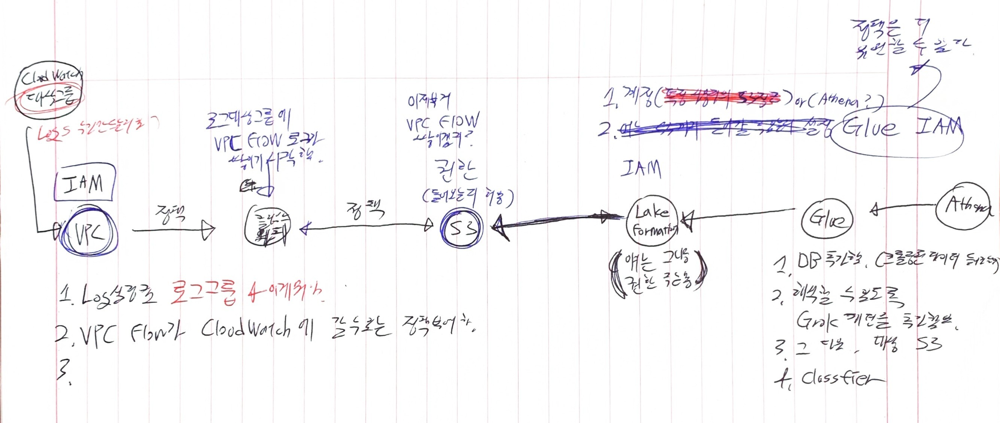
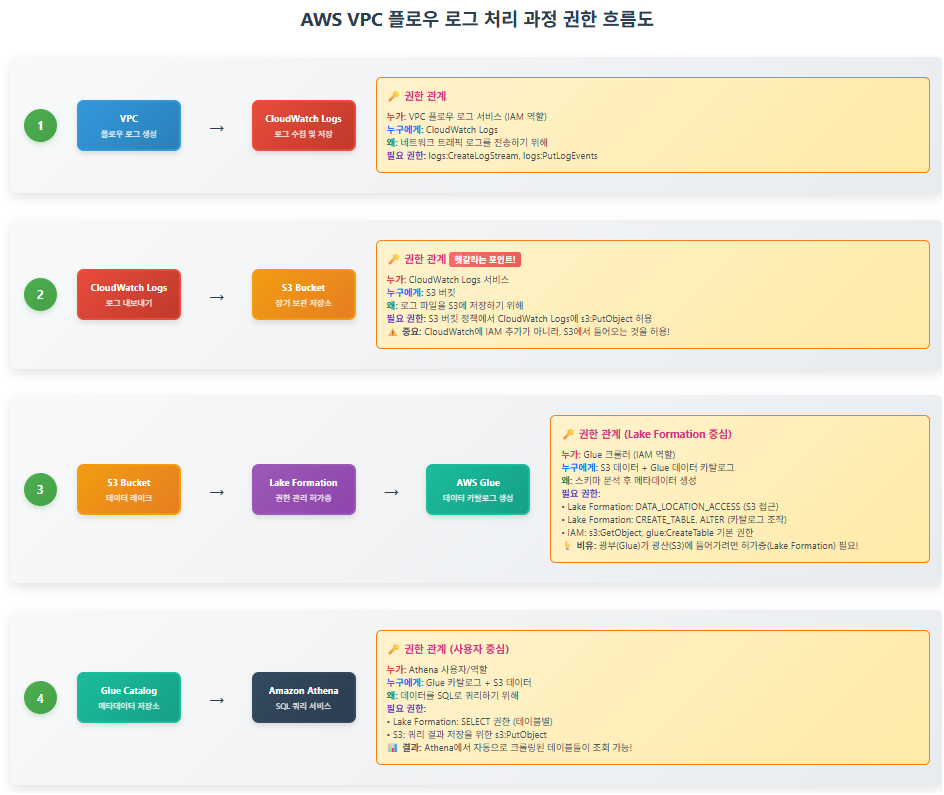

# AWS 로그수집 - Log → S3 → Glue → Athena 일련의 과정과, Classfier의 중요성과 데이터 포맷에 대하여

> **Summary**
> VPC Flow Log 수집 및 분석 파이프라인 구축을 위한 단계별 가이드를 제공하며, CloudWatch Logs에서 S3로 로그 전송, AWS Glue를 통한 데이터 카탈로그 등록, 그리고 Athena를 이용한 SQL 쿼리 실행 과정을 설명합니다. 각 단계에서 필요한 권한 설정과 작업을 상세히 안내하여, 네트워크 트래픽 로그를 효과적으로 분석할 수 있도록 돕습니다.

---


<details>
<summary>원본글</summary>

</details>

# VPC FLOW 수집 과정을 그림을 그려 내용을 정리해보자

🔗 [https://claude.ai/public/artifacts/bfd977b8-ca4c-4983-bdd3-ae8d7ae227fc](https://claude.ai/public/artifacts/bfd977b8-ca4c-4983-bdd3-ae8d7ae227fc)





<details>
<summary>**1. VPC 플로우 로그 활성화 및 CloudWatch Logs로 전송**</summary>

- **흐름:** VPC의 네트워크 트래픽 로그를 AWS CloudWatch Logs로 전송합니다.
- **권한:**
  - **누가:** VPC 플로우 로그 서비스(설정된 IAM 역할 기반)
  - **누구에게:** AWS CloudWatch Logs
  - **무엇 때문에:** CloudWatch Logs의 지정된 로그 그룹에 로그를 생성하고 기록하기 위함입니다. VPC 플로우 로그 서비스의 IAM 역할에는 logs:CreateLogStream, logs:PutLogEvents 등의 쓰기 권한이 필요합니다.
</details>

<details>
<summary>**2. CloudWatch Logs에서 S3 버킷으로 로그 내보내기**</summary>

- **흐름:** CloudWatch Logs의 로그를 장기 보관 및 분석을 위해 S3 버킷으로 내보냅니다.
- **권한:**
  - **누가:** AWS CloudWatch Logs 서비스(logs.[region].amazonaws.com)
  - **누구에게:** 대상 S3 버킷
  - **무엇 때문에:** S3 버킷에 로그 파일을 저장하기 위함입니다. S3 버킷 정책을 통해 CloudWatch Logs에 s3:PutObject 및 s3:GetBucketAcl 권한을 부여합니다.
</details>

<details>
<summary>**3. S3 데이터를 AWS Glue 데이터 카탈로그에 등록(AWS Lake Formation 경유)**</summary>

- **흐름:** S3의 원시 로그 데이터를 AWS Glue 크롤러로 스키마를 감지하고, Glue 데이터 카탈로그에 테이블 메타데이터를 생성합니다. AWS Lake Formation이 권한을 관리합니다.
- **권한:**
  - **Glue 크롤러의 S3 데이터 접근 및 데이터 카탈로그 수정 권한:**
    - **누가:** AWS Glue 크롤러의 IAM 역할
    - **누구에게:** S3 버킷의 로그 데이터와 Glue 데이터 카탈로그
    - **무엇 때문에:** 로그 파일의 스키마를 분석하고, 데이터 카탈로그에 테이블을 생성/업데이트하기 위함입니다.
    - **설정 방식:**
      1. Glue 크롤러 IAM 역할에 S3 읽기 권한(s3:GetObject, s3:ListBucket)과 Glue 카탈로그 권한(glue:CreateTable, glue:UpdateTable)을 부여합니다.
      1. **AWS Lake Formation:** 크롤러 IAM 역할에 (1) S3 데이터 위치 접근 권한과 (2) 데이터베이스 내 테이블 생성/수정 권한을 부여합니다.
</details>

<details>
<summary>**4. AWS Athena로 S3 데이터 쿼리(AWS Lake Formation 경유)**</summary>

- **흐름:** Athena로 Glue 데이터 카탈로그의 테이블을 SQL 쿼리합니다. S3의 실제 데이터에 대한 접근은 Lake Formation이 제어합니다.
- **권한:**
  - **Athena 사용자의 데이터 접근 권한:**
    - **누가:** Athena를 사용하는 IAM 사용자/역할
    - **누구에게:** Glue 데이터 카탈로그와 S3 데이터
    - **무엇 때문에:** 메타데이터 참조와 실제 데이터 접근을 위함입니다.
    - **설정 방식:** Lake Formation에서 IAM 사용자/역할에게 데이터베이스와 테이블의 SELECT 권한을 부여합니다.
  - **Athena의 쿼리 결과 저장 권한:**
    - **누가:** AWS Athena 서비스 또는 쿼리 실행 IAM 역할
    - **누구에게:** Athena 쿼리 결과용 S3 버킷
    - **무엇 때문에:** 쿼리 결과를 S3에 저장하기 위함입니다. Athena 작업 그룹의 IAM 역할에 s3:PutObject와 s3:GetObject 권한이 필요합니다.
</details>


---

# **VPC Flow Log 분석 파이프라인 구축 가이드: **

`**Log → S3 → Glue → Athena**`

이 가이드는 VPC Flow Log를 수집, 저장, 처리하여 Athena로 분석하기까지의 전체 과정을 안내합니다. 각 단계별로 필요한 작업과 그 이유를 설명합니다.

## **1단계: VPC Flow Log 수집 및 S3로 전송**

**목표**: VPC에서 발생하는 네트워크 트래픽 로그(VPC Flow Log)를 CloudWatch Logs를 거쳐 S3 버킷에 안정적으로 저장합니다.

### **1.1. CloudWatch Logs 로그 그룹 생성**

- **작업**: VPC Flow Log를 수신할 CloudWatch Logs 로그 그룹을 미리 생성합니다. (예: `mzc-0527-sbu-vpc-logs-vpcflow`)
- **이유**: VPC Flow Log의 전송 대상으로 지정하기 위함입니다. 로그를 중앙에서 관리하고 S3로 내보내는 중간 저장소 역할을 합니다.

### **1.2. IAM 정책 및 역할 생성 (VPC Flow Logs → CloudWatch Logs)**

```c++
- **작업**:
    1. **IAM 정책 생성**: VPC Flow Logs 서비스가 CloudWatch Logs에 로그를 쓰고 조회할 권한을 정의합니다. (logs:CreateLogStream, logs:PutLogEvents, logs:DescribeLogStreams, logs:DescribeLogGroups 포함)
        - *리소스 범위는 특정 로그 그룹으로 제한하는 것이 좋습니다.*
    2. **IAM 역할 생성**:
        - **신뢰 관계**: vpc-flow-logs.amazonaws.com 서비스가 수임하도록 설정합니다.
        - **권한**: 위에서 생성한 IAM 정책을 연결합니다.
- **이유**: VPC Flow Logs 서비스가 CloudWatch Logs에 안전하게 접근하여 로그를 기록할 수 있도록 최소한의 권한을 부여합니다.
```

- **작업**:
  1. **IAM 정책 생성**: VPC Flow Logs 서비스가 CloudWatch Logs에 로그를 기록할 수 있도록 허용하는 정책을 만듭니다.
```plain text
{
    "Version": "2012-10-17",
    "Statement": [
        {
            "Effect": "Allow",
            "Action": [
                "logs:CreateLogStream",
                "logs:PutLogEvents",
                "logs:DescribeLogStreams"
            ],
            "Resource": "arn:aws:logs:YOUR_REGION:YOUR_ACCOUNT_ID:log-group:YOUR_LOG_GROUP_NAME:log-stream:*"
        },
        {
            "Effect": "Allow",
            "Action": "logs:DescribeLogGroups",
            "Resource": "arn:aws:logs:YOUR_REGION:YOUR_ACCOUNT_ID:log-group:YOUR_LOG_GROUP_NAME:*"
        }
    ]
}


```

    - `YOUR_REGION`, `YOUR_ACCOUNT_ID`, `YOUR_LOG_GROUP_NAME`을 실제 환경에 맞게 수정하세요.
  1. **IAM 역할 생성**:
    - **신뢰 관계**: `vpc-flow-logs.amazonaws.com` 서비스가 역할을 수임(AssumeRole)할 수 있도록 설정합니다.
```plain text
{
  "Version": "2012-10-17",
  "Statement": [
    {
      "Effect": "Allow",
      "Principal": {
        "Service": "vpc-flow-logs.amazonaws.com"
      },
      "Action": "sts:AssumeRole"
    }
  ]
}


```

    - **권한**: 위에서 생성한 IAM 정책을 이 역할에 연결합니다.
- **이유**: VPC Flow Logs 서비스가 사용자의 CloudWatch Logs 로그 그룹에 접근하여 로그 데이터를 안전하게 쓸 수 있도록 최소한의 권한을 부여합니다 (Zero Trust 원칙).

### **1.3. VPC Flow Log 생성**

```plain text
- **작업**: 대상 VPC에서 Flow Log를 생성합니다.
    - **대상**: 'CloudWatch Logs' 선택.
    - **대상 로그 그룹**: 1.1에서 생성한 로그 그룹 지정.
    - **IAM 역할**: 1.2에서 생성한 IAM 역할 지정.
- **이유**: VPC 네트워크 트래픽 정보 수집을 시작합니다.
```

- **작업**:
  1. AWS VPC 콘솔로 이동하여 Flow Log를 생성할 VPC를 선택합니다.
  1. '플로우 로그 생성'을 클릭합니다.
  1. **대상**: 'CloudWatch Logs'를 선택합니다.
  1. **대상 로그 그룹**: 1.1에서 생성한 로그 그룹을 지정합니다.
  1. **IAM 역할**: 1.2에서 생성한 IAM 역할을 지정합니다.
  1. 로그 형식을 기본값 또는 필요한 형식으로 설정하고 생성합니다.
- **이유**: 실제 VPC 네트워크 트래픽 정보를 수집하기 시작하는 단계입니다.

### **1.4. S3 버킷 정책 설정 (CloudWatch Logs → S3)**

```plain text
- **작업**: CloudWatch Logs 서비스(logs.[YourRegion].amazonaws.com)가 대상 S3 버킷에 로그 파일을 쓸 수 있도록( s3:PutObject) S3 버킷 정책을 설정합니다. s3:GetBucketAcl 권한도 포함합니다.
    - *S3 객체 쓰기 시 bucket-owner-full-control ACL을 적용하여 버킷 소유자가 객체 소유권을 갖도록 하는 것이 좋습니다.*
- **이유**: CloudWatch Logs가 S3 버킷에 접근하여 로그를 내보낼 수 있도록 S3 리소스 측면에서 권한을 허용합니다.
```

- **작업**: CloudWatch Logs 서비스가 지정된 S3 버킷에 로그 데이터를 내보낼(PutObject) 수 있도록 S3 버킷 정책을 설정합니다.
```plain text
{
    "Version": "2012-10-17",
    "Statement": [
        {
            "Effect": "Allow",
            "Principal": {
                "Service": "logs.YOUR_REGION.amazonaws.com"
            },
            "Action": "s3:GetBucketAcl",
            "Resource": "arn:aws:s3:::YOUR_S3_BUCKET_NAME"
        },
        {
            "Effect": "Allow",
            "Principal": {
                "Service": "logs.YOUR_REGION.amazonaws.com"
            },
            "Action": "s3:PutObject",
            "Resource": "arn:aws:s3:::YOUR_S3_BUCKET_NAME/OPTIONAL_PREFIX/*",
            "Condition": {
                "StringEquals": {
                    "s3:x-amz-acl": "bucket-owner-full-control"
                }
            }
        }
    ]
}


```

  - `YOUR_REGION`, `YOUR_S3_BUCKET_NAME`, `OPTIONAL_PREFIX`를 실제 환경에 맞게 수정하세요.
- **이유**: CloudWatch Logs에 쌓인 데이터를 장기 보관 및 분석을 위해 저렴한 S3 스토리지로 옮길 때, CloudWatch Logs 서비스가 S3 버킷에 접근할 권한을 주기 위함입니다.

### **1.5. CloudWatch Logs에서 S3로 로그 내보내기 작업 설정**

```c++
- **작업**: CloudWatch Logs 콘솔에서 해당 로그 그룹을 선택, 'S3로 내보내기 작업'을 생성하여 S3 버킷 및 접두사(예: vpcflowlogs/)를 지정합니다.
- **이유**: 수집된 로그를 분석 시스템이 사용할 데이터 레이크(S3)로 이전합니다.
```

- **작업**: CloudWatch Logs 콘솔에서 해당 로그 그룹을 선택하고 'S3로 내보내기 작업 생성'을 통해 주기적으로 또는 일회성으로 S3 버킷으로 로그를 내보냅니다.
  - **S3 버킷**: 로그를 저장할 S3 버킷을 지정합니다.
  - **S3 접두사(선택 사항)**: S3 버킷 내 특정 폴더 경로를 지정합니다. (예: `vpcflowlogs/`)
- **이유**: 수집된 로그를 분석 시스템(Glue, Athena)이 접근할 수 있는 데이터 레이크(S3)로 옮기는 실질적인 데이터 이동 단계입니다.


## **2단계: Lake Formation 및 Glue 설정 (데이터 카탈로깅)**

**목표**: S3에 저장된 VPC Flow Log 데이터의 스키마(구조)를 자동으로 감지하고, 이를 Glue 데이터 카탈로그에 테이블로 등록하여 Athena 등에서 쿼리할 수 있도록 준비합니다. Lake Formation을 통해 이 과정의 보안을 강화합니다.

### **2.1. Lake Formation: 데이터 레이크 위치 등록**

```c++
- **작업**: Lake Formation 콘솔에서 VPC Flow Log가 저장된 S3 경로(예: s3://[YourS3BucketName]/)를 데이터 레이크 위치로 등록합니다.
- **이유**: Lake Formation이 S3 데이터를 관리 대상으로 인식하고, 중앙에서 권한을 통제할 수 있도록 S3 데이터 저장소를 지정합니다.
```

- **작업**: Lake Formation 콘솔에서 'Data lake locations' → 'Register location'을 선택합니다.
  - **Amazon S3 path**: VPC Flow Log가 저장된 S3 버킷의 최상위 경로 또는 관련 경로(예: `s3://YOUR_S3_BUCKET_NAME/`)를 등록합니다.
  - **IAM role**: 기본적으로 생성되는 `AWSServiceRoleForLakeFormationDataAccess` 역할을 사용하거나, 필요한 경우 별도 역할을 지정합니다.
- **이유**: Lake Formation이 S3에 저장된 데이터를 "관리 대상"으로 인식하고, 이후 이 데이터에 대한 접근 권한을 중앙에서 통제할 수 있도록 하기 위함입니다. "우리 데이터 창고는 여기야"라고 알려주는 단계입니다.

### **2.2. Lake Formation: 데이터 접근 권한 부여**

```c++
- **작업**:
    1. **데이터 레이크 관리자**: IAM 관리자 역할에게 등록된 S3 위치에 대한 Data location access 권한을 부여합니다.
    2. **Glue 크롤러 역할**: Glue 크롤러가 사용할 IAM 역할에게 (1) VPC Flow Log 데이터가 있는 특정 S3 경로에 대한 Data location access 권한, (2) 대상 Glue 데이터베이스에 테이블 생성/수정 권한을 Lake Formation을 통해 부여합니다.
- **이유**: 역할 기반 접근 제어(RBAC)를 통해 데이터 레이크 보안을 강화하고, 서비스(Glue 크롤러)에는 작업에 필요한 최소한의 권한만 부여합니다.
```

- **작업**:
  1. **관리자 권한 부여**: 'Data locations' 또는 'Permissions'에서 데이터 레이크 관리자 IAM 역할(예: `SBU-admin`)에게 등록된 S3 위치에 대한 `Data location access` 권한을 부여합니다.
  1. **Glue 크롤러 역할 권한 부여**: Glue 크롤러가 사용할 IAM 역할에게 **VPC Flow Log 데이터가 있는 특정 S3 경로**(예: `s3://YOUR_S3_BUCKET_NAME/vpcflowlogs/`)에 대한 `Data location access` 권한 및 데이터베이스/테이블 생성 권한을 부여합니다.
- **이유**:
  - 관리자는 데이터 레이크 전체를 관리할 수 있어야 합니다.
  - Glue 크롤러는 S3에서 데이터를 읽고, Glue 데이터 카탈로그에 메타데이터를 작성해야 하므로, 이에 필요한 최소한의 권한을 Lake Formation을 통해 부여받아야 합니다. "이 사람은 창고 관리자, 이 로봇은 특정 구역 작업자"라고 지정하는 것과 같습니다.

### **2.3. Glue: 데이터베이스 생성**

```c++
- **작업**: AWS Glue 콘솔에서 크롤러가 생성할 테이블 메타데이터를 저장할 데이터베이스를 생성합니다. (예: vpc_flow_logs_db)
- **이유**: 분석용 테이블 정의를 논리적으로 그룹화하며, 이 데이터베이스는 Lake Formation의 권한 관리 대상이 됩니다.
```

- **작업**: AWS Glue 콘솔에서 'Databases' → 'Add database'를 선택하여 데이터베이스를 생성합니다. (예: `vpc_flow_logs_db`)
- **이유**: 크롤러가 생성할 테이블(메타데이터)을 담을 논리적인 공간을 마련하는 것입니다. Lake Formation을 사용한다면, 이 데이터베이스에 대한 권한도 Lake Formation에서 관리하게 됩니다.

### **2.4. Glue: Classifier 생성 (Grok 패턴 사용)**

```c++
- **작업**: AWS Glue 콘솔에서 VPC Flow Log 형식에 맞는 Grok 패턴을 사용하여 사용자 지정 Classifier를 생성합니다.
    - **예시 Grok 패턴**: %{NUMBER:version:int} %{NUMBER:account_id} ... %{WORD:log_status} (제공된 패턴 참조)
- **이유**: 크롤러가 공백으로 구분된 VPC Flow Log 텍스트 파일의 각 필드를 정확히 인식하고 데이터 타입을 추론할 수 있도록 "해석 규칙"을 제공합니다.
```

- **작업**: AWS Glue 콘솔에서 'Classifiers' → 'Add classifier'를 선택합니다.
  - **Classifier type**: `Grok`
  - **Grok pattern**: VPC Flow Log 형식에 맞는 Grok 패턴을 입력합니다.
```plain text
%{NUMBER:version:int} %{NUMBER:account_id} %{NOTSPACE:interface_id} %{IP:srcaddr} %{IP:dstaddr} %{NUMBER:srcport:int} %{NUMBER:dstport:int} %{NUMBER:protocol:int} %{NUMBER:packets:int} %{NUMBER:bytes:int} %{NUMBER:start_time:long} %{NUMBER:end_time:long} %{WORD:action} %{WORD:log_status}
```

  - 필요시 Custom patterns도 추가할 수 있습니다.
- **이유**: VPC Flow Log는 공백으로 구분된 텍스트 파일입니다. 이 패턴은 크롤러에게 각 필드가 무엇을 의미하고 어떤 데이터 타입인지(예: 숫자인지, IP 주소인지) 알려주는 "해석 규칙"입니다. 이 규칙이 있어야 크롤러가 데이터를 정확히 이해하고 테이블 스키마를 만들 수 있습니다.

### **2.5. Glue: 크롤러 생성 및 실행**

```c++
- **작업**:
    1. **크롤러 생성**: 데이터 소스로 VPC Flow Log S3 경로 지정, 2.2에서 권한을 부여받은 IAM 역할 선택, 2.3에서 생성한 데이터베이스를 출력 대상으로 지정, 2.4의 Classifier를 추가합니다.
    2. **(선택 사항)** 이전 실행으로 인해 부정확한 스키마의 테이블이 있다면 먼저 삭제합니다.
    3. 크롤러를 실행합니다.
- **이유**: S3 데이터를 스캔하여 스키마를 자동 추론하고, Glue 데이터 카탈로그에 테이블로 등록하여 쿼리할 수 있도록 준비합니다.
```

- **작업**:
  1. AWS Glue 콘솔에서 'Crawlers' → 'Create crawler'를 선택합니다.
  1. **Crawler name**: 적절한 이름을 지정합니다.
  1. **Data source**: VPC Flow Log가 저장된 S3 경로를 지정합니다. (예: `s3://YOUR_S3_BUCKET_NAME/vpcflowlogs/`)
  1. **IAM Role**: Glue 서비스가 S3에 접근하고 데이터 카탈로그에 쓸 수 있는 권한을 가진 IAM 역할을 생성하거나 선택합니다. (이 역할은 2.2에서 Lake Formation 권한을 부여받아야 합니다.)
  1. **Output database**: 2.3에서 생성한 Glue 데이터베이스를 선택합니다.
  1. **Custom classifiers (Optional)**: 2.4에서 생성한 Grok 분류기를 추가합니다.
  1. 크롤러 설정을 완료하고 생성합니다.
  1. (선택 사항) 만약 이전에 잘못된 스키마로 테이블이 생성되었다면, 해당 테이블을 먼저 삭제합니다.
  1. 생성된 크롤러를 실행합니다.
- **이유**:
  - **크롤러**: S3의 데이터를 스캔하여 스키마를 추론하고, 이를 Glue 데이터 카탈로그에 테이블로 등록하는 자동화된 프로세스입니다.
  - **Grok 분류기 사용**: VPC Flow Log의 특정 형식을 정확하게 파싱하기 위함입니다.
  - **테이블 삭제 후 실행**: 깨끗한 상태에서 정확한 스키마로 테이블을 생성하기 위함입니다.
  - **크롤러 실행**: "이제 S3에 가서 데이터 구조를 파악하고, 데이터베이스에 그 정보를 정리해놔!"라고 명령하는 것입니다.


## **3단계: Athena로 데이터 쿼리 및 분석**

**목표**: Glue 데이터 카탈로그에 등록된 테이블을 사용하여 Athena에서 SQL 쿼리로 VPC Flow Log 데이터를 분석합니다.

### **3.1. Glue 데이터 카탈로그 확인**

```c++
- **작업**: 크롤러 실행 완료 후, Glue 데이터베이스에 테이블이 정상적으로 생성되고 스키마가 올바르게 정의되었는지 확인합니다.
- **이유**: Athena 쿼리 대상이 정확히 준비되었는지 최종 점검합니다.
```

- **작업**: Glue 콘솔에서 크롤러 실행이 완료된 후, 지정한 데이터베이스 아래에 테이블이 정상적으로 생성되었는지 확인합니다. 테이블의 스키마(컬럼명, 데이터 타입 등)가 Grok 패턴에 따라 올바르게 정의되었는지 검토합니다.
- **이유**: Athena가 쿼리할 대상 테이블과 그 구조가 올바르게 준비되었는지 최종 점검하는 단계입니다.

### **3.2. Lake Formation: Athena 사용자 권한 부여 (필요시)**

```c++
- **작업**: Athena로 쿼리할 IAM 사용자 또는 역할에게 Lake Formation을 통해 해당 Glue 데이터베이스 및 테이블에 대한 SELECT 권한 등을 부여합니다.
- **이유**: Lake Formation이 데이터 접근을 통제하므로, Athena 사용자도 정식 권한을 받아야 데이터를 조회할 수 있습니다.
```

- **작업**: Athena를 사용하여 데이터를 쿼리할 IAM 사용자 또는 역할에게 Lake Formation을 통해 해당 Glue 데이터베이스 및 테이블에 대한 `SELECT` 권한 등을 부여합니다.
- **이유**: Lake Formation으로 데이터 접근을 통제하고 있다면, Athena 사용자도 정식으로 권한을 부여받아야 데이터를 조회할 수 있습니다.

### **3.3. Athena에서 쿼리 실행**

```c++
- **작업**: Athena 콘솔에서 3.1의 데이터베이스를 선택하고, SQL 쿼리를 작성하여 실행합니다.
    - **쿼리 결과 저장 위치**: Athena 작업 그룹 설정에서 쿼리 결과를 저장할 S3 버킷이 지정되어 있어야 하며, Athena 실행 역할은 해당 S3 위치에 쓰기 권한을 가져야 합니다.
- **이유**: 대량의 VPC Flow Log 데이터를 SQL로 손쉽게 조회하고 분석하여 네트워크 인사이트를 얻습니다.
```

- **작업**:
  1. AWS Athena 콘솔로 이동합니다.
  1. **Database**: Glue에서 생성한 데이터베이스를 선택합니다.
  1. 쿼리 편집기에 SQL 쿼리를 작성하여 실행합니다.
    예시 쿼리:

```plain text
-- 특정 출발지 IP의 로그 조회
SELECT *
FROM your_vpc_flow_logs_table_name
WHERE srcaddr = '192.168.1.10'
LIMIT 100;

-- 가장 많은 트래픽을 발생시킨 출발지 IP 상위 10개
SELECT srcaddr, SUM(bytes) as total_bytes
FROM your_vpc_flow_logs_table_name
GROUP BY srcaddr
ORDER BY total_bytes DESC
LIMIT 10;


```

    - `your_vpc_flow_logs_table_name`을 실제 생성된 테이블 이름으로 변경하세요.
- **이유**: S3 데이터 레이크에 저장된 대량의 VPC Flow Log 데이터를 SQL을 통해 손쉽게 조회하고 분석하여 네트워크 트래픽 패턴, 보안 위협 등을 파악할 수 있게 됩니다.
이 가이드를 통해 VPC Flow Log 데이터 분석 파이프라인을 성공적으로 구축하시기를 바랍니다. 각 서비스의 세부 설정은 AWS 공식 문서를 참고하시면 더욱 자세한 정보를 얻을 수 있습니다.


