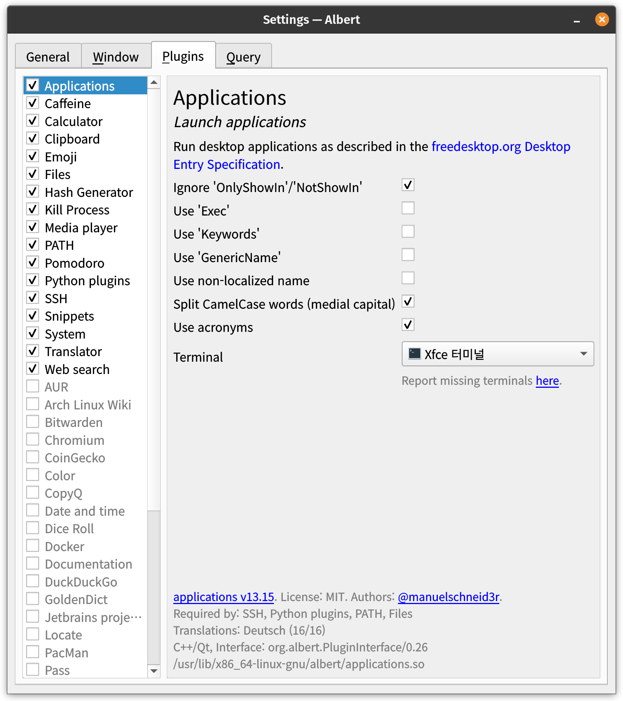

# Albert - Linux 런처 프로그램

> **Summary**
> Linux 런처 프로그램 Albert에 대한 정보와 다운로드 링크가 포함되어 있습니다. 관련 블로그와 소프트웨어 패키지 링크도 제공됩니다.

---

[https://blog.naver.com/jaydee88/221320589728](https://blog.naver.com/jaydee88/221320589728)

[https://software.opensuse.org/download/package.iframe?project=home:manuelschneid3r&package=albert&acolor=00cccc&hcolor=00aaaa](https://software.opensuse.org/download/package.iframe?project=home:manuelschneid3r&package=albert&acolor=00cccc&hcolor=00aaaa)

