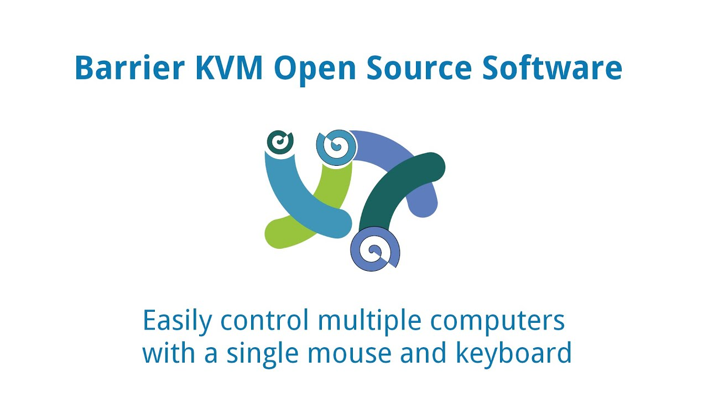

# Barrier - 

> **Summary**
> 소프트웨어 기반 KVM에 대한 정보와 관련된 링크가 포함되어 있습니다. 다양한 리눅스 배포판(Arch, Debian, Fedora, Ubuntu)에 대한 내용을 다루고 있습니다.

---

[https://bhjo0930.tistory.com/entry/%EC%86%8C%ED%94%84%ED%8A%B8%EC%9B%A8%EC%96%B4-%EA%B8%B0%EB%B0%98-KVM-%ED%95%98%EB%82%98%EC%9D%98-%ED%82%A4%EB%B3%B4%EB%93%9C-%EB%A7%88%EC%9A%B0%EC%8A%A4%EB%A1%9C-%EC%97%AC%EB%9F%AC-PC-%EC%82%AC%EC%9A%A9%ED%95%98%EA%B8%B0](https://bhjo0930.tistory.com/entry/%EC%86%8C%ED%94%84%ED%8A%B8%EC%9B%A8%EC%96%B4-%EA%B8%B0%EB%B0%98-KVM-%ED%95%98%EB%82%98%EC%9D%98-%ED%82%A4%EB%B3%B4%EB%93%9C-%EB%A7%88%EC%9A%B0%EC%8A%A4%EB%A1%9C-%EC%97%AC%EB%9F%AC-PC-%EC%82%AC%EC%9A%A9%ED%95%98%EA%B8%B0)

