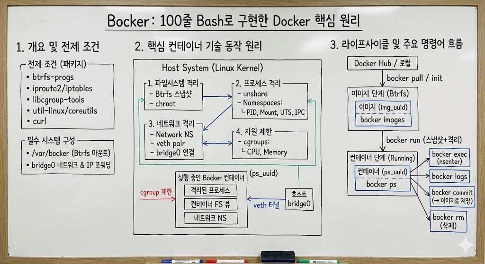

# Bocker : Bash100줄로 Docker 구현하기

> **Summary**
> Bocker는 약 100줄의 배쉬로 구현된 Docker로, Btrfs, 네임스페이스, cgroups와 같은 리눅스 커널 기능을 활용하여 경량 컨테이너를 생성하고 관리합니다. 주요 기능으로는 이미지 다운로드, 컨테이너 실행, 로그 확인, 리소스 제한 설정 등이 있으며, 사용자는 bocker pull, bocker run, bocker commit 등의 명령어를 통해 컨테이너를 관리할 수 있습니다. 이 프로젝트는 단순한 구현을 목표로 하며, 사용 편의성을 위해 필요한 환경을 구축할 수 있는 Vagrant 파일도 포함되어 있습니다.

---



🔗 [https://github.com/Cybecho/bocker](https://github.com/Cybecho/bocker)

> 기존 Bocker 프로젝트를 단순히 번역하고, 설명을 추가한 레파토지입니다. 설명이 틀렸을 가능성이 존재하니, 이점 감안하고 참고만 해주시면 감사하겠습니다.

**Bocker**

약 100줄의 배쉬로 구현된 Docker.

- [Bocker](https://github.com/Cybecho/bocker#bocker)
  - [전제 조건](https://github.com/Cybecho/bocker#%EC%A0%84%EC%A0%9C-%EC%A1%B0%EA%B1%B4)
  - [사용 예시](https://github.com/Cybecho/bocker#%EC%82%AC%EC%9A%A9-%EC%98%88%EC%8B%9C)
  - [기능: 현재 구현됨](https://github.com/Cybecho/bocker#%EA%B8%B0%EB%8A%A5-%ED%98%84%EC%9E%AC-%EA%B5%AC%ED%98%84%EB%90%A8)
  - [기능을 매우 제한적으로 구현되어있습니다: 아직 구현되지 않음](https://github.com/Cybecho/bocker#%EA%B8%B0%EB%8A%A5%EC%9D%84-%EB%A7%A4%EC%9A%B0-%EC%A0%9C%ED%95%9C%EC%A0%81%EC%9C%BC%EB%A1%9C-%EA%B5%AC%ED%98%84%EB%90%98%EC%96%B4%EC%9E%88%EC%8A%B5%EB%8B%88%EB%8B%A4-%EC%95%84%EC%A7%81-%EA%B5%AC%ED%98%84%EB%90%98%EC%A7%80-%EC%95%8A%EC%9D%8C)
  - [Bocker의 핵심 컨테이너 기술 동작 원리](https://github.com/Cybecho/bocker#bocker%EC%9D%98-%ED%95%B5%EC%8B%AC-%EC%BB%A8%ED%85%8C%EC%9D%B4%EB%84%88-%EA%B8%B0%EC%88%A0-%EB%8F%99%EC%9E%91-%EC%9B%90%EB%A6%AC)
    - [컨테이너 격리 구현 방식](https://github.com/Cybecho/bocker#%EC%BB%A8%ED%85%8C%EC%9D%B4%EB%84%88-%EA%B2%A9%EB%A6%AC-%EA%B5%AC%ED%98%84-%EB%B0%A9%EC%8B%9D)
    - [컨테이너 라이프사이클 관리](https://github.com/Cybecho/bocker#%EC%BB%A8%ED%85%8C%EC%9D%B4%EB%84%88-%EB%9D%BC%EC%9D%B4%ED%94%84%EC%82%AC%EC%9D%B4%ED%81%B4-%EA%B4%80%EB%A6%AC)
    - [그 외 구현](https://github.com/Cybecho/bocker#%EA%B7%B8-%EC%99%B8-%EA%B5%AC%ED%98%84)
  - [각 함수 설명](https://github.com/Cybecho/bocker#%EA%B0%81-%ED%95%A8%EC%88%98-%EC%84%A4%EB%AA%85)
    - [초기 설정과 기본 구조](https://github.com/Cybecho/bocker#%EC%B4%88%EA%B8%B0-%EC%84%A4%EC%A0%95%EA%B3%BC-%EA%B8%B0%EB%B3%B8-%EA%B5%AC%EC%A1%B0)
    - [기타 유틸리티 함수들](https://github.com/Cybecho/bocker#%EA%B8%B0%ED%83%80-%EC%9C%A0%ED%8B%B8%EB%A6%AC%ED%8B%B0-%ED%95%A8%EC%88%98%EB%93%A4)
      - [전체 워크플로우 요약](https://github.com/Cybecho/bocker#%EC%A0%84%EC%B2%B4-%EC%9B%8C%ED%81%AC%ED%94%8C%EB%A1%9C%EC%9A%B0-%EC%9A%94%EC%95%BD)
  - [License](https://github.com/Cybecho/bocker#license)
**전제 조건**

bocker를 실행하려면 다음 패키지가 필요합니다.

- btrfs-progs
- curl
- iproute2
- iptables
- libcgroup-tools
- util-linux >= 2.25.2
- coreutils >= 7.5
대부분의 배포판에는 충분히 새로운 버전의 유틸리티 리눅스가 제공되지 않으므로 [여기](https://www.kernel.org/pub/linux/utils/util-linux/v2.25/)에서 소스를 가져와 직접 컴파일해야 할 수도 있습니다.

또한 시스템을 다음과 같이 구성해야 합니다:

- 아래에 마운트된 btrfs 파일 시스템 `/var/bocker`
- 'bridge0'이라는 네트워크 브리지 및 10.0.0.1/24의 IP.
- IP 포워딩이 `/proc/sys/net/ipv4/ip_forward`에서 활성화된 경우
- 'bridge0'에서 물리적 인터페이스로 트래픽을 라우팅하는 방화벽.
사용 편의성을 위해 필요한 환경을 구축할 수 있는 Vagrant파일이 포함되어 있습니다.

위의 전제 조건을 충족하더라도 가상 머신에서 **보커를 실행**하고 싶을 수도 있습니다. Bocker는 루트로 실행되며 무엇보다도 네트워크 인터페이스, 라우팅 테이블 및 방화벽 규칙을 변경해야 합니다. **시스템을 엉망으로 만들지 않는다는 보장은 없습니다**.

**사용 예시**

```plain text
$ bocker pull centos 7
######################################################################## 100.0%
######################################################################## 100.0%
######################################################################## 100.0%
Created: img_42150

$ bocker images
IMAGE_ID        SOURCE
img_42150       centos:7

$ bocker run img_42150 cat /etc/centos-release
CentOS Linux release 7.1.1503 (Core)

$ bocker ps
CONTAINER_ID       COMMAND
ps_42045           cat /etc/centos-release

$ bocker logs ps_42045
CentOS Linux release 7.1.1503 (Core)

$ bocker rm ps_42045
Removed: ps_42045

$ bocker run img_42150 which wget
which: no wget in (/usr/local/sbin:/usr/local/bin:/usr/sbin:/usr/bin:/root/bin)

$ bocker run img_42150 yum install -y wget
Installing : wget-1.14-10.el7_0.1.x86_64                                  1/1
Verifying  : wget-1.14-10.el7_0.1.x86_64                                  1/1
Installed  : wget.x86_64 0:1.14-10.el7_0.1
Complete!

$ bocker ps
CONTAINER_ID       COMMAND
ps_42018           yum install -y wget
ps_42182           which wget

$ bocker commit ps_42018 img_42150
Removed: img_42150
Created: img_42150

$ bocker run img_42150 which wget
/usr/bin/wget

$ bocker run img_42150 cat /proc/1/cgroup
...
4:memory:/ps_42152
3:cpuacct,cpu:/ps_42152

$ cat /sys/fs/cgroup/cpu/ps_42152/cpu.shares
512

$ cat /sys/fs/cgroup/memory/ps_42152/memory.limit_in_bytes
512000000

$ BOCKER_CPU_SHARE=1024 \
	BOCKER_MEM_LIMIT=1024 \
	bocker run img_42150 cat /proc/1/cgroup
...
4:memory:/ps_42188
3:cpuacct,cpu:/ps_42188

$ cat /sys/fs/cgroup/cpu/ps_42188/cpu.shares
1024

$ cat /sys/fs/cgroup/memory/ps_42188/memory.limit_in_bytes
1024000000

```

**기능: 현재 구현됨**

- `docker build` †
- `docker pull`
- `docker images`
- `docker ps`
- `docker run`
- `docker exec`
- `docker logs`
- `docker commit`
- `docker rm` / `docker rmi`
- Networking
- Quota Support / CGroups
'bocker init'은 매우 제한적인 `docker build` 구현을 제공합니다.

**기능을 매우 제한적으로 구현되어있습니다: 아직 구현되지 않음**

- 데이터 볼륨 컨테이너
- 데이터 볼륨
- 포트 포워딩
**Bocker의 핵심 컨테이너 기술 동작 원리**

**컨테이너 격리 구현 방식**

Bocker는 리눅스 커널의 여러 격리 기술을 조합해 경량 컨테이너를 구현합니다. 각 기술의 연결 방식을 살펴보겠습니다.

> 파일시스템 격리

```plain text
# 이미지 기반 컨테이너 생성
btrfs subvolume snapshot "$btrfs_path/$1" "$btrfs_path/$uuid" > /dev/null

# 파일시스템 격리
chroot "$btrfs_path/$uuid" /bin/sh -c "..."
```

Bocker는 **Btrfs의 스냅샷 기능**을 활용해 이미지와 컨테이너를 관리합니다. 이는 Docker가 초기에 AUFS와 같은 계층 파일시스템을 사용한 것과 유사합니다. Btrfs 스냅샷은:

1. **Copy-on-Write**: 변경이 발생할 때만 새 데이터 블록을 생성하므로 저장공간이 효율적입니다
1. **빠른 생성**: 메타데이터만 복사하므로 대용량 이미지도 즉시 복제됩니다
1. **격리**: 각 컨테이너는 독립적인 파일시스템 뷰를 가집니다
`chroot`는 프로세스의 루트 디렉토리를 변경해 컨테이너가 호스트 파일시스템에 접근하지 못하게 합니다.

> 네트워크 격리

```plain text
# 네트워크 네임스페이스 생성
ip netns add netns_"$uuid"

# 가상 이더넷 인터페이스 생성 및 연결
ip link add dev veth0_"$uuid" type veth peer name veth1_"$uuid"
ip link set veth1_"$uuid" netns netns_"$uuid"

# 네트워크 격리 내에서 명령 실행
ip netns exec netns_"$uuid" ... 명령어 실행 ...
```

네트워크 격리는 **네트워크 네임스페이스**와 **가상 이더넷(veth) 쌍**을 이용합니다:

1. 각 컨테이너는 전용 네트워크 네임스페이스를 가집니다
1. veth 인터페이스 쌍은 컨테이너와 호스트 사이의 통신 터널 역할을 합니다
1. 호스트의 `bridge0` 브릿지는 모든 컨테이너를 연결하는 가상 스위치처럼 작동합니다
1. 각 컨테이너는 `10.0.0.x` 형태의 내부 IP를 할당받습니다
이 구성은 Docker의 기본 `bridge` 네트워크 모드와 매우 유사합니다.

> 프로세스 격리

```plain text
# 여러 격리 기술 조합하여 컨테이너 실행
unshare -fmuip --mount-proc \
    chroot "$btrfs_path/$uuid" \
    /bin/sh -c "..."
```

`unshare` 명령은 프로세스를 여러 네임스페이스로부터 격리합니다:

- `f`: 새 fork 네임스페이스 (PID 분리)
- `m`: 새 마운트 네임스페이스 (마운트 지점 분리)
- `u`: 새 UTS 네임스페이스 (호스트명 분리)
- `i`: 새 IPC 네임스페이스 (IPC 객체 분리)
- `p`: 새 PID 네임스페이스 (프로세스 ID 분리)
- `-mount-proc`: 새 /proc 마운트 (프로세스 정보 분리)
이런 네임스페이스 조합으로 컨테이너 프로세스는 호스트 시스템의 다른 프로세스를 볼 수 없고, 자신이 시스템의 유일한 프로세스인 것처럼 작동합니다.

> 자원 제한

```plain text
# cgroup 설정
cgcreate -g "$cgroups:/$uuid"
cgset -r cpu.shares="$BOCKER_CPU_SHARE" "$uuid"
cgset -r memory.limit_in_bytes="$((BOCKER_MEM_LIMIT * 1000000))" "$uuid"

# cgroup 내에서 실행
cgexec -g "$cgroups:$uuid" 명령어
```

- *cgroups(컨트롤 그룹)**은 컨테이너의 리소스 사용량을 제한합니다:
1. CPU 할당량은 `cpu.shares`로 제어됩니다 (기본값: 512)
1. 메모리 사용량은 `memory.limit_in_bytes`로 제한됩니다 (기본값: 512MB)
1. 사용자는 환경변수(`BOCKER_CPU_SHARE`, `BOCKER_MEM_LIMIT`)로 이 값을 조정할 수 있습니다
**컨테이너 라이프사이클 관리**

> 이미지 → 컨테이너 전환

```plain text
# 이미지 서브볼륨을 컨테이너로 변환
btrfs subvolume snapshot "$btrfs_path/$1" "$btrfs_path/$uuid" > /dev/null
echo "$cmd" > "$btrfs_path/$uuid/$uuid.cmd"  # 명령어 기록
```

컨테이너는 이미지의 스냅샷으로 생성되어 이미지를 변경하지 않으면서 독립적으로 수정할 수 있습니다. 이 접근법은 Docker의 이미지 레이어 시스템과 컨테이너 레이어 개념과 유사합니다.

> 컨테이너 → 이미지 전환 (commit)

```plain text
# 컨테이너를 이미지로 변환
bocker_rm "$2" && btrfs subvolume snapshot "$btrfs_path/$1" "$btrfs_path/$2" > /dev/null
```

`bocker_commit`은 컨테이너의 현재 상태를 새 이미지로 저장합니다. 이는 변경사항을 영구적으로 보존하는 방법으로, Docker의 `docker commit` 명령과 동일한 목적을 가집니다.

> 컨테이너 내 명령 실행 (exec)

```plain text
# 실행 중인 컨테이너 PID 찾기
cid="$(ps o ppid,pid | grep "^$(ps o pid,cmd | grep -E "^\ *[0-9]+ unshare.*$1" | awk '{print $1}')" | awk '{print $2}')"

# 해당 네임스페이스로 진입하여 명령 실행
nsenter -t "$cid" -m -u -i -n -p chroot "$btrfs_path/$1" "${@:2}"
```

`nsenter`는 기존 컨테이너의 네임스페이스에 진입하여 추가 명령을 실행합니다. 이 방식은:

1. 먼저 `ps` 명령으로 컨테이너의 메인 프로세스 PID를 찾습니다
1. 해당 PID의 모든 네임스페이스(마운트, UTS, IPC, 네트워크, PID)에 진입합니다
1. `chroot`로 컨테이너 파일시스템에서 명령을 실행합니다
이는 Docker의 `docker exec` 명령과 동일한 기능입니다.

**그 외 구현**

> 재귀적 UUID 충돌 해결

```plain text
[[ "$(bocker_check "$uuid")" == 0 ]] && echo "UUID conflict, retrying..." && bocker_run "$@" && return
```

UUID 충돌이 발생하면(매우 드문 경우), 함수는 재귀적으로 자신을 호출하여 새 UUID를 생성합니다. 이는 간결하지만 깊은 재귀가 발생할 위험이 있습니다.

> 파이프라인과 명령 체인

```plain text
# 복잡한 파이프라인으로 Docker Hub API 토큰 추출
token="$(curl -sL -o /dev/null -D- -H 'X-Docker-Token: true' "https://index.docker.io/v1/repositories/$1/images" | tr -d '\r' | awk -F ': *' '$1 == "X-Docker-Token" { print $2 }')"
```

Bocker는 복잡한 동작을 구현하기 위해 여러 Unix 도구를 파이프라인으로 연결합니다. 이는 외부 라이브러리에 의존하지 않고 기본 시스템 도구만으로 기능을 구현하는 유닉스 철학을 따릅니다.

**각 함수 설명**

**초기 설정과 기본 구조**

```plain text
#!/usr/bin/env bash
set -o errexit -o nounset -o pipefail; shopt -s nullglob
btrfs_path='/var/bocker' && cgroups='cpu,cpuacct,memory';
```

