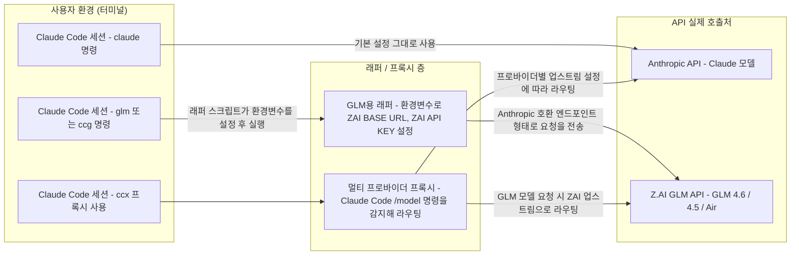

# Claude Code에서 GLM 과 Claude를 동시에 사용해보자

> **Summary**
> Claude Code에서 GLM 모델과 Claude 모델을 동시에 사용하기 위해, 환경변수를 조정하고 프록시 도구(ccx)를 활용하는 방법을 설명한다. 사용자는 별도의 터미널에서 각 모델을 실행하거나, ccx를 통해 한 세션 내에서 모델을 자유롭게 전환할 수 있다. 이를 통해 Anthropic과 

---

[https://www.reddit.com/r/ClaudeCode/comments/1o8yst9/how_do_i_use_glm_46_and_claude_on_claude_code/](https://www.reddit.com/r/ClaudeCode/comments/1o8yst9/how_do_i_use_glm_46_and_claude_on_claude_code/)

[https://github.com/JoeInnsp23/claude-glm-wrapper](https://github.com/JoeInnsp23/claude-glm-wrapper)

---

# 요약 정리

- Claude Code 자체에는 “Claude 모델과 GLM 모델을 한 세션 안에서 공식으로 토글”하는 기능은 없다.
- 하지만 다음 두 종류의 접근을 조합하면, 사실상 한 터미널 환경에서 두 모델을 매끄럽게 함께 쓸 수 있다.
  - (1) Z.AI의 GLM API를 Claude Code처럼 보이게 만드는 래퍼 스크립트와 환경변수 라우팅
  - (2) 여러 모델/프로바이더를 하나의 로컬 프록시로 묶어서, 한 세션 안에서 모델만 바꿔 쓸 수 있는 ccx 같은 프록시 도구
- WSL/Linux 환경에서는
  - 기본: claude (Anthropic)
  - GLM: glm, ccg, ccg45, ccf 같은 별도 실행 명령
  - 멀티 프로바이더: ccx 프록시 + /model 명령
조합으로 “터미널 두 개 + 필요한 만큼 세션”을 두어 병행 사용하는 패턴이 현실적으로 가장 단순하고 안정적이다.
아래에서는 먼저 논리적/구조적 배경을 설명하고, Reddit에서 논의된 패턴과 claude-glm-wrapper(래퍼+프록시)의 구조를 합쳐서, 단계별 설정과 실사용 방법을 정리한다.

## 1. 전체 구조 – “한 터미널에서 Claude + GLM 함께 쓰기”의 개념도

먼저 전체 그림을 그리면 다음과 같다.

사용자는 기존 Claude Code 클라이언트는 그대로 두고, 중간에 “래퍼/프록시 층”을 두어 실제 호출이 어디로 갈지만 바꾼다.



- 사용자 입장에서는 “claude, glm, ccg, ccx” 같은 명령만 다르게 입력할 뿐, Claude Code UI/UX는 동일하다.
- 실제 요청이 Anthropic으로 갈지 Z.AI로 갈지는 래퍼/프록시가 환경변수나 업스트림 URL 설정을 통해 결정한다.
- “동시에”라는 요구는 정확히는 “같은 터미널 창 내에서 여러 Claude Code 세션을 열어 두고, 각 세션이 서로 다른 모델을 사용하도록 구성”하는 형태로 실현된다.
이제 구체적으로 어떤 방법들이 있고, 어떤 논리로 결합하면 좋은지를 단계별로 본다.

## 2. Claude Code에서 모델/프로바이더를 바꾸는 기본 원리

Claude Code CLI는 기본적으로 Anthropic API(또는 공식 엔드포인트)를 사용하도록 설정되어 있다.

이 설정은 보통 다음 환경변수들에 의해 결정된다(이름은 구현에 따라 약간씩 다를 수 있음).

- ANTHROPIC_BASE_URL: API 베이스 URL
- ANTHROPIC_AUTH_TOKEN 또는 ANTHROPIC_API_KEY: 인증 토큰/키
- ANTHROPIC_MODEL 또는 그에 준하는 모델 이름 변수
- CLAUDE_HOME 또는 그에 준하는 설정/히스토리 경로
여기서 핵심 아이디어는 두 가지다.

1. 환경변수만 바꾸면 실제 API 호출처가 바뀐다.
  - Z.AI는 “Anthropic 호환” 엔드포인트(예: [https://api.z.ai/api/anthropic](https://api.z.ai/api/anthropic))를 제공한다.
  - 이 주소를 ANTHROPIC_BASE_URL으로 설정하고, Z.AI에서 받은 API 키를 ANTHROPIC_AUTH_TOKEN으로 넣어주면,
Claude Code 입장에서는 “마치 Anthropic에 요청을 보내는 것처럼” 행동하면서 실제로는 [Z.AI](http://z.ai/) GLM이 응답하게 된다.【turn4fetch0】
1. Claude Code 실행 전에 환경변수만 미리 설정해 주면, “세션 단위로 모델/프로바이더”를 고정할 수 있다.
  - 예를 들어 GLM용 터미널에서만 ANTHROPIC_BASE_URL을 Z.AI로 설정하고 claude를 실행하면, 그 세션은 “GLM 백엔드를 쓰는 Claude 세션”처럼 동작한다.
  - 반면 다른 터미널에서는 아무런 환경변수 조작 없이 claude를 실행하면, 기존대로 Anthropic Claude를 쓰게 된다.
즉, Claude Code 자체를 수정하는 것이 아니라 “Claude Code를 띄우기 전에 환경을 어떻게 세팅하느냐”만 다루는, 격리된 wrapper 방식이 가능해진다. 이것이 Reddit과 GitHub 쪽에서 공통으로 사용하는 논리적 기반이다.【turn8fetch0】【turn4fetch0】

## 3. Reddit 패턴 정리 – 환경변수 + alias/스크립트로 GLM과 Claude 분리

Reddit 토론에서는 크게 세 가지 패턴이 자주 언급된다. 이 중 WSL/Linux를 기준으로 가장 직관적인 방식부터 설명한다.

### 3.1 [Z.AI](http://z.ai/) 프록시 + alias로 모델 분리 (WSL/Linux)

개념은 다음과 같다.

- [Z.AI](http://z.ai/) API 키를 환경변수에 저장해 둔다.
- GLM용 alias를 만들어, 해당 alias를 실행할 때만 [Z.AI](http://z.ai/) 쪽 엔드포인트와 모델을 사용하도록 환경변수를 덮어쓴 뒤 claude를 실행한다.
예시 흐름은 다음과 같다(이름은 사용자 환경에 맞게 조정 가능).

1. ~/.zshrc(또는 ~/.bashrc) 열기
1. [Z.AI](http://z.ai/) 관련 환경변수 추가
- Z.AI의 GLM용 엔드포인트와 API 키를 미리 변수에 저장해 두고, 여러 alias에서 재사용한다.
```bash
export ZAI_BASE_URL="<https://api.z.ai/api/anthropic>"
export ZAI_API_KEY="여기에_본인_API키"

```

1. GLM용 alias 정의
- glm이라는 명령을 치면, Anthropic 대신 Z.AI로 요청이 가도록 환경변수를 설정하고 claude를 실행한다.
```bash
alias glm="ANTHROPIC_MODEL=GLM-4.6 \\
  ANTHROPIC_BASE_URL=${ZAI_BASE_URL} \\
  ANTHROPIC_AUTH_TOKEN=${ZAI_API_KEY} \\
  claude --dangerously-skip-permissions"

```

1. 적용 후 사용
- 변경을 반영한 뒤:
```bash
source ~/.zshrc

```

- 그 다음:
```bash
claude  # 기존 Claude Code 세션 (Anthropic Claude)
glm     # GLM-4.6을 백엔드로 쓰는 Claude Code 세션

```

- 두 터미널을 각각 열어 두고, 한쪽은 claude, 다른 한쪽은 glm을 실행해 두면,
“같은 터미널 환경 안에서 Claude와 GLM을 동시에 띄워놓고 번갈아 쓰는” 상태가 된다.
이 방식의 장점은:

- 별도의 외부 도구 설치 없이, 쉘과 환경변수만으로 원리를 이해하기 쉽다.
- 기존 Claude 설정(~/.claude 등)을 전혀 건드리지 않아 안전하다.
- 원하면 alias 안에서 모델 버전(4.5, 4.5-Air 등)을 더 세분화할 수도 있다.
단점은:

- 세션 내에서 실시간으로 모델을 바꾸는 것은 불가능하다. 세션마다 처음부터 “Claude용/GLM용”으로 결정해야 한다.
- Windows/macOS/WSL별로 alias 설정 방식이 조금씩 다르므로, 플랫폼 간에 설정을 공유하려면 추가 관리가 필요하다.
### 3.2 claude-glm-installer 기반 래퍼 (cc, ccg, ccg45, ccf)

위 방식을 더 “자동화 + 크로스 플랫폼”으로 만든 것이 GitHub의 claude-glm-wrapper 프로젝트다.

Reddit에서도 이 installer를 한 줄로 실행하면 cc, ccg, ccg45, ccf 같은 명령이 생긴다고 소개하고 있다.【turn8fetch0】【turn4fetch0】

핵심만 정리하면 다음과 같다.

1. 설치 (Node.js가 있으면 가장 간단)
```bash
npx claude-glm-installer

```

- 설치 과정에서:
  - OS 자동 감지
  - Claude Code 설치 여부 확인
  - [Z.AI](http://z.ai/) API 키 입력
  - 각 플랫폼에 맞는 래퍼 스크립트 생성 및 쉘/프로필에 alias 추가
가 이루어진다.【turn4fetch0】
1. 변경 사항 반영
- macOS / Linux:
```bash
source ~/.zshrc   # 또는 ~/.bashrc

```

- Windows PowerShell:
```powershell
. $PROFILE

```

1. 생성되는 주요 명령
- cc: 기존처럼 Anthropic Claude를 쓰는 Claude Code 세션
- ccg: GLM-4.6(최신)을 백엔드로 쓰는 Claude Code 세션
- ccg45: GLM-4.5 세션
- ccf: GLM-4.5-Air(빠르고 저렴한 모델) 세션
- ccx: 멀티 프로바이더 프록시(뒤에서 자세히 설명)【turn4fetch0】
이들의 동작 원리는 앞서 설명한 “환경변수 + alias” 패턴과 본질적으로 같다.

차이점은:

- 사용자가 직접 alias를 짤 필요 없이, 설치기가 다음을 자동으로 만들어 준다는 점:
  - 적절한 환경변수를 설정하는 래퍼 스크립트(bash 또는 PowerShell)
  - 이 스크립트를 간단한 이름(ccg, ccg45 등)으로 호출할 수 있는 alias 또는 PATH 구성
- 각 모델마다 별도 설정 디렉터리(~/.claude-glm, ~/.claude-glm-45, ~/.claude-glm-fast 등)를 사용해, 서로 충돌하지 않는다.【turn9fetch0】
예시 사용 흐름:

```bash
ccg       # GLM-4.6 세션 열기
ccg45     # GLM-4.5 세션 열기
ccf       # GLM-4.5-Air 세션 열기
cc        # 일반 Claude Code 세션 열기

```

- 각 명령은 독립적인 Claude Code 프로세스이므로, 여러 터미널 탭에서 각각 다른 모델 세션을 열어 두고 병행 사용할 수 있다.
- 히스토리/설정도 디렉터리 단위로 격리되어, 한쪽에서 바뀐 설정이 다른 쪽에 영향을 주지 않는다.【turn9fetch0】
따라서 “단순한 병행 사용” 목적이라면 이 패턴이 가장 실용적이고, Reddit에서도 “먼저 이 방식부터 추천한다”는 의견이 많다.【turn1search3】

### 3.3 단순 스크립트로 use-glm / use-claude 만들기

Reddit에서는 조금 더 “수동적이지만 유연한” 패턴으로, 모델 전환용 쉘 스크립트를 만드는 방법도 언급된다. 예를 들면:

- use-glm:
  - GLM용 환경변수나 설정 파일(.env 등)을 덮어쓰고,
  - 그 상태에서 claude를 실행하는 스크립트
- use-claude:
  - 다시 원래 Claude 설정으로 롤백하는 스크립트
맥 사용자 중에서는 다음처럼 간단히 구현하는 사례도 있다.

- glm이라는 명령어를 만들어,
  - GLM용 환경변수를 설정하고
  - 그 뒤에 claude를 실행하도록 스크립트 작성
- 결과적으로 alias 패턴과 유사하지만, 스크립트 파일로 분리해 두면 내용을 더 자유롭게 고칠 수 있다.
이 방식의 논리적 의의는:

- “세션 시작 시점에만 환경을 결정한다”는 원칙을 그대로 유지하면서,
- 사용자가 원하는 어떤 형태로든 스위칭 로직을 직접 제어할 수 있다는 점이다.
- 다만, cc/ccg/ccx 같은 잘 만들어진 도구를 쓰는 것이 중복 작업을 줄이는 측면에서는 더 효율적이다.
## 4. [Z.AI](http://z.ai/) GLM API로 요청을 라우팅하는 래퍼 스크립트의 동작 원리

claude-glm-wrapper의 래퍼 스크립트와 앞서 본 alias 패턴은 내부적으로 거의 같은 원리를 사용한다. 여기서는 조금 더 체계적으로 정리해 본다.

### 4.1 래퍼 스크립트의 역할

래퍼 스크립트는 보통 다음 순서로 동작한다.

1. 필요한 환경변수 설정
  - ANTHROPIC_BASE_URL을 [Z.AI](http://z.ai/) GLM용 엔드포인트로 설정
  - ANTHROPIC_AUTH_TOKEN(또는 API_KEY)을 [Z.AI](http://z.ai/) API 키로 설정
  - ANTHROPIC_MODEL을 GLM-4.6, GLM-4.5, GLM-4.5-Air 등으로 설정
  - CLAUDE_HOME을 이 모델 전용 설정 디렉터리(예: ~/.claude-glm)로 설정
1. 그 상태에서 claude(실제 Claude Code CLI)를 실행
  - 래퍼 스크립트 입장에서는 “환경변수만 바꾸고 실제 바이너리는 실행만 해 주는” 얇은 층이다.
