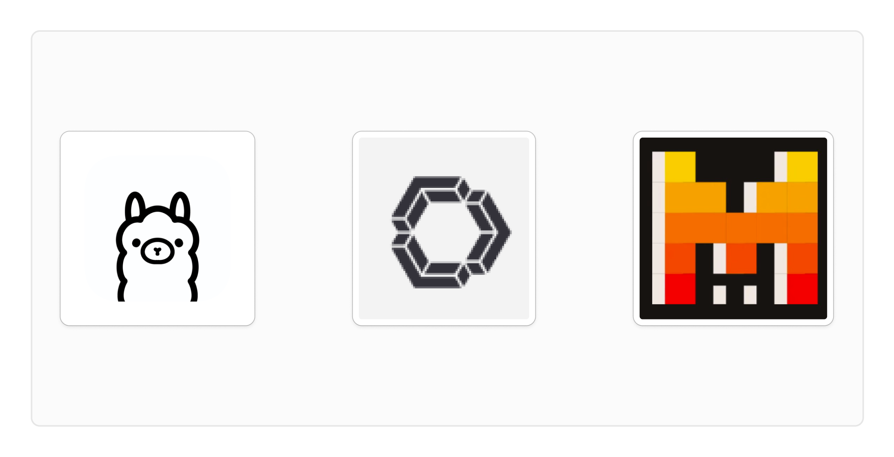

# Copilot 대체제 Continue

> **Summary**
> Continue는 GitHub Copilot의 오픈소스 대안으로, 다양한 AI 모델을 지원하며 로컬에서 실행할 수 있는 장점이 있습니다. Ollama를 통해 모델을 설치하고 VSCode에서 사용할 수 있으며, 채팅 모드와 자동완성 모드를 통해 효율적인 코딩 환경을 제공합니다. Mistral 모델의 뛰어난 성능과 StarCoder의 빠른 응답 속도를 활용하여 개발자들은 더욱 창의적인 코딩 경험을 즐길 수 있습니다.

---

🔗 [https://github.com/continuedev/continue](https://github.com/continuedev/continue)

🎥 [동영상 보기](https://www.youtube.com/watch?v=6whYBs6u-tA)

# GitHub Copilot의 오픈소스 대안, Continue 소개

안녕하세요. 오늘은 GitHub Copilot의 오픈소스 대체제인 'Continue'에 대해 소개해드리려고 합니다. Continue는 VSCode와 JetBrains IDE에서 사용할 수 있는 AI 코딩 어시스턴트로, 다양한 오픈소스 모델을 활용할 수 있는 강력한 도구입니다.

## Continue의 주요 특징

1. **오픈소스**: Continue는 완전히 오픈소스로 제공되어, 커뮤니티의 지속적인 개선과 확장이 가능합니다.
1. **다양한 모델 지원**: Llama, StarCoder, Mistral 등 다양한 오픈소스 모델을 지원하며, OpenAI, Anthropic 등 상용 모델도 사용할 수 있습니다.
1. **로컬 실행**: Ollama를 통해 모델을 로컬에서 실행할 수 있어, 데이터 프라이버시 보장과 인터넷 연결 없이도 사용 가능합니다.
1. **채팅 모델과 자동완성 모델의 분리**: 채팅 기능을 위한 모델과 코드 자동완성을 위한 모델을 별도로 설정할 수 있어, 각 작업에 최적화된 모델을 선택할 수 있습니다.
## 설정 및 사용 방법

1. **Ollama 설치**: [Ollama 공식 웹사이트](https://ollama.ai/)에서 다운로드 및 설치합니다.
1. **모델 다운로드**: Ollama를 통해 Llama, StarCoder, Mistral 등의 모델을 다운로드합니다.
1. **VSCode 확장 설치**: VSCode 마켓플레이스에서 Continue 확장을 설치합니다.
1. **설정**: `config.json` 파일에서 사용할 모델과 API 설정을 구성합니다.
## 모델 비교

1. **Llama 3**: 8B 파라미터 모델은 빠른 응답 속도를 제공하지만, 70B 모델에 비해 품질이 떨어질 수 있습니다.
1. **StarCoder**: 3B 파라미터의 Fill-in-the-middle 모델로, 코드 자동완성에 적합하지만 복잡한 작업에는 한계가 있습니다.
1. **Mistral**: 22B 파라미터 모델로, 뛰어난 코드 생성 능력을 보여주지만, 속도가 다소 느립니다.
## 사용 팁

1. **채팅 모드 활용**: 복잡한 코드 생성이나 설명이 필요한 경우, 채팅 모드를 사용하세요.
1. **자동완성 모드**: 빠른 코드 작성이 필요한 경우, StarCoder와 같은 가벼운 모델을 자동완성 모드로 사용하세요.
1. **모델 선택**: 작업의 복잡도와 필요한 응답 속도를 고려하여 적절한 모델을 선택하세요.
## 결론

Continue는 GitHub Copilot의 강력한 오픈소스 대안으로, 다양한 모델을 지원하고 로컬에서 실행할 수 있는 장점이 있습니다. 특히 Mistral 모델의 뛰어난 성능과 StarCoder의 빠른 응답 속도를 적절히 활용하면, 효율적인 코딩 환경을 구축할 수 있습니다. 오픈소스 커뮤니티의 지속적인 발전으로 앞으로 더 나은 기능과 성능 개선이 기대됩니다.

AI 코딩 어시스턴트의 세계는 계속 발전하고 있습니다. Continue와 같은 도구를 통해 개발자들은 더욱 효율적이고 창의적인 코딩 경험을 즐길 수 있을 것입니다. 여러분도 Continue를 한번 사용해보시는 건 어떨까요?

