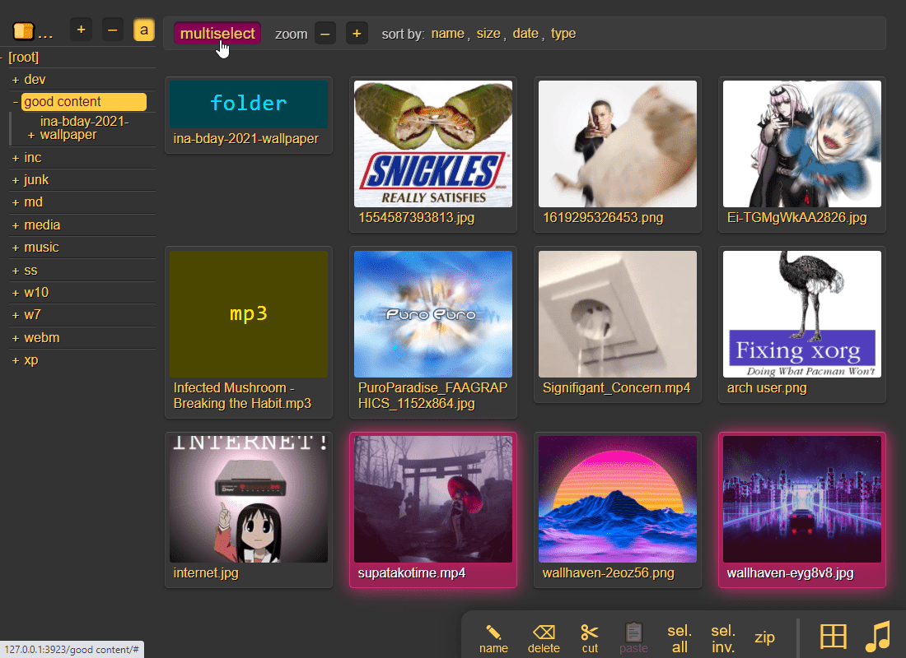
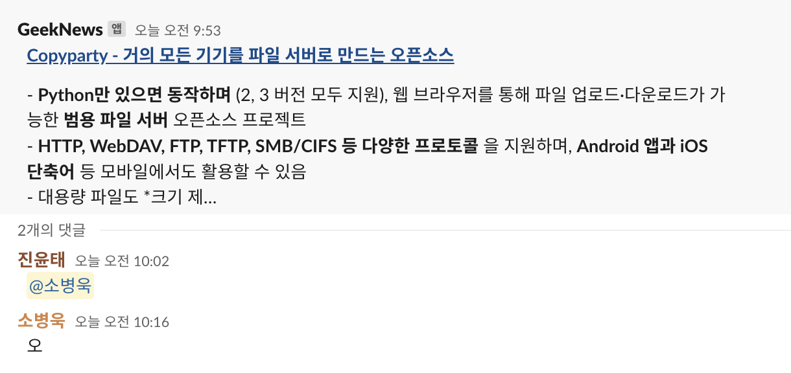
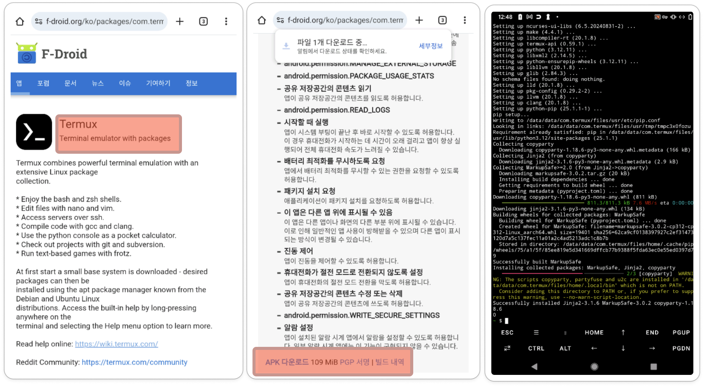
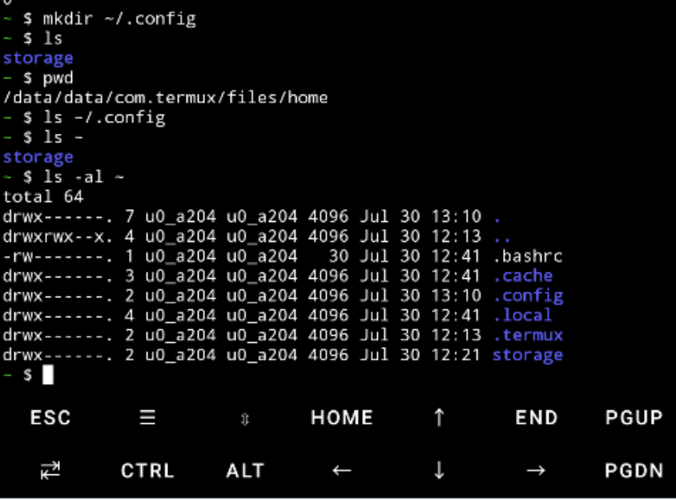
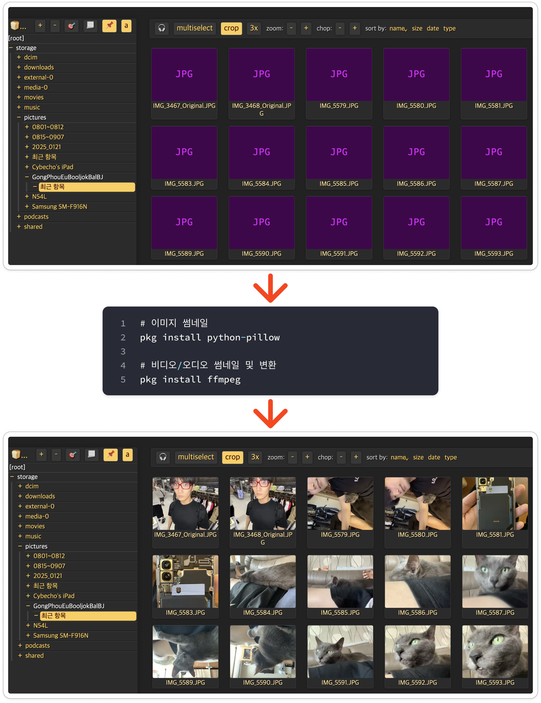

# Copyparty - 거의 모든 기기를 파일 서버로 만드는 오픈소스

> **Summary**
> Copyparty는 파이썬 파일 하나로 다양한 기기를 파일 서버로 변환하는 오픈소스 프로젝트로, 설치가 간편하고 다양한 파일 전송 프로토콜을 지원합니다. 사용자 계정 관리, 임시 공유 링크 생성, 미디어 스트리밍 등 풍부한 기능을 제공하며, 개인 데이터의 통제를 가능하게 합니다. 안정적인 파일 전송과 관리 도구로서의 역할을 하며, 사용자에게 실용성과 유연성을 제공합니다.

---



> 두근거리는 윤태님의 오전 알람…



### Copyparty: 파이썬 파일 하나로 거의 모든 기기를 만능 파일 서버로 만드는 법

🎥 [동영상 보기](https://www.youtube.com/watch?v=15_-hgsX2V0)

최근 `copyparty`라는 인상적인 오픈소스 프로젝트를 발견했습니다. 이 프로젝트의 핵심은 파이썬 파일 하나만으로 거의 모든 종류의 기기를 강력한 파일 서버로 만들어준다는 점입니다. 단순히 파일을 올리고 내리는 수준을 넘어, 현대적인 파일 서버가 갖춰야 할 거의 모든 기능을 놀라울 정도로 가볍고 간결하게 구현해 냈습니다. 설치나 빌드 과정 없이, 어떤 환경에서든 즉시 실행할 수 있는 실용성에 초점을 맞춘 이 프로젝트는 저의 오랜 고민에 대한 명쾌한 해답처럼 다가왔습니다.

### 왜 우리는 또 다른 파일 서버를 필요로 하는가?

기기 간 파일 전송은 생각보다 번거로운 작업입니다. 특히 스마트폰과 PC 사이에서, 혹은 인터넷이 불안정한 환경에서 대용량 파일을 옮겨야 할 때, 우리는 종종 적절한 도구가 없어 곤란을 겪습니다. 클라우드 서비스는 편리하지만 용량 제한이나 개인정보에 대한 우려가 있고, NAS 같은 전문 장비는 초기 비용과 설정의 부담이 있습니다. FTP나 SMB는 특정 상황에서는 훌륭하지만, 웹 브라우저만 있는 환경에서는 무용지물일 때가 많습니다.


`copyparty`는 바로 이 지점에서 출발합니다. 프로젝트의 철학은 "설정이나 빌드 과정 없이, 최대한 다양한 환경에서 바로 쓸 수 있는 실용성"을 추구하는 것입니다. 복잡한 의존성이나 설정 파일 없이, 단일 실행 파일 하나로 언제 어디서든 파일 서버를 즉시 가동할 수 있다는 점은 이 프로젝트의 가장 큰 미덕입니다. 임시로 파일을 공유해야 하는 긴급한 상황이든, 가정이나 사무실에서 쓸 가벼운 로컬 파일 서버가 필요하든, `copyparty`는 압도적인 유연성과 편의성을 제공합니다.

### 어떻게 이 모든 것이 가능한가?

`copyparty`가 제공하는 기능의 목록을 살펴보면, 이것이 단순히 가벼움만을 추구한 프로젝트가 아님을 알 수 있습니다. 오히려 대형 파일 서버 솔루션의 핵심 기능들을 효과적으로 응축해 놓았습니다.

- **압도적인 호환성과 단순함**: 파이썬 2와 3을 모두 지원하며, Windows, Linux, macOS, Android(Termux), FreeBSD 등 운영체제를 가리지 않습니다. 심지어 구형 PC나 라즈베리파이 같은 저사양 기기에서도 원활히 동작합니다. `copyparty-sfx.py`라는 단일 파일을 실행하는 것만으로 모든 것이 시작되며, Docker를 포함한 다양한 패키지 형태로도 제공되어 설치 과정이 사실상 없습니다.
- **현대적인 파일 전송 기능**: HTTP, WebDAV, FTP, 심지어 TFTP와 SMB까지 다양한 프로토콜을 지원하여 거의 모든 클라이언트 환경에 대응합니다. 웹 UI는 드래그 앤 드롭 방식의 폴더 단위 업로드를 지원하며, 대용량 파일도 청크(chunk) 단위로 분할하여 멀티스레드로 전송합니다. 덕분에 업로드 중단과 재개가 자유롭고, 네트워크 상태가 좋지 않은 환경에서도 안정적인 성능을 보여줍니다. 특히 인상 깊었던 "race-the-beam" 기능은 파일 업로드가 완료되기 전에도 이미 업로드된 부분까지 다운로드를 시작할 수 있게 하여, 즉각적인 파일 공유가 필요할 때 빛을 발합니다.
- **풍부한 부가 기능**: `copyparty`는 단순한 파일 저장소를 넘어섭니다. 사용자 계정별, 폴더별로 세밀한 읽기/쓰기/이동/삭제(rwmda) 권한을 설정할 수 있고, 기간과 암호를 지정할 수 있는 일회성 공유 링크 생성 기능도 갖추었습니다. 내장된 미디어 플레이어는 서버 측 트랜스코딩을 통해 거의 모든 형식의 오디오와 비디오를 스트리밍으로 재생하며, 앨범 아트와 함께 잠금 화면 컨트롤까지 지원합니다. 또한, 파일 인덱싱을 활성화하면 파일명, 크기, 날짜는 물론 오디오 파일의 메타 태그(아티스트, 앨범 등)를 이용한 강력한 검색이 가능해집니다. 이 외에도 RSS 피드, 실시간 로그 뷰어, 배치 이름 변경, 마크다운 편집기 등 파워 유저들이 꿈꿔왔을 법한 기능들이 가득합니다.
### 그래서, 이것이 우리에게 어떤 의미인가?

`copyparty`는 잘 만들어진 소프트웨어를 넘어, 개발자의 깊은 고민과 뚜렷한 철학이 담겨있는 결과물입니다. Hacker News의 한 댓글에서 개발자는 2019년부터 스마트폰으로 코딩을 시작하며 이 프로젝트를 만들었다고 밝혔습니다. 이는 AI나 LLM의 도움 없이, 순수한 필요와 재미를 동력으로 만들어진 장인 정신의 산물임을 보여줍니다.

프로젝트의 README에서 밝힌 "역(逆) 리눅스 철학 — 모든 걸 다 하고, 무난하게 해냄(inverse linux philosophy -- do all the things, and do an okay job)"이라는 문구는 이 프로젝트의 정체성을 가장 잘 설명합니다. 하나의 기능에만 집중하는 대신, 사용자가 마주할 다양한 상황에 유연하게 대처할 수 있는 '만능 도구'를 지향하는 것입니다.

이러한 철학 덕분에 `copyparty`는 Nextcloud와 같은 무거운 솔루션이 부담스럽거나, Syncthing처럼 상시 동기화가 필요 없는 사용자들에게 훌륭한 대안이 될 수 있습니다. 이는 단순히 파일을 공유하는 행위를 넘어, 낡은 노트북, 남는 안드로이드폰, 라즈베리파이 등 잠자고 있던 모든 기기에 새로운 쓰임새를 부여하고, 사용자가 자신의 데이터를 직접 통제할 수 있는 자유를 선사합니다. `copyparty`는 오픈소스 커뮤니티가 보여줄 수 있는 최고의 가치, 즉 개인의 창의성과 노력이 어떻게 모두를 위한 강력하고 실용적인 도구로 발전할 수 있는지를 증명하는 살아있는 예시입니다.

## 그렇다면 나는 왜 안정적인 파일 서버가 필요했나?

> **내가 이게 왜 필요하게 되었는가?**

### 불안정한 안드로이드 파일 서버 CX탐색기에게 작별을 고하며…


PC와 스마트폰 사이에서 파일을 주고받는 것은 아주 흔한 일입니다. 저 역시 로컬 네트워크 안에서 두 기기 간의 파일 전송을 위해 여러 방법을 사용해왔습니다. 그중 가장 오래 사용한 방법은 안드로이드 파일 탐색기 앱인 'CX 파일탐색기'에 내장된 FTP 서버 기능이었습니다. 별도의 설정 없이 버튼 한 번으로 FTP 서버를 열 수 있어 간편했기 때문입니다.

하지만 이 방식에는 고질적인 문제가 있었습니다. 안드로이드 운영체제는 시스템 자원을 관리하기 위해 백그라운드에서 실행되는 앱 프로세스를 예고 없이 종료하곤 합니다. CX 파일탐색기 역시 예외는 아니어서, 파일을 한창 옮기던 중 FTP 연결이 끊기는 일이 잦았습니다. 대용량 파일을 옮길 때 이런 일이 발생하면 처음부터 다시 전송을 시작해야 했습니다. 이는 제가 스스로 정한 '개인용 시스템 운영 가용성(SLA)'을 심각하게 해치는 요소였습니다. 결국 저는 더 안정적이고 지속적으로 운영할 수 있는 안드로이드 파일 서버를 찾아 나서게 되었습니다.

### 어떻게 Copyparty를 만나고 정착하게 되었나?

프로젝트의 GitHub 페이지와 소개 영상을 살펴보니 그 기능의 깊이에 놀라지 않을 수 없었습니다. HTTP, WebDAV, FTP 등 다양한 프로토콜 지원은 기본이고, 멀티스레드를 활용한 빠른 속도와 중단된 지점부터 다시 시작하는 이어올리기/받기 기능, 계정별 권한 관리, 임시 공유 링크 생성 등 상상했던 파일 서버의 모든 기능이 담겨 있었습니다. 특히 업로드 도중에도 해당 파일의 다운로드를 시작할 수 있는 'Race the Beam' 기능 시연 영상은 이 프로젝트가 지향하는 바를 명확히 보여주었습니다.



안드로이드 스마트폰에 설치하는 과정은 놀라울 정도로 간단했습니다. 먼저 리눅스 환경을 제공하는 Termux 앱을 설치한 후, 공식 설명서에 있는 명령어 한 줄을 붙여넣는 것으로 모든 준비가 끝났습니다.

> install Termux + its companion app `Termux:API` (see ocv.me/termux) and then copy-paste this into Termux (long-tap) all at once:

```shell
yes | pkg upgrade && termux-setup-storage && yes | pkg install python termux-api && python -m ensurepip && python -m pip install --user -U copyparty && { grep -qE 'PATH=.*\.local/bin' ~/.bashrc 2>/dev/null || { echo 'PATH="$HOME/.local/bin:$PATH"' >> ~/.bashrc && . ~/.bashrc; }; }
echo $?
```

<details>
<summary>전체 로그 확인</summary>

```plain text
~ $ yes | pkg upgrade && termux-setup-storage && yes | pkg install python termux-api && python -m ensurepip && python -m pip install --user -U copyparty && { grep -qE 'PATH=.*\.local/bin' ~/.bashrc 2>/dev/null || { echo 'PATH="$HOME/.local/bin:$PATH"' >> ~/.bashrc && . ~/.bashrc; }; }
echo $?

No mirror or mirror group selected. You might want to select one by running 'termux-change-repo'
Testing the available mirrors:
[*] (10) https://packages-cf.termux.dev/apt/termux-main: ok
[*] (1) https://tmx.xvx.my.id/apt/termux-main: ok
[*] (1) https://mirror.twds.com.tw/termux/termux-main: ok
[*] (1) https://mirror.bardia.tech/termux/termux-main: bad
[*] (1) https://mirror.meowsmp.net/termux/termux-main: ok
[*] (1) https://mirror.nevacloud.com/applications/termux/termux-main: ok
[*] (1) https://linux.domainesia.com/applications/termux/termux-main: ok
[*] (1) https://mirror.rinarin.dev/termux/termux-main: ok
[*] (1) https://mirrors.cbrx.io/apt/termux/termux-main: ok
[*] (1) https://termux.niranjan.co/termux-main: ok
[*] (1) https://mirror.jeonnam.school/termux/termux-main: ok
[*] (1) https://mirrors.krnk.org/apt/termux/termux-main: ok
[*] (1) https://mirror.freedif.org/termux/termux-main: ok
[*] (1) https://mirrors.saswata.cc/termux/termux-main: ok
[*] (1) https://mirrors.nguyenhoang.cloud/termux/termux-main: ok
[*] (1) https://mirrors.ravidwivedi.in/termux/termux-main: ok
[*] (1) https://mirror.textcord.xyz/termux/termux-main: bad
[*] (1) https://mirrors.in.sahilister.net/termux/termux-main/: ok
[*] (1) https://mirror.albony.in/termux/termux-main: ok
[*] (1) https://mirrors.zju.edu.cn/termux/apt/termux-main: ok
[*] (1) https://mirrors.pku.edu.cn/termux/termux-main/: ok
[*] (1) https://mirror.iscas.ac.cn/termux/apt/termux-main: ok
[*] (1) https://mirrors.sau.edu.cn/termux/apt/termux-main: ok
[*] (1) https://mirror.sjtu.edu.cn/termux/termux-main/: ok
[*] (1) https://mirrors.ustc.edu.cn/termux/termux-main: ok
[*] (1) https://mirrors.bfsu.edu.cn/termux/apt/termux-main: ok
[*] (1) https://mirror.nyist.edu.cn/termux/apt/termux-main: ok
[*] (1) https://mirrors.sustech.edu.cn/termux/apt/termux-main: ok
[*] (1) https://mirrors.sdu.edu.cn/termux/termux-main: bad
[*] (1) https://mirrors.cqupt.edu.cn/termux/termux-main: ok
[*] (1) https://mirrors.hust.edu.cn/termux/apt/termux-main: ok
[*] (1) https://mirrors.nju.edu.cn/termux/apt/termux-main: ok
[*] (1) https://mirrors.cernet.edu.cn/termux/apt/termux-main: ok
[*] (1) https://mirrors.tuna.tsinghua.edu.cn/termux/apt/termux-main: ok
[*] (1) https://mirrors.aliyun.com/termux/termux-main: ok
[*] (1) https://termux.cdn.lumito.net/termux-main: ok
[*] (1) https://mirrors.cfe.re/termux/termux-main: bad
[*] (1) https://mirrors.medzik.dev/termux/termux-main: ok
[*] (1) https://termux.librehat.com/apt/termux-main: ok
[*] (1) https://termux.3san.dev/termux/termux-main: bad
[*] (1) https://is.mirror.flokinet.net/termux/termux-main: ok
[*] (1) https://termux.mentality.rip/termux-main: ok
[*] (1) https://mirror.mwt.me/termux/main: ok
[*] (1) https://md.mirrors.hacktegic.com/termux/termux-main: ok
[*] (1) https://mirror.termux.dev/termux-main: bad
[*] (1) https://nl.mirror.flokinet.net/termux/termux-main: ok
[*] (1) https://mirror.polido.pt/termux/termux-main: bad
[*] (1) https://mirror.leitecastro.com/termux/termux-main: ok
[*] (1) https://mirror.autkin.net/termux/termux-main: ok
[*] (1) https://ftp.agdsn.de/termux/termux-main: ok
[*] (1) https://mirror.accum.se/mirror/termux.dev/termux-main: ok
[*] (1) https://mirror.bouwhuis.network/termux/termux-main: ok
[*] (1) https://mirrors.de.sahilister.net/termux/termux-main: ok
[*] (4) https://grimler.se/termux/termux-main: ok
[*] (1) https://ro.mirror.flokinet.net/termux/termux-main: ok
[*] (1) https://ftp.fau.de/termux/termux-main: ok
[*] (1) https://packages.termux.dev/apt/termux-main: ok
[*] (1) https://mirror.sunred.org/termux/termux-main: ok
[*] (1) https://mirror.csclub.uwaterloo.ca/termux/termux-main: ok
[*] (1) https://mirror.vern.cc/termux/termux-main: ok
[*] (1) https://dl.kcubeterm.com/termux-main: bad
[*] (1) https://mirror.fcix.net/termux/termux-main: ok
[*] (1) https://gnlug.org/pub/termux/termux-main: ok
[*] (1) https://mirrors.utermux.dev/termux/termux-main: ok
[*] (1) https://mirror.quantum5.ca/termux/termux-main: ok
[*] (1) https://termux.danyael.xyz/termux/termux-main: ok
[*] (1) https://plug-mirror.rcac.purdue.edu/termux/termux-main: ok
[*] (1) https://mirror.mwt.me/termux/main: ok
[*] (1) https://mirrors.middlendian.com/termux/termux-main: ok
[*] (1) https://repository.su/termux/termux-main/: bad
[*] (1) http://mirror.mephi.ru/termux/termux-main: ok
Picking mirror: (20) /data/data/com.termux/files/usr/etc/termux/mirrors/asia/mirror.freedif.org
Get:1 https://mirror.freedif.org/termux/termux-main stable InRelease [14.0 kB]
Get:2 https://mirror.freedif.org/termux/termux-main stable/main aarch64 Packages [531 kB]
Fetched 545 kB in 12s (44.4 kB/s)
Reading package lists... Done
Building dependency tree... Done
36 packages can be upgraded. Run 'apt list --upgradable' to see them.
Reading package lists... Done
Building dependency tree... Done
Calculating upgrade... Done
The following packages will be upgraded:
  bash ca-certificates command-not-found coreutils curl
  debianutils diffutils dpkg ed gawk gpgv grep gzip less
  libassuan libcurl libgcrypt libgpg-error libidn2 liblzma
  libnettle libnghttp2 libnghttp3 libsmartcols libunbound lsof
  nano openssl patch readline termux-core termux-exec
  termux-keyring termux-tools util-linux xz-utils
36 upgraded, 0 newly installed, 0 to remove and 0 not upgraded.
Need to get 11.6 MB of archives.
After this operation, 2367 kB of additional disk space will be used.
Get:1 https://mirror.freedif.org/termux/termux-main stable/main aarch64 readline aarch64 8.3.1 [293 kB]
Get:2 https://mirror.freedif.org/termux/termux-main stable/main aarch64 ca-certificates all 1:2025.07.15 [123 kB]
Get:3 https://mirror.freedif.org/termux/termux-main stable/main aarch64 openssl aarch64 1:3.5.1 [2447 kB]
Get:4 https://mirror.freedif.org/termux/termux-main stable/main aarch64 coreutils aarch64 9.7-2 [764 kB]
Get:5 https://mirror.freedif.org/termux/termux-main stable/main aarch64 libnghttp2 aarch64 1.66.0 [95.0 kB]
Get:6 https://mirror.freedif.org/termux/termux-main stable/main aarch64 libnghttp3 aarch64 1.11.0 [65.8 kB]
Get:7 https://mirror.freedif.org/termux/termux-main stable/main aarch64 libcurl aarch64 8.15.0 [968 kB]
Get:8 https://mirror.freedif.org/termux/termux-main stable/main aarch64 curl aarch64 8.15.0 [226 kB]
Get:9 https://mirror.freedif.org/termux/termux-main stable/main aarch64 diffutils aarch64 3.12-1 [163 kB]
Get:10 https://mirror.freedif.org/termux/termux-main stable/main aarch64 gawk aarch64 5.3.1-1 [782 kB]
Get:11 https://mirror.freedif.org/termux/termux-main stable/main aarch64 grep aarch64 3.12-1 [128 kB]
Get:12 https://mirror.freedif.org/termux/termux-main stable/main aarch64 gzip aarch64 1.14 [87.8 kB]
Get:13 https://mirror.freedif.org/termux/termux-main stable/main aarch64 less aarch64 679-1 [129 kB]
Get:14 https://mirror.freedif.org/termux/termux-main stable/main aarch64 termux-core aarch64 0.4.0 [198 kB]
Get:15 https://mirror.freedif.org/termux/termux-main stable/main aarch64 termux-exec aarch64 1:2.4.0 [377 kB]
Get:16 https://mirror.freedif.org/termux/termux-main stable/main aarch64 libsmartcols aarch64 2.40.2-4 [98.0 kB]
Get:17 https://mirror.freedif.org/termux/termux-main stable/main aarch64 util-linux aarch64 2.40.2-4 [726 kB]
Get:18 https://mirror.freedif.org/termux/termux-main stable/main aarch64 liblzma aarch64 5.8.1 [192 kB]
Get:19 https://mirror.freedif.org/termux/termux-main stable/main aarch64 xz-utils aarch64 5.8.1 [71.0 kB]
Get:20 https://mirror.freedif.org/termux/termux-main stable/main aarch64 termux-tools aarch64 1.46.0+really1.45.0 [33.6 kB]
Get:21 https://mirror.freedif.org/termux/termux-main stable/main aarch64 bash aarch64 5.3 [956 kB]
Get:22 https://mirror.freedif.org/termux/termux-main stable/main aarch64 dpkg aarch64 1.22.6-3 [309 kB]
Get:23 https://mirror.freedif.org/termux/termux-main stable/main aarch64 termux-keyring all 3.13 [39.8 kB]
Get:24 https://mirror.freedif.org/termux/termux-main stable/main aarch64 libgpg-error aarch64 1.55 [120 kB]
Get:25 https://mirror.freedif.org/termux/termux-main stable/main aarch64 libassuan aarch64 3.0.2 [74.0 kB]
Get:26 https://mirror.freedif.org/termux/termux-main stable/main aarch64 libgcrypt aarch64 1.11.1 [502 kB]
Get:27 https://mirror.freedif.org/termux/termux-main stable/main aarch64 gpgv aarch64 2.5.5 [187 kB]
Get:28 https://mirror.freedif.org/termux/termux-main stable/main aarch64 libidn2 aarch64 2.3.8 [105 kB]
Get:29 https://mirror.freedif.org/termux/termux-main stable/main aarch64 libnettle aarch64 3.10.2 [407 kB]
Get:30 https://mirror.freedif.org/termux/termux-main stable/main aarch64 libunbound aarch64 1.23.1 [365 kB]
Get:31 https://mirror.freedif.org/termux/termux-main stable/main aarch64 command-not-found aarch64 3.1-5 [104 kB]
Get:32 https://mirror.freedif.org/termux/termux-main stable/main aarch64 debianutils aarch64 5.23.1 [16.8 kB]
Get:33 https://mirror.freedif.org/termux/termux-main stable/main aarch64 ed aarch64 1.22 [42.7 kB]
Get:34 https://mirror.freedif.org/termux/termux-main stable/main aarch64 lsof aarch64 4.99.5 [122 kB]
Get:35 https://mirror.freedif.org/termux/termux-main stable/main aarch64 nano aarch64 8.5-2 [230 kB]
Get:36 https://mirror.freedif.org/termux/termux-main stable/main aarch64 patch aarch64 2.8 [73.9 kB]
Fetched 11.6 MB in 2min 59s (64.9 kB/s)
(Reading database ... 4470 files and directories currently installed.)
Preparing to unpack .../readline_8.3.1_aarch64.deb ...
Unpacking readline (8.3.1) over (8.2.13) ...
Setting up readline (8.3.1) ...
(Reading database ... 4475 files and directories currently installed.)
Preparing to unpack .../ca-certificates_1%3a2025.07.15_all.deb ...
Unpacking ca-certificates (1:2025.07.15) over (1:2025.02.25) ...
Setting up ca-certificates (1:2025.07.15) ...
(Reading database ... 4475 files and directories currently installed.)
Preparing to unpack .../openssl_1%3a3.5.1_aarch64.deb ...
Unpacking openssl (1:3.5.1) over (1:3.4.1) ...
Setting up openssl (1:3.5.1) ...

Configuration file '/data/data/com.termux/files/usr/etc/tls/openssl.cnf'
 ==> File on system created by you or by a script.
 ==> File also in package provided by package maintainer.
   What would you like to do about it ?  Your options are:
    Y or I  : install the package maintainer's version
    N or O  : keep your currently-installed version
      D     : show the differences between the versions
      Z     : start a shell to examine the situation
 The default action is to keep your current version.
*** openssl.cnf (Y/I/N/O/D/Z) [default=N] ? Installing new version of config file /data/data/com.termux/files/usr/etc/tls/openssl.cnf ...
(Reading database ... 4476 files and directories currently installed.)
Preparing to unpack .../coreutils_9.7-2_aarch64.deb ...
Unpacking coreutils (9.7-2) over (9.6-1) ...
Setting up coreutils (9.7-2) ...
update-alternatives: using /data/data/com.termux/files/usr/libexec/coreutils/cat to provide /data/data/com.termux/files/usr/bin/pager (pager) in auto mode
(Reading database ... 4477 files and directories currently installed.)
Preparing to unpack .../libnghttp2_1.66.0_aarch64.deb ...
Unpacking libnghttp2 (1.66.0) over (1.65.0) ...
Setting up libnghttp2 (1.66.0) ...
(Reading database ... 4477 files and directories currently installed.)
Preparing to unpack .../libnghttp3_1.11.0_aarch64.deb ...
Unpacking libnghttp3 (1.11.0) over (1.8.0) ...
Setting up libnghttp3 (1.11.0) ...
(Reading database ... 4477 files and directories currently installed.)
Preparing to unpack .../libcurl_8.15.0_aarch64.deb ...
Unpacking libcurl (8.15.0) over (8.12.1) ...
Setting up libcurl (8.15.0) ...
(Reading database ... 4481 files and directories currently installed.)
Preparing to unpack .../curl_8.15.0_aarch64.deb ...
Unpacking curl (8.15.0) over (8.12.1) ...
Setting up curl (8.15.0) ...
(Reading database ... 4481 files and directories currently installed.)
Preparing to unpack .../diffutils_3.12-1_aarch64.deb ...
Unpacking diffutils (3.12-1) over (3.11) ...
Setting up diffutils (3.12-1) ...
(Reading database ... 4481 files and directories currently installed.)
Preparing to unpack .../gawk_5.3.1-1_aarch64.deb ...
Unpacking gawk (5.3.1-1) over (5.3.0) ...
Setting up gawk (5.3.1-1) ...
(Reading database ... 4479 files and directories currently installed.)
Preparing to unpack .../grep_3.12-1_aarch64.deb ...
Unpacking grep (3.12-1) over (3.11) ...
Setting up grep (3.12-1) ...
(Reading database ... 4479 files and directories currently installed.)
Preparing to unpack .../archives/gzip_1.14_aarch64.deb ...
Unpacking gzip (1.14) over (1.13) ...
Setting up gzip (1.14) ...
(Reading database ... 4479 files and directories currently installed.)
Preparing to unpack .../less_679-1_aarch64.deb ...
Unpacking less (679-1) over (668) ...
Setting up less (679-1) ...
update-alternatives: using /data/data/com.termux/files/usr/bin/less to provide /data/data/com.termux/files/usr/bin/pager (pager) in auto mode
(Reading database ... 4479 files and directories currently installed.)
Preparing to unpack .../termux-core_0.4.0_aarch64.deb ...
Unpacking termux-core (0.4.0) over (0.3.0) ...
Setting up termux-core (0.4.0) ...
(Reading database ... 4480 files and directories currently installed.)
Preparing to unpack .../termux-exec_1%3a2.4.0_aarch64.deb ...
Unpacking termux-exec (1:2.4.0) over (1:2.3.0) ...
Setting up termux-exec (1:2.4.0) ...
termux-exec.postinst: Start
termux-exec.postinst: android_build_version_sdk: '29'
termux-exec: Setting primary Termux '$LD_PRELOAD' library in 'libtermux-exec-ld-preload.so' to '/data/data/com.termux/files/usr/lib/libtermux-exec-direct-ld-preload.so'
termux-exec.postinst: End
(Reading database ... 4483 files and directories currently installed.)
Preparing to unpack .../libsmartcols_2.40.2-4_aarch64.deb ...
Unpacking libsmartcols (2.40.2-4) over (2.40.2-3) ...
Setting up libsmartcols (2.40.2-4) ...
(Reading database ... 4483 files and directories currently installed.)
Preparing to unpack .../util-linux_2.40.2-4_aarch64.deb ...
Unpacking util-linux (2.40.2-4) over (2.40.2-3) ...
Setting up util-linux (2.40.2-4) ...
(Reading database ... 4494 files and directories currently installed.)
Preparing to unpack .../liblzma_5.8.1_aarch64.deb ...
Unpacking liblzma (5.8.1) over (5.8.0) ...
Setting up liblzma (5.8.1) ...
(Reading database ... 4494 files and directories currently installed.)
Preparing to unpack .../xz-utils_5.8.1_aarch64.deb ...
Unpacking xz-utils (5.8.1) over (5.8.0) ...
Setting up xz-utils (5.8.1) ...
(Reading database ... 4494 files and directories currently installed.)
Preparing to unpack .../termux-tools_1.46.0+really1.45.0_aarch64.deb ...
Unpacking termux-tools (1.46.0+really1.45.0) over (1.45.0) ...
Setting up termux-tools (1.46.0+really1.45.0) ...
(Reading database ... 4494 files and directories currently installed.)
Preparing to unpack .../archives/bash_5.3_aarch64.deb ...
Unpacking bash (5.3) over (5.2.37-2) ...
Setting up bash (5.3) ...

Configuration file '/data/data/com.termux/files/usr/etc/bash.bashrc'
 ==> File on system created by you or by a script.
 ==> File also in package provided by package maintainer.
   What would you like to do about it ?  Your options are:
    Y or I  : install the package maintainer's version
    N or O  : keep your currently-installed version
      D     : show the differences between the versions
      Z     : start a shell to examine the situation
 The default action is to keep your current version.
*** bash.bashrc (Y/I/N/O/D/Z) [default=N] ? Installing new version of config file /data/data/com.termux/files/usr/etc/bash.bashrc ...
(Reading database ... 4501 files and directories currently installed.)
Preparing to unpack .../dpkg_1.22.6-3_aarch64.deb ...
Unpacking dpkg (1.22.6-3) over (1.22.6-1) ...
Setting up dpkg (1.22.6-3) ...
(Reading database ... 4501 files and directories currently installed.)
Preparing to unpack .../termux-keyring_3.13_all.deb ...
Unpacking termux-keyring (3.13) over (3.12-1) ...
Setting up termux-keyring (3.13) ...
(Reading database ... 4504 files and directories currently installed.)
Preparing to unpack .../libgpg-error_1.55_aarch64.deb ...
Unpacking libgpg-error (1.55) over (1.50) ...
Setting up libgpg-error (1.55) ...
(Reading database ... 4504 files and directories currently installed.)
Preparing to unpack .../libassuan_3.0.2_aarch64.deb ...
Unpacking libassuan (3.0.2) over (3.0.1-2) ...
Setting up libassuan (3.0.2) ...
(Reading database ... 4504 files and directories currently installed.)
Preparing to unpack .../libgcrypt_1.11.1_aarch64.deb ...
Unpacking libgcrypt (1.11.1) over (1.11.0) ...
Setting up libgcrypt (1.11.1) ...
(Reading database ... 4504 files and directories currently installed.)
Preparing to unpack .../gpgv_2.5.5_aarch64.deb ...
Unpacking gpgv (2.5.5) over (2.4.5-3) ...
Setting up gpgv (2.5.5) ...
(Reading database ... 4504 files and directories currently installed.)
Preparing to unpack .../libidn2_2.3.8_aarch64.deb ...
Unpacking libidn2 (2.3.8) over (2.3.7) ...
Setting up libidn2 (2.3.8) ...
(Reading database ... 4504 files and directories currently installed.)
Preparing to unpack .../libnettle_3.10.2_aarch64.deb ...
Unpacking libnettle (3.10.2) over (3.10.1) ...
Setting up libnettle (3.10.2) ...
(Reading database ... 4504 files and directories currently installed.)
Preparing to unpack .../libunbound_1.23.1_aarch64.deb ...
Unpacking libunbound (1.23.1) over (1.22.0) ...
Setting up libunbound (1.23.1) ...
(Reading database ... 4504 files and directories currently installed.)
Preparing to unpack .../0-command-not-found_3.1-5_aarch64.deb ...
Unpacking command-not-found (3.1-5) over (2.4.0-68) ...
Preparing to unpack .../1-debianutils_5.23.1_aarch64.deb ...
Unpacking debianutils (5.23.1) over (5.21) ...
Preparing to unpack .../2-ed_1.22_aarch64.deb ...
Unpacking ed (1.22) over (1.21.1) ...
Preparing to unpack .../3-lsof_4.99.5_aarch64.deb ...
Unpacking lsof (4.99.5) over (4.99.4) ...
Preparing to unpack .../4-nano_8.5-2_aarch64.deb ...
Unpacking nano (8.5-2) over (8.3) ...
Preparing to unpack .../5-patch_2.8_aarch64.deb ...
Unpacking patch (2.8) over (2.7.6-4) ...
Setting up ed (1.22) ...
Setting up command-not-found (3.1-5) ...
Setting up patch (2.8) ...
Setting up lsof (4.99.5) ...
Setting up nano (8.5-2) ...
update-alternatives: updating alternative /data/data/com.termux/files/usr/bin/nano because link group editor has changed slave links
update-alternatives: warning: failed to detect 'makewhatis', not updating manpage database
Setting up debianutils (5.23.1) ...
No mirror or mirror group selected. You might want to select one by running 'termux-change-repo'
Checking availability of current mirror:
[*] https://mirror.freedif.org/termux/termux-main: ok
Reading package lists... Done
Building dependency tree... Done
Reading state information... Done
The following additional packages will be installed:
  clang gdbm glib libandroid-posix-semaphore libcompiler-rt
  libcrypt libexpat libffi libllvm libsqlite libxml2 lld llvm
  make ncurses-ui-libs ndk-sysroot pkg-config
  python-ensurepip-wheels python-pip
Suggested packages:
  python-tkinter
The following NEW packages will be installed:
  clang gdbm glib libandroid-posix-semaphore libcompiler-rt
  libcrypt libexpat libffi libllvm libsqlite libxml2 lld llvm
  make ncurses-ui-libs ndk-sysroot pkg-config python
  python-ensurepip-wheels python-pip termux-api
0 upgraded, 21 newly installed, 0 to remove and 0 not upgraded.
Need to get 96.5 MB of archives.
After this operation, 610 MB of additional disk space will be used.
Get:1 https://mirror.freedif.org/termux/termux-main stable/main aarch64 libcompiler-rt aarch64 20.1.8 [2734 kB]
Get:2 https://mirror.freedif.org/termux/termux-main stable/main aarch64 libffi aarch64 3.4.7 [30.6 kB]
Get:3 https://mirror.freedif.org/termux/termux-main stable/main aarch64 libxml2 aarch64 2.14.5 [453 kB]
Get:4 https://mirror.freedif.org/termux/termux-main stable/main aarch64 libllvm aarch64 20.1.8 [29.1 MB]
Get:5 https://mirror.freedif.org/termux/termux-main stable/main aarch64 lld aarch64 20.1.8 [2539 kB]
Get:6 https://mirror.freedif.org/termux/termux-main stable/main aarch64 llvm aarch64 20.1.8 [14.3 MB]
Get:7 https://mirror.freedif.org/termux/termux-main stable/main aarch64 ndk-sysroot aarch64 27c [1737 kB]
Get:8 https://mirror.freedif.org/termux/termux-main stable/main aarch64 clang aarch64 20.1.8 [29.9 MB]
Get:9 https://mirror.freedif.org/termux/termux-main stable/main aarch64 gdbm aarch64 1.25 [150 kB]
Get:10 https://mirror.freedif.org/termux/termux-main stable/main aarch64 libandroid-posix-semaphore aarch64 0.1-3 [4128 B]
Get:11 https://mirror.freedif.org/termux/termux-main stable/main aarch64 libcrypt aarch64 0.2-5 [8720 B]
Get:12 https://mirror.freedif.org/termux/termux-main stable/main aarch64 libexpat aarch64 2.7.1 [87.8 kB]
Get:13 https://mirror.freedif.org/termux/termux-main stable/main aarch64 libsqlite aarch64 3.50.3 [635 kB]
Get:14 https://mirror.freedif.org/termux/termux-main stable/main aarch64 ncurses-ui-libs aarch64 6.5.20240831-2 [33.0 kB]
Get:15 https://mirror.freedif.org/termux/termux-main stable/main aarch64 python aarch64 3.12.11 [7546 kB]
Get:16 https://mirror.freedif.org/termux/termux-main stable/main aarch64 glib aarch64 2.84.3 [2546 kB]
Get:17 https://mirror.freedif.org/termux/termux-main stable/main aarch64 make aarch64 4.4.1 [239 kB]
Get:18 https://mirror.freedif.org/termux/termux-main stable/main aarch64 pkg-config aarch64 0.29.2-2 [31.4 kB]
Get:19 https://mirror.freedif.org/termux/termux-main stable/main aarch64 python-ensurepip-wheels all 3.12.11 [1802 kB]
Get:20 https://mirror.freedif.org/termux/termux-main stable/main aarch64 python-pip all 25.1.1-1 [2584 kB]
Get:21 https://mirror.freedif.org/termux/termux-main stable/main aarch64 termux-api aarch64 0.59.1 [28.8 kB]
Fetched 96.5 MB in 18min 38s (86.3 kB/s)
Selecting previously unselected package libcompiler-rt.
(Reading database ... 4504 files and directories currently installed.)
Preparing to unpack .../00-libcompiler-rt_20.1.8_aarch64.deb ...
Unpacking libcompiler-rt (20.1.8) ...
Selecting previously unselected package libffi.
Preparing to unpack .../01-libffi_3.4.7_aarch64.deb ...
Unpacking libffi (3.4.7) ...
Selecting previously unselected package libxml2.
Preparing to unpack .../02-libxml2_2.14.5_aarch64.deb ...
Unpacking libxml2 (2.14.5) ...
Selecting previously unselected package libllvm.
Preparing to unpack .../03-libllvm_20.1.8_aarch64.deb ...
Unpacking libllvm (20.1.8) ...
Selecting previously unselected package lld.
Preparing to unpack .../04-lld_20.1.8_aarch64.deb ...
Unpacking lld (20.1.8) ...
Selecting previously unselected package llvm.
Preparing to unpack .../05-llvm_20.1.8_aarch64.deb ...
Unpacking llvm (20.1.8) ...
Selecting previously unselected package ndk-sysroot.
Preparing to unpack .../06-ndk-sysroot_27c_aarch64.deb ...
Unpacking ndk-sysroot (27c) ...
Selecting previously unselected package clang.
Preparing to unpack .../07-clang_20.1.8_aarch64.deb ...
Unpacking clang (20.1.8) ...
Selecting previously unselected package gdbm.
Preparing to unpack .../08-gdbm_1.25_aarch64.deb ...
Unpacking gdbm (1.25) ...
Selecting previously unselected package libandroid-posix-semaphore.
Preparing to unpack .../09-libandroid-posix-semaphore_0.1-3_aarch64.deb ...
Unpacking libandroid-posix-semaphore (0.1-3) ...
Selecting previously unselected package libcrypt.
Preparing to unpack .../10-libcrypt_0.2-5_aarch64.deb ...
Unpacking libcrypt (0.2-5) ...
Selecting previously unselected package libexpat.
Preparing to unpack .../11-libexpat_2.7.1_aarch64.deb ...
Unpacking libexpat (2.7.1) ...
Selecting previously unselected package libsqlite.
Preparing to unpack .../12-libsqlite_3.50.3_aarch64.deb ...
Unpacking libsqlite (3.50.3) ...
Selecting previously unselected package ncurses-ui-libs.
Preparing to unpack .../13-ncurses-ui-libs_6.5.20240831-2_aarch64.deb ...
Unpacking ncurses-ui-libs (6.5.20240831-2) ...
Selecting previously unselected package python.
Preparing to unpack .../14-python_3.12.11_aarch64.deb ...
Unpacking python (3.12.11) ...
Selecting previously unselected package glib.
Preparing to unpack .../15-glib_2.84.3_aarch64.deb ...
Unpacking glib (2.84.3) ...
Selecting previously unselected package make.
Preparing to unpack .../16-make_4.4.1_aarch64.deb ...
Unpacking make (4.4.1) ...
Selecting previously unselected package pkg-config.
Preparing to unpack .../17-pkg-config_0.29.2-2_aarch64.deb ...
Unpacking pkg-config (0.29.2-2) ...
Selecting previously unselected package python-ensurepip-wheels.
Preparing to unpack .../18-python-ensurepip-wheels_3.12.11_all.deb ...
Unpacking python-ensurepip-wheels (3.12.11) ...
Selecting previously unselected package python-pip.
Preparing to unpack .../19-python-pip_25.1.1-1_all.deb ...
Unpacking python-pip (25.1.1-1) ...
Selecting previously unselected package termux-api.
Preparing to unpack .../20-termux-api_0.59.1_aarch64.deb ...
Unpacking termux-api (0.59.1) ...
Setting up gdbm (1.25) ...
Setting up ndk-sysroot (27c) ...
Setting up libexpat (2.7.1) ...
Setting up libandroid-posix-semaphore (0.1-3) ...
Setting up libsqlite (3.50.3) ...
Setting up libffi (3.4.7) ...
Setting up libcrypt (0.2-5) ...
Setting up ncurses-ui-libs (6.5.20240831-2) ...
Setting up make (4.4.1) ...
Setting up libcompiler-rt (20.1.8) ...
Setting up termux-api (0.59.1) ...
Setting up python (3.12.11) ...
Setting up libxml2 (2.14.5) ...
Setting up python-ensurepip-wheels (3.12.11) ...
Setting up libllvm (20.1.8) ...
Setting up glib (2.84.3) ...
No schema files found: doing nothing.
Setting up lld (20.1.8) ...
Setting up pkg-config (0.29.2-2) ...
Setting up llvm (20.1.8) ...
Setting up clang (20.1.8) ...
Setting up python-pip (25.1.1-1) ...
pip setup...
Writing to /data/data/com.termux/files/usr/etc/pip.conf
Looking in links: /data/data/com.termux/files/usr/tmp/tmpc3x0fozu
Requirement already satisfied: pip in /data/data/com.termux/files/usr/lib/python3.12/site-packages (25.1.1)
Collecting copyparty
  Downloading copyparty-1.18.6-py3-none-any.whl.metadata (166 kB)
Collecting Jinja2 (from copyparty)
  Downloading jinja2-3.1.6-py3-none-any.whl.metadata (2.9 kB)
Collecting MarkupSafe>=2.0 (from Jinja2->copyparty)
  Downloading markupsafe-3.0.2.tar.gz (20 kB)
  Installing build dependencies ... done
  Getting requirements to build wheel ... done
  Preparing metadata (pyproject.toml) ... done
Downloading copyparty-1.18.6-py3-none-any.whl (811 kB)
   ━━━━━━━━━━━━━━━━━━━━━━━━━━━ 811.3/811.3 kB 7.6 MB/s eta 0:00:00
Downloading jinja2-3.1.6-py3-none-any.whl (134 kB)
Building wheels for collected packages: MarkupSafe
  Building wheel for MarkupSafe (pyproject.toml) ... done
  Created wheel for MarkupSafe: filename=markupsafe-3.0.2-cp312-cp312-linux_aarch64.whl size=19401 sha256=62ca9cf0138397927c2ef31473120d7a5c137fec11a01a2c4ad5213adc1c8b7b
  Stored in directory: /data/data/com.termux/files/home/.cache/pip/wheels/75/a1/5f/85ee819e5d341669dffcb77b9388f5fda63ec0e55ed0397d79
Successfully built MarkupSafe
Installing collected packages: MarkupSafe, Jinja2, copyparty
   ━━━━━━━━━━━━━━━━━━━━━━━━━━╸━━━━━━━━━━━━━ 2/3 [copyparty]  WARNING: The scripts copyparty, partyfuse and u2c are installed in '/data/data/com.termux/files/home/.local/bin' which is not on PATH.
  Consider adding this directory to PATH or, if you prefer to suppress this warning, use --no-warn-script-location.
Successfully installed Jinja2-3.1.6 MarkupSafe-3.0.2 copyparty-1.18.6
0
```

</details>

<details>
<summary>로그 설명</summary>

제공된 명령어는 여러 개의 작은 명령어를 `&&`로 연결한 것입니다. 이는 각 단계가 성공해야만 다음 단계가 실행되는 방식입니다.

### 1. 패키지 매니저 준비 및 업그레이드 (`pkg upgrade`)

- **미러 서버 선택:** 먼저 Termux가 패키지를 다운로드할 가장 빠르고 안정적인 서버(미러)를 자동으로 테스트하고 선택했습니다. 최종적으로 `mirror.freedif.org`가 선택되었습니다.
- **패키지 업그레이드:** 이후 `bash`, `openssl`, `curl` 등 36개의 기존에 설치된 시스템 필수 패키지들을 최신 버전으로 성공적으로 업그레이드했습니다. 이 과정은 새로운 프로그램을 설치하기 전에 시스템을 최신 상태로 유지하는 중요한 단계입니다.
- **설정 파일 업데이트:** `openssl.cnf`와 `bash.bashrc` 설정 파일에 대한 업데이트 질문이 있었고, 로그상으로는 새로운 버전의 설정 파일을 설치하는 것으로 진행되었습니다. `yes |` 명령어로 인해 자동으로 'Y'가 입력된 것으로 보입니다.
### 2. 저장소 접근 설정 (`termux-setup-storage`)

- 이 명령어는 Termux 앱이 안드로이드 기기의 공유 저장소(다운로드, 사진 폴더 등)에 접근할 수 있도록 권한을 요청하는 역할을 합니다. 로그에는 보이지 않지만, 이 시점에 안드로이드 화면에 권한 허용 팝업이 나타났을 것이며, 명령어가 중단되지 않고 계속 진행된 것으로 보아 권한이 성공적으로 부여된 것으로 추정됩니다.
### 3. 필수 패키지 설치 (`pkg install python termux-api`)

- copyparty를 실행하는 데 필수적인 **`python`*과, 안드로이드 기능과 상호작용할 수 있게 해주는 `termux-api` 패키지를 새로 설치했습니다. 이 과정에서 `clang`, `llvm` 등 21개의 의존성 패키지들이 함께 성공적으로 설치되었습니다.
### 4. copyparty 설치 (`pip install --user -U copyparty`)

- 이것이 copyparty를 직접 설치하는 핵심 단계입니다.
- Python의 패키지 관리자인 `pip`을 사용하여 `copyparty-1.18.6` 버전과 그에 필요한 `Jinja2`, `MarkupSafe` 라이브러리를 성공적으로 다운로드하고 설치했습니다.
- **중요한 경고 메시지:** 설치 과정에서 다음과 같은 경고가 발생했습니다.
이것은 `copyparty` 실행 파일이 설치된 위치(`~/.local/bin`)가 터미널이 기본적으로 명령어를 찾는 경로(PATH)에 포함되어 있지 않다는 의미입니다. **하지만 걱정할 필요 없습니다.**
```plain text
WARNING: The scripts copyparty, partyfuse and u2c are installed in '/data/data/com.termux/files/home/.local/bin' which is not on PATH.

```

### 5. 환경 변수(PATH) 설정

- 사용하신 명령어의 마지막 부분 (`{ grep ... }`)이 바로 위 경고 메시지를 해결하기 위한 것입니다.
- 이 스크립트는 `~/.bashrc` 파일에 `~/.local/bin` 경로가 이미 있는지 확인하고, **없으면 경로를 추가**해 줍니다. 이 덕분에 터미널 어디에서든 `copyparty` 명령어를 바로 실행할 수 있게 됩니다.
### 6. 최종 실행 결과 (`echo $?`)

- 명령어의 가장 마지막에 `echo $?`를 실행하여 받은 결과값은 `0`이었습니다. 리눅스/유닉스 환경에서 종료 코드 `0`은 **"성공"**을 의미합니다. 이는 첫 단계인 `pkg upgrade`부터 마지막 `PATH` 설정까지 모든 과정이 아무런 치명적인 오류 없이 완료되었음을 최종적으로 확인시켜 줍니다.
---

### 최종 결론 및 다음 단계

**설치는 문제없이 아주 잘 되었습니다.**

명령어에 포함된 `PATH` 설정 스크립트가 `pip` 설치 시 발생한 경고를 자동으로 처리했기 때문에, 이제 바로 copyparty를 사용할 수 있습니다.

**다음 단계:**

1. 변경된 `PATH` 설정을 적용하기 위해 **Termux 앱을 완전히 종료했다가 다시 시작**하거나, 새 세션(화면을 왼쪽에서 오른쪽으로 밀어 'NEW SESSION' 선택)을 여세요.
1. 새로운 터미널 창에서 아래 명령어를 입력하여 copyparty 서버를 시작하세요.
```shell
copyparty

```

1. 서버가 시작되면 화면에 여러 개의 URL 주소가 나타날 것입니다. 같은 Wi-Fi 네트워크에 연결된 다른 기기(PC, 다른 스마트폰 등)의 웹 브라우저에서 해당 주소로 접속하면 파일 서버를 이용할 수 있습니다.
</details>

명령어를 실행하면 Termux 환경 설정부터 Python과 Copyparty 설치까지 자동으로 진행됩니다. 설치 후 `copyparty`라는 명령어만 입력하면 즉시 현재 폴더를 공유하는 파일 서버가 실행됩니다.

```shell
copyparty
```

<details>
<summary>전체 로그 확인</summary>

```plain text
~ $ copyparty
warning: Unable to store config in [/data/data/com.termux/files/home/.config] due to FileNotFoundError(2, 'No such file or directory'). Using [/data/data/com.termux/files/usr/tmp/copyparty] for config; filekeys/dirkeys will change on every restart. Consider setting XDG_CONFIG_HOME or giving the unix-user a ~/.config/

copyparty v1.18.6 "logtail" (2025-07-28)
  CPython v3.12.11 on Linux64  [Clang 18.0.3 (]
   sqlite 3.50.3*1 | jinja 3.1.6 | pyftpd (None) | tftp (None)

no arguments provided; will use --qr

using hostname from /data/data/com.termux/files/usr/tmp/copyparty/name.txt

2025-07-30
12:53:13.313 root                  WARNING: --th-ram-max is very small (0.30 GiB); will not be able to generate audio waveforms or spectrograms
12:53:13.314 root                  creating new sessions-db /data/data/com.termux/files/usr/tmp/copyparty/sessions.db
12:53:13.372 root                  created new sessions-db
12:53:13.386 auth                  volumes and permissions:

"/"  /data/data/com.termux/files/home
|    read:  everybody
|   write:  everybody
|    move:  --none--
|  delete:  --none--
|    dots:  --none--
|     get:  --none--
|   upGet:  --none--
|    html:  --none--
|  uadmin:  --none--

12:53:13.387 auth                  hint: enable searching and upload-undo with argument -e2dsa
12:53:13.387 auth                  hint: enable upload deduplication with --dedup (but see readme for consequences)
12:53:13.387 auth                  anyone can write to the current directory: /data/data/com.termux/files/home

12:53:13.390 root                  max clients: 1024
12:53:14.552 tcpsrv                available @  http://127.0.0.1:3923/  (1-lo)
12:53:14.552 tcpsrv                available @  http://[::1]:3923/  (1-lo)
12:53:14.552 tcpsrv                available @  http://[fe80::5c7e:38ff:fe5e:c002]:3923/  (3-dummy0)
12:53:14.552 tcpsrv                available @  http://[fd7a:115c:a1e0::8801:6a72]:3923/  (38-tun0)
12:53:14.552 tcpsrv                available @  http://${Your VPN IP}:3923/  (38-tun0)
12:53:14.552 tcpsrv                available @  http://[fe80::2e0:4cff:fe4f:5a40]:3923/  (9-eth0)
12:53:14.552 tcpsrv                available @  http://${Your Private IP}:3923/  (9-eth0, external)

12:53:14.615 optional-dependencies OK: sqlite, NG: pillow, vips, pillow-webp, ffmpeg, ffprobe, mutagen, argon2, pyzmq, pillow-heif, pillow-avif, see --deps (this is fine btw)
12:53:14.616 thumb                 decoder preference: (None available)
12:53:14.617 thumb                 need either Pillow, pyvips, or FFmpeg to create thumbnails; for example:
                                     python -m pip install --user Pillow
                                     python -m pip install --user pyvips
                                     apt install ffmpeg
12:53:14.618 thumb                 setting --no-acode because either FFmpeg or FFprobe is not available
12:53:15.895 tcpsrv                listening @ [::]:3923  f3 p30742
12:53:15.898 cert                  creating new ca ...
12:53:15.900 hsrv                  subscribed @ [::]:3923  f3 p30742
12:53:15.902 qr-code               http://${Your Private IP}:3923/


    █▀▀▀▀▀█  ▀▄███▄▄▄ █▀▀▀▀▀█
    █ ███ █ ██ ▀█▄ ██ █ ███ █
    █ ▀▀▀ █ ███▀▀▀▀▄  █ ▀▀▀ █
    ▀▀▀▀▀▀▀ █▄▀ ▀ █▄█ ▀▀▀▀▀▀▀
    ▀▄▀███▀▄▄█▄  ▀▄▀▀▄▀▀▀▀▀▄
     ▀█▀█▄▀█▀█▄▀▀  ▀▄ ▀▀▄▀ ▀█
    █ ▀▀ ▄▀▀▄█▄ ██▄   ▀▀▀▄▀█▀
    █ ▄█▀▀▀▄ ▄▄▄ ▀ █ ▀ ▀ █ ▀█
    ▀   ▀ ▀ ▄▄███▀▄ █▀▀▀█▄█
    █▀▀▀▀▀█ ▄  ▄▄▀▄▄█ ▀ ██▀▀▀
    █ ███ █ ███▄▄█▄██▀███▀█▄▄
    █ ▀▀▀ █ ▀ ▀▄█ ▄ ▄▀▄▄▄▄▀ █
    ▀▀▀▀▀▀▀ ▀    ▀ ▀ ▀▀▀▀▀▀▀▀


12:53:15.906 cert                  could not create TLS certificates: [Errno 2] No such file or directory: 'cfssl'
12:53:15.906 cert                  install cfssl if you want to fix this; https://github.com/cloudflare/cfssl/releases/latest  (cfssl, cfssljson, cfssl-certinfo)
12:53:15.911 up2k                  / d2d d2t
12:53:15.912 up2k                  0 volumes in 0.00 sec
12:53:15.917 cert                  using default TLS certificate; https will be insecure: /data/data/com.termux/files/usr/tmp/copyparty/cert.pem
```

</details>

<details>
<summary>로그 설명</summary>

**서버는 성공적으로 실행되었습니다.** `copyparty` 프로그램이 정상적으로 시작되어 현재 당신의 안드로이드 기기에서 파일 서버로 작동하고 있습니다. 다른 기기에서 접속할 준비가 된 상태입니다.

다만, 아무런 설정 없이 기본 상태로 실행했기 때문에 몇 가지 중요한 **경고**와 **힌트**가 출력되었습니다. 아래에서 각 항목의 의미를 자세히 설명해 드리겠습니다.

### 로그 상세 분석

### 1. 핵심 성공 지표 (서버 실행 중)

이 부분이 서버가 정상적으로 실행되고 있다는 가장 중요한 증거입니다.

```plain text
12:53:14.552 tcpsrv                available @  <http://${Your Private IP}:3923/>  (9-eth0, external)
...
12:53:15.902 qr-code               <http://${Your Private IP}:3923/>

```

- **서버 주소:** `http://${Your Private IP}:3923/` 이 주소가 현재 당신의 파일 서버 주소입니다.
- **접속 방법:** 같은 Wi-Fi에 연결된 PC나 다른 스마트폰의 웹 브라우저에서 이 주소를 입력하거나, 화면에 나타난 **QR코드**를 카메라로 스캔하면 파일 서버에 접속할 수 있습니다.
- `127.0.0.1` 주소는 안드로이드 기기 내부에서만 접속할 수 있는 주소입니다. 외부 기기에서는 `${Your Private IP}` 주소를 사용해야 합니다.
### 2. 주의해야 할 경고 및 힌트

서버는 실행되었지만, 몇 가지 알아두어야 할 중요한 사항들이 있습니다.

- **⚠️ 가장 중요한 보안 경고:**
```plain text
anyone can write to the current directory: /data/data/com.termux/files/home

```

  **아무런 설정을 하지 않았기 때문에 현재는 같은 네트워크에 있는 누구나 당신의 서버에 파일을 올릴(쓰기) 수 있는 상태입니다.** 개인적인 용도로 잠시 사용하는 것은 괜찮지만, 중요한 파일을 다루거나 여러 사람이 접속하는 환경에서는 반드시 설정 파일을 만들어 계정과 비밀번호를 설정해야 합니다.

🔗 [https://github.com/9001/copyparty/blob/main/docs/config.md](https://github.com/9001/copyparty/blob/main/docs/config.md)

- **설정 파일 저장 위치 경고:**
```plain text
warning: Unable to store config in [/data/data/com.termux/files/home/.config] due to FileNotFoundError...

```

  `~/.config` 디렉토리가 없어서 서버의 설정 정보(세션, 임시 키 등)가 임시 폴더(`.../tmp/...`)에 저장된다는 의미입니다. 이 경우 서버를 재시작할 때마다 일부 정보가 초기화될 수 있습니다. 아래 명령어로 디렉토리를 만들어주면 이 경고는 사라집니다.

```shell
mkdir -p ~/.config

```



- **HTTPS (보안 접속) 경고:**
```plain text
could not create TLS certificates: ... No such file or directory: 'cfssl'
using default TLS certificate; https will be insecure

```

  `https`로 접속할 때 필요한 공식 인증서를 만들지 못해, 브라우저에서 '안전하지 않은 사이트'라는 경고가 표시될 것이라는 의미입니다. 로컬 네트워크에서 개인적으로 사용하는 경우에는 큰 문제가 되지 않습니다.

- **기능 관련 힌트:**
```plain text
hint: enable searching and upload-undo with argument -e2dsa
hint: enable upload deduplication with --dedup

```

  파일 검색, 업로드 취소, 중복 파일 업로드 방지 같은 유용한 기능들이 있지만 기본적으로는 비활성화되어 있다는 안내입니다. 필요하다면 `-e2dsa`나 `--dedup` 같은 옵션을 붙여서 서버를 실행하면 됩니다.

### 3. 추가 기능 활성화 방법 (선택 사항)

```plain text
NG: pillow, vips, pillow-webp, ffmpeg, ffprobe, ...
need either Pillow, pyvips, or FFmpeg to create thumbnails

```

이미지나 비디오의 미리보기(썸네일)를 생성하는 데 필요한 추가 라이브러리(`Pillow`, `ffmpeg` 등)가 설치되어 있지 않다는 의미입니다. 만약 썸네일 기능이 필요하다면, 아래와 같은 명령어로 필요한 프로그램을 설치할 수 있습니다.

```shell
# 이미지 썸네일을 원할 경우
pkg install python-pillow

# 비디오/오디오 썸네일 및 변환을 원할 경우
pkg install ffmpeg

```

### 최종 결론

**설치는 완벽하게 잘 되었고, 서버도 정상적으로 실행되고 있습니다.** 이제 같은 Wi-Fi에 연결된 다른 기기에서 `http://${Your Private IP}:3923`으로 접속하여 파일을 공유하고 관리할 수 있습니다.

다만, 현재는 **누구나 접속하여 파일을 올릴 수 있는 완전 개방 상태**이므로, 지속적으로 사용하시려면 보안을 위해 계정 설정을 하는 것을 강력히 권장합니다.

</details>

### 썸네일 기능을 활성화하기

이미지나 비디오의 미리보기(썸네일)를 생성하는 데 필요한 추가 라이브러리(`Pillow`, `ffmpeg` 등)가 설치되어 있지 않다는 의미입니다. 만약 썸네일 기능이 필요하다면, 아래와 같은 명령어로 필요한 프로그램을 설치할 수 있습니다.

```shell
# 이미지 썸네일을 원할 경우
pkg install python-pillow

# 비디오/오디오 썸네일 및 변환을 원할 경우
pkg install ffmpeg

```

설치 후에는 copyparty 서버가 새로 설치된 라이브러리를 인식하고 사용할 수 있도록 **서버를 재시작**해야 합니다.

```plain text
# 만약, 기존 서버가 실행되어있었다면, ctrl+c 로 프로세스 종료
copyparty
```



### PhotoSync와 copyparty 통합 (WebDav 활용)

PhotoSync에는 WebDav 와 FTP SMB 등 다양한 프로토콜을 제공합니다. **이제 PhotoSync 앱에서 방금 만든 서버를 새로운 전송 대상으로 추가합니다.**

1. **새로운 연결 설정:** PhotoSync 앱에서 `설정(Configure)` > `전송(Transfer)` > `새로운 연결 추가(Add New Connection)`로 이동합니다.
1. **프로토콜 선택:** `WebDAV`를 선택합니다.
1. **서버 정보 입력:** 아래 표를 참고하여 서버 정보를 입력합니다.

| 설정 항목 | 입력 값 | 비고 |
| --- | --- | --- |
| **서버 (Server)** | `${Your Private IP}` | copyparty 실행 시 표시된 'external' IP 주소 |
| **포트 (Port)** | `3923` | copyparty의 기본 포트 |
| **로그인 (Login)** | **없음 (설정 불필요)** | 현재는 익명 사용자도 접근 가능한 기본 모드입니다. |
| **비밀번호 (Password)** | **없음 (설정 불필요)** | 위와 동일합니다. |
| **디렉토리 (Directory)** | `photos` | 사진을 저장할 폴더 이름 |
| **SSL 사용** | **체크 해제** | 로컬 네트워크에서는 HTTP를 사용하는 것이 간편합니다. |


**FTP나 SMB를 사용하고 싶다면?**

설정 과정은 거의 동일합니다. PhotoSync에서 프로토콜을 `FTP`나 `SMB`로 선택하고, 위와 동일한 서버 주소, ID, 비밀번호를 입력하면 됩니다.

이제 여러분은 외부 서비스 없이도 안전하고 완벽하게 제어 가능한 자신만의 사진 백업 시스템을 갖게 되었습니다.

### Android Termux 환경을 위한 Copyparty Config 설정

Copyparty는 별도의 설정 없이 바로 실행할 수 있지만, 안정적인 운영과 보안을 위해서는 설정 파일(`.conf`)을 사용하는 것이 좋습니다. 이 가이드는 Termux 환경에서 설정 파일을 생성하고 관리하는 모든 과정을 순차적으로 안내합니다.

> **1단계: 설정 파일 위치 지정 및 생성**

가장 먼저 할 일은 서버가 참조할 설정 파일을 어디에 만들지 결정하는 것입니다.

1. **위치 결정 (홈 디렉토리 권장):**
Termux를 실행하면 기본적으로 사용자의 홈 디렉토리(`~`)에서 시작합니다. 이곳에 설정 파일을 두는 것이 가장 관리하기 편리합니다. 아래 명령어로 현재 위치를 확인하고 홈 디렉토리로 이동하세요.
```shell
# 현재 경로가 /data/data/com.termux/files/home 인지 확인
pwd

# 만약 다른 경로라면 홈 디렉토리로 이동
cd ~

```


1. **설정 디렉토리 생성:**`copyparty`는 기본적으로 `~/.config` 디렉토리에서 설정을 찾으려 시도합니다. 관련 경고 메시지를 방지하고 깔끔한 관리를 위해 이 디렉토리를 미리 만들어 줍니다.
```shell
mkdir -p ~/.config

```

1. **설정 파일 생성:**`nano` 텍스트 편집기를 사용하여 홈 디렉토리에 `my-server.conf` 라는 이름의 설정 파일을 생성합니다. 파일 이름은 자유롭게 지정할 수 있습니다.
```shell
nano my-server.conf
```    이제 비어있는 편집기 화면이 나타나면 다음 단계의 내용을 입력할 준비가 된 것입니다.


```

> **2단계: 설정 파일 내용 작성 및 상세 설명**

<details>
<summary>Copyparty는 볼륨(volume) 설정을 통해 특정 폴더를 웹 서버의 특정 경로와 연결할 수 있습니다.이를 통해 사용자는 원하는 디렉토리를 자유롭게 설정하고 각기 다른 권한을 부여할 수 있습니다.</summary>

**주요 설정 항목은 다음과 같습니다:**

- **가상 파일 시스템:** 사용자는 실제 파일 시스템의 폴더들을 원하는 대로 조합하여 가상의 파일 시스템을 구성할 수 있습니다. 예를 들어, 기기 내의 여러 폴더를 하나의 웹 서버 주소 아래에 나타나게 할 수 있습니다.
- **권한 설정:** 각 폴더(볼륨)별로 사용자 권한을 세밀하게 설정할 수 있습니다. 읽기, 쓰기, 삭제, 관리자 권한 등을 사용자별로 다르게 지정할 수 있습니다.
- **숨김 폴더 (Shadowing):** 특정 하위 폴더를 숨기는 기능도 제공됩니다. 이는 특정 폴더를 상위 폴더 목록에 노출하지 않고 별도의 볼륨으로 설정하여 접근을 제어하는 방식입니다.
- **심볼릭 링크:** Copyparty는 심볼릭 링크를 지원하여, 파일 시스템의 다른 위치에 있는 파일이나 폴더를 특정 볼륨에 포함시킬 수 있습니다.
이러한 설정들은 설정 파일(.conf)을 통해 관리할 수 있으며, 서버 실행 시 해당 설정 파일을 불러와 적용합니다.

</details>

아래는 특정 폴더만 공유하고, 사용자별로 권한을 부여하는 표준적인 설정 예시입니다. 이 내용을 `nano` 편집기에 복사하여 붙여넣은 후, 자신의 환경에 맞게 수정하세요.

```plain text
# my-server.conf

# =======================================================
# 섹션 1: 서버 전역 설정
# =======================================================
[global]
# 서버 전체에 적용되는 기본 옵션들을 설정합니다.

# e2dsa: 파일 시스템 인덱싱을 활성화합니다. (파일 검색, 업로드 취소 기능에 필수)
# e2ts: 오디오 파일의 메타데이터(아티스트, 앨범 등)를 인덱싱합니다.
# dedup: 동일한 파일이 다시 업로드될 때, 파일을 복사하는 대신 링크를 만들어 저장 공간을 절약합니다.
# z: mDNS와 SSDP 프로토콜을 사용해 로컬 네트워크의 다른 기기들이 이 서버를 자동으로 발견하도록 합니다.
e2dsa, e2ts, dedup, z

# =======================================================
# 섹션 2: 사용자 계정 설정
# =======================================================
[accounts]
# 서버에 접속할 사용자 계정을 '이름: 비밀번호' 형식으로 정의합니다.
# 여기에 정의된 계정만 로그인할 수 있습니다.
# 예시: admin 계정의 비밀번호는 'my-secret-password123' 입니다.
admin: my-secret-password123
guest: guest123

# =======================================================
# 섹션 3: 볼륨(폴더) 정의 및 권한 설정
# =======================================================
# '볼륨'은 웹 주소와 실제 폴더를 연결하고 권한을 부여하는 단위입니다.

# --- 볼륨 예시 1: 모든 사람이 읽을 수 있는 '공유' 폴더 ---
[/share]
  # 웹 주소: <http://서버주소:3923/share>
  # 실제 경로: 안드로이드 기기의 공용 'Download' 폴더
  ~/storage/shared/Download
  accs:
    # admin 계정에게는 모든 권한(읽기,쓰기,이동,삭제,관리자)을 부여합니다.
    rwmda: admin
    # 그 외 모든 사용자(*)에게는 읽기(r) 권한만 부여합니다.
    r: *

# --- 볼륨 예시 2: 특정 사용자만 업로드 가능한 '업로드' 폴더 ---
[/uploads]
  # 웹 주소: <http://서버주소:3923/uploads>
  # 실제 경로: 안드로이드 기기의 공용 'Documents' 폴더 안의 'my-uploads' 폴더
  # (이 폴더는 미리 만들어두는 것이 좋습니다: mkdir -p ~/storage/shared/Documents/my-uploads)
  ~/storage/shared/Documents/my-uploads
  accs:
    # admin과 guest 계정에게 쓰기(w, 업로드) 권한과 읽기(r, 다운로드) 권한을 부여합니다.
    rw: admin, guest
    # '*'에 대한 설정이 없으므로, 익명 사용자는 이 폴더에 접근할 수 없습니다.

```

> **3단계: 설정 저장 및 서버 실행**

1. **설정 파일 저장:** `nano` 편집기에서 `Ctrl` + `X` 키를 누른 후, `Y` 키를 누르고 `Enter` 키를 쳐서 파일을 저장하고 종료합니다.
1. **서버 실행:** `c` 옵션을 사용하여 방금 만든 설정 파일을 지정하고 서버를 실행합니다.
이제 터미널에는 `my-server.conf` 파일에 정의된 설정으로 작동하는 서버의 접속 주소와 QR 코드가 표시됩니다. 이 터미널 세션을 유지하는 동안 서버는 계속 실행됩니다.
```shell
copyparty -c my-server.conf

```

### 그래서, Copyparty는 무엇을 바꾸었나?

Copyparty는 저의 오랜 골칫거리였던 '불안정한 모바일 파일 서버' 문제를 완벽하게 해결해주었습니다. 이제는 파일 전송 중 연결이 끊길까 걱정할 필요가 없어졌습니다. 하지만 Copyparty가 가져다준 변화는 단순히 안정성 확보에 그치지 않았습니다.

이 프로젝트는 '파일 서버'라는 단어만으로는 설명이 부족한, 종합 파일 관리 도구에 가깝습니다. 별도의 클라이언트 없이 웹 브라우저만으로 파일 탐색, 음악 및 영상 스트리밍, 텍스트 및 마크다운 문서 편집까지 가능합니다. 파일 시스템의 기본 원칙을 존중하여 복잡한 데이터베이스나 별도 구조 없이 기존의 폴더와 파일을 그대로 사용하기에, 만약 Copyparty 사용을 중단하더라도 제 파일들은 아무런 영향 없이 그대로 남는다는 점도 큰 장점입니다.

결론적으로, Copyparty는 간단한 파일 공유 문제를 해결하기 위해 도입했지만, 이제는 제 개인 로컬 네트워크의 핵심 인프라로 자리 잡았습니다. 특정 목적을 위해 만들어졌지만, 그 과정에서 재미와 실용성을 추구하며 상상 이상의 결과물을 만들어 낸 훌륭한 오픈소스의 모범 사례라고 생각합니다. 저와 비슷한 고민을 하고 있는 분이 있다면, 이 강력하고 가벼운 파일 서버를 꼭 한 번 경험해보시길 권합니다.

### 개선사항

- 접근제한
- SSL
- 중복파일제거
- 안드로이드 시스템 재실행시 Termux 시스템 자동실행 && Copyparty 자동실행
