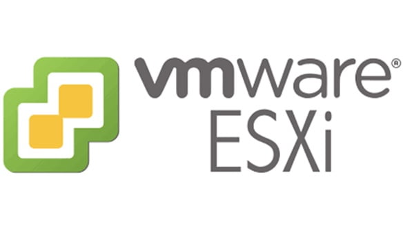

# ESXi무료로 받아보자

> **Summary**
> VMware ESXi 8.0U3e 무료 버전이 출시되었으며, 다운로드는 제공된 링크를 통해 가능하다. 파일 이름, 릴리스 날짜, 빌드 번호 및 해시 값 등의 정보가 포함되어 있다.

---

🔗 [https://svrforum.com/itnews/2301976](https://svrforum.com/itnews/2301976)

## 내 정보 (어처피 SHA있어봤자 의미없을듯)

