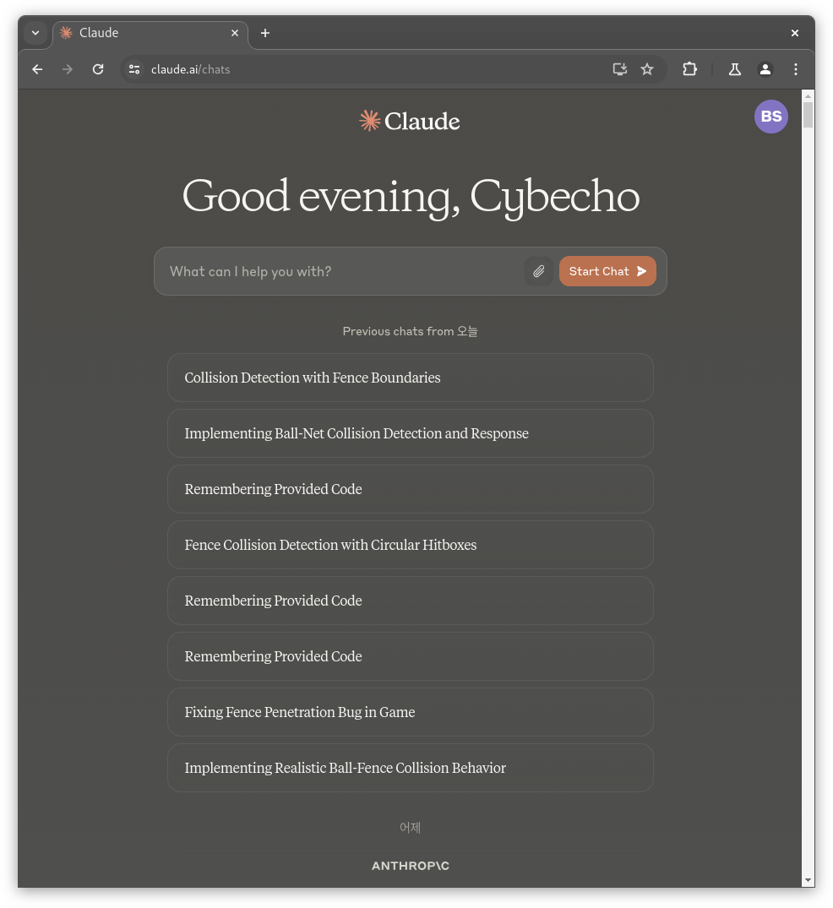
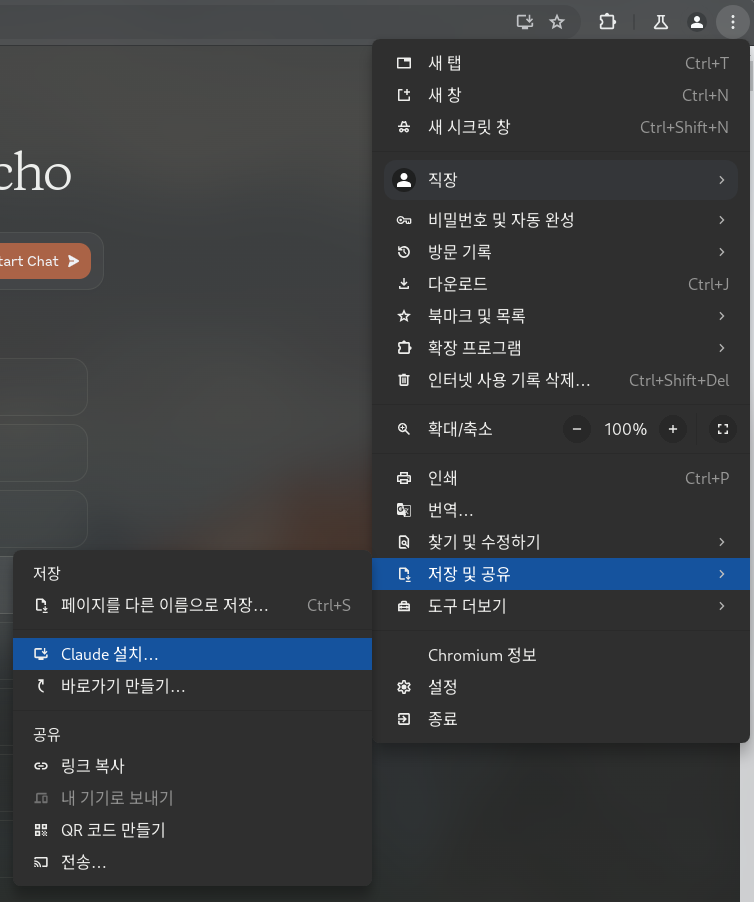
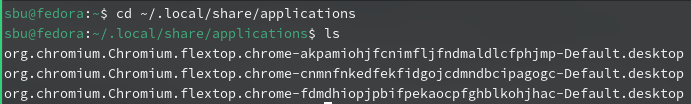

# Fedora 웹 앱 등록 및 커스텀 아이콘 만들기

> **Summary**
> 웹 앱을 등록하려면 Chromium을 사용하고, 필요한 확장 프로그램을 설치한 후 웹사이트를 방문하여 앱을 설치합니다. 커스텀 아이콘을 등록하려면 .desktop 파일을 수정하고, 아이콘 파일을 다운로드하여 지정된 디렉토리에 저장한 후 경로를 업데이트합니다.

---

# 웹 앱 등록

> 💡 **Chromium이 너무 가벼워서… Chromium 기준으로 할거임**

> 💡 **일단 다음 Extenction이 필요하다**
> ---
>
> [https://chromewebstore.google.com/detail/open-as-popup/ncppfjladdkdaemaghochfikpmghbcpc?hl=ko](https://chromewebstore.google.com/detail/open-as-popup/ncppfjladdkdaemaghochfikpmghbcpc?hl=ko)
>
>

> 💡 **웹 앱 화 시켜버릴 목적의 웹사이트 방문**
> 
>
>

> 💡 **우측상단 점 세개 → 저장 및 공유 → 웹 앱 설치… (바로가기 만들기도 상관없음)**
> 
>
> 
>
>

> 💡 **그럼 이제 애플리케이션 항목 가면 앱 추가되어있을탠데, 재부팅 후 보면 앱 등록되어있을거임**

웹 앱 등록

# 커스텀 아이콘 등록

[https://www.reddit.com/r/Fedora/comments/14eh9s9/fedora_i_want_to_change_the_icon_for_an_app_via/](https://www.reddit.com/r/Fedora/comments/14eh9s9/fedora_i_want_to_change_the_icon_for_an_app_via/)

```latex
앱 실행기 아이콘(.desktop 파일)을 의미하는 경우 해당 아이콘은 앱 설치 방법에 따라 다양한 위치에 나타날 수 있습니다.

    시스템 수준 RPM 패키지 앱 실행 프로그램은 일반적으로 /usr/share/applications에 있습니다.

    사용자 수준 앱 실행 프로그램은 ~/.local/share/applications에 있습니다.

    Flatpak이 설치된 앱은 시스템 전체 설치의 경우 /var/lib/Flatpak 또는 사용자 수준 설치의 경우 ~/.var/lib/Flatpak 아래 어딘가에 실행 프로그램이 있습니다(정확히 둘 다 /exports/share 하위 폴더 아래에 있을 수 있는지는 확실하지 않음). Google에서 찾은 장소 또는 일부 정보에 따르면 각 .desktop 실행 프로그램은 /usr/share/applications 사례와 같이 하나의 폴더에 모두 있는 것이 아니라 특정 flatpak 앱별로 복잡한 중첩 트리에 있을 수 있습니다.

앱이 /usr/share/applications에 RPM으로 설치된 시스템 앱인 경우 가장 쉬운 아이콘을 재정의하는 방법은 거기에서 .desktop 파일을 복사하여 ~/.local/share/applications(귀하의 그런 다음 사본은 시스템에 설치된 항목 위에 그림자를 적용합니다. 그놈 앱 서랍은 시스템 아이콘 대신 아이콘을 사용하고 이를 편집하여 사용자 정의 이미지에 새 Icon= 값을 추가합니다.

없습니다 . Flatpak .desktop 실행 프로그램을 재정의하는 데 효과가 있을 수 있지만 이에 대해서는 확신할 수 Flatpak .desktop 실행 프로그램은 다음에 소프트웨어를 업데이트할 때 덮어쓰여지기 때문에 직접 수정하고 싶지 않을 것입니다(/usr/share/applications 실행 프로그램과 동일하지만 ~에서 로컬로 재정의할 수 있을 만큼 쉽습니다. /.공유 폴더).
```

## 나의경우, chromium으로 만든 바로가기다보니 해당 디렉토리에 존재했다

```latex
cd ~/.local/share/applications
```



## 아이콘 필요한거 다운받자.. 가능하면 ico 확장자로

[https://icon-icons.com/](https://icon-icons.com/)

```latex
난 파일 저장하고, ~/appIcon 디렉토리를 만들어 여기에 아이콘을 저장해뒀다
```

## 아이콘 파일 수정…

```latex
sbu@fedora:~/.local/share/applications$ **vim org.chromium.Chromium.flextop.chrome-fdmdhiopjpbifpekaocpfghblkohjhac-Default.desktop **
```

```latex
#!/usr/bin/env xdg-open

[Desktop Entry]
Version=1.0
Terminal=false
Type=Application
Name=Notion
Exec=flatpak 'run' '--command=/app/bin/chromium' 'org.chromium.Chromium' '--profile-directory=Default' '--app-id=fdmdhiopjpbifpekaocpfghblkohjhac'
# Icon=chrome-fdmdhiopjpbifpekaocpfghblkohjhac-Default
**Icon=/home/sbu/appIcon/notion_logo_icon_229291.ico #아이콘 저장된 디렉토리**
StartupWMClass=crx_fdmdhiopjpbifpekaocpfghblkohjhac
X-Flatpak-Part-Of=org.chromium.Chromium
TryExec=/var/lib/flatpak/exports/bin/org.chromium.Chromium
```


