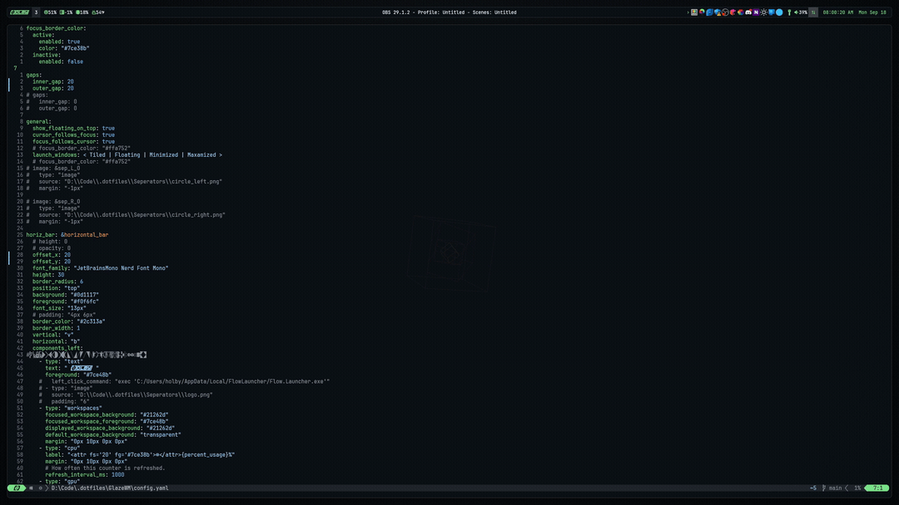

# GlazeWM 윈도우용 i3

> **Summary**
> GlazeWM은 Windows에서 i3와 유사한 윈도우 관리자로, Scoop을 통해 설치할 수 있다. 사용자는 GlazeWM과 Komorebi를 비교하며, GlazeWM이 더 쉽게 시작할 수 있다고 언급한다. 사용자 설정에 대한 정보와 함께 다양한 단축키 및 작업 공간 관리 방법이 제공된다.

---



🔗 [https://github.com/glzr-io/glazewm](https://github.com/glzr-io/glazewm)

> 💡 **`Scoop` 으로 설치해주세요!**
> [윈도우 패키지 관리자 scoop 설치](https://www.notion.so/85c8c41652704cfc9b25a72a32ce190b) 
>
>
> ## **Scoop**
>
> ```javascript
> scoop bucket add extras # Ensure bucket is added first
> scoop install glazewm
> ```
>
>

# GlazeWM 이랑 비슷한놈들

# 유저 세팅

# 내 세팅

## 좆같은 단축키 목록 (config 건드려서 싹 다 해결함)

- 윈도우 잠금 `LWin + L` 
- 음성 입력 `LWin + H`
- 라이브 캡션 `Ctrl + LWin + L`

