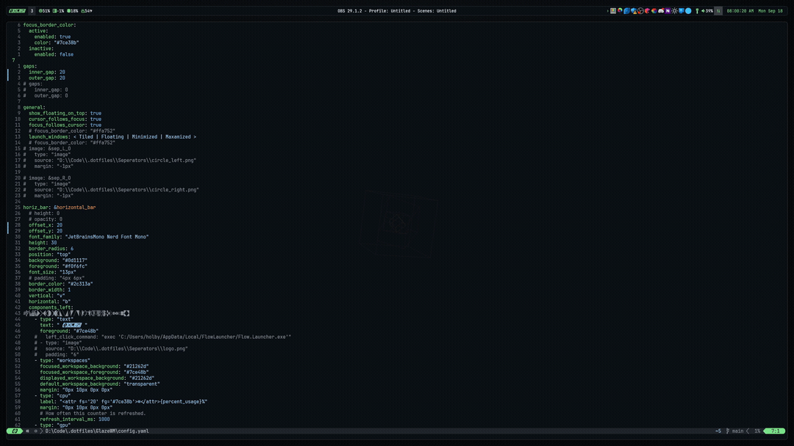

# GlazeWM 윈도우용 i3

> **Summary**
> GlazeWM은 Windows에서 i3와 유사한 윈도우 관리자로, Scoop을 통해 설치할 수 있다. 사용자는 GlazeWM과 Komorebi를 비교하며, GlazeWM이 더 쉽게 시작할 수 있다고 언급한다. 사용자 설정에 대한 정보와 함께 다양한 단축키 및 작업 공간 관리 방법이 제공된다.

---



🔗 [https://github.com/glzr-io/glazewm](https://github.com/glzr-io/glazewm)

> 💡 **`Scoop` 으로 설치해주세요!**
> [윈도우 패키지 관리자 scoop 설치](https://www.notion.so/85c8c41652704cfc9b25a72a32ce190b) 
>
>
> ## **Scoop**
>
> ```javascript
> scoop bucket add extras # Ensure bucket is added first
> scoop install glazewm
> ```
>
>

# GlazeWM 이랑 비슷한놈들

🔗 [https://www.reddit.com/r/i3wm/comments/101z4ox/i3wm_for_windows_11/](https://www.reddit.com/r/i3wm/comments/101z4ox/i3wm_for_windows_11/)

정말 도움이 됩니다! 완전성을 기하기 위해 저는 이것을 정확히 조사하려고 했고 다음과 같은 후보자 목록을 얻었습니다.

- [https://github.com/ritschmaster/b3](https://github.com/ritschmaster/b3)
- [https://github.com/LGUG2Z/komorebi](https://github.com/LGUG2Z/komorebi)
- [https://github.com/lars-berger/GlazeWM](https://github.com/lars-berger/GlazeWM)
- [https://github.com/workspacer/workspacer](https://github.com/workspacer/workspacer)
- [https://github.com/TimUntersberger/nog](https://github.com/TimUntersberger/nog)
- [https://github.com/GGLucas/PyleWM](https://github.com/GGLucas/PyleWM)
- [https://github.com/McYoloSwagHam/win3wm](https://github.com/McYoloSwagHam/win3wm)
이미 b3/GlazeWM에 대해 언급하셨는데, 다른 것들도 평가해 보셨나요?

매우 감사!

## 크게 4가지 있는듯

[GlazeWM
](https://github.com/glzr-io/glazewm)[Fancy WM
](https://apps.microsoft.com/detail/9P1741LKHQS9?hl=en-us&gl=US)[workspacer
](https://www.youtube.com/watch?v=0NXHv1CjxM0)[**Komorebi**](https://github.com/LGUG2Z/komorebi)

<details>
<summary>GlazeWM vs Komorebi</summary>

나는 komorebi를 사용해 본 적이 없으며 GlazeWM을 시작하기 전에 조사한 옵션 중 하나였습니다. 내가 올바르게 기억한다면 GlazeWM은 기본값을 사용하여 시작하는 것이 더 쉬워 보였습니다. 그들이 갖고 있던 키보드 치트시트는 시작하는 데 매우 유용했습니다.

내 작업 공간 중 일부에는 단일 최대화된 창이 있습니다. 최대화/타일링 간에 전환하기 위해 내가 사용하는 다른 것 `Alt+X`(기본값)의 경우 익숙해지기가 매우 쉽다는 것을 알았습니다.

안녕하세요 방금 Glaze wm을 사용해 보았는데 익숙해지기가 정말 쉽고 구성도 i3wm에 가깝습니다. 소개해주셔서 감사합니다. 게임을 하고 싶을 때마다 Ctrl+Shift+E를 사용하여 비활성화할 수도 있습니다. 큰 장점

</details>


# 유저 세팅

> GlazeWM , PowerToys , Scoop , FocusMode , fastfetch 가 필수인듯

scoop 먼저 설치하고 나머지 설치하셈

🔗 [https://github.com/fathulfahmy/dotfiles-wsl](https://github.com/fathulfahmy/dotfiles-wsl)

- 패킷 관리자 : scoop , winget , chocolate
- 파워토이
- glazewm
- 터미널은 focus mode 적용
🔗 [https://pastebin.com/xUcQiaUV](https://pastebin.com/xUcQiaUV)

🔗 [https://www.reddit.com/r/unixporn/comments/10sy6u0/hyprlandyabaikomorebi_cattppuccin_everything/](https://www.reddit.com/r/unixporn/comments/10sy6u0/hyprlandyabaikomorebi_cattppuccin_everything/)

Windows

[Dotfiles](https://github.com/khaneliman/dotfiles/tree/main/dots/windows)

- WM: [Komorebi](https://github.com/LGUG2Z/komorebi)
- OS: Windows 11 Pro
- Terminal: [Powershell](https://github.com/PowerShell/PowerShell)
- Terminal Emulator: [Windows Terminal Preview](https://github.com/microsoft/terminal)
- Fetch: [Fastfetch](https://github.com/LinusDierheimer/fastfetch)
- Bar: [StartIsBack](https://www.startisback.com/)
- Font: Liga SFMono Nerd Font
- Editor: [Neovim](https://github.com/neovim/neovim) / VS Code
- System Monitor: [btop](https://github.com/aristocratos/btop)
- Cursor: [Catppuccin-Mocha-Dark-Cursors](https://github.com/catppuccin/cursors)
- Icons: (Just realized I forgot to add this)
- Explorer theme:[Cattppuccin](https://www.deviantart.com/niivu/art/catppuccin-22H2-921727479)
- Package Managers: Winget, Scoop, and Pacman

# 내 세팅

🔗 [https://github.com/Cybecho/Windows_Setting/blob/main/config.yaml](https://github.com/Cybecho/Windows_Setting/blob/main/config.yaml)

```bash
general:
  # Whether to automatically focus windows underneath the cursor.
  focus_follows_cursor: false

  # Whether to jump the cursor between windows focused by the WM.
  cursor_follows_focus: false

  # Whether to switch back and forth between the previously focused workspace
  # when focusing the current workspace.
  toggle_workspace_on_refocus: false

  # Whether to show floating windows as always on top.
  show_floating_on_top: false

  # Amount to move floating windows by (eg. when using `alt+LWin+<hjkl>` on a floating window)
  floating_window_move_amount: "5%"

  # Whether to center new floating windows.
  center_new_floating_windows: false

  # *Strongly* recommended to set to 'false'. Whether to globally enable/disable
  # window transition animations (on minimize, close, etc). Set to 'unchanged'
  # to make no setting changes.
  window_animations: "unchanged"

gaps:
  # Gap between adjacent windows.
  inner_gap: "10px"

  # Gap between windows and the screen edge.
  outer_gap: "8px"

# Highlight active/inactive windows with a colored border.
# ** Exclusive to Windows 11 due to API limitations.
focus_borders:
  active:
    enabled: true
    color: "#00ff00"

  inactive:
    enabled: false
    color: "#ff0000"

bar:
  height: "16px"
  position: "top"
  opacity: 1.0
  background: "#20242cc4"
  foreground: "#ffffff"
  font_family: "Segoe UI"
  font_size: "10px"
  padding: "0px 8px"
  offset_x: "0"
  offset_y: "0"
  border_radius: "0"
  components_left:
    - type: "workspaces"
      focused_workspace_background: "#ffffff33"
      displayed_workspace_background: "#00000033"
      default_workspace_background: "transparent"

  components_center:
    - type: "window title"
  components_right:
    # - type: "system tray" #실행중인 프로그램 목록
    - type: "cpu"
      margin: "0 4px"
      padding: "0 8px"
    - type: "memory"

    - type: "tiling direction"
      label_horizontal: "⮂"
      label_vertical: "⮁"
      background: "#ffffff33"
      margin: "0 4px"
      padding: "0 8px"

    - type: "battery"
      margin: "0 4px"
      padding: "0 8px"

    - type: "binding mode"
      background: "#ffffff33"
      margin: "0 4px 0 0"
      padding: "0 8px"
    - type: "clock"
      # Documentation on formatting date/time string:
      # https://learn.microsoft.com/en-us/dotnet/standard/base-types/custom-date-and-time-format-strings
      time_formatting: "hh:mm tt  ddd MMM d"

workspaces:
  - name: "1"
  - name: "2"
  - name: "3"
  - name: "4"
  - name: "5"
  - name: "6"
  - name: "7"
  - name: "8"
  - name: "9"

window_rules:
  # Task Manager requires admin privileges to manage and should be ignored unless running
  # the WM as admin.
  - command: "ignore"
    match_process_name: "/Taskmgr|ScreenClippingHost/"

  # Launches system dialogs as floating by default (eg. File Explorer save/open dialog).
  - command: "set floating"
    match_class_name: "#32770"

  # Do not manage picture-in-picture windows for browsers. Note that the default is for
  # English; change `match_title` to the window's title if you use another language.
  - command: "ignore"
    match_title: "[Pp]icture.in.[Pp]icture"
    match_class_name: "Chrome_WidgetWin_1|MozillaDialogClass"

  # Some applications (eg. Steam) have borders that extend past the normal border size.
  - command: "resize borders 0px -7px -7px -7px"
    match_process_name: "steam"

binding_modes:
  - name: "resize"
    keybindings:
      # Resize focused window by a percentage or pixel amount.
      - command: "resize width -2%"
        bindings: ["H", "Left"]
      - command: "resize width +2%"
        bindings: ["L", "Right"]
      - command: "resize height +2%"
        bindings: ["K", "Up"]
      - command: "resize height -2%"
        bindings: ["J", "Down"]
      # Press enter/escape to return to default keybindings.
      - command: "binding mode none"
        bindings: ["Escape", "Enter"]

keybindings:
  # Shift focus in a given direction.
  - command: "focus left"
    bindings:
      [
        "Alt+LWin+J",
        "Alt+LWin+Left",
        "LControlKey+LWin+J",
        "LWin+J",
        "LWin+Left",
      ]
  - command: "focus right"
    bindings:
      [
        "Alt+LWin+L",
        "Alt+LWin+Right",
        "LControlKey+LWin+L",
        "LWin+L",
        "LWin+Right",
      ]
  - command: "focus up"
    bindings:
      ["Alt+LWin+I", "Alt+LWin+Up", "LControlKey+LWin+I", "LWin+I", "LWin+Up"]
  - command: "focus down"
    bindings:
      [
        "Alt+LWin+K",
        "Alt+LWin+Down",
        "LControlKey+LWin+K",
        "LWin+K",
        "LWin+Down",
      ]

  # Move focused window in a given direction.
  - command: "move left"
    bindings:
      ["Alt+LWin+Shift+J", "Alt+LWin+Shift+Left", "LControlKey+LWin+Shift+J"]
  - command: "move right"
    bindings:
      ["Alt+LWin+Shift+L", "Alt+LWin+Shift+Right", "LControlKey+LWin+Shift+L"]
  - command: "move up"
    bindings:
      ["Alt+LWin+Shift+I", "Alt+LWin+Shift+Up", "LControlKey+LWin+Shift+I"]
  - command: "move down"
    bindings:
      ["Alt+LWin+Shift+K", "Alt+LWin+Shift+Down", "LControlKey+LWin+Shift+K"]

  # Resize focused window by a percentage or pixel amount.
  - command: "resize width +2%"
    binding: "Alt+LWin+O"
  - command: "resize width -2%"
    binding: "Alt+LWin+U"
  - command: "resize height +2%"
    binding: "Alt+LWin+Shift+U"
  - command: "resize height -2%"
    binding: "Alt+LWin+Shift+O"

  # As an alternative to the resize keybindings above, resize mode enables resizing via
  # HJKL or arrow keys. The binding mode is defined above with the name "resize".
  - command: "binding mode resize"
    binding: "Alt+LWin+R"

  # Change tiling direction. This determines where new tiling windows will be inserted.
  - command: "tiling direction toggle"
    bindings: ["Alt+LWin+V"]

  # Change focus between floating / tiling windows.
  - command: "focus mode toggle"
    binding: "Alt+LWin+Space"

  # Change the focused window to be floating / tiling.
  - command: "toggle floating"
    binding: "Alt+LWin+Shift+Space"

  # Change the focused window to be maximized / unmaximized.
  - command: "toggle maximized"
    binding: "Alt+LWin+X"

  # Minimize focused window.
  - command: "set minimized"
    binding: "Alt+LWin+M"

  # Close focused window.

  - command: "close"
    binding: "Alt+LWin+Shift+Q"

  # Kill GlazeWM process safely.
  - command: "exit wm"
    #binding: "Alt+LWin+Shift+E"
    binding: "Alt+Escape"

  # Re-evaluate configuration file.
  - command: "reload config"
    binding: "Alt+Shift+R"

  # Launch CMD terminal alternatively `exec wt` or `exec %ProgramFiles%/Git/git-bash.exe`
  # to start Windows Terminal and Git Bash respectively.
  #
  # - command: "exec cmd"
  # C:\Program Files\WindowsApps\Microsoft.WindowsTerminalPreview_1.20.10572.0_x64__8wekyb3d8bbwe
  - command: "exec %ProgramFiles%/WindowsApps/Microsoft.WindowsTerminalPreview_1.20.10572.0_x64__8wekyb3d8bbwe/WindowsTerminal.exe"
    bindings: ["Alt+LWin+Enter"]

  # Focus the workspace that last had focus.
  - command: "focus workspace recent"
    bindings: ["Alt+LWin+LControlKey+R"]

  # Focus the next/previous workspace defined in `workspaces` config.
  - command: "focus workspace next"
    bindings: ["LWin+LControlKey+Right", "Alt+Shift+LWin+H"]
  - command: "focus workspace prev"
    bindings: ["LWin+LControlKey+Left", "Alt+Shift+LWin+G"]

  # Change focus to a workspace defined in `workspaces` config.
  - command: "focus workspace 1"
    bindings: ["Alt+LWin+1", "LWin+1"]
  - command: "focus workspace 2"
    bindings: ["Alt+LWin+2", "LWin+2"]
  - command: "focus workspace 3"
    bindings: ["Alt+LWin+3", "LWin+3"]
  - command: "focus workspace 4"
    bindings: ["Alt+LWin+4", "LWin+4"]
  - command: "focus workspace 5"
    bindings: ["Alt+LWin+5", "LWin+5"]
  - command: "focus workspace 6"
    bindings: ["Alt+LWin+6", "LWin+6"]
  - command: "focus workspace 7"
    bindings: ["Alt+LWin+7", "LWin+7"]
  - command: "focus workspace 8"
    bindings: ["Alt+LWin+8", "LWin+8"]
  - command: "focus workspace 9"
    bindings: ["Alt+LWin+9", "LWin+9"]

  # Move focused workspace to a monitor in a given direction.
  - command: "move workspace left"
    binding: "Alt+LWin+A"
  - command: "move workspace right"
    binding: "Alt+LWin+F"
  - command: "move workspace up"
    binding: "Alt+LWin+D"
  - command: "move workspace down"
    binding: "Alt+LWin+S"

  # Move focused window to a workspace defined in `workspaces` config.
  - commands: ["move to workspace 1", "focus workspace 1"]
    bindings: ["Alt+LWin+Shift+1", "LWin+Shift+1"]
  - commands: ["move to workspace 2", "focus workspace 2"]
    bindings: ["Alt+LWin+Shift+2", "LWin+Shift+2"]
  - commands: ["move to workspace 3", "focus workspace 3"]
    bindings: ["Alt+LWin+Shift+3", "LWin+Shift+3"]
  - commands: ["move to workspace 4", "focus workspace 4"]
    bindings: ["Alt+LWin+Shift+4", "LWin+Shift+5"]
  - commands: ["move to workspace 5", "focus workspace 5"]
    bindings: ["Alt+LWin+Shift+5", "LWin+Shift+6"]
  - commands: ["move to workspace 6", "focus workspace 6"]
    bindings: ["Alt+LWin+Shift+6", "LWin+Shift+6"]
  - commands: ["move to workspace 7", "focus workspace 7"]
    bindings: ["Alt+LWin+Shift+7", "LWin+Shift+7"]
  - commands: ["move to workspace 8", "focus workspace 8"]
    bindings: ["Alt+LWin+Shift+8", "LWin+Shift+8"]
  - commands: ["move to workspace 9", "focus workspace 9"]
    bindings: ["Alt+LWin+Shift+9", "LWin+Shift+9"]

```


## 좆같은 단축키 목록 (config 건드려서 싹 다 해결함)

- 윈도우 잠금 `LWin + L` 
- 음성 입력 `LWin + H`
- 라이브 캡션 `Ctrl + LWin + L`

