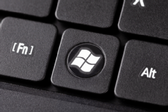

# GlazeWM 을 활용한 win키 비활성화

> **Summary**
> LWin 키를 비활성화하기 위해 추가했지만, 이로 인해 다른 Win 핫키가 완전히 차단되는 문제가 발생할 수 있다. 더 나은 방법을 찾고 있다.

---

# 걍 잘 안쓰는 항목에 `LWin` 추가함

### 근데 이러면 다른 Win 핫키들이 완전 차단됨

더 나은 다른 방법 없을까…

