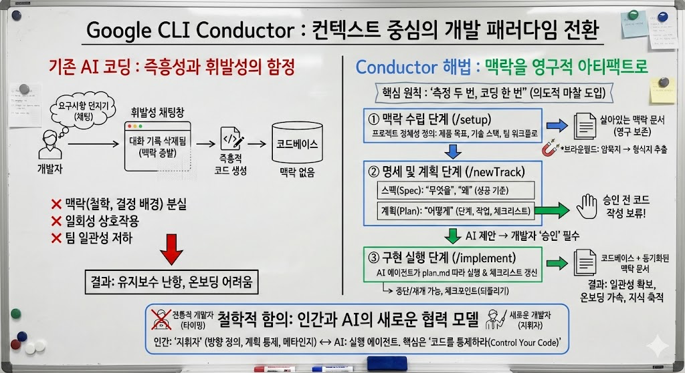

# Google CLI Conductor: 컨텍스트 중심의 개발 접근법 제안

> **Summary**
> AI 시대의 개발에서 즉흥적 접근 방식의 위험성을 지적하며, 구글의 Conductor는 개발 맥락을 코드베이스와 통합하여 지속 가능한 문서화와 팀 협업을 촉진하는 구조적 접근법을 제안한다. 이 시스템은 프로젝트의 정체성을 정의하고, 명세 및 계획 단계를 통해 작업을 구체화하며, 구현 단계에서 AI가 계획을 실행하도록 한다. 또한, 기존 프로젝트에 적용할 때의 복잡성을 해결하고, 팀의 일관성을 높이며, 개발자의 역할을 재정의하는 데 중점을 둔다. 그러나 오버헤드 문제, 문서의 최신성 유지, 창의성 제약 등의 도전 과제가 존재한다.

---

🔗 [https://developers.googleblog.com/conductor-introducing-context-driven-development-for-gemini-cli/](https://developers.googleblog.com/conductor-introducing-context-driven-development-for-gemini-cli/)

# Conductor: AI 시대의 개발 패러다임 전환

## 문제의식으로부터 출발하기

벤저민 프랭클린은 "계획하지 않는 것은 실패를 계획하는 것"이라 했지만, 아이러니하게도 AI 시대의 개발자들은 종종 그 반대의 함정에 빠진다. LLM 기반 코딩 도구가 등장하면서, 우리는 설계와 사고의 단계를 건너뛰고 곧바로 구현으로 뛰어드는 유혹에 자주 노출된다. 채팅창에 요구사항을 던지면 순식간에 코드가 생성되는 경험은 매혹적이지만, 동시에 위험하다.

이러한 즉흥적 개발 방식은 근본적인 문제를 안고 있다. 첫째, 채팅 기록은 휘발성이다. 대화가 길어질수록 초기 맥락은 희석되고, 세션이 종료되면 그간의 논의는 사라진다. 둘째, 개발의 의도와 맥락이 코드베이스 외부에 존재한다. 프로젝트의 철학, 아키텍처 결정의 배경, 기술 스택 선택의 이유 같은 중요한 정보들이 개발자의 머릿속이나 산발적인 문서에만 남아있다. 셋째, AI와의 상호작용이 일회성으로 끝난다. 같은 프로젝트를 다루더라도 매번 맥락을 재설명해야 하고, 팀원들 간에도 AI 도구 사용 시 일관성을 유지하기 어렵다.

## 컨텍스트 중심 개발이라는 응답

구글이 제시한 Conductor는 이러한 문제의식에 대한 구조적 응답이다. 핵심 아이디어는 단순하면서도 근본적이다. 개발 맥락(context)을 채팅 로그라는 일시적 공간에서 해방시켜, 코드베이스와 함께 살아 숨 쉬는 영구적 아티팩트로 전환하는 것이다.

이 접근법은 몇 가지 중요한 철학적 전제를 깔고 있다. 우선, 코드 저장소를 단순히 실행 가능한 명령어의 집합이 아니라, 프로젝트의 의도와 맥락을 포함하는 지식의 총체로 바라본다. Markdown 형식의 스펙(spec)과 계획(plan) 문서들은 코드와 동등한 위상을 갖는 프로젝트의 구성요소가 된다.

또한 "측정은 두 번, 코딩은 한 번(Measure twice, code once)"이라는 원칙을 AI 시대에 재해석한다. 전통적 소프트웨어 공학에서 요구사항 분석과 설계 단계의 중요성은 잘 알려져 있지만, AI 코딩 도구의 즉각성은 이 단계들을 생략하도록 부추긴다. Conductor는 의도적으로 마찰(friction)을 도입한다. 코드를 작성하기 전에 먼저 무엇을 만들 것인지(spec), 어떻게 만들 것인지(plan)를 명시적으로 문서화하도록 강제하는 것이다.

## 작동 메커니즘의 다층성

Conductor의 워크플로는 세 개의 상호연결된 단계로 구성된다. 각 단계는 서로 다른 차원의 맥락을 다룬다.

**맥락 수립 단계**는 프로젝트의 정체성을 정의한다. `/conductor:setup` 명령은 단순한 설정이 아니라, 프로젝트에 대한 근본적 질문들을 던진다. 제품(Product) 차원에서는 사용자가 누구인지, 제품의 목표가 무엇인지, 핵심 기능이 무엇인지를 규정한다. 기술 스택(Tech stack) 차원에서는 언어, 데이터베이스, 프레임워크 선택을 명시한다. 워크플로(Workflow) 차원에서는 팀이 어떻게 일하는지, 예컨대 테스트 주도 개발(TDD)을 따르는지 같은 관행을 기록한다.

이렇게 정의된 맥락은 일회성 설정이 아니다. 프로젝트가 진화하면서 지속적으로 업데이트되고, 새로운 팀원이 합류하거나 AI 에이전트가 작업할 때마다 참조되는 살아있는 문서가 된다. 이는 조직의 암묵지(tacit knowledge)를 형식지(explicit knowledge)로 전환하는 과정이기도 하다.

**명세 및 계획 단계**는 구체적 작업의 윤곽을 잡는다. `/conductor:newTrack` 명령으로 새로운 작업 단위(track)를 시작하면, Conductor는 두 가지 핵심 문서를 생성하도록 안내한다. 스펙(spec)은 "무엇을" 그리고 "왜"에 답한다. 이 기능이 해결하려는 문제가 무엇인지, 성공의 기준은 무엇인지를 명확히 한다. 계획(plan)은 "어떻게"에 답한다. 단계(Phases), 작업(Tasks), 하위작업(Sub-tasks)으로 세분화된 실행 가능한 체크리스트를 만든다.

여기서 흥미로운 점은 Conductor가 단순히 템플릿을 제공하는 것이 아니라, 이미 수립된 프로젝트 맥락을 활용해 제안을 한다는 것이다. 이는 AI가 프로젝트의 역사와 규범을 학습하고, 그에 부합하는 계획을 도출하는 과정이다. 개발자는 이 제안을 검토하고 수정하며, 승인 전까지 코드는 한 줄도 작성되지 않는다.

**구현 단계**는 계획의 실행이다. `/conductor:implement` 명령 이후 AI 에이전트는 plan.md 파일을 따라가며 작업을 완료하고 체크리스트를 갱신한다. 중요한 것은 상태가 파일로 저장되기 때문에, 작업을 중단했다가 재개할 수 있고, 다른 머신에서 이어갈 수도 있다는 점이다. 또한 체크포인트 시스템을 통해 이전 상태로 되돌릴 수 있고, 실행 중에도 계획을 수정할 수 있는 유연성을 제공한다.

## 브라운필드 프로젝트라는 현실

대부분의 실무 개발은 그린필드(greenfield, 새 프로젝트)가 아닌 브라운필드(brownfield, 기존 프로젝트)에서 이루어진다. 이미 수년간 축적된 코드베이스, 때로는 일관성 없는 아키텍처, 문서화되지 않은 설계 결정들이 뒤섞인 환경이다. 많은 AI 코딩 도구가 이러한 복잡성 앞에서 무력해지는 이유는, 프로젝트의 역사적 맥락과 암묵적 규범을 이해하지 못하기 때문이다.

Conductor는 이 문제에 정면으로 접근한다. 기존 프로젝트에 도입할 때, 인터랙티브 세션을 통해 프로젝트의 아키텍처, 가이드라인, 목표에 대한 기초 문서를 만드는 과정을 안내한다. 이는 일종의 지식 추출(knowledge extraction) 과정이다. 코드베이스에 산재된 암묵적 지식을, 명시적이고 구조화된 문서로 전환한다.

더 중요한 것은 이것이 일회성 작업으로 끝나지 않는다는 점이다. 새로운 기능을 추가하고 버그를 수정하면서, 맥락 문서도 함께 진화한다. 프로젝트의 지식이 점진적으로 축적되는 것이다. 구글은 이것이 "첫 단계"일 뿐이라고 밝혔는데, 향후 기존 프로젝트 이해 능력을 더욱 강화할 계획임을 시사한다.

## 팀 협업의 새로운 지평

개인 개발자의 생산성 향상을 넘어, Conductor가 조직적 차원에서 갖는 의미는 더 크다. 프로젝트 수준의 맥락을 한 번 정의하면, 팀의 모든 구성원과 모든 AI 에이전트가 동일한 기준을 공유하게 된다.

예컨대 팀이 특정 테스팅 전략을 확립했다면, 이것이 맥락 문서에 명시됨으로써 누가 새 기능을 개발하든 자동으로 적용된다. 코딩 스타일 가이드, 네이밍 규칙, 에러 핸들링 패턴 같은 것들도 마찬가지다. 이는 두 가지 효과를 낳는다.

첫째, 일관성이 확보된다. 서로 다른 개발자가 작성한 코드가 마치 한 사람이 쓴 것처럼 통일된 스타일과 구조를 갖게 된다. AI가 생성한 코드도 팀의 규범을 준수한다.

둘째, 온보딩이 가속화된다. 새로 합류한 팀원은 맥락 문서를 통해 프로젝트의 철학, 기술적 제약, 개발 관행을 빠르게 파악할 수 있다. 그리고 AI 도구를 사용할 때도 처음부터 팀의 기준에 맞는 결과물을 얻을 수 있다.

이는 팀의 집단지성을 코드화(codification)하는 과정이기도 하다. 숙련된 개발자들의 노하우와 과거의 실수로부터 얻은 교훈이 문서로 축적되고, 이것이 모든 팀원의 작업에 반영된다.

## 철학적 함의: 인간과 AI의 새로운 협력 모델

Conductor가 제시하는 비전은 단순한 도구의 차원을 넘어선다. 이것은 AI 시대의 소프트웨어 개발에서 인간의 역할을 재정의하는 시도다.

전통적 개발에서 개발자는 타이핑하는 사람이었다. 요구사항을 이해하고, 설계하고, 직접 코드를 작성했다. 초기 AI 코딩 도구들은 타이핑의 부담을 줄여주었지만, 역설적으로 개발자의 역할을 축소시키는 측면도 있었다. "이것 좀 만들어줘"라고 말하면 AI가 코드를 생성하고, 개발자는 그것을 받아들이거나 거부하는 수동적 위치에 머물렀다.

Conductor는 다른 방향을 제안한다. 개발자를 "지휘자(conductor)"로 위치시킨다. 오케스트라의 지휘자가 각 악기의 연주를 직접 하지 않지만 전체 음악의 방향을 결정하듯, 개발자는 무엇을 만들지, 어떻게 만들지를 명확히 정의하고, AI는 그 청사진을 실행한다.

이 모델에서 중요한 것은 통제(control)다. 제목이 암시하듯 "코드를 통제하라(control your code)"는 것이 핵심 메시지다. AI가 자율적으로 코드를 생성하는 것이 아니라, 인간이 정의한 맥락과 계획 안에서 작동하도록 한다. 개발자는 계획을 승인하기 전까지 코드 생성을 보류할 수 있고, 실행 중에도 방향을 수정할 수 있다.

동시에 이것은 메타인지(metacognition)를 강조하는 접근이기도 하다. 개발자에게 끊임없이 묻는다. "당신은 정말로 무엇을 만들고 싶은가?", "왜 이 방식으로 만들어야 하는가?", "이것이 프로젝트의 전체 맥락에서 어떤 의미를 갖는가?". 즉각적인 코드 생성의 유혹을 거부하고, 사고하고 계획하는 시간을 확보하도록 강제한다.

## 잠재적 도전과 개방된 질문들

그러나 Conductor 접근법이 모든 상황에 적합한 것은 아닐 수 있다. 몇 가지 고려해야 할 지점들이 있다.

**오버헤드의 문제**: 간단한 버그 수정이나 사소한 변경에도 스펙과 계획을 작성하는 것이 과연 효율적인가? Conductor는 "단순한 코드 편집보다 복잡한 작업에 이상적"이라고 명시하지만, 그 경계는 모호하다. 개발자들은 어떤 작업이 Conductor를 쓸 만큼 복잡한지 판단해야 하는 추가적인 인지 부담을 갖게 될 수 있다.

**문서의 최신성 유지**: 맥락 문서가 프로젝트와 함께 진화한다는 것은 이상적이지만, 실제로는 문서가 코드와 동기화를 잃기 쉽다. 개발자들이 코드는 수정하면서 관련 맥락 문서를 업데이트하지 않으면, 시간이 지날수록 문서는 현실을 반영하지 못하게 된다. 전통적인 소프트웨어 문서화가 겪어온 고질적 문제가 여기서도 재현될 가능성이 있다.

**창의성과 즉흥성의 제약**: 때로는 코드를 작성하면서 아이디어가 발전하고, 예상치 못한 솔루션을 발견하기도 한다. 지나치게 구조화된 계획은 이러한 발견의 여지를 제한할 수 있다. 물론 Conductor가 실행 중 계획 수정을 허용하지만, 심리적으로는 기존 계획에 얽매이는 효과가 있을 수 있다.

**학습 곡선**: 새로운 패러다임을 습득하는 데는 시간이 필요하다. 개발자들이 Conductor 방식에 익숙해지기까지, 그리고 좋은 스펙과 계획을 작성하는 법을 배우기까지 초기 비용이 발생한다. 특히 애자일이나 린 스타트업 같은 빠른 반복을 중시하는 환경에서는 이러한 무게감이 부담스러울 수 있다.

## 더 넓은 맥락: 지식의 형식화 운동

한 걸음 물러나 보면, Conductor는 소프트웨어 개발에서 지식을 형식화하려는 더 큰 흐름의 일부로 볼 수 있다.

Git이 코드의 역사를 형식화했다면, 이슈 트래커는 버그와 기능 요청을 형식화했다. CI/CD 파이프라인은 빌드와 배포 과정을 형식화했고, IaC(Infrastructure as Code)는 인프라를 형식화했다. Conductor는 개발 의도와 맥락을 형식화한다.

이러한 형식화는 자동화를 가능하게 한다. 형식화되지 않은 지식은 인간의 머릿속에만 존재하고, 전달과 재사용이 어렵다. 하지만 명시적으로 구조화된 지식은 기계가 읽고 처리할 수 있으며, AI 에이전트가 활용할 수 있다.

동시에 이것은 trade-off를 내포한다. 형식화는 명확성과 일관성을 가져오지만, 유연성과 뉘앙스를 잃을 수 있다. 모든 개발 결정을 문서로 표현할 수 있는 것은 아니며, 때로는 암묵적 지식이나 직관이 중요한 역할을 한다.

## 앞으로의 궤적

구글은 Conductor가 "프리뷰" 단계임을 강조하며, 특히 브라운필드 프로젝트 지원을 "첫 단계"로 묘사한다. 향후 발전 방향을 추측해보면:

**컨텍스트 추론의 고도화**: 현재는 개발자가 명시적으로 맥락을 정의해야 하지만, 미래에는 AI가 코드베이스를 분석해 아키텍처 패턴, 코딩 규범, 암묵적 규칙을 자동으로 추출할 수 있을 것이다.

**팀 협업 기능 강화**: 여러 개발자가 동시에 다른 track을 작업할 때의 조율, 맥락 문서의 버전 관리와 병합, 리뷰 워크플로의 통합 등이 강화될 가능성이 있다.

**다른 도구와의 통합**: JIRA 같은 프로젝트 관리 도구, GitHub Issues, 디자인 시스템 등과 연결되어 더 넓은 생태계의 맥락을 활용할 수 있을 것이다.

**적응적 계획**: AI가 프로젝트의 과거 데이터를 학습해, 어떤 종류의 작업이 얼마나 걸리는지, 어떤 리스크가 있는지를 예측하고 더 정교한 계획을 생성할 수 있을 것이다.

## 결론을 대신하여: 개방된 탐구

Conductor가 제시하는 비전은 매력적이면서도 도전적이다. 개발 맥락을 코드와 동등한 일급 시민으로 취급하고, 계획을 실행보다 앞세우며, 인간 개발자를 통제의 중심에 두려는 시도는 AI 코딩 도구의 방향에 대한 중요한 제안이다.

그러나 이것이 모든 팀과 모든 상황에 적합한 유일한 방식이라고 단정할 수는 없다. 프로젝트의 성격, 팀의 문화, 개발 단계에 따라 최적의 접근법은 다를 것이다. 어떤 팀은 Conductor의 구조화된 접근을 통해 큰 가치를 얻을 것이고, 어떤 팀은 그 무게감이 부담스러울 수 있다.

중요한 것은 대화를 시작하는 것이다. AI가 코드를 생성할 수 있게 된 시대에, 인간 개발자의 역할은 무엇인가? 개발의 맥락과 의도를 어떻게 보존하고 전달할 것인가? 속도와 통제, 즉흥성과 계획성 사이의 균형점은 어디인가?

Conductor는 이러한 질문들에 대한 하나의 답이자, 동시에 더 많은 질문을 촉발하는 촉매제다. 그리고 그것으로 충분하다. 기술의 진화는 완성된 해답이 아니라 지속적인 탐구의 과정이기 때문이다.

