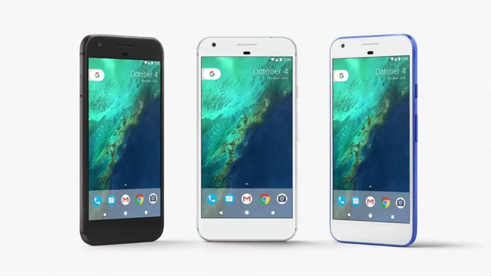

# Google Pixel 1 간헐적 동기화 서버 설계

> **Summary**
> 픽셀 1의 간헐적 동기화를 위해 윈도우 서버를 사용하여 사진을 동기화하고, FTP 서버를 설정하여 파일을 관리하는 방법을 설명합니다. 또한, Syncthing을 통해 자동 파일 전송을 설정하고, MacroDroid를 이용해 Google Photos의 자동 백업을 유지하는 방법을 안내합니다. 배터리 과열 방지를 위한 스마트 플러그 사용도 권장됩니다.

---



# Google Pixel 1 간헐적 동기화 서버 설계

```plain text
폰 2 폰 구조가 아닌 이유는

픽셀1이 항상 서버역할로 켜져있으면 발열과 배터리 이슈가 있으니..

중간에 윈도우 서버를 두어(Proxmox위에 VM으로 올려둠) 

집에 올떄마다 그날 찍은 이미지들을 PhotoSync로 동기화해두고

Pixel 1 이 켜졌을때, 그동안 저장되었었던 Windows에 있던 사진 파일들을 핃셀1에 동기화
```

🔗 [https://www.figma.com/board/PuUNtcRr2BktQZ1Vyr7jvD/%EA%B5%AC%EA%B8%80%ED%94%BD%EC%85%80-%EC%84%9C%EB%B2%84?node-id=0-1&t=RcWEx1qScN8vzMNO-1](https://www.figma.com/board/PuUNtcRr2BktQZ1Vyr7jvD/%EA%B5%AC%EA%B8%80%ED%94%BD%EC%85%80-%EC%84%9C%EB%B2%84?node-id=0-1&t=RcWEx1qScN8vzMNO-1)

## Google Pixel 1 저장공간 확장하기

> 💡 **[Google Pixel 1 에 외장하드 마운트하기](https://www.notion.so/1a28f3aeda114b0380435ba02c83e9e1) **

## Pixel 1 아이피 고정 & FTP 서버 개설

> 💡 **[https://www.youtube.com/watch?v=29cuWkfal1c](https://www.youtube.com/watch?v=29cuWkfal1c)**
> ---
>
> 해당 유튜브에서 다음만 보면 될 듯 하다
>
> - 아이피고정
> - 픽셀1 FTP 서버 개설
> - 윈도우 픽셀1 FTP 서버 마운트
>

### → CX 파일 탐색기로 FTP서버 개설 하면 됩니다

[https://play.google.com/store/apps/details?id=com.cxinventor.file.explorer&hl=ko&pli=1](https://play.google.com/store/apps/details?id=com.cxinventor.file.explorer&hl=ko&pli=1)

[7분 30초부터 보세요](https://youtu.be/29cuWkfal1c?si=wYnLUe9kyCeKjXYH&t=456)

---

> 서버 개설

> 윈도우에서 ftp 서버 마운트

## 윈도우→안드로이드 동기화

### → Syncthing

1. Windows PC와 Android 폰에 Syncthing 설치
1. 두 기기를 페어링
1. Windows의 특정 폴더를 공유 폴더로 설정
1. Android에서 해당 폴더를 '받기 전용'으로 설정
1. Windows PC를 항상 실행 상태로 유지
이렇게 설정하면 Android 폰이 Wi-Fi에 연결될 때마다 자동으로 새 파일을 받아올 것입니다.

## MacroDroid를 이용한 Google Photos 자동 백업 설정 가이드

> 💡 **[https://karjeg.tistory.com/395](https://karjeg.tistory.com/395)**

안드로이드 업데이트로 인해 휴면 상태의 기기에서 Google Photos 백업이 중단되는 문제가 발생했습니다. 이를 해결하기 위해 MacroDroid를 사용하여 Pixel 1 폰이 활성 상태임을 시스템에 알리는 방법을 소개합니다.

### → 설정 목표

다음 작업을 주기적으로 수행하여 기기 활성 상태를 유지합니다:

1. 2시간마다 화면을 켜고 잠금 해제
1. Google Photos 앱 실행
1. 업로드된 사진 삭제
### → 사전 준비

1. 안드로이드 홈 화면 중앙에 'Photos - 여유 공간' 아이콘 배치
  - Photos 앱 아이콘을 길게 눌러 '여유 공간' 옵션을 홈 화면으로 드래그


### → MacroDroid 설정 방법

1. MacroDroid 앱 실행 후 'Add macro' 선택


1. 다음 단계를 반복하여 매크로 생성 (Pixel 1 기준 클릭 좌표 사용):
  - 트리거, 동작, 제약 설정
  - 화면 켜기, 잠금 해제, Photos 앱 실행, 사진 삭제 등의 작업 추가
### → 주의사항

- 배터리 과열 방지를 위해 스마트 플러그 사용 권장
  - 예: 3시간 휴식 후 1시간 충전 주기 설정

이 설정을 완료하면, 폰의 전원만 유지하면 자동으로 백업이 이루어집니다.

