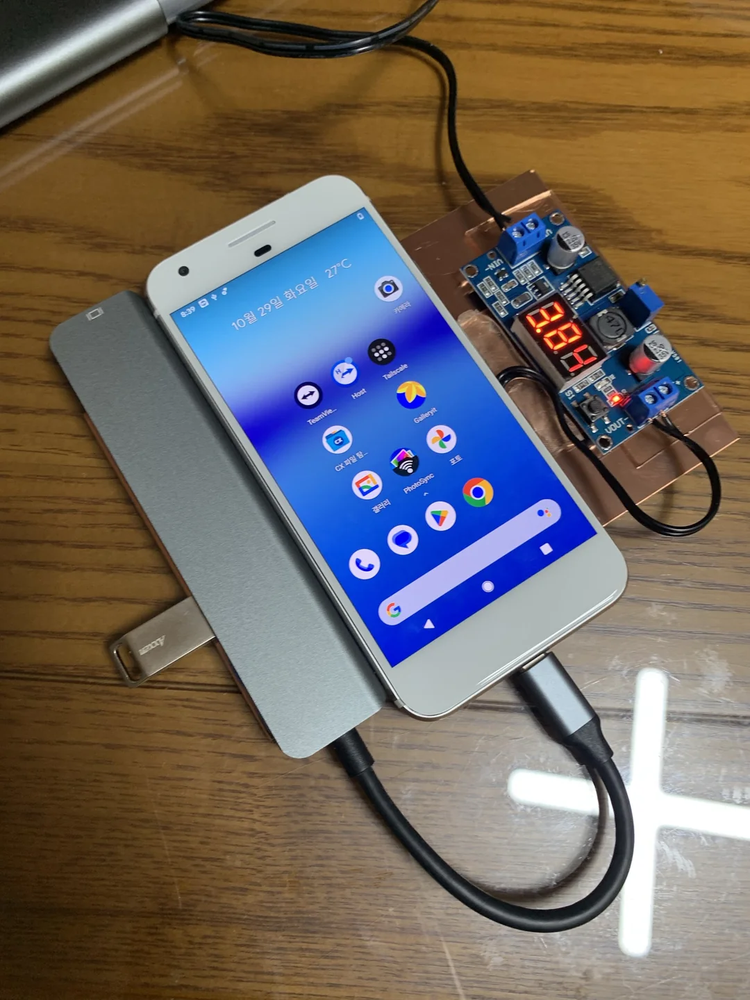

# Google Pixel 1 상시 전원 무적의 380도로 마개조하기

> **Summary**
> 구글 픽셀 1을 상시 전원으로 개조하는 방법에 대한 내용으로, 써멀패드와 구리판을 사용한 실제 개조 사례가 포함되어 있습니다. 관련 비디오 링크와 추가 자료도 제공됩니다.

---

[https://www.youtube.com/watch?v=Xbzv6BI-2Hw&embeds_referring_euri=https%3A%2F%2Flilys.ai%2F&embeds_referring_origin=https%3A%2F%2Flilys.ai](https://www.youtube.com/watch?v=Xbzv6BI-2Hw&embeds_referring_euri=https%3A%2F%2Flilys.ai%2F&embeds_referring_origin=https%3A%2F%2Flilys.ai)

🎥 [동영상 보기](https://www.youtube.com/watch?v=Xbzv6BI-2Hw&embeds_referring_euri=https%3A%2F%2Flilys.ai%2F&embeds_referring_origin=https%3A%2F%2Flilys.ai)

[https://lilys.ai/digest/1082461/931289?s=1&nid=-1](https://lilys.ai/digest/1082461/931289?s=1&nid=-1)

# 그리고 실제로 했음

난 써멀패드에 구리판까지 넣어 붙였음

