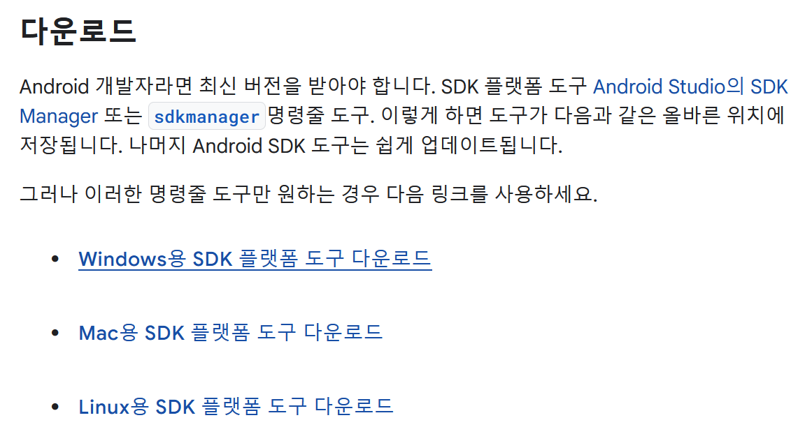
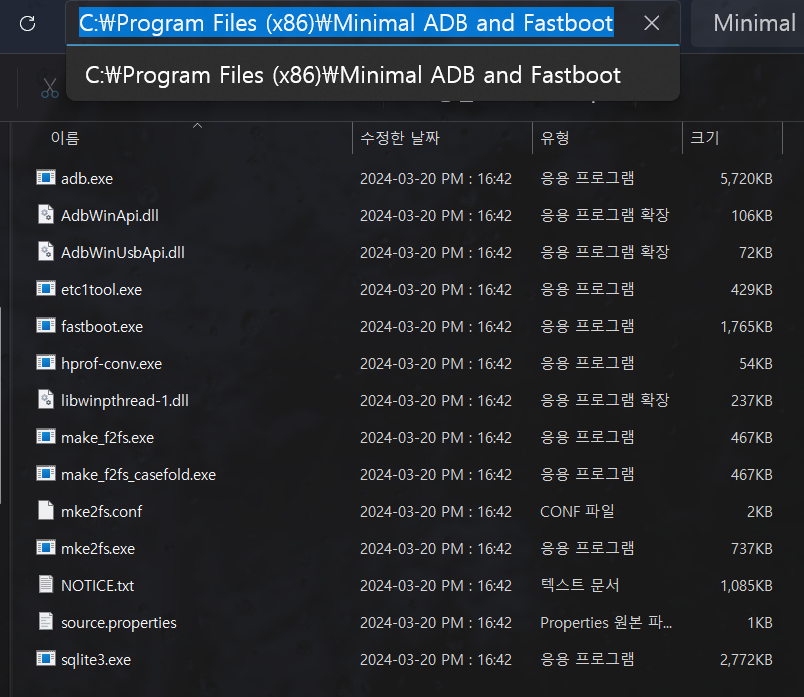
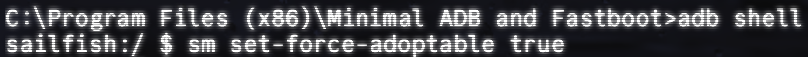

# Google Pixel 1 에 외장하드 마운트하기

> **Summary**
> 픽셀1 폰에서 OTG 외장하드를 마운트하는 방법: 개발자 모드와 USB 디버깅 활성화, ADB 설치 및 명령어 실행, 외장하드 연결 및 설정, 사진 백업 및 구글 포토 자동 업로드 준비. 무선 업로드를 위한 FTP 서버 구동도 가능하나 속도는 느림.

---


🔗 [https://www.clien.net/service/board/lecture/17216250#comment_write_point](https://www.clien.net/service/board/lecture/17216250#comment_write_point)

# 픽셀1 폰에서 구글 포토 대용량 백업 튜토리얼

## 준비 사항

- 픽셀1 폰
- PC
- USB 케이블
- OTG 지원 외장하드
## 절차

### 1. 개발자 모드 활성화

1. 설정 → 휴대전화 정보 → 소프트웨어 정보
1. '빌드 번호' 여러 번 클릭하여 개발자 모드 활성화
### 2. USB 디버깅 활성화

- 설정 → 개발자 옵션 → USB 디버깅 활성화
### 3. ADB 설치 및 실행

1. [Android Platform Tools](https://developer.android.com/studio/releases/platform-tools) 다운로드 및 설치




1. 폰과 PC를 USB로 연결
1. 폰에서 USB 디버깅 허용
### 4. ADB 명령어 실행

1. PC에서 관리자 권한으로 명령 프롬프트(cmd) 실행
1. 아까 압축 해제한 폴더로 이동
```plain text
cd C:\Program Files (x86)\Minimal ADB and Fastboot
```

1. 디바이스 연결 확인:
```plain text
adb devices -l

```

1. ADB 셸 진입:
```plain text
adb shell

```

1. 외장 저장소 강제 채택 설정:
```plain text
sm set-force-adoptable true

```

1. (선택사항) ADB 셸 종료:
```plain text
exit

```



### 5. 외장하드 설정

1. 폰에 OTG로 외장하드 연결
1. 외장 메모리로 사용 선택 (필요시 포맷)
### 6. 사진 업로드 준비

1. 외장하드를 PC에 연결
1. DCIM 폴더에 백업할 사진 복사
### 7. 구글 포토 백업

1. 외장하드를 다시 폰에 연결
1. 구글 포토 앱에서 자동으로 사진 인식 및 업로드 시작
## 선택사항: 무선 업로드

- 안드로이드 폰에서 FTP 서버 구동
- 외장드라이브를 폴더로 지정하여 무선 업로드 가능 (단, 속도가 느림)
