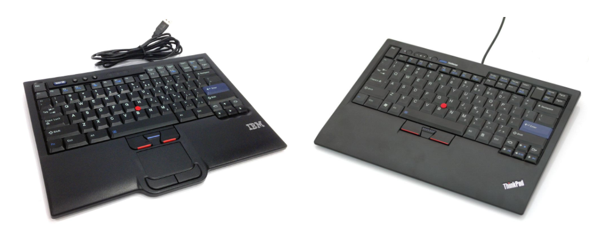

# IBM 구형 키보드 펌웨어 변조

> **Summary**
> 구형 IBM 키보드에서 

---



[https://www.reddit.com/r/thinkpad/comments/ondeco/how_to_swap_the_fn_ctrl_keys_on_the_sk8845_sk8835/](https://www.reddit.com/r/thinkpad/comments/ondeco/how_to_swap_the_fn_ctrl_keys_on_the_sk8845_sk8835/)

[https://www.clien.net/service/board/lecture/16863202](https://www.clien.net/service/board/lecture/16863202)

[https://forum.thinkpads.com/viewtopic.php?t=120571](https://forum.thinkpads.com/viewtopic.php?t=120571)

[https://www.clien.net/service/board/use/11988692](https://www.clien.net/service/board/use/11988692)

---

🔗 [https://blog.naver.com/wreg/221854068812](https://blog.naver.com/wreg/221854068812)

🔗 [https://m.blog.naver.com/wreg/220962115688](https://m.blog.naver.com/wreg/220962115688)

---


구형 IBM 키보드에서 `Fn` 키를 `Ctrl` 키로, `Ctrl` 키를 `Win` 키로 재매핑하고자 하시는군요. 이러한 키 재매핑은 Windows 레지스트리의 `Scancode Map` 항목을 수정하여 가능합니다. 그러나 `Fn` 키는 하드웨어적으로 처리되는 경우가 많아, 소프트웨어적으로 재매핑이 어려울 수 있습니다. 따라서, `Ctrl` 키를 `Win` 키로 변경하는 방법을 중심으로 안내해 드리겠습니다.

**1. 레지스트리 편집기 실행:**

- `Win + R` 키를 눌러 실행 창을 열고, `regedit`를 입력하여 레지스트리 편집기를 실행합니다.
**2. 레지스트리 경로 이동:**

- 다음 경로로 이동합니다:
  `HKEY_LOCAL_MACHINE\SYSTEM\CurrentControlSet\Control\Keyboard Layout`

**3. **`**Scancode Map**`** 값 생성:**

- 오른쪽 빈 공간에서 마우스 오른쪽 버튼을 클릭하고, `새로 만들기` > `이진 값`을 선택합니다.
- 새로운 값의 이름을 `Scancode Map`으로 지정합니다.
**4. **`**Scancode Map**`** 값 편집:**

- `Scancode Map` 값을 더블 클릭하여 편집 창을 엽니다.
- 아래의 이진 데이터를 입력합니다:
```plain text
00 00 00 00 00 00 00 00
02 00 00 00
5B E0 1D 00
00 00 00 00

```

  **데이터 설명:**

  - 첫 번째 줄과 마지막 줄은 헤더와 종료를 나타내며, 고정된 값입니다.
  - 두 번째 줄의 `02 00 00 00`은 매핑할 키의 개수 + 1을 나타냅니다. 여기서는 한 개의 키를 매핑하므로 `02`입니다.
  - 세 번째 줄의 `5B E0 1D 00`은 왼쪽 `Ctrl` 키(`1D 00`)를 왼쪽 `Win` 키(`5B E0`)로 매핑한다는 의미입니다.
**5. 레지스트리 편집기 종료 및 시스템 재부팅:**

- 모든 작업을 완료한 후, 레지스트리 편집기를 닫고 시스템을 재부팅합니다.
이러한 과정을 통해 왼쪽 `Ctrl` 키를 `Win` 키로 재매핑할 수 있습니다. 그러나 앞서 언급한 것처럼, `Fn` 키는 하드웨어적으로 처리되는 경우가 많아, 소프트웨어적인 재매핑이 어려울 수 있습니다. 따라서, `Fn` 키의 재매핑은 제조사에서 제공하는 소프트웨어나 펌웨어 업데이트를 통해서만 가능할 수 있습니다.

추가로, 레지스트리를 직접 수정하는 것은 시스템에 영향을 미칠 수 있으므로, 변경 전에 반드시 레지스트리 백업을 진행하시기 바랍니다. 레지스트리 백업 및 복원 방법에 대한 자세한 내용은 [Microsoft의 공식 문서](https://support.microsoft.com/ko-kr/help/322756/how-to-back-up-and-restore-the-registry-in-windows)를 참고하시기 바랍니다.

또한, 키 매핑을 보다 쉽게 수행하기 위해 [SharpKeys](https://github.com/randyrants/sharpkeys)와 같은 타사 유틸리티를 사용할 수도 있습니다. 이러한 도구는 사용자 친화적인 인터페이스를 제공하여 키 매핑 작업을 간소화합니다.

마지막으로, 키 매핑에 대한 시각적인 가이드를 원하신다면, 아래의 영상을 참고하실 수 있습니다:

videoHow to Remap Keyboard Keys in Windows 10/11turn0search11

이 영상은 Windows 10 및 11에서 키 매핑을 변경하는 방법을 단계별로 안내합니다.

위의 방법들을 시도해 보시고, 원하는 키 매핑을 설정하시길 바랍니다. 추가적인 도움이 필요하시면 언제든지 문의해 주세요.

---

# SK-8845 키보드에서 **Fn 키를 Win 키로 맵핑하는 방법**

제공된 정보를 기반으로 PowerToys 제외한 방법을 정리합니다.

---

### 1. **BIOS 설정을 통한 Fn 키 기능 변경**

- **SK-8845 키보드**는 일부 레노버/씽크패드 제품과 유사한 BIOS 설정을 지원할 수 있습니다.
  - 부팅 시 `Del` 키 연타 → BIOS 진입 → `Advanced` 탭 → **Fn/Ctrl 키 스왑 옵션** 활성화[(출처17)](https://support.lenovo.com/bo/ko/solutions/ht074187).
  - **주의**: 일부 모델에서는 **Win 키 직접 변경** 옵션이 없을 수 있으나, Fn 키를 Ctrl로 변경 후 추가 설정 가능[(출처16)](https://blog.naver.com/PostView.nhn?blogId=mk235&logNo=221192783459)[(출처19)](https://kr.msi.com/support/technical_details/NB_KB_Setting).
---

### 2. **전용 유틸리티 활용 (레노버 공식 도구)**

- 레노버 제공 **키보드 설정 유틸리티** 사용:
  - `Fn + Ctrl 키 스왑` 기능을 활성화한 후, **Ctrl 키를 Win 키로 재맵핑**하는 방식[(출처5)](https://support.lenovo.com/us/en/solutions/ht074187-how-to-swap-the-fn-function-and-ctrl-control-keyboard-keys-in-bios)[(출처20)](https://ko.aliexpress.com/item/1005001474701365.html).
  - 유틸리티 설치 후 **키맵핑 탭**에서 대상 키 선택 → `Win 키`로 설정[(출처6)](https://support.microsoft.com/en-us/topic/how-do-i-reassign-hot-keys-for-my-keyboard-703f897c-ad72-db5d-8e64-0928873d712f).
---

### 3. **KeyTweak 또는 레지스트리 편집**

- **KeyTweak** 프로그램으로 Fn 키를 Win 키로 재할당:
  - 프로그램 실행 → **Fn 키 선택** → `Win 키`로 매핑 후 적용[(출처3)](https://forum.thinkpads.com/viewtopic.php?t=38326).
  - 레지스트리 직접 편집 시 `HKEY_LOCAL_MACHINE\\SYSTEM\\CurrentControlSet\\Control\\Keyboard Layout`에서 키 값 수정[(출처8)](https://stackoverflow.com/questions/48986359/identify-and-remap-fn-key-to-win-key).
---

### 4. **AutoHotkey 스크립트 작성**

- **Fn 키를 Win 키로 변환하는 스크립트** 예시:
```plain text
Fn::LWin  ; Fn 키를 왼쪽 Win 키로 매핑

```

  - 단, **Fn 키가 하드웨어 수준에서 입력되지 않는 경우** 작동하지 않을 수 있음[(출처7)](https://www.autohotkey.com/boards/viewtopic.php?t=92676)[(출처8)](https://stackoverflow.com/questions/48986359/identify-and-remap-fn-key-to-win-key).
---

### 5. **키보드 하드웨어 딥스위치 확인**

- 일체형 키보드의 경우 **딥스위치(DIP Switch)** 로 Fn 키 기능 변경 가능 여부 확인[(출처21)](https://brunch.co.kr/@ruseupi/88).
  - 키보드 하단 또는 측면에 위치한 스위치 조합으로 **Win 키 활성화**.
---

### 요약

| 방법 | 장점 | 단점 |
| **BIOS 설정** | 안정적 | 옵션 유무 확인 필요 |
| **전용 유틸리티** | 공식 지원 | SK-8845 호환성 확인 필수 |
| **KeyTweak** | 즉시 적용 가능 | 관리자 권한 필요 |
| **AutoHotkey** | 유연한 커스터마이징 | Fn 키 입력 감지 여부에 따라 제한 |

🔍 **추천 순서**: BIOS/유틸리티 → KeyTweak → AutoHotkey → 하드웨어 스위치 확인

출처: [(출처3)](https://forum.thinkpads.com/viewtopic.php?t=38326)[(출처5)](https://support.lenovo.com/us/en/solutions/ht074187-how-to-swap-the-fn-function-and-ctrl-control-keyboard-keys-in-bios)[(출처7)](https://www.autohotkey.com/boards/viewtopic.php?t=92676)[(출처8)](https://stackoverflow.com/questions/48986359/identify-and-remap-fn-key-to-win-key)[(출처16)](https://blog.naver.com/PostView.nhn?blogId=mk235&logNo=221192783459)[(출처17)](https://support.lenovo.com/bo/ko/solutions/ht074187)[(출처19)](https://kr.msi.com/support/technical_details/NB_KB_Setting)[(출처20)](https://ko.aliexpress.com/item/1005001474701365.html)[(출처21)](https://brunch.co.kr/@ruseupi/88)

# **Fn 키가 하드웨어 수준에서 작동할 때의 해결 방안**

Fn 키가 **하드웨어/펌웨어 레벨에서 처리**되는 경우, 소프트웨어 기반 재맵핑은 기본적으로 불가능합니다.

하지만 다음 방법으로 우회적 해결을 시도할 수 있습니다.

---

### 1. **BIOS/UEFI에서 Fn ↔ Ctrl 키 스왑 후 Ctrl을 Win 키로 재맵핑**

- **Fn 키를 Ctrl 키로 먼저 변경**:
  - BIOS 설정 진입 → `Advanced` → `Keyboard/Mouse` → **Fn and Ctrl Key Swap** 활성화[(출처39)](https://support.lenovo.com/bo/ko/solutions/ht074187).
  - 변경 후 Ctrl 키를 소프트웨어(KeyTweak, 레지스트리)로 **Win 키로 재할당**.
  - **장점**: 하드웨어 지원 변경으로 안정적입니다.
  - **단점**: SK-8845 모델에 해당 BIOS 옵션이 있는지 확인이 필요합니다[(출처25)](https://www.reddit.com/r/thinkpad/comments/ondeco/how_to_swap_the_fn_ctrl_keys_on_the_sk8845_sk8835/)[(출처29)](https://www.thinkpads.com/forum/viewtopic.php?t=130672).
---

### 2. **키보드 DIP 스위치 활용 (하드웨어 레벨)**

- **DIP 스위치로 Fn 키 동작 변경**:
  - 키보드 하단 또는 측면에 위치한 **DIP 스위치** 조합을 통해 Fn 키 기능을 Win 키로 변경.
  - 예: 시노비 키보드의 경우 DIP 스위치로 Fn/Ctrl 스왑 후 추가 설정 가능.
  - **확인 방법**: 제품 매뉴얼 또는 제조사 지원 문의.
---

### 3. **외부 컨트롤러 또는 프로그래머블 키보드 활용**

- **커스텀 PCB 또는 컨트롤러 장착**:
  - 아두이노, QMK/VIA 지원 컨트롤러를 키보드에 연결해 **Fn 키 입력을 Win 키로 변환**.
  - **전제 조건**: 키보드 분해 및 납땜 기술 필요.
---

### 4. **Fn 키 조합 + 다른 키를 Win 키로 대체**

- **AutoHotkey로 Fn 조합 키 설정**:
```plain text
Fn & LCtrl::LWin  ; Fn + LCtrl을 Win 키로 매핑

```

  - **한계**: Fn 키 단독 입력은 여전히 불가능하며, 반드시 **다른 키와 조합**해야 합니다.
---

### 5. **물리적 하드웨어 개조 (극단적 방법)**

- **키보드 회로판 직접 수정**:
  - Fn 키와 Win 키의 **전기적 신호 라인을 교체**합니다.
  - **위험성**: 키보드 고장 가능성이 높으며, 전문 지식과 장비 필요[(출처34)](https://lobste.rs/s/nl96zm/what_keyboards_do_you_use_do_you_program).
---

### **요약: 방법별 비교**

| 방법 | 실행 난이도 | 안정성 | 비고 |
| BIOS + 소프트웨어 재맵핑 | 중간 | 높음 | BIOS 옵션 확인 필수 |
| DIP 스위치 | 낮음 | 높음 | 하드웨어 지원 필요 |
| 외부 컨트롤러 | 매우 높음 | 중간 | 기술력 요구 |
| AutoHotkey 조합 키 | 낮음 | 낮음 | Fn 단독 사용 불가 |
| 물리적 개조 | 매우 높음 | 낮음 | 고장 위험 |

🔍 **추천 순서**:

1. **BIOS 설정 확인** → 2. **DIP 스위치 유무 확인** → 3. **Fn 조합 키 대체**
출처: [(출처25)](https://www.reddit.com/r/thinkpad/comments/ondeco/how_to_swap_the_fn_ctrl_keys_on_the_sk8845_sk8835/)[(출처29)](https://www.thinkpads.com/forum/viewtopic.php?t=130672)[(출처34)](https://lobste.rs/s/nl96zm/what_keyboards_do_you_use_do_you_program)[(출처39)](https://support.lenovo.com/bo/ko/solutions/ht074187)

