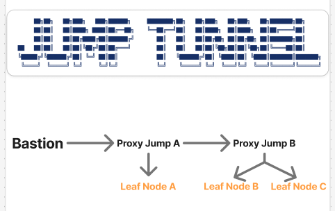

# JUMP TUNNEL ! : ssh 터널링 클라이언트를 직접 개발해보았다

> **Summary**
> Jump Tunnel은 SSH 터널링의 복잡성을 단순화하기 위해 개발된 GUI 프로그램으로, Bastion Host를 통해 내부망을 안전하게 보호하고 ProxyJump 기능을 활용하여 여러 서버에 쉽게 접근할 수 있도록 해줍니다. 사용자는 마스터 계정과 키를 통해 관리 효율성을 높일 수 있으며, 간편한 설정 자동화로 SSH 터널링을 쉽게 이해하고 적용할 수 있습니다.

---

🔗 [https://github.com/Cybecho/JumpTunnel](https://github.com/Cybecho/JumpTunnel)

# 4.5

# o1

# Grok3

