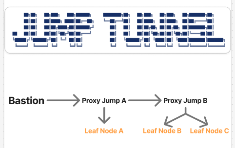

# JUMP TUNNEL ! : ssh 터널링 클라이언트를 직접 개발해보았다

> **Summary**
> Jump Tunnel은 SSH 터널링의 복잡성을 단순화하기 위해 개발된 GUI 프로그램으로, Bastion Host를 통해 내부망을 안전하게 보호하고 ProxyJump 기능을 활용하여 여러 서버에 쉽게 접근할 수 있도록 해줍니다. 사용자는 마스터 계정과 키를 통해 관리 효율성을 높일 수 있으며, 간편한 설정 자동화로 SSH 터널링을 쉽게 이해하고 적용할 수 있습니다.

---



🔗 [https://github.com/Cybecho/JumpTunnel](https://github.com/Cybecho/JumpTunnel)

# 4.5

<관조자>
흠... 이제 이 글을 하나의 블로그 포스팅 형태로 다듬어보자.
글의 목적은 누군가에게 "왜 Jump Tunnel을 개발했으며, 어떤 기술적 흐름에서 출발했는가"를 소개하는 것이다.
</관조자>

<final_answer>

# Jump Tunnel: 복잡한 SSH 터널링을 단순화한 이야기

## 들어가며

SSH 터널링이라는 개념은 얼핏 복잡하게 들리지만, 사실은 “보안이 중요한 내부망에 어떻게 하면 안전하게 접근할 수 있을까?”라는 아주 단순한 고민에서 시작되었습니다. 이 문제를 해결하기 위해, 저는 `Jump Tunnel`이라는 프로그램을 만들었는데요. 이번 글에서는 왜 이런 프로그램을 구상하게 되었고, 그 과정에서 어떤 기술적 아이디어들을 활용했는지를 공유해보려 합니다.

---

## 1. Bastion Host와 DMZ, 그리고 SSH 터널링

### 왜 Bastion Host인가?

회사의 중요한 내부 서버들(WEB, WAS, DB 등)을 인터넷에 직접 노출하는 것은 보안상 매우 위험합니다. 그래서 내부망과 외부망(인터넷) 사이에는 **DMZ(비무장지대)**라는 완충 지대를 두고, 이 DMZ에 위치한 **Bastion Host**만을 통해서 내부로 들어갈 수 있게 만듭니다. Bastion Host는 내부망으로 가는 유일한 출입문이자, 최소한의 기능만으로 운영되어 외부 공격에 대한 위험성을 줄이는 역할을 합니다.

### 이중 SSH 터널링

보통 “중요한 서버는 내부망에, 외부에서는 절대 접속 불가!”라는 구조를 짜다 보면, Bastion을 지나 또 다른 Router까지 거쳐야 최종 서버에 갈 수 있는 경우가 많습니다. 이때, **이중 SSH 터널링**이 필요해집니다.

1. 내 PC → Bastion
1. Bastion → Router
1. Router → 내부 서버(WEB, WAS, DB 등)
처음에는 터미널 2~3개를 켜놓고, 포트포워딩 명령어를 매번 일일이 입력했죠. 당연히 번거롭습니다. “어떻게 하면 더 편리하게 자동화할 수 있을까?”라는 질문이 들 수밖에 없었습니다.

---

## 2. 한 방에 점프하자: ProxyJump

리눅스 SSH에는 `ProxyJump`라는 강력한 기능이 있습니다. 중간 서버 여러 개를 거쳐 최종 서버에 도달해야 하는 복잡한 상황을 단 한 번의 명령어로 정리할 수 있게 만들어 줍니다. 예를 들어,

```shell
ssh -o ProxyJump="bastion,router" target_server

```

이런 식이죠. 중간 단계에서 매번 SSH 키를 새로 입력하는 대신, 호스트(내 PC)가 가진 하나의 개인 키로 모든 서버를 순차적으로 연결하는 구조가 형성됩니다.

이 방식으로 복잡한 SSH 연결 과정을 크게 단순화했지만, 여전히 각 서버에 다른 계정과 다른 키를 써야 한다면 관리가 번거롭습니다. “아예 모든 서버가 같은 계정과 키를 공유한다면 어떨까?”라는 아이디어가 떠오른 것도 이 때문이었습니다.

---

## 3. 하나의 마스터 키로 모든 서버에 접근하기

### 마스터 계정 & 마스터 키

모든 서버에 `master`라는 공통 계정을 만들고, 동일한 SSH 키를 등록해두면 관리 효율성이 획기적으로 올라갑니다. 한 번 생성한 키 쌍을 각 서버에 배포하고, `~/.ssh/config`에서 ProxyJump 설정만 해두면, 원하는 서버로 바로 “점프”할 수 있거든요.

물론 실제 운영 환경에서는 보안 관점에서 여러 계정과 다중 키를 고려해야 하지만, 데모나 내부 개발 환경에서는 이렇게 깔끔한 구조로도 충분할 때가 많습니다.

---

## 4. Jump Tunnel을 만들다

이러한 배경에서, 저는 “Jump Tunnel”이라는 GUI 프로그램을 구상하게 되었습니다. 사용자는 몇 가지 정보를 입력하기만 하면,

1. 로컬 PC에 SSH 마스터 키를 자동으로 생성하고,
1. Bastion부터 Router, 내부 서버(Leaf Node)까지 **트리 구조**로 설정한 뒤,
1. `~/.ssh/config`에 ProxyJump 설정을 자동으로 작성해줍니다.
이렇게 만들어진 구조를 통해, 호스트 PC에서는 `ssh <서버별_호스트명>` 명령만 입력하면 자동으로 여러 단계를 거쳐 최종 목적지 서버로 점프합니다.

### 간편화와 자동화

개발자로서 매번 복잡한 명령을 타이핑하는 대신, 버튼 몇 번으로 모든 SSH 설정을 완료할 수 있다면 훨씬 편리합니다. 더불어, 이 모든 과정을 **시각적**으로 표현해줄 수 있다면 누구나 쉽게 SSH 터널링 개념을 이해하고 적용할 수 있을 테죠.

---

## 5. 마무리하며

Jump Tunnel 프로그램은 복잡한 SSH 터널링과 계정/키 관리를 최소한의 클릭으로 해결하고자 탄생했습니다. 결국 “내부망 보호”라는 기본 원칙에서 출발했지만, 이를 어떻게 하면 더 효율적으로, 또 개발자 친화적으로 만들 수 있을까 고민한 결과물이었습니다.

정리하자면,

- Bastion Host로 내부망 보호
- ProxyJump로 이중, 삼중 SSH 점프를 단순화
- 하나의 마스터 키와 계정으로 다수 서버 접근
- GUI를 통한 설정 자동화
이것이 Jump Tunnel 프로젝트를 탄생시킨 주요 아이디어였습니다. “보안의 복잡성은 유지하되, 사용자는 편하게!”라는 목표로, 앞으로도 더 쉽게 SSH 터널링을 구성할 수 있는 방향으로 계속 발전시키고 싶습니다.

감사합니다!
</final_answer>


# o1

<관조자>
흠... 이제 이 글을 하나의 블로그 포스팅 형태로 다듬어보자.
글의 목적은 누군가에게 "왜 Jump Tunnel을 개발했으며, 어떤 기술적 흐름에서 출발했는가"를 소개하는 것이다.
</관조자>

<final_answer>

# Jump Tunnel: 복잡한 SSH 터널링을 단순화한 이야기

## 들어가며

SSH 터널링이라는 개념은 얼핏 복잡하게 들리지만, 사실은 “보안이 중요한 내부망에 어떻게 하면 안전하게 접근할 수 있을까?”라는 아주 단순한 고민에서 시작되었습니다. 이 문제를 해결하기 위해, 저는 `Jump Tunnel`이라는 프로그램을 만들었는데요. 이번 글에서는 왜 이런 프로그램을 구상하게 되었고, 그 과정에서 어떤 기술적 아이디어들을 활용했는지를 공유해보려 합니다.

---

## 1. Bastion Host와 DMZ, 그리고 SSH 터널링

### 왜 Bastion Host인가?

회사의 중요한 내부 서버들(WEB, WAS, DB 등)을 인터넷에 직접 노출하는 것은 보안상 매우 위험합니다. 그래서 내부망과 외부망(인터넷) 사이에는 **DMZ(비무장지대)**라는 완충 지대를 두고, 이 DMZ에 위치한 **Bastion Host**만을 통해서 내부로 들어갈 수 있게 만듭니다. Bastion Host는 내부망으로 가는 유일한 출입문이자, 최소한의 기능만으로 운영되어 외부 공격에 대한 위험성을 줄이는 역할을 합니다.

### 이중 SSH 터널링

보통 “중요한 서버는 내부망에, 외부에서는 절대 접속 불가!”라는 구조를 짜다 보면, Bastion을 지나 또 다른 Router까지 거쳐야 최종 서버에 갈 수 있는 경우가 많습니다. 이때, **이중 SSH 터널링**이 필요해집니다.

1. 내 PC → Bastion
1. Bastion → Router
1. Router → 내부 서버(WEB, WAS, DB 등)
처음에는 터미널 2~3개를 켜놓고, 포트포워딩 명령어를 매번 일일이 입력했죠. 당연히 번거롭습니다. “어떻게 하면 더 편리하게 자동화할 수 있을까?”라는 질문이 들 수밖에 없었습니다.

---

## 2. 한 방에 점프하자: ProxyJump

리눅스 SSH에는 `ProxyJump`라는 강력한 기능이 있습니다. 중간 서버 여러 개를 거쳐 최종 서버에 도달해야 하는 복잡한 상황을 단 한 번의 명령어로 정리할 수 있게 만들어 줍니다. 예를 들어,

```shell
ssh -o ProxyJump="bastion,router" target_server

```

이런 식이죠. 중간 단계에서 매번 SSH 키를 새로 입력하는 대신, 호스트(내 PC)가 가진 하나의 개인 키로 모든 서버를 순차적으로 연결하는 구조가 형성됩니다.

이 방식으로 복잡한 SSH 연결 과정을 크게 단순화했지만, 여전히 각 서버에 다른 계정과 다른 키를 써야 한다면 관리가 번거롭습니다. “아예 모든 서버가 같은 계정과 키를 공유한다면 어떨까?”라는 아이디어가 떠오른 것도 이 때문이었습니다.

---

## 3. 하나의 마스터 키로 모든 서버에 접근하기

### 마스터 계정 & 마스터 키

모든 서버에 `master`라는 공통 계정을 만들고, 동일한 SSH 키를 등록해두면 관리 효율성이 획기적으로 올라갑니다. 한 번 생성한 키 쌍을 각 서버에 배포하고, `~/.ssh/config`에서 ProxyJump 설정만 해두면, 원하는 서버로 바로 “점프”할 수 있거든요.

물론 실제 운영 환경에서는 보안 관점에서 여러 계정과 다중 키를 고려해야 하지만, 데모나 내부 개발 환경에서는 이렇게 깔끔한 구조로도 충분할 때가 많습니다.

---

## 4. Jump Tunnel을 만들다

이러한 배경에서, 저는 “Jump Tunnel”이라는 GUI 프로그램을 구상하게 되었습니다. 사용자는 몇 가지 정보를 입력하기만 하면,

1. 로컬 PC에 SSH 마스터 키를 자동으로 생성하고,
1. Bastion부터 Router, 내부 서버(Leaf Node)까지 **트리 구조**로 설정한 뒤,
1. `~/.ssh/config`에 ProxyJump 설정을 자동으로 작성해줍니다.
이렇게 만들어진 구조를 통해, 호스트 PC에서는 `ssh <서버별_호스트명>` 명령만 입력하면 자동으로 여러 단계를 거쳐 최종 목적지 서버로 점프합니다.

### 간편화와 자동화

개발자로서 매번 복잡한 명령을 타이핑하는 대신, 버튼 몇 번으로 모든 SSH 설정을 완료할 수 있다면 훨씬 편리합니다. 더불어, 이 모든 과정을 **시각적**으로 표현해줄 수 있다면 누구나 쉽게 SSH 터널링 개념을 이해하고 적용할 수 있을 테죠.

---

## 5. 마무리하며

Jump Tunnel 프로그램은 복잡한 SSH 터널링과 계정/키 관리를 최소한의 클릭으로 해결하고자 탄생했습니다. 결국 “내부망 보호”라는 기본 원칙에서 출발했지만, 이를 어떻게 하면 더 효율적으로, 또 개발자 친화적으로 만들 수 있을까 고민한 결과물이었습니다.

정리하자면,

- Bastion Host로 내부망 보호
- ProxyJump로 이중, 삼중 SSH 점프를 단순화
- 하나의 마스터 키와 계정으로 다수 서버 접근
- GUI를 통한 설정 자동화
이것이 Jump Tunnel 프로젝트를 탄생시킨 주요 아이디어였습니다. “보안의 복잡성은 유지하되, 사용자는 편하게!”라는 목표로, 앞으로도 더 쉽게 SSH 터널링을 구성할 수 있는 방향으로 계속 발전시키고 싶습니다.

감사합니다!
</final_answer>


---


# Grok3

# Jump Tunnel: 복잡한 SSH 터널링을 단순화한 이야기

## 들어가며

SSH 터널링은 겉보기에는 복잡해 보이지만, 그 시작은 “보안이 중요한 내부망에 어떻게 하면 안전하게 접근할 수 있을까?”라는 단순한 질문에서 비롯되었습니다. 저는 이 고민을 해결하기 위해 `Jump Tunnel`이라는 프로그램을 개발하게 되었는데요. 이번 글에서는 Jump Tunnel을 왜 만들었는지, 그리고 어떤 기술적 흐름을 따라가며 이 프로젝트가 탄생했는지 소개하겠습니다.

---

## 1. Bastion Host와 DMZ, 그리고 SSH 터널링의 시작

### 왜 Bastion Host가 필요한가?

회사의 핵심 서버들, 예를 들어 웹 서버(WEB), 애플리케이션 서버(WAS), 데이터베이스(DB) 등을 인터넷에 직접 노출시키는 것은 보안상 큰 위험을 초래합니다. 이를 막기 위해 내부망과 외부망 사이에 **DMZ(비무장지대)**라는 중간 지대를 두고, 이곳에 **Bastion Host**를 배치합니다. Bastion Host는 외부에서 내부망으로 들어가는 유일한 관문 역할을 하며, 최소한의 기능만 갖춰 외부 공격의 위험을 줄여줍니다.

### 이중 SSH 터널링의 현실

내부망에 중요한 서버를 두고 외부 접속을 차단하는 구조에서는 Bastion Host를 거친 뒤, 또 다른 중간 서버(Router)를 통해 최종 서버에 도달해야 하는 경우가 많습니다. 이 과정에서 **이중 SSH 터널링**이 필요해집니다. 예를 들어:

1. 내 PC에서 Bastion Host로 연결
1. Bastion Host에서 Router로 연결
1. Router에서 내부 서버(WEB, WAS, DB 등)로 연결
처음에는 터미널 창을 여러 개 띄우고, 매번 포트포워딩 명령어를 수동으로 입력하며 작업했습니다. 하지만 이런 방식은 너무 번거로웠고, 자연스럽게 “이 과정을 어떻게 자동화하고 간편하게 만들 수 있을까?”라는 생각이 들었습니다.

---

## 2. 한 번에 해결하는 기술: ProxyJump

리눅스 SSH에는 `ProxyJump`라는 기능이 있습니다. 이 기능은 여러 중간 서버를 거쳐야 하는 복잡한 접속 과정을 단 하나의 명령어로 간소화해줍니다. 예를 들어:

```shell
ssh -o ProxyJump="bastion,router" target_server

```

이 명령어 하나로 내 PC에서 Bastion과 Router를 거쳐 목표 서버까지 순차적으로 연결할 수 있습니다. 매번 중간 단계에서 SSH 키를 입력할 필요 없이, 내 PC에 저장된 하나의 개인 키로 모든 과정을 처리할 수 있죠.

ProxyJump 덕분에 SSH 연결이 훨씬 간단해졌지만, 여전히 각 서버마다 다른 계정과 키를 관리해야 한다면 번거로움이 남아 있었습니다. 그래서 “모든 서버가 동일한 계정과 키를 공유한다면 어떨까?”라는 아이디어가 떠올랐습니다.

---

## 3. 관리 효율성을 위한 마스터 키

### 마스터 계정과 키의 도입

모든 서버에 `master`라는 공통 계정을 만들고, 동일한 SSH 키를 등록하면 관리가 훨씬 쉬워집니다. 한 번 생성한 키 쌍을 각 서버에 배포한 뒤, 로컬 PC의 `~/.ssh/config` 파일에 ProxyJump 설정을 추가하면 됩니다. 그러면 원하는 서버로 바로 “점프”할 수 있는 구조가 완성되죠.

물론 실제 운영 환경에서는 보안 강화를 위해 계정과 키를 다양하게 설정하는 것이 좋지만, 데모 환경이나 내부 개발 환경에서는 이런 단순한 방식이 매우 유용합니다.

---

## 4. Jump Tunnel의 탄생

이런 기술적 흐름과 고민을 바탕으로, 저는 `Jump Tunnel`이라는 GUI 프로그램을 만들게 되었습니다. Jump Tunnel은 사용자가 몇 가지 정보를 입력하기만 하면 다음 과정을 자동으로 처리합니다:

1. 로컬 PC에 SSH 마스터 키를 생성
1. Bastion Host부터 Router, 내부 서버(Leaf Node)까지 **트리 구조**로 설정
1. `~/.ssh/config` 파일에 ProxyJump 설정을 자동 작성
이렇게 설정이 완료되면, 사용자는 `ssh <서버별_호스트명>` 명령어만 입력해 여러 단계를 거치지 않고 목표 서버에 바로 연결할 수 있습니다.

### 간편함과 자동화의 가치

개발자로서 매번 복잡한 SSH 명령어를 입력하는 대신, 버튼 몇 번으로 모든 설정을 끝낼 수 있다면 작업 효율이 크게 올라갑니다. 게다가 GUI를 통해 이 과정을 시각적으로 보여주면 SSH 터널링이 처음인 사람도 쉽게 이해하고 사용할 수 있죠.

---

## 5. 맺음말

Jump Tunnel은 복잡한 SSH 터널링과 계정/키 관리를 단순화하려는 목표에서 시작되었습니다. 내부망을 안전하게 보호한다는 기본 원칙을 지키면서도, 사용 편의성을 높이고 개발자 친화적인 도구를 만들고자 했던 노력의 결과물입니다.

핵심 아이디어를 정리하면:

- **Bastion Host**로 내부망 보호
- **ProxyJump**로 다중 SSH 연결 단순화
- 하나의 **마스터 키와 계정**으로 효율적 관리
- **GUI**를 통한 설정 자동화
이것이 Jump Tunnel을 개발하게 된 이유이자, 그 바탕이 된 기술적 흐름입니다. “보안의 복잡성은 유지하되, 사용자는 편리하게!”라는 목표를 가지고, 앞으로도 SSH 터널링을 더 쉽게 만들 수 있는 방향으로 발전시켜 나가고 싶습니다.

읽어주셔서 감사합니다!


