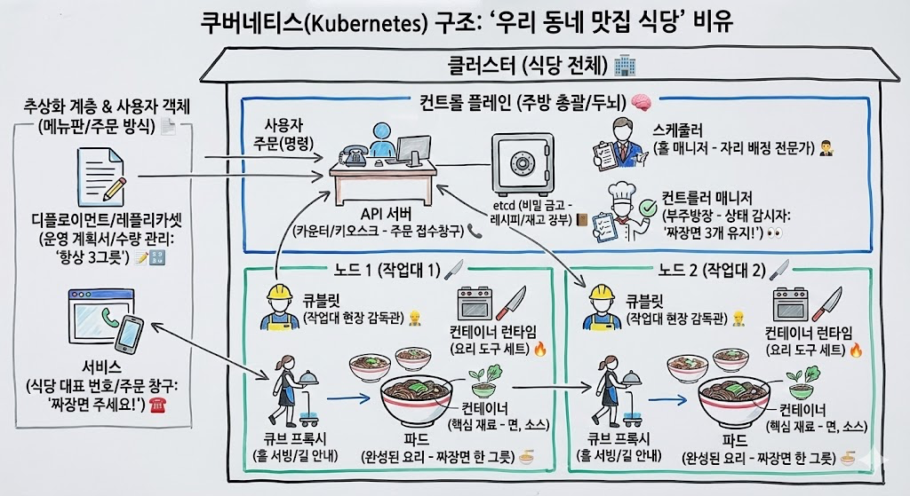

# Kubernetes 각 용어 개념을 다시한번 정리해보자

> **Summary**
> 쿠버네티스 클러스터는 컨테이너화된 애플리케이션을 관리하는 시스템으로, 컨트롤 플레인이 모든 의사결정을 담당하며, 워커 노드는 실제 컨테이너를 실행하는 서버이다. 사용자는 디플로이먼트를 통해 시스템을 운영하고, 파드는 애플리케이션 코드가 실행되는 최소 단위로, 서비스는 안정적인 접속을 제공한다. 전체 작동 과정은 API 서버를 통해 설정이 전달되고, 스케줄러와 컨트롤러 매니저가 협력하여 파드를 생성하고 서비스에 접근할 수 있도록 한다.

---

## [주제 1: 쿠버네티스 클러스터의 구조적 정의]

쿠버네티스 클러스터(Cluster)는 컨테이너화된 애플리케이션을 실행하고 관리하기 위한 전체 시스템을 의미한다. 이는 식당 건물 전체에 비유될 수 있으며, 내부적으로는 관리 체계인 컨트롤 플레인과 실제 작업이 수행되는 노드로 구성된다. 클러스터는 주방, 홀, 직원 등 모든 구성 요소를 포함하는 물리적·논리적 통합체로서, 애플리케이션의 배포와 운영이 이루어지는 독립적인 환경을 제공한다.

## [주제 2: 컨트롤 플레인의 핵심 구성 요소 및 의사결정 프로세스]

컨트롤 플레인(Control Plane)은 클러스터의 두뇌 역할을 수행하며 모든 의사결정과 지시를 총괄한다. 사용자의 명령은 오직 API 서버(API Server)라는 단일 창구를 통해서만 접수되며, 접수된 모든 클러스터 상태 정보와 설정값은 고가용성 저장소인 etcd에 기록되어 관리된다.

새로운 작업 부하(Pod)가 발생하면 스케줄러(Scheduler)는 각 노드의 자원 상태와 가용성을 분석하여 가장 적합한 작업대를 선정하고 배정한다. 이 과정에서 컨트롤러 매니저(Controller Manager)는 클러스터의 현재 상태를 지속적으로 감시하며, 사용자가 설정한 '원하는 상태(Desired State)'와 '현재 상태(Actual State)'가 일치하도록 유지하는 제어 루프를 실행한다. 예를 들어 특정 서비스의 인스턴스 개수를 유지하라는 규칙이 있다면, 부족한 인스턴스를 자동으로 생성하도록 API 서버에 요청하여 시스템의 안정성을 보장한다.

## [주제 3: 워커 노드의 실행 환경 및 현장 관리 체계]

워커 노드(Node)는 실제로 컨테이너가 실행되는 개별 서버 또는 작업 공간이다. 각 노드에는 현장 감독관 역할을 하는 큐블릿(Kubelet)이 상주하여 컨트롤 플레인의 지시사항을 이행한다. 큐블릿은 해당 노드에서 컨테이너가 정상적으로 구동되고 있는지 확인하며 주기적으로 상태를 보고한다.

네트워크 연결 및 라우팅은 큐브 프록시(Kube Proxy)가 담당한다. 이는 외부 손님이나 다른 노드의 작업자가 특정 서비스에 접근할 수 있도록 길을 안내하고 트래픽을 분산시키는 역할을 수행한다. 실제 컨테이너를 실행하기 위한 물리적 도구 집합인 컨테이너 런타임(Container Runtime)이 각 노드에 구비되어 있어야만 최종적으로 애플리케이션의 구동이 가능해진다.

## [주제 4: 사용자 객체 추상화를 통한 운영 관리]

사용자는 복잡한 내부 인프라를 직접 제어하는 대신 추상화된 객체를 통해 시스템을 운영한다. 디플로이먼트(Deployment)는 애플리케이션의 배포 방식과 유지할 인스턴스 수 등을 정의하는 운영 계획서의 역할을 수행하며, 이에 종속된 레플리카셋(ReplicaSet)이 선언된 수량만큼의 파드를 실질적으로 유지 관리한다.

가장 작은 실행 단위인 파드(Pod)는 하나 이상의 컨테이너(Container)를 포함하는 집합체로, 실제 애플리케이션 코드가 실행되는 최소 물리 단위이다. 파드는 생성과 소멸이 빈번한 가변적인 특성을 가지므로, 서비스(Service)라는 고정된 엔드포인트를 통해 사용자에게 안정적인 접속 창구를 제공한다. 이를 통해 개별 파드의 상태 변화와 관계없이 중단 없는 서비스 제공이 가능해진다.

## [주제 5: 쿠버네티스 작동의 전체 메커니즘 분석]

사용자가 API 서버를 통해 디플로이먼트 설정을 전달하면, 시스템은 유기적인 흐름에 따라 작업을 수행한다. API 서버는 해당 요청을 etcd에 영구 저장하고, 스케줄러는 리소스 현황을 파악하여 적절한 노드를 결정한다. 이후 컨트롤러 매니저가 설정된 복제본 수를 유지하도록 명령을 하달하면, 각 노드의 큐블릿이 컨테이너 런타임을 구동하여 파드를 생성한다. 최종적으로 큐브 프록시가 네트워크 설정을 완료함으로써 사용자는 서비스 객체를 통해 실행 중인 애플리케이션에 접근할 수 있게 된다.

> **전체 흐름:**

> 손님(개발자)이 "짜장면 3그릇 유지하는 계획(Deployment)"을 카운터 직원(API 서버)에게 주문합니다. API 서버는 이 정보를 비밀 금고(etcd)에 기록하고, 홀 매니저(스케줄러)가 어떤 요리사 작업대(Node)가 좋을지 3곳을 골라냅니다. 그러면 부주방장(컨트롤러 매니저)이 "짜장면 3개 유지!"를 지시하고, 각 작업대의 조수(Kubelet)가 도구(컨테이너 런타임)를 이용해 실제 짜장면(Pod 안의 Container)을 만듭니다. 손님은 대표 번호(Service)로 "짜장면 주세요!"라고 하면 서빙 직원(Kube 프록시)이 알아서 잘 만들어진 짜장면(Pod)으로 안내해 주는 거죠!

