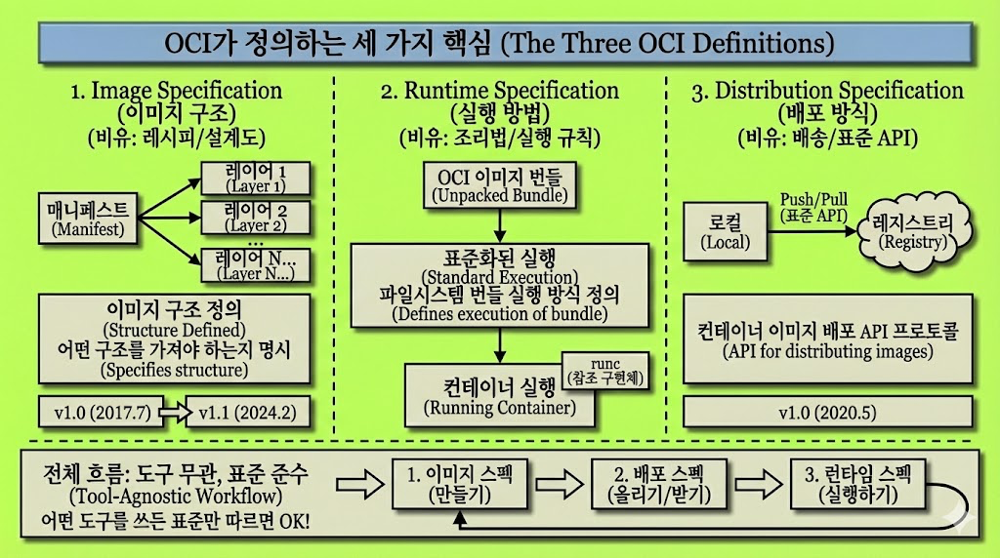

# Let’s Bootc! [2] - What is OCI?

> **Summary**
> OCI는 컨테이너 생태계의 표준을 정의하여 Docker와 Podman 등 다양한 도구에서 호환성을 제공합니다. bootc는 OCI 표준을 활용하여 기존의 컨테이너 도구와 레지스트리를 그대로 사용할 수 있으며, 커널과 initramfs를 포함한 부팅 가능한 컨테이너 이미지를 제공합니다. 이를 통해 전체 OS 이미지를 다시 받을 필요 없이 업데이트가 가능해집니다.

---

## [2] OCI 표준과 bootc: 컨테이너가 OS가 되기까지

### 컨테이너가 부팅이 된다고?

퀵스타트를 따라 bootc 이미지를 빌드하고 부팅해본 분이라면 한 번쯤 이런 생각이 들었을 것입니다. 

"이거 그냥 Docker 이미지 아닌가? 근데 왜 부팅이 되지?”

Bootc에서는 Containerfile을 작성하고, `podman build`로 빌드하고, 레지스트리에 푸시하는 과정이 일반 컨테이너 이미지를 만드는 것과 다를 바 없었기 때문입니다. 그런데 이 이미지가 실제 하드웨어에서 부팅됩니다. 무엇이 다른거길래?

이 질문에 답하려면, 우리는 먼저 OCI가 무엇인지부터 이해해야 합니다.

---

### OCI가 필요했던 이유

OCI는 Open Container Initiative의 약자입니다. 

2013년 Docker의 등장 이후 컨테이너 기술이 급속히 확산되었으나, 확산 속도 대비 표준이 부재하였고, Docker가 런타임과 이미지 포맷에 사실상 독점하고 있었습니다.

이로 인해 컨테이너 생태계 전체가 단일 기업의 구현에 종속되는 구조가 형성되었고, 업계에서는 이를 생태계 파편화와 벤더 종속의 위험 요소로 인식하였습니다.

그래서 2015년 6월, Docker와 CoreOS를 비롯한 컨테이너 업계 리더들이 컨테이너 포맷과 런타임에 대한 개방형 산업 표준을 만드는것을 목적으로, Linux Foundation 산하에 OCI 프로젝트를 설립하게 되었습니다.

그렇다면, 이 컨테이너에 대한 표준은 왜 필요했을까요?

가상화 기술의 역사를 돌아보면 답이 보입니다. VMware라던가 VirtualBox, KVM, Hyper-V 등 만드는 회사별로, 돌아가는 OS 시스템별로 많은 하이퍼바이저들이 있지 않습니까?

이들이 가상 머신을 만든다는 공통점은 있지만, VMware에서 만든 가상화 이미지가 Hyper-V에서 돌아가지 않듯이 서로 호환되지 않는다는 문제가 있었습니다. 각자의 포맷과 방식이 있었는데, 이는 결국 이전 VM 하이퍼바이저에는 표준이 없었다는 것이죠.

그렇다면 만약, 만약 컨테이너 생태계가 이런 식으로 파편화되었다면 어땠을까요? Docker에서 만든 이미지는 Docker에서만, Podman에서 만든 이미지는 Podman에서만 돌아가는 세상이었을 것입니다.

OCI는 이런 파편화를 막기 위해 탄생했습니다. 웹 기술에서 HTML, CSS, JavaScript가 브라우저에 관계없이 동작하는 것처럼, 컨테이너도 도구에 관계없이 동일하게 동작해야 한다는 사명을 가지고 세상에 나타나게 되었죠…!

---

### OCI가 정의하는 세 가지

OCI는 현재 세 가지 스펙을 정의하고 있습니다.

첫째, **Image Specification**입니다. 컨테이너 이미지의 포맷을 정의합니다. 이미지가 어떤 구조를 가져야 하는지, 매니페스트와 레이어는 어떻게 구성되어야 하는지를 명시합니다.

둘째, **Runtime Specification**입니다. "파일시스템 번들"을 어떻게 실행할 것인지를 정의합니다. OCI 이미지를 다운로드하면 이를 언팩해서 런타임 번들로 만들고, 이 번들을 실행하는 방식을 표준화한 것입니다. runc가 이 스펙의 참조 구현체입니다.

셋째, **Distribution Specification**입니다. 컨테이너 이미지를 어떻게 배포할 것인지에 대한 API 프로토콜을 정의합니다. 레지스트리에 이미지를 푸시하고 풀하는 표준 API입니다.

이 세 가지가 맞물려 돌아갑니다. 이미지 스펙으로 이미지를 만들고, 배포 스펙으로 레지스트리에 올리고, 런타임 스펙으로 실행합니다. 그리고 이 모든 과정에서 어떤 도구를 쓰든 상관없습니다. 표준을 따르기만 하면 됩니다.

---

### 표준이 가져다준 것

이 표준 덕분에 우리는 Docker Hub에서 받은 이미지를 Podman으로 실행할 수 있습니다. containerd에서 빌드한 이미지를 CRI-O에서 돌릴 수 있습니다. 쿠버네티스가 다양한 컨테이너 런타임을 지원할 수 있는 것도 이 표준 덕분입니다.

레지스트리도 마찬가지입니다. Docker Hub, GitHub Container Registry, Quay.io, Harbor. 이들은 모두 OCI Distribution Specification을 따릅니다. 그래서 같은 명령어로 이미지를 푸시하고 풀할 수 있습니다. `podman push`든 `docker push`든 대상 레지스트리가 달라도 동작합니다.

해당 내용에 대해서는, 흐름이 잘 정리가 된 블로그 글이 있어, 아래 블로그 글을 참고해주시면 이해에 더 큰 도움이 되지 않을까 싶습니다.

🔗 [https://m.blog.naver.com/PostView.naver?blogId=pjt3591oo&logNo=222992244712&proxyReferer=&noTrackingCode=true](https://m.blog.naver.com/PostView.naver?blogId=pjt3591oo&logNo=222992244712&proxyReferer=&noTrackingCode=true)

---

### bootc가 OCI를 따른다는 것의 의미

bootc 공식 문서에는 이런 문장이 있습니다.

> "transactional, in-place operating system updates using OCI/Docker container images". 

OCI 컨테이너 이미지를 사용해서 운영체제를 업데이트한다는 뜻입니다.

이게 무슨 의미일까요.

- 첫째, 기존 컨테이너 도구를 그대로 쓸 수 있습니다. Podman이든 Docker든, OCI 이미지를 만들 수 있는 도구라면 무엇이든 bootc 이미지를 빌드할 수 있습니다. 새로운 도구를 배울 필요가 없습니다.
- 둘째, 기존 레지스트리 인프라를 그대로 쓸 수 있습니다. Docker Hub에 이미지를 올려도 되고, GHCR을 써도 되고, 회사 내부의 Harbor를 써도 됩니다. OCI Distribution Specification을 따르는 레지스트리라면 어디든 상관없습니다.
- 셋째, 이미지 레이어 구조를 그대로 활용합니다. OCI 이미지는 레이어로 구성됩니다. 베이스 이미지 위에 변경 사항을 레이어로 쌓아 올리는 구조입니다. bootc도 이 구조를 그대로 사용합니다. 업데이트할 때 변경된 레이어만 받으면 됩니다. 전체 OS 이미지를 매번 다시 받을 필요가 없습니다.

Red Hat 문서에서도 이 점을 설명하고 있습니다. "rhel-10-bootc 컨테이너 이미지는 OCI 이미지 형식을 재사용합니다." 즉, 새로운 형식을 만든 게 아니라, rhel역시 기존 형식을 그대로 가져다 쓴 것이라는 것이죠.

---

### 정리하면

OCI 표준 덕분에 bootc는 기존 컨테이너 생태계의 모든 것을 그대로 활용할 수 있습니다. 빌드 도구, 레지스트리, 레이어 구조, 이미지 배포 방식. 새로운 인프라를 구축할 필요가 없습니다.

bootc 이미지가 일반 컨테이너와 다른 점은 딱 하나입니다. 커널과 initramfs가 포함되어 있다는 것. 그리고 이것을 실제 디스크에 설치하는 도구(`bootc install`)가 함께 제공된다는 것.

"컨테이너 이미지가 곧 OS"라는 말의 의미가 이제 조금 명확해졌을 것입니다. OCI라는 표준 위에, 커널이라는 한 가지 요소를 더해서, 부팅 가능한 컨테이너라는 개념을 구현한 것이지요.

허나 컨테이너와 bootc간에 무엇이 다른지, 커널이 포함된다는게 무슨 의미를 다루는지에 대해서는 아직 다루지 않아 의문점이 많으실거라 생각이 듭니다. 이것은 다음 글에서 이 내용에 대해 정리하도록 하겠습니다.

오늘 가이드를 추상화해서 간단하게 축약한다면, “Docker쓰듯이 Bootc 를 쓸 수 있음!” 이라고 정리도 가능할수도 있지 않을까요…?

긴 글 읽어주셔서 감사합니다.

# Reference 

[https://blog.naver.com/pjt3591oo/222992244712](https://blog.naver.com/pjt3591oo/222992244712)

