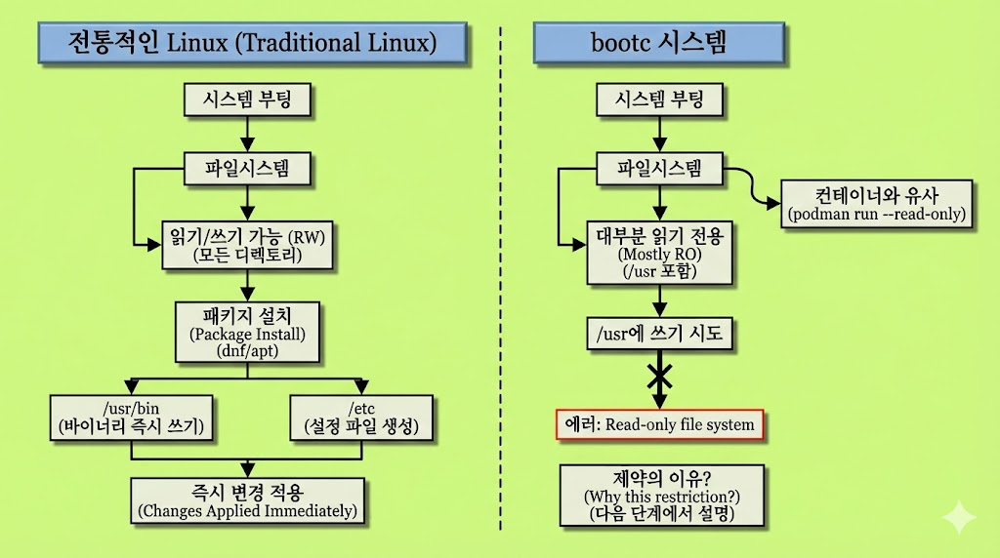
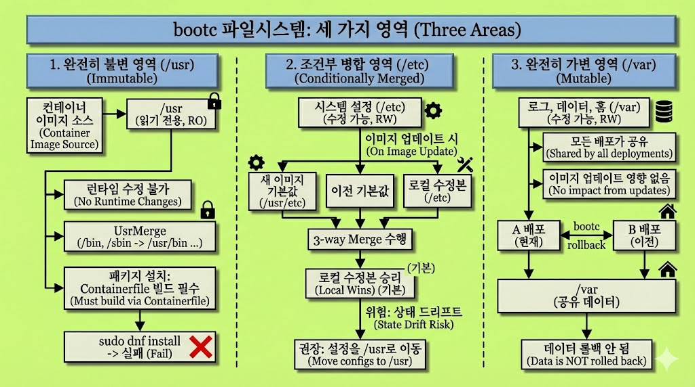

# Let’s Bootc! [4] - File System

> **Summary**
> bootc 시스템의 파일시스템은 세 가지 영역으로 나뉘며, 각각의 특성이 다릅니다. /usr는 완전히 불변이며, 패키지 설치는 이미지 빌드 시에만 가능하고, /etc는 수정 가능하지만 3-way merge가 적용되어 로컬 수정과 이미지 변경이 충돌할 수 있습니다. /var는 완전히 가변이며, 애플리케이션 데이터와 상태가 저장됩니다. 이러한 구조는 불변 인프라 원칙을 구현한 것으로, 시스템을 수정하기보다는 교체하는 접근 방식을 강조합니다.

---


# 어디에 쓸 수 있고, 어디에 못 쓰는가? - bootc의 파일시스템 구조

## **들어가며**

Containerfile을 작성하다 보면 이상한 일을 겪습니다. 분명 `RUN echo "something" >> /etc/someconfig`를 넣었는데, 시스템을 업데이트하고 나면 그 설정이 사라져 있습니다. 혹은 `/var/lib/myapp`에 넣어둔 데이터가 이미지를 새로 빌드해도 그대로 남아 있습니다. 왜 어떤 것은 유지되고 어떤 것은 덮어씌워지는 걸까요?

이 의문에 답하려면 bootc 시스템의 파일시스템 구조를 이해해야 합니다. 그리고 이 구조를 이해하면 이후 포스트에서 다룰 anaconda 설정, toml 파일, 인증 정보 관리, 데이터 백업 전략이 왜 그런 방식으로 설계되었는지가 자연스럽게 연결됩니다.

---

## 전통적인 Linux와 무엇이 다른가

리눅스 파일 시스템은 ‘모든 것은 파일이며, 모든 것은 하나의 계층적 루트(/) 아래 표준 구조로 배치된다’ 라는 철학을 따릅니다.

[https://linuxopsys.com/linux-file-system-hierarchy-co11](https://linuxopsys.com/linux-file-system-hierarchy-co11)

전통적인 Linux 시스템에서 파일시스템은 단순합니다. **‘everything is a file’** 이라는 철학에 걸맞게, 모든 디렉토리가 읽기/쓰기 가능하고, `dnf install`이나 `apt install`로 패키지를 설치하면 그 자리에서 바로 `/usr/bin`에 바이너리가 들어가고 `/etc`에 설정 파일이 생성됩니다. 재부팅 없이도 변경사항이 즉시 적용됩니다.


허나, bootc 시스템은 다릅니다. 부팅된 시스템에서 `/usr`에 무언가를 쓰려고 하면 "Read-only file system" 에러가 발생합니다. 마치 `podman run --read-only`로 컨테이너를 실행한 것과 비슷한 상태입니다.

왜 이런 제약을 두었을까요? 이 질문에 답하기 전에, 먼저 bootc가 파일시스템을 어떻게 나누는지 살펴보겠습니다.



---

## 세 영역으로 나뉜 파일시스템

bootc 시스템의 파일시스템은 크게 세 가지 영역으로 구분됩니다. 완전히 불변인 영역, 조건부로 병합되는 영역, 그리고 완전히 가변인 영역입니다.



### /usr - 완전히 불변인 영역

`/usr` 디렉토리는 컨테이너 이미지에서 그대로 가져옵니다. 이 디렉토리는 읽기 전용으로 마운트되며, 런타임에 어떤 수정도 허용하지 않습니다.

여기에는 운영체제의 핵심 바이너리, 라이브러리, 커널 모듈이 들어 있습니다. `/bin`, `/sbin`, `/lib`, `/lib64` 같은 디렉토리들은 사실 `/usr` 아래의 해당 디렉토리로 심볼릭 링크되어 있습니다. 이것이 "UsrMerge"라고 불리는 구조입니다.

bootc가 composefs를 활성화한 상태에서는 `/usr`뿐 아니라 루트 `/` 자체가 동일한 불변 이미지의 일부가 됩니다. 둘 사이에 근본적인 차이가 없습니다.

이 불변성이 의미하는 바는 명확합니다. 부팅된 시스템에서 `sudo dnf install something`을 실행해도 실패합니다. 패키지 설치는 Containerfile에서만 가능합니다. 시스템에 새 소프트웨어를 추가하고 싶다면 이미지를 다시 빌드하고, 레지스트리에 푸시하고, `bootc upgrade`를 실행해야 합니다.

### /etc - 3-way merge가 적용되는 영역

`/etc` 디렉토리는 조금 복잡합니다. 기본적으로 영구적이고 수정 가능한 상태입니다. 시스템 관리자가 `/etc/ssh/sshd_config`를 수정하면 그 변경사항은 재부팅 후에도 유지됩니다.

그런데 이미지를 업데이트하면 어떻게 될까요? 새 이미지에도 `/etc/ssh/sshd_config`가 포함되어 있고, 로컬에서도 이 파일을 수정했다면 충돌이 발생합니다. 이때 OSTree는 3-way merge를 수행합니다.

3-way merge의 동작 방식은 다음과 같습니다. 먼저 새 이미지의 기본 설정인 `/usr/etc`의 내용을 가져옵니다. 그다음 이전 배포의 기본 설정을 확인합니다. 마지막으로 로컬에서 수정된 파일과 비교합니다. 로컬에서 수정된 파일이 있다면, 기본적으로 로컬 수정본이 "승리"합니다.

이 동작이 의미하는 바가 있습니다. Containerfile에서 `/etc/someconfig`를 수정했더라도, 이미 배포된 시스템에서 해당 파일이 로컬로 수정되어 있다면 새 이미지의 변경사항이 적용되지 않을 수 있습니다. 이것이 "상태 드리프트(state drift)"의 원인이 됩니다.

그래서 bootc 공식 문서는 가능하다면 설정을 `/usr` 아래에 두라고 권장합니다. `/usr/lib/systemd/system`에 유닛 파일을 두거나, `/usr/share/defaults`에 기본 설정을 두는 방식입니다. 이렇게 하면 상태가 일관되게 불변으로 유지됩니다.

### /var - 완전히 가변인 영역

`/var` 디렉토리는 완전히 다른 성격을 가집니다. 이 영역은 영구적이고 수정 가능하며, 이미지 업데이트의 영향을 받지 않습니다.

여기에 저장되는 것들은 다음과 같습니다. 시스템 로그가 `/var/log`에 쌓입니다. 애플리케이션 데이터가 `/var/lib`에 저장됩니다. 컨테이너 이미지가 `/var/lib/containers`에 위치합니다. 사용자 홈 디렉토리가 `/var/home`에 있습니다.

중요한 점이 있습니다. `/var`는 물리적으로 단 하나만 존재합니다. 별도의 파티션으로 분리하지 않았다면, `/ostree/deploy/$stateroot/var`에 바인드 마운트되어 모든 배포(deployment)가 공유합니다. A/B 배포 구조에서 A 배포든 B 배포든 같은 `/var`를 봅니다.

이 설계가 의미하는 바는 명확합니다. `bootc rollback`을 실행해서 이전 OS 버전으로 돌아가더라도, `/var`의 데이터는 롤백되지 않습니다. PostgreSQL 데이터베이스가 `/var/lib/pgsql`에 있다면, OS를 롤백해도 데이터베이스 내용은 그대로입니다.

---

## 컨테이너 이미지의 /var는 어떻게 동작하는가

여기서 한 가지 혼란스러운 지점이 있습니다. Containerfile에서 `/var/lib/myapp/data`에 파일을 넣을 수 있습니다. 빌드 시점에는 분명히 가능합니다. 그런데 이 파일이 배포된 시스템에서는 어떻게 되는 걸까요?

bootc 문서는 이렇게 설명합니다. `/var`에 포함된 컨테이너 이미지의 내용은 Docker의 `VOLUME`처럼 동작합니다. 초기 설치 시점에 컨테이너 이미지의 `/var` 내용이 복사되고, 그 이후로는 업데이트되지 않습니다.

이것은 의도된 동작입니다. 만약 이미지 업데이트마다 `/var`의 내용이 덮어씌워진다면, 사용자 데이터와 애플리케이션 상태가 모두 날아갈 것입니다. 그래서 `/var`는 "한 번 초기화되고 이후로는 손대지 않는" 영역으로 설계되었습니다.

실무적으로 이것이 의미하는 바는 다음과 같습니다. `/var` 아래에 디렉토리 구조를 미리 만들어두고 싶다면, `systemd-tmpfiles.d`를 사용하거나 systemd 유닛의 `StateDirectory=` 옵션을 활용해야 합니다. Containerfile에서 직접 데이터를 넣는 방식은 초기 설치 시에만 적용됩니다.


---

## /opt는 어디에 속하는가

`/opt` 디렉토리는 전통적으로 서드파티 소프트웨어가 설치되는 위치입니다. bootc에서 이 디렉토리는 어떻게 취급될까요?

composefs가 활성화된 bootc 시스템에서 `/opt`는 `/usr`와 마찬가지로 읽기 전용입니다. 런타임에 수정할 수 없습니다. 이것이 문제가 되는 경우가 있습니다. 일부 상용 소프트웨어는 `/opt/vendorname` 아래에 설치되면서 동시에 그 디렉토리에 로그나 상태 파일을 쓰려고 합니다.

이런 경우의 해결책은 심볼릭 링크입니다. `/opt/myapp/logs`가 쓰기 가능해야 한다면, Containerfile에서 다음과 같이 처리합니다.

```docker
RUN rmdir /opt/myapp/logs && ln -sr /var/log/myapp /opt/myapp/logs

```

또는 systemd 유닛에서 `BindPaths=` 옵션을 사용해 런타임에 `/var` 아래의 디렉토리를 `/opt` 아래로 바인드 마운트할 수 있습니다.

---

## Containerfile 작성 시 주의점

이 파일시스템 구조를 이해했다면, Containerfile을 작성할 때 몇 가지 원칙이 도출됩니다.

첫째, 패키지 설치와 바이너리 추가는 자유롭게 합니다. `RUN dnf install`은 `/usr`에 파일을 설치하고, 이것은 이미지의 일부가 됩니다. 배포 후에는 불변이 되지만, 빌드 시점에는 문제없습니다.

둘째, 설정 파일은 위치를 신중하게 선택합니다. 가능하다면 `/usr/lib` 아래의 drop-in 디렉토리를 활용합니다. 예를 들어 systemd 유닛 설정은 `/usr/lib/systemd/system`에, sysctl 설정은 `/usr/lib/sysctl.d`에 둡니다. 불가피하게 `/etc`에 두어야 한다면, 3-way merge 동작을 인지하고 있어야 합니다.

셋째, `/var`에 데이터를 넣는 것은 초기 설치용으로만 사용합니다. 이후 업데이트에서 이 데이터가 갱신되지 않는다는 점을 기억해야 합니다. 디렉토리 구조만 필요하다면 `tmpfiles.d`를 사용합니다.

넷째, `/usr/etc`에는 절대 직접 파일을 넣지 않습니다. 이 디렉토리는 OSTree가 3-way merge를 위해 내부적으로 사용하는 위치입니다. 여기에 파일을 넣으면 정의되지 않은 동작이 발생할 수 있습니다.

---

## 왜 이런 구조를 선택했는가

이쯤에서 근본적인 질문으로 돌아가 봅니다. 왜 bootc는 이렇게 복잡한 파일시스템 구조를 채택했을까요? 전통적인 방식대로 모든 것을 읽기/쓰기 가능하게 두면 안 되는 걸까요?

이 질문에 대한 답은 "불변 인프라(Immutable Infrastructure)"라는 원칙에서 찾을 수 있습니다.

불변 인프라의 핵심 아이디어는 단순합니다. 시스템을 "수정"하지 말고 "교체"하라는 것입니다. 버그를 고치기 위해 운영 중인 서버에 SSH로 접속해서 파일을 수정하는 대신, 버그가 고쳐진 새 이미지를 빌드하고 그 이미지로 시스템을 교체합니다.

이 원칙이 가져오는 이점은 여러 가지입니다.

재현 가능성이 보장됩니다. 동일한 이미지를 배포하면 동일한 시스템 상태가 됩니다. "이 서버에서만 안 되는" 문제가 발생할 여지가 줄어듭니다.

롤백이 안전합니다. 새 버전에 문제가 있으면 이전 버전으로 즉시 되돌릴 수 있습니다. `/usr`가 불변이기 때문에 "부분적으로 업데이트된" 상태가 존재하지 않습니다.

업데이트가 원자적입니다. 업데이트 도중에 전원이 나가도 시스템이 망가지지 않습니다. 새 배포가 완전히 준비된 후에 부트로더만 전환하면 됩니다.

상태 드리프트가 제한됩니다. 운영자가 시스템에 "임시로" 적용한 변경사항이 어느새 영구적이 되어 추적 불가능해지는 상황을 방지합니다. `/usr`는 손댈 수 없으므로, 시스템의 핵심 상태는 항상 이미지와 일치합니다.

물론 완전한 불변성은 현실적이지 않습니다. 로그는 쌓여야 하고, 데이터베이스는 데이터를 저장해야 하며, 사용자는 자신의 홈 디렉토리를 사용해야 합니다. 그래서 `/var`라는 가변 영역이 존재합니다. `/etc`가 3-way merge를 수행하는 이유도 비슷합니다. 현실의 요구사항과 불변성 원칙 사이의 절충점입니다.

---

## 이후 포스트와의 연결

이 파일시스템 구조를 이해했다면, 이후 포스트에서 다룰 내용들이 왜 그런 방식으로 설계되었는지 이해할 수 있습니다.

[4]번과 [5]번에서 anaconda와 toml 설정을 다룰 때, 초기 설치 시점에 `/etc`와 `/var`에 어떤 내용이 들어가는지를 이해할 수 있습니다. toml 파일에서 사용자 계정을 설정하면 그것이 `/etc/passwd`로 들어갑니다. 이것이 3-way merge의 대상이 된다는 점도 알게 됩니다.

[8]번에서 인증 설정을 다룰 때, `containers-auth.json`을 `/etc`에 둘지 `/var`에 둘지 결정할 수 있습니다. 업데이트 시에도 유지되어야 하지만 이미지의 일부로 관리되어야 한다면 어디에 두어야 할지 판단할 수 있습니다.

[9]번에서 데이터 관리를 다룰 때, 왜 `/var`를 별도로 백업해야 하는지가 명확해집니다. 시스템은 이미지로 복구할 수 있지만, `/var`의 데이터는 이미지에 포함되어 있지 않습니다. "시스템은 이미지로, 데이터는 별도로"라는 원칙이 여기서 나옵니다.

---

## 정리

bootc 시스템의 파일시스템은 세 영역으로 나뉩니다.

`/usr`와 대부분의 최상위 디렉토리는 컨테이너 이미지에서 가져오며 런타임에 불변입니다. 이것이 재현 가능성과 원자적 업데이트의 기반입니다.

`/etc`는 영구적이고 수정 가능하지만, 업데이트 시 3-way merge가 적용됩니다. 로컬 수정과 이미지 변경이 충돌할 수 있으므로 주의가 필요합니다.

`/var`는 완전히 가변이며 이미지 업데이트의 영향을 받지 않습니다. 애플리케이션 데이터와 상태가 저장되는 곳입니다.

이 구조는 불변 인프라 원칙의 구현입니다. "수정하지 말고 교체하라"는 원칙과 현실의 요구사항 사이에서 찾은 절충점입니다. Containerfile을 작성할 때 이 구조를 염두에 두면, "왜 이건 안 되지?"라는 질문에 답할 수 있게 됩니다.

