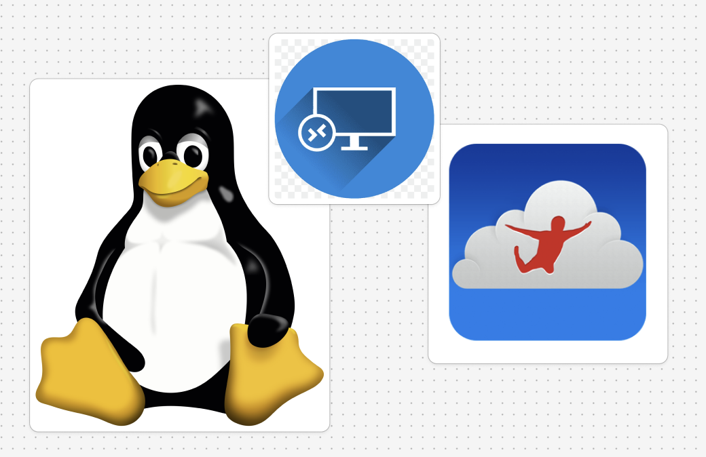

# Linux + RDP + JumpDesktop 를 이용한 리눅스 원격 환경 구성

> **Summary**
> RDP를 통해 리눅스 XFCE 데스크탑 환경에 원격으로 접속하는 방법을 설명합니다. Xorg, XRDP, XFCE 설치 및 설정, GNOME 원격 설정 비활성화, 방화벽 설정, Jump Desktop 및 Windows 원격 데스크탑 클라이언트 설정을 포함하여 문제 해결 방법도 안내합니다.

---



# RDP를 이용한 XFCE 환경의 원격 데스크탑 구축기

이 튜토리얼에서는 **Xorg**, **XRDP**, **XFCE**를 사용하여 RDP를 통해 리눅스 데스크탑 환경에 원격으로 접속하는 방법을 설명합니다. 또한, **Jump Desktop**과 같은 클라이언트를 활용하여 연결하는 과정까지 다룹니다.

## 준비 사항

- 리눅스 호스트 (예: Ubuntu, Pop!_OS)
- 원격 접속 클라이언트 (예: Windows의 원격 데스크톱 연결, macOS의 Jump Desktop)
- 관리자 권한이 있는 사용자 계정
---

## 1. Xorg 및 XFCE 설치

XFCE는 가벼운 데스크탑 환경으로 원격 접속 시 성능이 우수합니다. Xorg는 그래픽 서버로 필수 구성 요소입니다.

### 1.1 패키지 업데이트 및 설치

터미널을 열고 다음 명령어를 실행합니다:

```shell
sudo apt update
sudo apt install xfce4 xfce4-goodies xorg
```

설치 도중 몇 가지 옵션이 표시될 수 있으니 기본값을 선택하세요.

---

## 2. XRDP 설치 및 설정

XRDP는 리눅스에서 RDP를 지원하는 서버 소프트웨어입니다.

### 2.1 XRDP 설치

```shell
sudo apt install xrdp -y
```

### 2.2 XRDP 서비스 활성화

XRDP를 시스템 시작 시 자동으로 실행되도록 설정합니다:

```shell
sudo systemctl enable xrdp
sudo systemctl start xrdp
```

### 2.3 XRDP 서비스 상태 확인

정상적으로 실행 중인지 확인합니다:

```shell
sudo systemctl status xrdp
```

출력 결과에 `active (running)`이 표시되면 XRDP가 정상적으로 실행되고 있는 것입니다.

---

## 3. XRDP와 XFCE 연동 설정

XRDP가 XFCE 데스크탑 환경을 실행하도록 설정해야 합니다.

### 3.1 시작 스크립트 수정

`/etc/xrdp/startwm.sh` 파일을 수정합니다:

```shell
sudo nano /etc/xrdp/startwm.sh
```

파일의 맨 아래에 다음 줄을 추가합니다:

```shell
startxfce4`
```

이후 `Ctrl + O`, `Ctrl + X`를 눌러 저장하고 종료합니다.

### 3.2 사용자 환경 설정

사용자 홈 디렉토리에 `.xsession` 파일을 생성하고 XFCE를 지정합니다:

```shell
echo "xfce4-session" > ~/.xsession

```

이제 XRDP를 통해 접속 시 XFCE 데스크탑 환경이 실행됩니다.

---

## 4. GNOME 원격 설정 비활성화 (중요)

Pop!_OS 또는 Ubuntu GNOME 환경에서 원격 설정이 활성화되어 있으면 XRDP와 충돌이 발생할 수 있습니다. 이를 비활성화하려면 다음을 수행합니다:

### 4.1 GNOME 원격 설정 비활성화

```shell
sudo systemctl stop gnome-remote-desktop
sudo systemctl disable gnome-remote-desktop

```

### 4.2 서비스 비활성화 확인

```shell
sudo systemctl status gnome-remote-desktop

```

출력 결과에 `inactive (dead)`가 표시되면 GNOME 원격 설정이 비활성화된 것입니다.

---

## 5. 방화벽 설정 (선택 사항)

리눅스 방화벽(UFW)을 사용하는 경우 XRDP 포트(기본 3389)를 허용해야 합니다:

```shell
sudo ufw allow 3389/tcp
sudo ufw reload

```

---

## 6. 원격 데스크탑 클라이언트 설정

이제 RDP 클라이언트를 사용하여 XFCE 데스크탑 환경에 원격 접속합니다.

### 6.1 Jump Desktop 설정 (macOS/Windows)

1. **Jump Desktop**을 설치합니다 ([https://jumpdesktop.com](https://jumpdesktop.com/)).
1. 새로운 RDP 연결을 추가하고 다음 정보를 입력합니다:
  - **IP 주소**: 리눅스 호스트의 IP 주소
  - **포트**: 3389
  - **사용자 이름**: 리눅스 계정 사용자 이름
  - **비밀번호**: 리눅스 계정 비밀번호
1. 연결을 저장하고 접속합니다.
### 6.2 Windows 원격 데스크탑 설정

1. Windows에서 **원격 데스크톱 연결** 프로그램을 엽니다.
1. **컴퓨터** 필드에 리눅스 호스트의 IP 주소를 입력합니다.
1. 사용자 계정 정보를 입력한 후 연결합니다.
---

## 7. 접속 및 테스트

위의 설정이 완료되면 Jump Desktop이나 RDP 클라이언트를 통해 XFCE 환경에 접속할 수 있습니다.

- 접속 시 **XFCE 데스크탑**이 정상적으로 표시되면 성공입니다.
- 만약 화면이 검거나 터미널이 실행되지 않는다면 XRDP 로그를 확인하세요:
```shell
sudo journalctl -u xrdp
sudo journalctl -u xrdp-sesman

```

---

## 8. 문제 해결

### 8.1 빈 화면 또는 세션 충돌

- 로컬 세션이 열려 있으면 원격 접속이 실패할 수 있습니다. **로컬 세션을 로그아웃**한 후 접속하세요.
### 8.2 XRDP 세션 강제 종료

XRDP 세션이 중복되어 문제를 일으키는 경우 강제로 종료합니다:

```shell
pkill -u 사용자명

```

### 8.3 커서 문제 해결

원격 접속 시 커서가 비정상적으로 표시되는 경우:

```shell
xfconf-query -c xsettings -p /Gtk/CursorThemeName -s "Adwaita"
xfconf-query -c xsettings -p /Gtk/CursorThemeSize -s 24

```

---

## 마무리

이제 XRDP와 XFCE를 통해 리눅스 데스크탑 환경에 원격으로 접속할 수 있습니다. Jump Desktop과 같은 클라이언트를 사용하면 성능이 우수하고 연결이 간편합니다. 문제가 발생할 경우 로그를 확인하고 필요에 따라 설정을 조정해 보세요.

---

## 참고 자료

- [XRDP 공식 문서](https://github.com/neutrinolabs/xrdp)
- [XFCE 데스크탑 환경](https://xfce.org/)
- [Jump Desktop 공식 웹사이트](https://jumpdesktop.com/)
