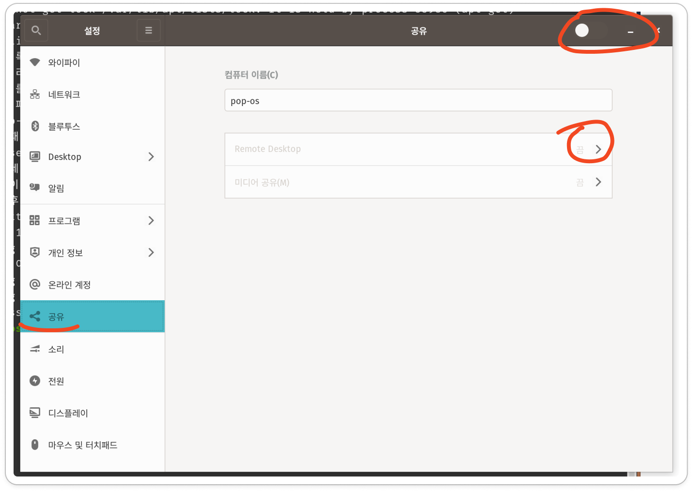
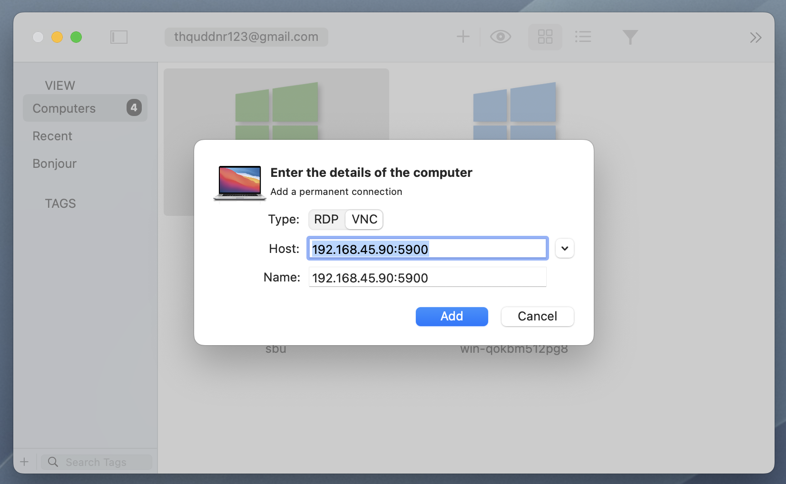

# Linux + VNC + JumpDesktop 를 이용한 리눅스 원격 환경 구성

> **Summary**
> Pop!_OS에서 VNC 서버를 설정하고 Jump Desktop 클라이언트를 통해 원격 접속하는 방법을 설명합니다. Vino를 설치하고 Xorg 세션을 활성화한 후, dconf를 사용해 VNC 설정을 변경합니다. 방화벽 설정, IP 주소 확인, Jump Desktop에서의 연결 방법 및 Vino 서버의 자동 시작 설정도 포함되어 있습니다.

---


# Pop!_OS에서 VNC 서버 설정 및 Jump Desktop으로 연결하기

이 튜토리얼은 **Pop!_OS**에서 기본 VNC 서버를 설정하고 **Jump Desktop** 클라이언트를 사용하여 원격으로 접속하는 방법을 설명합니다. GNOME 환경에 맞춰 작성되었으며, `Vino`를 VNC 서버로 사용합니다.

---

## 1. **Vino 설치 및 활성화**

Vino는 GNOME 환경에서 제공하는 기본 원격 데스크톱 서버입니다. 다음 단계를 통해 설치하고 활성화합니다:

### **1.1 Vino 설치**

터미널을 열고 다음 명령어를 입력하여 Vino를 설치합니다:

```shell
sudo apt update
sudo apt install vino

```

---

### **1.2 Xorg 세션 확인**

Vino는 Wayland 세션에서는 작동하지 않습니다. Xorg 세션으로 전환한 후 Vino를 설정해야 합니다:

1. **세션 확인**:
```shell
echo $XDG_SESSION_TYPE

```

  결과가 `x11`이 나와야 합니다. 만약 `wayland`로 표시된다면 Xorg로 전환이 필요합니다.

1. **Xorg 세션 활성화**:
  - 로그인 화면에서 사용자 이름을 클릭한 후 **톱니바퀴 아이콘**을 클릭합니다.
  - *"GNOME on Xorg"**를 선택한 후 로그인합니다.
1. **Wayland 비활성화** (선택 사항):
만약 GNOME on Xorg 옵션이 보이지 않는다면, 다음 설정을 통해 강제로 Wayland를 비활성화할 수 있습니다:
```shell
sudo nano /etc/gdm3/custom.conf

```

  - `#WaylandEnable=false` 항목에서 주석(#)을 제거하여 활성화합니다:
```plain text
WaylandEnable=false

```

  - 저장 후 GDM을 재시작합니다:
```shell
sudo systemctl restart gdm3

```

---

### **1.3 Vino 설정**

Vino는 GUI 설정이 기본적으로 지원되지 않으므로 `dconf`를 사용해 설정합니다:

1. **dconf-editor 설치**
```shell
sudo apt install dconf-editor
dconf-editor

```

1. **VNC 관련 설정 변경**
  - `org.gnome.desktop.remote-desktop` 경로를 찾습니다.
  - 다음 항목을 설정합니다:
    - **authentication-methods**: `['vnc']`
    - **enabled**: `true`
    - **require-encryption**: `false` (Jump Desktop 호환을 위해 필요)
1. **GNOME 화면 공유 설정 (대안)**:
GUI를 사용해 화면 공유를 설정할 수도 있습니다:
```shell
gnome-control-center sharing
```



  - **"Screen Sharing"** 또는 **"화면 공유"** 옵션을 활성화합니다.
  - **비밀번호 보호**를 설정합니다.
1. **VNC 비밀번호 설정** (CLI):
Vino의 VNC 접속 비밀번호를 설정하려면 다음 명령어를 사용합니다:
```shell
gsettings set org.gnome.Vino vnc-password "$(echo -n '비밀번호' | base64)"

```

  **비밀번호** 대신 원하는 VNC 비밀번호를 입력하세요.

---

### **1.4 Vino 서버 시작**

VNC 서버를 실행하려면 다음 명령어를 사용합니다:

```shell
/usr/lib/vino/vino-server &

```

서버가 시작되면 Pop!_OS가 원격 접속을 허용하게 됩니다.

---

## 2. **Pop!_OS 방화벽 설정** (선택 사항)

기본적으로 Pop!_OS 방화벽(`ufw`)이 비활성화되어 있지만, 방화벽이 활성화된 경우 다음과 같이 VNC 포트(5900)를 열어줍니다:

```shell
sudo ufw allow 5900/tcp
sudo ufw reload

```

---

## 3. **IP 주소 확인**

VNC 클라이언트가 올바르게 접속할 수 있도록 Pop!_OS의 IP 주소를 확인합니다:

```shell
ip addr show

```

- **예시**: `192.168.1.10`
기록된 IP 주소와 포트를 기억하세요 (기본 포트: 5900).

---

## 4. **Jump Desktop에서 연결**

1. **Jump Desktop 실행**: Mac 또는 Windows에서 Jump Desktop 클라이언트를 엽니다.
1. **새 연결 추가**:
  - 연결 유형: **VNC**
  - 주소: Pop!_OS의 **IP 주소** 입력 (예: `192.168.1.10`)
  - 비밀번호: 설정한 VNC 비밀번호 입력
1. **연결 시도**: 설정을 저장하고 연결 버튼을 클릭합니다.



---

## 5. **Vino 자동 시작 설정** (선택 사항)

Pop!_OS 재부팅 후에도 VNC 서버가 자동으로 시작되도록 설정하려면 다음 단계를 따릅니다:

1. **시스템 서비스 파일 생성**:
```shell
sudo nano /etc/systemd/system/vino-server.service

```

1. **파일 내용 추가**:
```plain text
[Unit]
Description=Vino VNC Server
After=network.target graphical.target

[Service]
ExecStart=/usr/lib/vino/vino-server
Restart=on-failure
User=사용자이름

[Install]
WantedBy=default.target

```

  - **사용자이름**을 실제 사용자 이름으로 변경하세요.
1. **서비스 활성화 및 시작**:
```shell
sudo systemctl daemon-reload
sudo systemctl enable vino-server
sudo systemctl start vino-server

```

---

## 완료!

이제 Pop!_OS에서 VNC 서버를 설정하고 Jump Desktop을 통해 원격으로 연결할 수 있습니다. 문제가 발생하면 방화벽, 네트워크 설정, 또는 VNC 서버 로그를 점검해 보세요.

