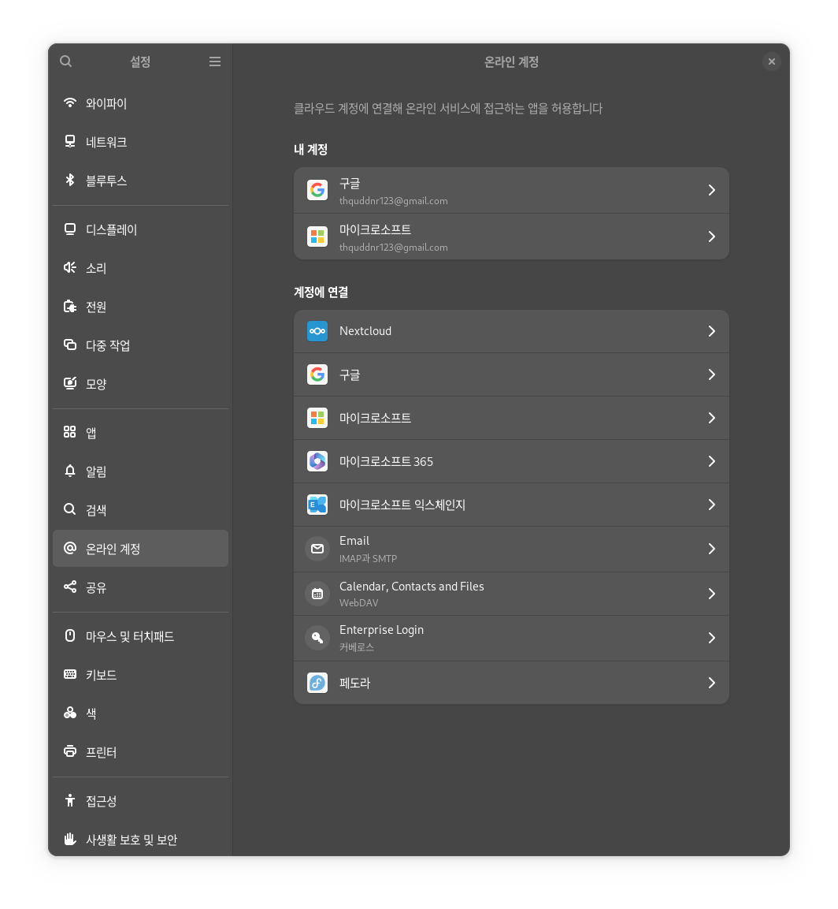
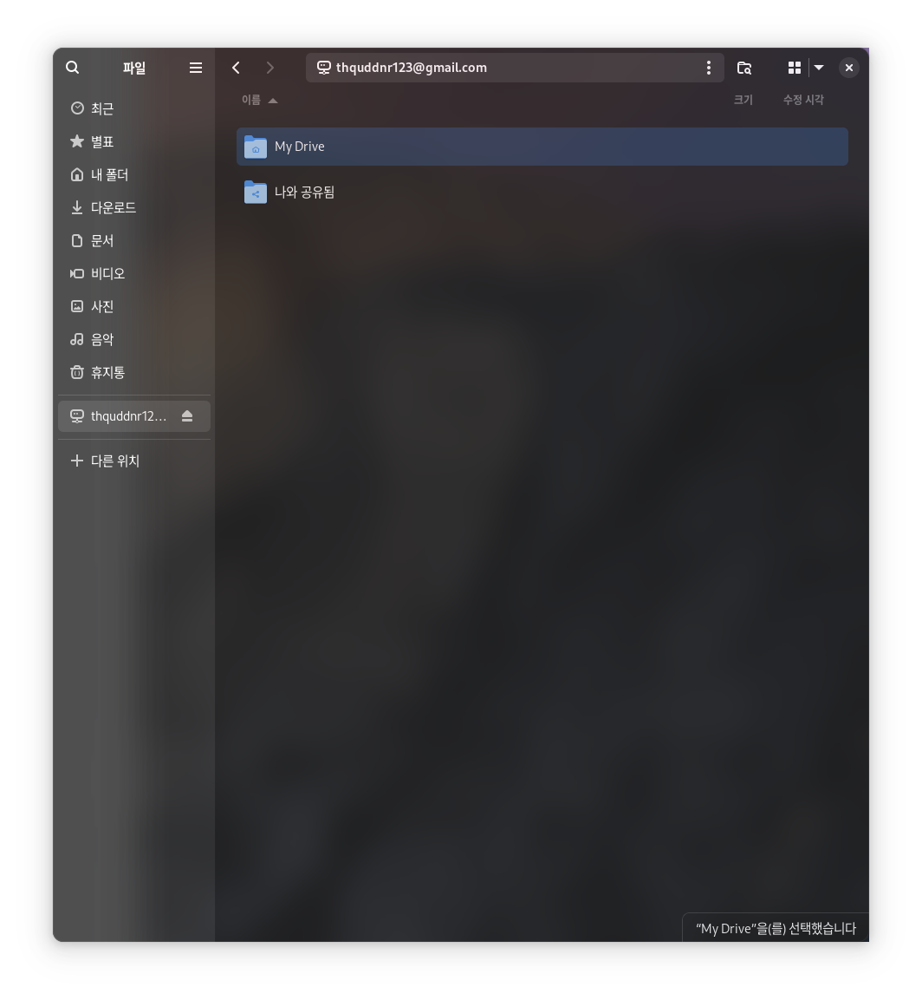

# Linux에 google Drive 로컬 마운트하기

> **Summary**
> 구글 드라이브를 리눅스에 로컬로 마운트하는 방법은 매우 간단하다. 설정에서 온라인 계정을 추가하면 쉽게 연결할 수 있다.

---

[https://fedoramagazine.org/connect-your-google-drive-to-fedora-workstation/](https://fedoramagazine.org/connect-your-google-drive-to-fedora-workstation/)

너무나도 간단했다…

그냥 

설정 - 온라인계정 - 구글 추가하면

