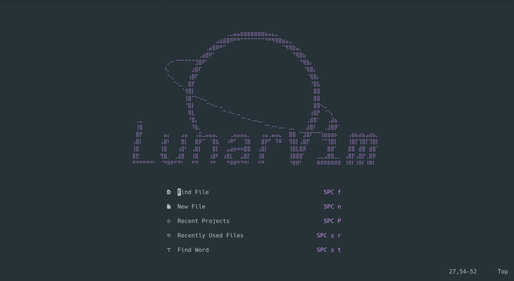

# LunarVim

> **Summary**
> LunarVim에 대한 설치 정보를 제공하며, Arch, Debian, MAC, Windows, Ubuntu와 같은 다양한 운영 체제에서 사용할 수 있는 개발 환경을 다룹니다.

---

🔗 [https://velog.io/@mythos/Linux-Lunar-Vim-설치](https://velog.io/@mythos/Linux-Lunar-Vim-설치)

