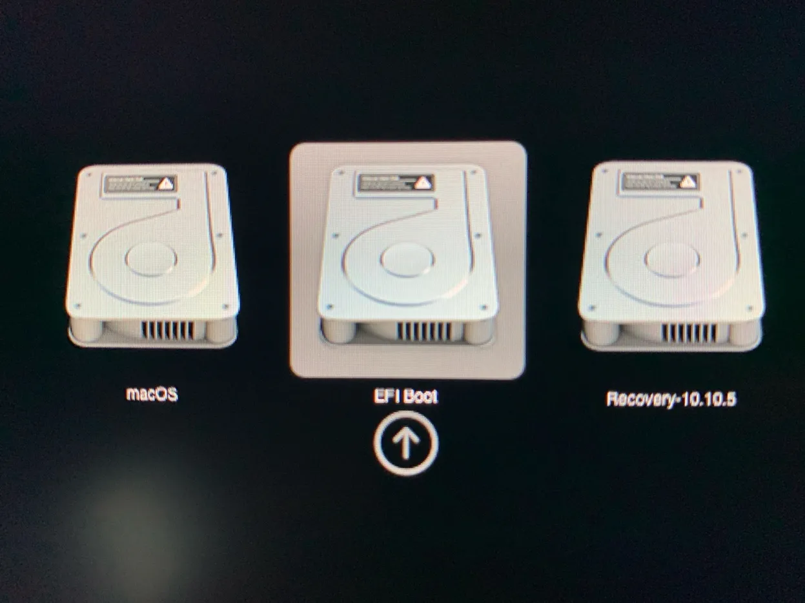

# MAC EFI boot 찌꺼기 삭제하기

> **Summary**
> macOS에서 EFI 부트 엔트리를 완전히 제거하려면 터미널을 열고 EFI 시스템 파티션을 마운트한 후, BOOT 폴더로 이동하여 "BOOTX64.EFI" 파일과 관련된 Linux 배포판 폴더를 삭제하고, 작업 후 마운트 해제한 다음 macOS를 재시작하여 "EFI Boot" 엔트리가 사라졌는지 확인합니다.

---



```latex
오늘도 어김없이 똥컴에 리눅스깔다가 삽질하는 나!

잘 알지도 모르는 grub 설치한다고 커널이 망가져버렸다!

그래서 그냥 디스크 다 날려버리고 새롭게 다시 깔아야지 했더니... 

EFI boot가 남아서 재설치할때마다 오류가생김..
```

```latex
참고로 난 파티션 나눌때 이름을 fedora로 해둔걸 기억
```

### EFI 부트 엔트리를 완전히 제거하려면 다음 단계를 따르세요

1. macOS에서 터미널을 실행합니다.
1. 다음 명령어를 입력하여 EFI 시스템 파티션을 마운트합니다:
```plain text
sudo diskutil mount disk0s1
```

1. EFI 시스템 파티션이 마운트되면 해당 경로로 이동합니다:
```plain text
cd /Volumes/EFI/EFI
```

1. BOOT 폴더로 이동합니다:
```plain text
cd BOOT
```

1. 해당 디렉토리에 있는 "BOOTX64.EFI" 파일을 확인하고, 다음 명령어로 삭제합니다:
```plain text
sudo rm BOOTX64.EFI
```

1. 상위 디렉토리로 이동합니다:
```plain text
cd ..
```

1. "fedora" 또는 "ubuntu"와 같은 Linux 배포판 관련 폴더가 있는지 확인하고, 있다면 해당 폴더도 삭제합니다. 예를 들어 "fedora" 폴더를 삭제하려면:
```plain text
sudo rm -rf fedora
```

1. 작업이 완료되면 EFI 시스템 파티션을 마운트 해제합니다:
```plain text
sudo diskutil unmount disk0s1
```

1. 이제 macOS를 재시작하고 Option 키를 누른 상태로 부팅 메뉴에 진입합니다. "EFI Boot" 엔트리가 더 이상 표시되지 않는지 확인하세요.
