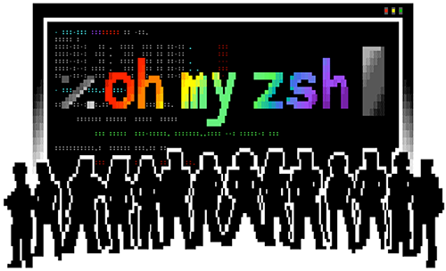

# MAC 터미널 꾸미기 2

> **Summary**
> 맥 터미널을 꾸미는 방법에 대한 내용으로, iTerm2와 Oh My Zsh를 활용한 꾸미기 방법을 소개합니다. 관련 링크도 포함되어 있습니다.

---

🔗 [https://velog.io/@easyhwan/Mac-맥북-터미널-꾸미기-iTerm2-Oh-My-Zsh](https://velog.io/@easyhwan/Mac-맥북-터미널-꾸미기-iTerm2-Oh-My-Zsh)

