# MAC 터미널 꾸미기

> **Summary**
> 맥 터미널을 꾸미기 위해 Oh My Zsh를 설치하고, 원하는 테마로 변경하며, 폰트를 설치하고 적용하는 방법을 설명합니다. 또한 VSC 터미널에서도 폰트를 변경하고, 명령어 하이라이트를 적용하는 방법을 다룹니다.

---


🔗 [https://velog.io/@saemsol/Oh-My-Zsh](https://velog.io/@saemsol/Oh-My-Zsh)


기존 fig로 oh my zsh를 설치하니 환경변수 문제가 많아 그냥 직접 커맨드를 입력하여 omz 를 설치했다…

# 아래 내용은 전부 위 블로그를 그대로 스크랩해온것…

# 1. [Oh My Zsh](https://gist.github.com/kevin-smets/8568070) 설치하기

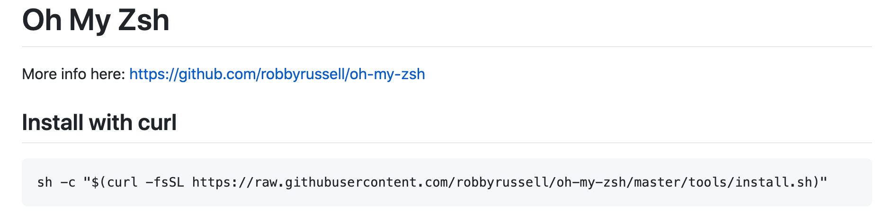

## 1-1. Install with curl

ZSH 먼저 설치하고

```shell
sudo apt install zsh
```

[여기](https://gist.github.com/kevin-smets/8568070)에서 설치코드를 복사해 터미널에 붙여넣는다.

```plain text
sh -c "$(curl -fsSL https://raw.githubusercontent.com/robbyrussell/oh-my-zsh/master/tools/install.sh)"
```

그럼 몇초 뒤 **설치 완료** ✨

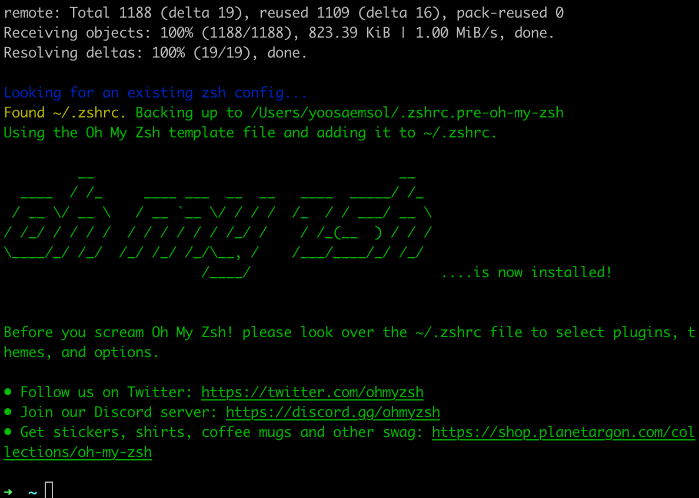

## 1-2. clear 입력

~ 옆에 `clear` 입력해주고 엔터!

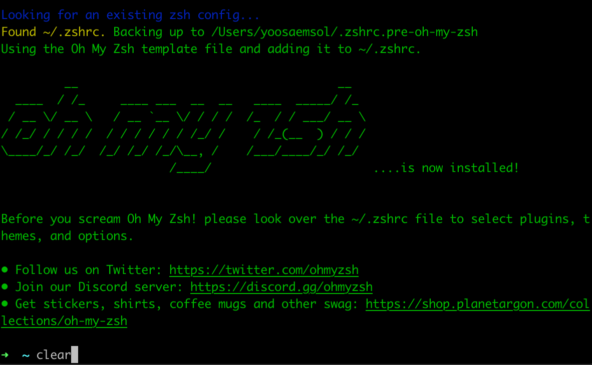

# 2. 테마 바꾸기

## 2-1. 테마변경하기

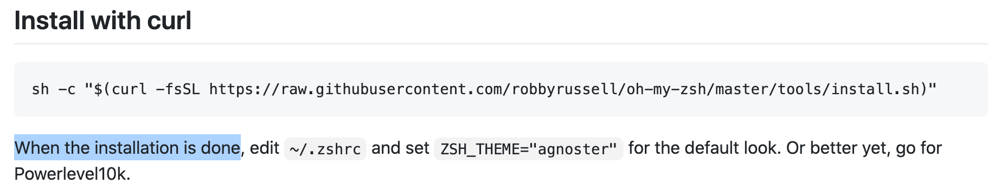

→ `1번` 에서는 `Oh My Zsh` 를 설치한것 뿐이기 때문에, 이제 원하는 테마로 설정해줘야한다.

- 저는 [Oh My Zsh 테마목록](https://github.com/ohmyzsh/ohmyzsh/wiki/Themes) 중 "agnoster" 를 설정하려고 합니다.
### ① ~ open ~/.zshrc

터미널에 `~ open ~/.zshrc` 를 입력해준다.

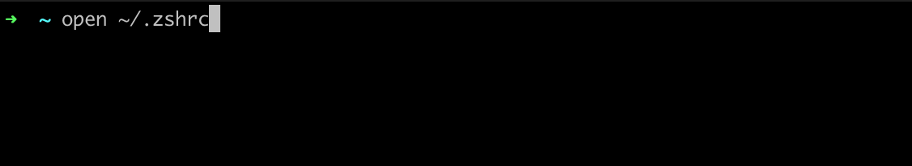

→ 그러면 새로운 **텍스트창**이 열린다.

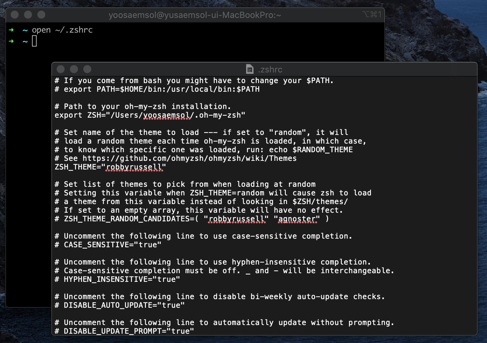

### ② ZSH_THEME="agnoster"

ZSH_THEME="`이부분`" 을 **변경**해준다.

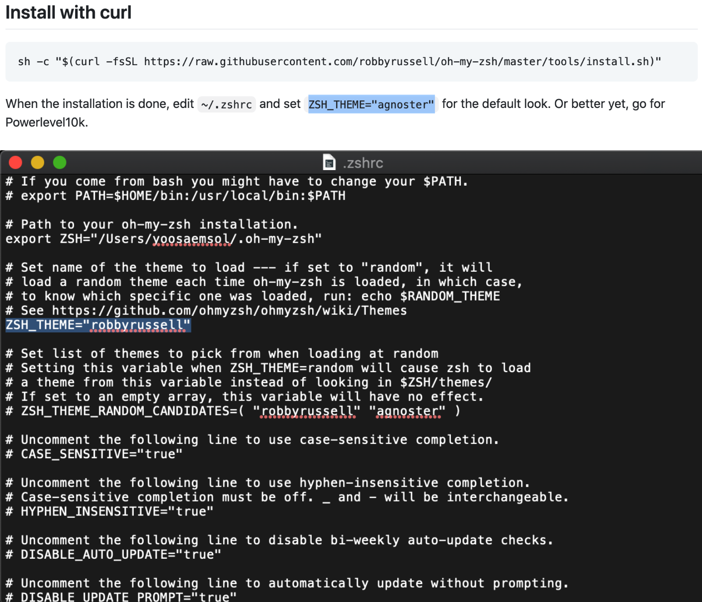

- "robbyrrussell" → **"agnoster"**
### ③ iTerms 다시 열기

변경해준 뒤 `iterm2` 를 껐다가 다시 켜준다.

🤚🏻 그러면 아래처럼 ? 박스도 있고 이상한 모양이되는데, **폰트가 깨져서 생기는 문제**이다.

→ 이제 **폰트를 설치**해줘야한다.


## 2-2. 폰트패치하기

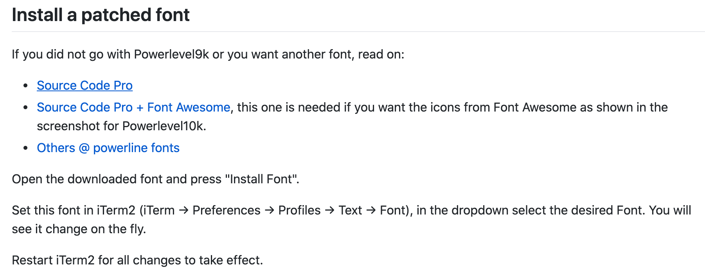

### ① 폰트다운 및 설치

[Source Code Pro](https://github.com/powerline/fonts/blob/master/SourceCodePro/Source%20Code%20Pro%20for%20Powerline.otf) 에서 폰트를 다운받고 설치한다.


### ② 원한다면 다른 폰트도 설치

혹시 다른 폰트도 원한다면, 이 단계도 진행해주면 된다. 🙂

[Others @ powerline fonts](https://github.com/powerline/fonts) 여기에 들어간다음에 쭉 내려서 `README` 부분으로 간다.

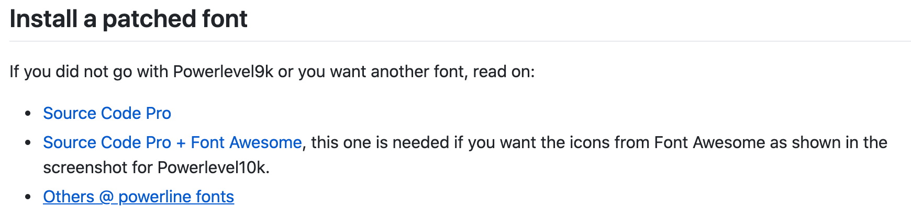

→ **각 운영체제에 맞는 부분**으로 빠른설치를 실행한다.

✨ 저는 Mac OS 이기때문에 `**On other environments**` 부분으로 진행했습니다.


1️⃣ `#clone` 부분 진행하기 (아래 코드를 터미널에 붙여넣습니다.)

```plain text
git clone https://github.com/powerline/fonts.git --depth=1
```

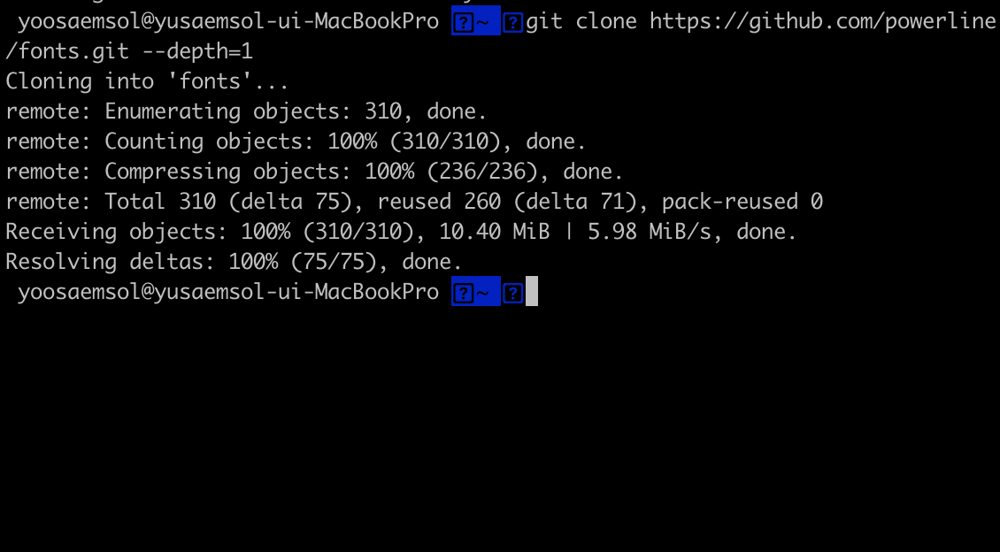

2️⃣ `#install` 부분 진행하기

- 이전단계가 완료되면, `cd fonts` 를 입력해줍니다.


- 완료되면 이제 초록색 부분이 생기는데, 이어서 `./install.sh` 를 입력해줍니다.
3️⃣ `# clean-up a bit` 부분 진행하기

- `cd ..` 를 입력해줍니다.
- 이어서 `rm -rf fonts` 도 입력해줍니다.
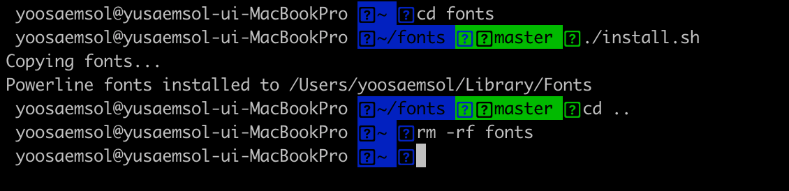

### ④ 위에서 설치한 폰트 적용

설치한 폰트를 적용시키기 위해 `iTrem2` > `Preferences...` 로 들어간다.

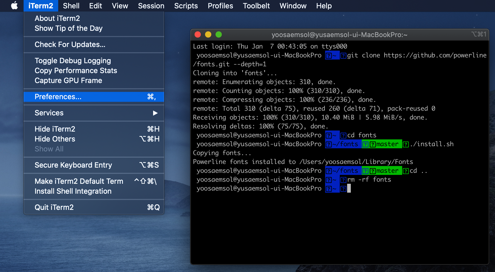

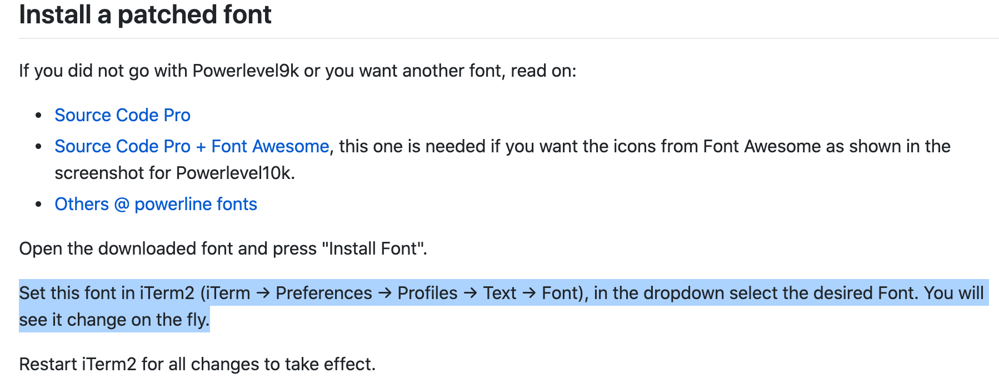

`iTerm` → `Preferences` → `Profiles` → `Text` → `Font` 로 이동한다!

- Font 를 **Source Code Pro for Powerline** 로 설정해준다!
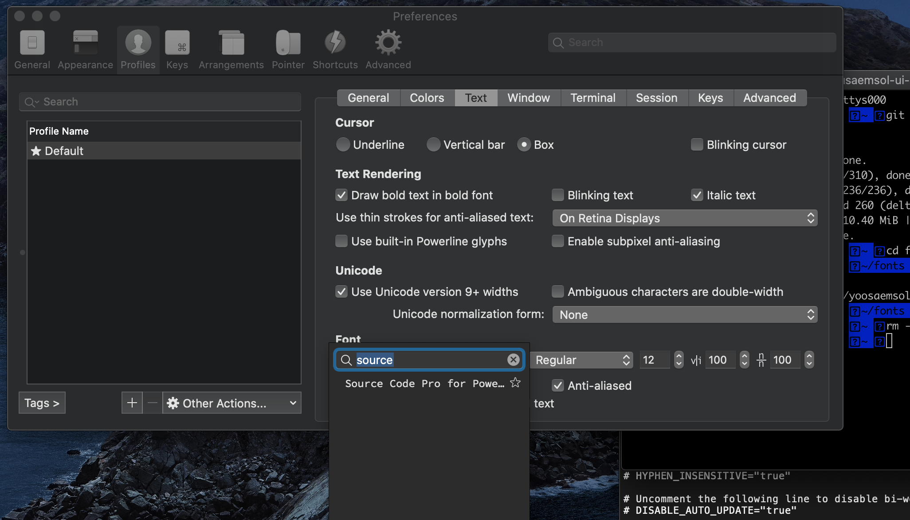

- 그럼이제 물음표 박스도 사라지고, 모양도 조금 비슷해진다.
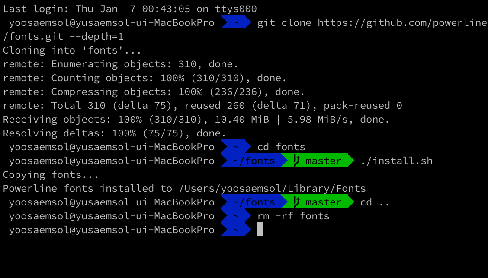

### ⑤ 색상 테마 변경

- 이번에는 다시 `iTerm` → `Preferences` → `Profiles` → `Colors` 로 이동한다.
- 그리고 하단의 `**Color Presets...**` 를 변경해주거나, 색상을 변경시켜준다.
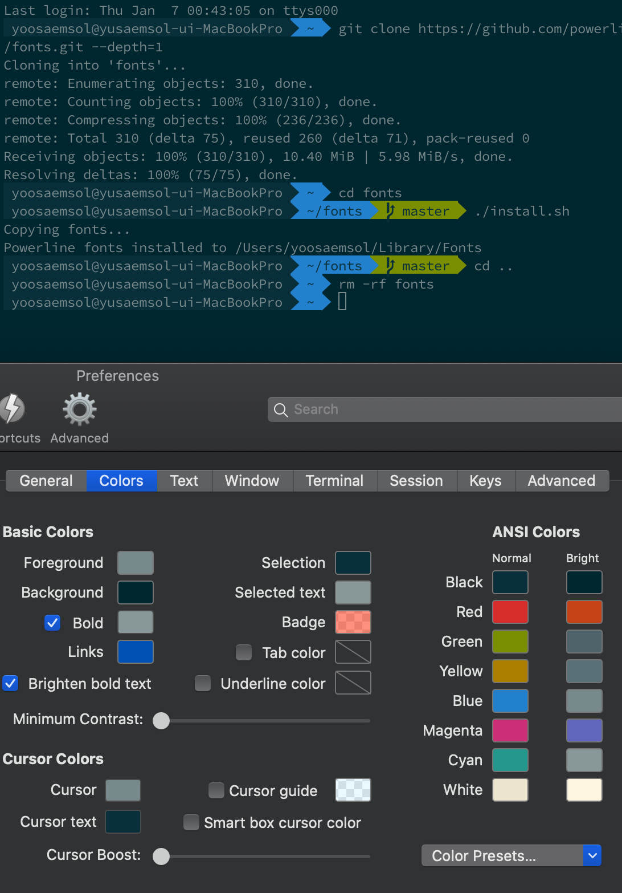

# 3. 완성 🥳

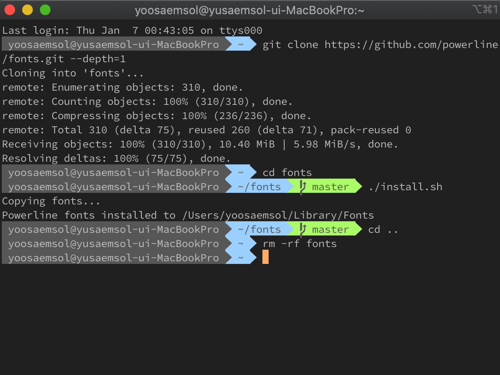

# 4. (추가) VSC 에서도 설정

🤚🏻 아무것도 해주지 않으면 VSC 터미널에서도 폰트가 깨진다.


✨ **VSC 터미널에서도 폰트를 변경**해줘야한다!

- `setting` 에서`"terminal.integrated.fontFamily": "Source Code Pro for Powerline",`를 붙여넣어준다.
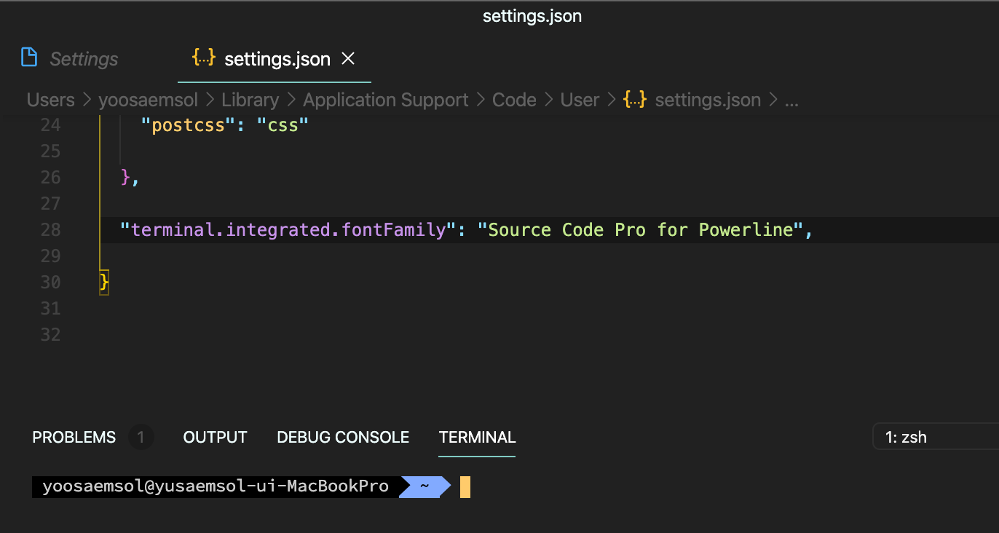

# 5. Syntax Highlight 적용

명령어에 **하이라이트**가 된다! ✨

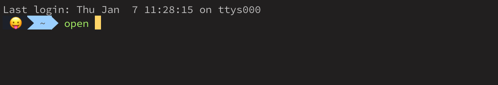

## 5-1. brew를 통해 설치

- **설치**
```plain text
brew install zsh-syntax-highlighting
```

- **적용**
```plain text
source /usr/local/share/zsh-syntax-highlighting/zsh-syntax-highlighting.zsh
```

- `open ~/.zshrc` 에 들어가서 맨 아래에도 **추가**하기 (항상실행되도록)
```plain text
source /usr/local/share/zsh-syntax-highlighting/zsh-syntax-highlighting.zsh
```

## 5-2. 오류가 난다면

설치단계 `brew install zsh-syntax-highlighting` 에서 다음과 같은 오류가 발생한다면,

```plain text
Error : The following directories are not writable by your user: /usr/local/share/man/man7

You should change the ownership of these directories to your user.

sudo chown -R $(whoami) /usr/local/share/man/man7

```

→ 시키는대로 해주면 된다!

- **폴더 권한 수정**
```plain text
sudo chown -R $(whoami) /usr/local/share/man/man7
```

