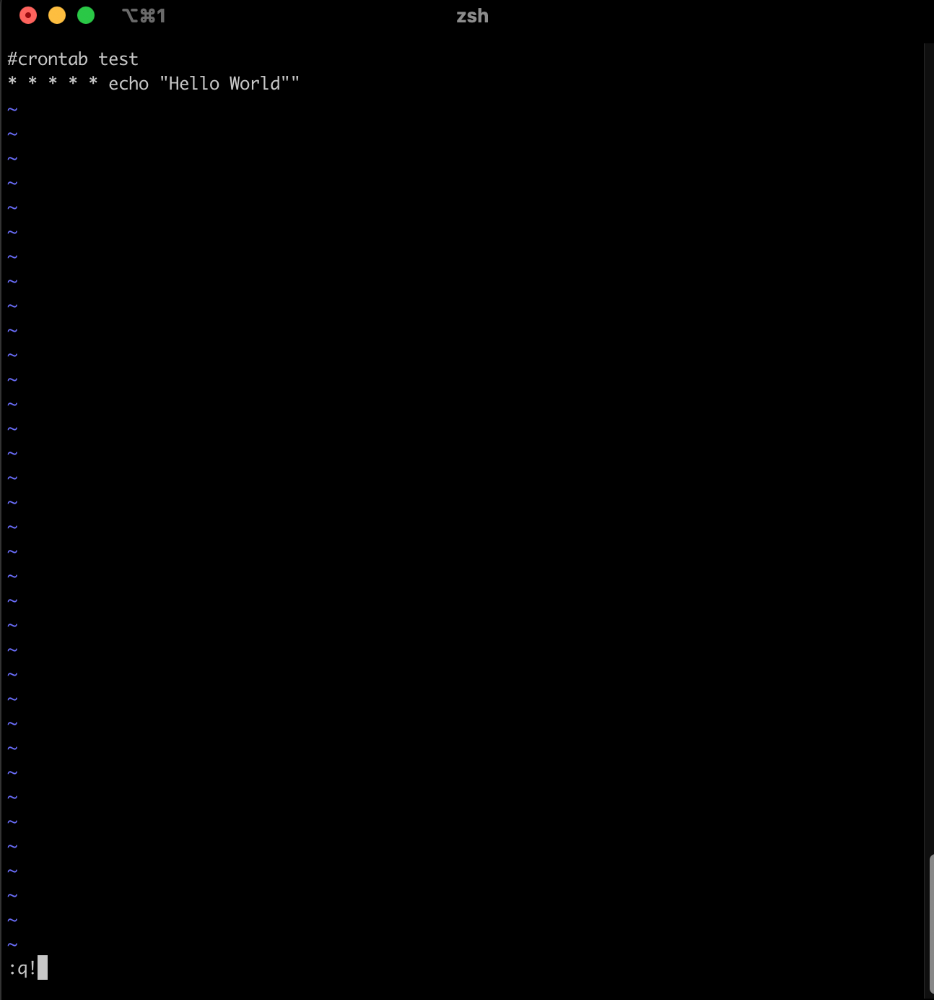
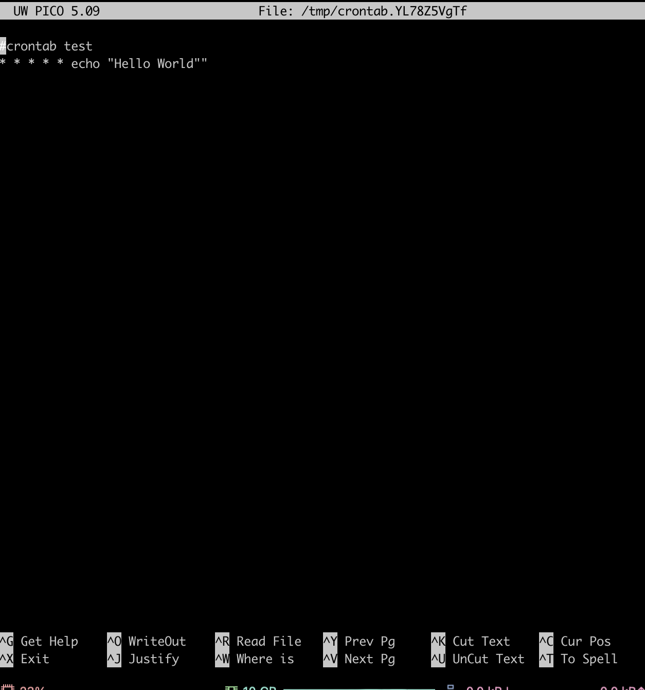

# MAC 터미널 에디터 변경 & 파이썬 코드 스케듈링

> **Summary**
> MAC 터미널에서 crontab의 기본 에디터를 vim에서 nano로 변경하려면 

---


# MAC 터미널 crontab 에디터 nano로 변경

터미널에서 crontab을 사용할 때 기본 에디터가 vim이 아닌 nano를 사용하고 싶다면, 다음과 같이 하시면 됩니다.

터미널에서 다음 명령어를 입력해주세요.


```shell
export VISUAL=nano; crontab -e
```


위 명령어를 입력하시면 crontab을 열 때 nano가 기본 에디터로 설정됩니다. 만약 vim으로 변경하고 싶다면, 위 명령어에서 nano를 vim으로 변경해주시면 됩니다.




기존 vim 에디터는 상당히 불편하다

nano가 조금 더 직관적이고 편해서 nano에디터로 변경하려고한다.

방법은 간단하다.


```javascript
export VISUAL=nano; crontab -e
```





다시 Vim 에디터로 변경하고싶으면 VISUAL 부분을 vim 으로 변경해주면 쉽게 바꿀 수 있다


```javascript
export VISUAL=vim; crontab -e
```


# MAC에서 파이썬 스케듈링 방법

우분투 22.04LTS 에서는 파이썬 코드를 실행시키기위해서

`* * * * * cd /home/your/path && /usr/bin/python3 python_script.py`

cd 로 디렉토리로 이동하여 and 연산자를 사용하여 기존 파이썬 설치 디렉토리와 비교하여 코드를 실행시켰는데, MAC 터미널에서는 실행방법이 달랐다.


cd를 생략하고 파이썬이 설치된 디렉토리를 먼저 입력하고 파이썬 코드가 있는 디렉토리로 바로 이동하는것이다.

다음 코드를 확인하면 된다.

```javascript
#  m     h    dom mon  dow
#  *     *     *   *    *        command to be executed
#  -     -     -   -    -
#  |     |     |   |    |
#  |     |     |   |    +----- day of the week (0 - 6) (Sunday=0)
#  |     |     |   +------- month (1 - 12)
#  |     |     +--------- day of the month (1 - 31)
#  |     +----------- hour (0 - 23)
#  +------------- min (0 - 59)

* * * * * /usr/bin/python3 /Users/your/path/python_script.py
```


# 현재 실행중인 파이썬 코드 확인방법

```python
ps aux | grep python3
```

