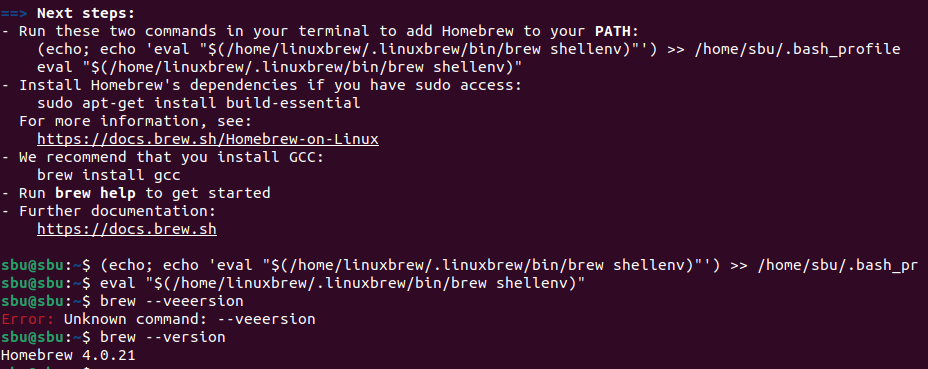
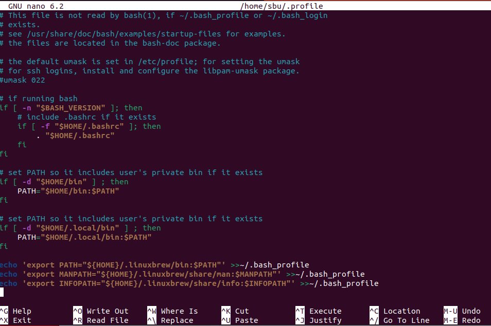

# MAC에 Ubuntu 설치

> **Summary**
> MAC에서 Ubuntu를 설치하기 위한 부팅 디스크 생성 방법과 GUID 파티션 맵 옵션이 보이지 않을 때의 해결 방법, sudo 권한 부여 및 Homebrew 설치 방법에 대해 설명합니다. 또한, Ubuntu에 Zsh를 설치하는 방법도 포함되어 있습니다.

---

# 부팅 디스크로 우분투 설치

🎥 [동영상 보기](https://www.youtube.com/watch?time_continue=167&v=o30qsxv1CsM&embeds_referring_euri=https://www.clien.net/service/board/cm_linux/15115374&source_ve_path=MTM5MTE3LDEyNzI5OSwyODY2MywxMzc3MjEsMTI3Mjk5LDEyNzI5OSwyODY2MywxMjczMDEsMjM4NTE&feature=emb_title)

🎥 [동영상 보기](https://www.youtube.com/watch?v=KIgxEEzT9ek)

# Ubuntu 원격 접속 관련

🎥 [동영상 보기](https://www.youtube.com/watch?v=bn1Nxo44LCo)

🔗 [https://linuxhint.com/best_remote_desktop_sharing_apps_ubuntu/](https://linuxhint.com/best_remote_desktop_sharing_apps_ubuntu/)


```javascript
MAC에서 디스크 유틸리티에서 ubunut 실행 파티션을 만들기 위해 USB디스크를 MS-DOS(FAT32) 로 초기화 하려고 하는데, GUID 파티션맵 옵션이 보이지 않습니다.어떻게 해야하나요?
```

# 부팅디스크 만들때 GUID 파티션맵 안보임

안녕하세요. Mac에서 디스크 유틸리티에서 ubunut 실행 파티션을 만들기 위해 USB디스크를 MS-DOS(FAT32) 로 초기화 하려고 하는데, GUID 파티션맵 옵션이 보이지 않는다고 하셨군요. 이 문제는 USB디스크를 MS-DOS(FAT32)로 초기화한 후에 발생하는 문제입니다. 이 경우, 디스크 유틸리티에서 파티션을 생성할 때 GUID 파티션맵 옵션이 보이지 않을 수 있습니다. 이 문제를 해결하기 위해서는 다음과 같은 단계를 따르시면 됩니다.

1. 디스크 유틸리티를 실행합니다.
1. USB디스크를 선택합니다.
1. 도구 막대에서 삭제 버튼을 클릭합니다.
1. 삭제 대화상자에서 'MS-DOS(FAT)'을 선택합니다.
1. 삭제 버튼을 클릭합니다.
1. 도구 막대에서 파티션 버튼을 클릭합니다.
1. 파티션 대화상자에서 '1개의 파티션'을 선택합니다.
1. 포맷 대화상자에서 'Mac OS 확장'을 선택합니다.
1. 이름과 용량을 설정하고 '적용' 버튼을 클릭합니다.
위 단계를 따르시면 GUID 파티션맵 옵션이 보이게 됩니다.

참고로, 이 문제는 USB디스크가 MS-DOS(FAT32)로 초기화되어 있기 때문에 발생하는 것입니다¹. 이 문제를 해결하기 위해서는 USB디스크를 Mac OS 확장으로 초기화하시면 됩니다².

도움이 되었길 바랍니다!

출처: Bing과의 대화, 2023. 6. 4.
(1) Mac용 디스크 유틸리티에서 물리적 디스크 파티션하기 - Apple 지원 .... [https://support.apple.com/ko-kr/guide/disk-utility/dskutl14027/mac](https://support.apple.com/ko-kr/guide/disk-utility/dskutl14027/mac).
(2) Mac용 디스크 유틸리티에서 사용 가능한 파티션 설계 - Apple 지원 (KR). [https://support.apple.com/ko-kr/guide/disk-utility/dsku1c614201/mac](https://support.apple.com/ko-kr/guide/disk-utility/dsku1c614201/mac).
(3) Mac에서 디스크 파티션을 만드는 방법은 무엇입니까? | ITIGIC. [https://www.itigic.com/ko/how-to-make-a-disk-partition-on-your-mac/](https://www.itigic.com/ko/how-to-make-a-disk-partition-on-your-mac/).


# 가상 머신으로 우분투 설치

🔗 [https://wooleee.github.io/blog/linumac/](https://wooleee.github.io/blog/linumac/)


## sudo 권한주기

🔗 [https://www.maketecheasier.com/fix-ubuntu-cannot-open-terminal/](https://www.maketecheasier.com/fix-ubuntu-cannot-open-terminal/)

🔗 [https://starseeker711.tistory.com/176](https://starseeker711.tistory.com/176)

root 로 이동

```shell
su
```

sudoers 파일 수정

```shell
nano /etc/sudoers
```

sudoers 파일 내부에 `root ALL=(ALL:ALL) ALL` 이라고적힌 부분을 찾아 바로 그 아래에 다음 명령어 추가

```shell
USERNAME ALL=(ALL:ALL) ALL
```


저장후 나오면 sudo 명령어를사용 가능함


## homebrew 설치

🔗 [https://linux.how2shout.com/install-brew-on-ubuntu-22-04-lts-jammy-linux/](https://linux.how2shout.com/install-brew-on-ubuntu-22-04-lts-jammy-linux/)

🔗 [https://www.lesstif.com/lpt/linux-brew-package-manager-54952258.html](https://www.lesstif.com/lpt/linux-brew-package-manager-54952258.html)


루트 계정으로 이동

```shell
su
```

루트 계정에서 다음 명령어 실행

```shell
sudo apt-get install build-essential curl file git
```

일반 계정으로 이동

```shell
su USERNAME
```

일반 계정으로 돌아와서 다음 명령어입력

```shell
sh -c "$(curl -fsSL https://raw.githubusercontent.com/Linuxbrew/install/master/install.sh)"
```


입력 후 두명령어를 입력하라고 한다 (homebrew를 활성화하기위해 PATH 를 추가하는 과정)




이후 다음 명령어 실행

```shell
nano ~/.profile
```

열린 `~/.profile` 파일 맨 아래에 다음코드 추가

```shell
echo 'export PATH="${HOME}/.linuxbrew/bin:$PATH"' >>~/.bash_profile
echo 'export MANPATH="${HOME}/.linuxbrew/share/man:$MANPATH"' >>~/.bash_profile
echo 'export INFOPATH="${HOME}/.linuxbrew/share/info:$INFOPATH"' >>~/.bash_profile
```




초기화 파일을 새롭게 읽음

```shell
source ~/.bash_profile
```


설치 확인

```shell
brew --version
```


# Install Zsh

🔗 [https://log4cat.tistory.com/7](https://log4cat.tistory.com/7)

🔗 [https://the-illusionist.me/47](https://the-illusionist.me/47)


