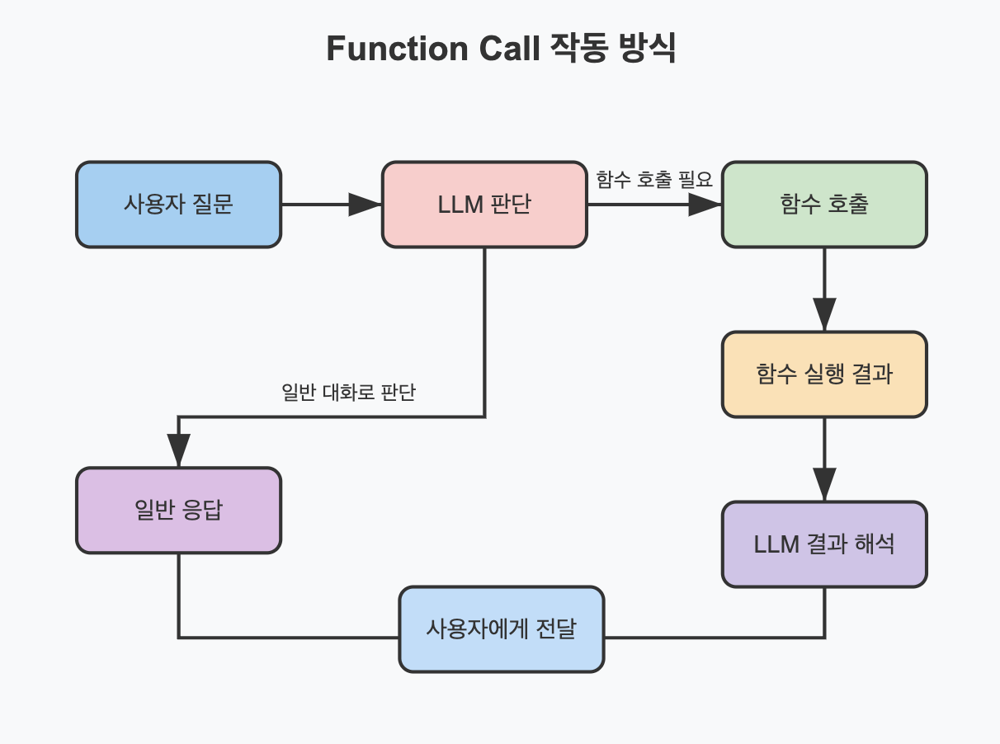

# MCP 생각해보니 그냥 프로그래밍이잖아? LLM의 이점은 비정형 데이터 처리인데? 그래서 나온 대답 ClaudeCode

> **Summary**
> MCP는 LLM의 자연어 처리 능력을 정형화된 프로토콜에 맞추려 했으나, 클로드 스킬은 자연어로 지시하는 방식으로 더 간단하게 접근할 수 있게 해줍니다. 클로드 스킬은 복잡한 프로토콜 대신 사용자가 원하는 워크플로를 자유롭게 만들 수 있는 능력을 강조하며, MCP는 대규모 배포와 서비스 연동에 여전히 유용합니다. LLM의 본질은 자연어 이해이며, 클로드 스킬은 이를 최대한 활용합니다.

---



## MCP에서 클로드 스킬로: 프로토콜에서 자연어로의 회귀

🔗 [https://share.google/y9yRmyKYJUF5P8WI1](https://share.google/y9yRmyKYJUF5P8WI1)

### **핵심 역설의 발견**

2024년 하반기, MCP(Model Context Protocol) 열풍이 불었습니다. "AI계의 USB-C"라는 별명처럼, AI에게 외부 도구를 연결하는 표준화된 방법을 제공했죠. 개발자들은 JSON-RPC 스펙을 공부하고 MCP 서버를 구축했습니다. 그런데 어느 순간 근본적인 질문이 떠올랐습니다.

"잠깐, LLM은 자연어를 이해하는 모델 아닌가? 그런데 왜 이렇게 정형화된 프로토콜이 필요하지?"

MCP의 작동 방식을 보면 이 역설이 더 명확해집니다. 도구 목록을 가져오려면 `tools/list` 엔드포인트를 호출하고, 실행하려면 `tools/call`에 정해진 형식으로 요청해야 합니다. 마치 기존 프로그래밍처럼 특정 형태의 요청을 특정 주소에 보내야 특정 응답이 나오는 구조입니다.

비정형 데이터를 자유자재로 다루는 LLM에게, 정형화된 프로토콜을 씌우고 있었던 겁니다.

### **더 간단한 방법이 있었습니다**

사실 마크다운 파일에 "사용자가 날씨를 물어보면 weather.sh 스크립트를 실행해 줘"라고 쓰면 됩니다. LLM은 이걸 읽고 이해합니다. list 엔드포인트도, call 엔드포인트도 필요 없습니다. 말을 알아듣으니까요.

이것이 클로드 스킬(Claude Skills)의 핵심입니다. 정형화된 프로토콜 대신, 자연어로 "이럴 때 이렇게 해줘"라고 적어두는 방식입니다.

### **스킬의 단순함**

```markdown
name: db-setup
description: D1 데이터베이스 연동 워크플로. "DB 연동", "데이터베이스 설정" 등의 요청 시 트리거됩니다.

## 워크플로
1. wrangler.toml 파일 확인
2. D1 데이터베이스 생성 여부 확인
3. 없다면 `wrangler d1 create` 실행
4. drizzle ORM 패키지 설치
5. 스키마 파일 생성
6. 마이그레이션 실행

```

이게 전부입니다. JSON-RPC 스펙도, 엔드포인트 매핑도 없습니다. MCP로 같은 기능을 구현하려면 서버를 띄우고, 도구 목록을 정의하고, 각 도구의 실행 로직을 구현해야 합니다. 스킬은 폴더에 마크다운 파일 하나 만들면 끝입니다.

### **프로그래밍으로의 회귀, 그리고 넘어서기**

여기서 흥미로운 지점이 있습니다. 상황별로 다른 MCP를 연결하고 관리하다 보니, 결국 "이건 그냥 프로그래밍이랑 다를 바가 없잖아"라는 깨달음에 도달한 겁니다. 그래서 아예 프로그래밍의 유연함을 가져왔습니다. 하지만 코드 대신 자연어로.

고정된 워크플로는 스크립트로 만들고, 스킬에서는 그 스크립트를 호출하게 하면 됩니다. LLM의 유연함과 스크립트의 정확함/속도가 결합됩니다. 스크립트가 예외 상황에서 막히면? Claude가 알아서 고쳐서 실행합니다.

### **MCP의 미래**

그렇다고 MCP가 사라질까요? 아닙니다. 이미 구축된 거대한 오픈소스 생태계가 있고, 외부 서비스 연동과 커뮤니티 공유에는 여전히 유용합니다.

결론은 이겁니다. 개인 워크플로와 빠른 프로토타이핑에는 클로드 스킬이, 대규모 배포와 서비스 연동에는 MCP가 적합합니다.

### **본질로의 회귀**

LLM의 본질은 자연어 이해입니다. MCP가 LLM을 기존 프로그래밍 패러다임에 끼워 맞추려 했다면, 클로드 스킬은 LLM의 강점을 그대로 활용합니다. 정형화된 프로토콜을 외우는 대신, 말로 지시하면 됩니다.

바이브 코딩 시대에 진짜 필요한 건 복잡한 프로토콜이 아니라, 자신만의 워크플로를 자유롭게 만들어내는 능력입니다.

