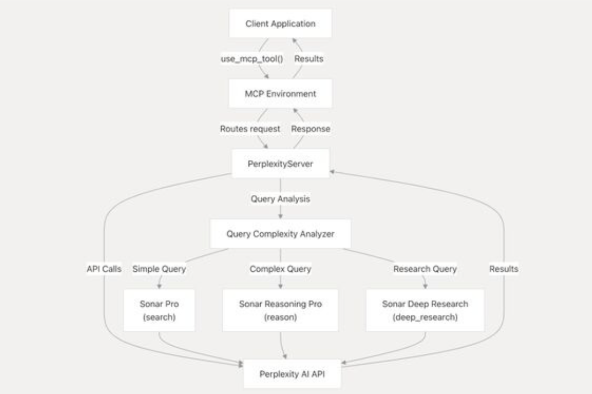

# MCP 엿보기 (Perflexity API?)

> **Summary**
> Claude를 중심으로 한 AI 기반 개인 생산성 통합 시스템은 여러 앱 간의 번거로움을 해소하고 정보를 효율적으로 관리하여 집중력을 향상시킵니다. 주요 기능으로는 통합 허브와 지능형 쿼리 분석이 있으며, 개인 지식 관리, 연구 보조, 자동화된 워크플로 실행, 비즈니스 인텔리전스 플랫폼 등 다양한 활용 방안을 제공합니다.

---

🔗 [https://chatgpt.com/share/687513b3-8b8c-8007-acfb-610c80d0d032](https://chatgpt.com/share/687513b3-8b8c-8007-acfb-610c80d0d032)

🔗 [https://www.genspark.ai/spark/ai-%EA%B8%B0%EB%B0%98-%EA%B0%9C%EC%9D%B8-%EC%83%9D%EC%82%B0%EC%84%B1-%ED%98%81%EC%8B%A0%EC%9D%84-%EC%9C%84%ED%95%9C-claude-%ED%86%B5%ED%95%A9-%EC%8B%9C%EC%8A%A4%ED%85%9C-%EC%95%84%ED%82%A4%ED%85%8D%EC%B2%98-%EB%B6%84%EC%84%9D/36378f36-72d9-44ed-84df-63502988c235](https://www.genspark.ai/spark/ai-%EA%B8%B0%EB%B0%98-%EA%B0%9C%EC%9D%B8-%EC%83%9D%EC%82%B0%EC%84%B1-%ED%98%81%EC%8B%A0%EC%9D%84-%EC%9C%84%ED%95%9C-claude-%ED%86%B5%ED%95%A9-%EC%8B%9C%EC%8A%A4%ED%85%9C-%EC%95%84%ED%82%A4%ED%85%8D%EC%B2%98-%EB%B6%84%EC%84%9D/36378f36-72d9-44ed-84df-63502988c235)

### **AI 기반 개인 생산성 혁신 시스템 요약**

이 글은 Claude를 중심으로 구축된 **AI 기반 개인 생산성 통합 시스템**에 대한 설명입니다.

**1. 시스템 목표:**

- 여러 앱(구글 드라이브, 옵시디언, n8n 등)을 오가는 번거로움 해소
- 정보를 한곳으로 모아 효율적인 관리 및 접근
- 집중력 향상 및 멀티태스킹으로 인한 생산성 저하 문제 해결
**2. 핵심 기능:**

- **통합 허브:** Claude를 통해 모든 정보 소스에 한 번에 접근 (앱 전환 71% 감소, 집중 시간 증가)
- **지능형 쿼리 분석 (Query Complexity Analyzer):** 사용자의 질문 복잡도에 따라 최적의 AI 모델(Perplexity의 Sonar Pro, Reasoning Pro, Deep Research)로 자동 연결
**3. 주요 구성 요소:**

- **Claude:** 모든 정보와 도구를 통합하는 중심 플랫폼
- **PerplexityServer:** 쿼리 분석 및 AI 모델 라우팅 담당
- **다양한 데이터 소스:** 구글 드라이브(문서), 옵시디언(개인 지식), n8n(자동화 워크플로 실행) 등
**4. 시스템 의의:**

- 개인 작업 효율을 극대화하고, 복잡한 정보 처리와 루틴 작업을 AI가 담당하게 함으로써 사용자는 더 깊이 있는 사고와 창의적인 활동에 집중할 수 있도록 돕습니다. 이는 AI 시대의 새로운 업무 방식을 제시하는 사례입니다.
이 시스템의 **활용 방안**은 다음과 같습니다:

1. **개인 지식 관리 시스템:**
  - **예시:** "지난 주 회의록에서 AI 프로젝트 관련 내용 찾아줘"
  - **작동:** Query Analyzer가 단순 쿼리로 판단하여 Sonar Pro를 통해 Google Drive 및 Obsidian에서 관련 문서를 검색하고 요약 제공.
1. **연구 보조 도구:**
  - **예시:** "LLM의 환각 현상을 줄이는 방법들을 종합적으로 분석해줘"
  - **작동:** Query Analyzer가 연구 쿼리로 판단하여 Sonar Deep Research를 통해 웹, 개인 노트, 논문 등을 포괄적으로 검색하고 분석하여 보고서 생성.
1. **자동화된 워크플로 실행:**
  - **예시:** "매주 금요일 팀 성과 리포트 만들어줘"
  - **작동:** Query Analyzer가 복잡 쿼리로 판단하여 Sonar Reasoning Pro를 통해 n8n 워크플로를 트리거하여 데이터 수집, 분석, 리포트 생성을 자동화.
1. **비즈니스 인텔리전스 플랫폼:**
  - **예시:** "경쟁사 분석 데이터와 우리 매출 데이터를 비교분석해줘"
  - **작동:** Query Analyzer가 복잡 쿼리로 판단하여 Sonar Reasoning Pro를 통해 다중 데이터 소스를 통합 분석하여 인사이트 및 액션 아이템 제안.
