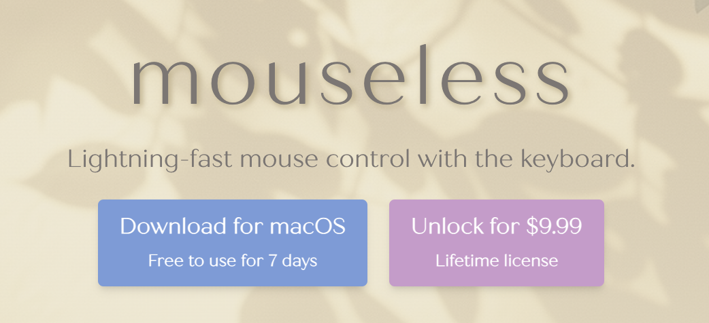

# Mouseless

> **Summary**
> Mouseless는 MacOS 사용자를 위한 혁신적인 키보드 기반 컨트롤 앱으로, 마우스 없이도 빠르게 클릭할 수 있도록 도와줍니다. 주요 기능으로는 빠른 화면 내 클릭, 완벽한 커스터마이징, 드래그 및 다중 버튼 지원, 그리고 키보드 단축키로 해결되지 않는 상황 대체가 있습니다. Mouseless는 손의 피로를 줄이고 작업 흐름을 개선하여 생산성을 높이며, 현재 MacOS에서만 지원되지만 향후 Windows와 Linux 버전도 개발될 예정입니다.

---

🎥 [동영상 보기](https://www.youtube.com/watch?v=J0rwQVNQkHM&t=208s)

# 마우스를 버리고 키보드만으로 빠르고 효율적인 컨트롤: **Mouseless** 소개

---

### **Mouseless: 혁신적인 키보드 기반 컨트롤 앱**

MacOS 사용자를 위한 새로운 앱, **Mouseless**는 더 이상 마우스를 사용하지 않아도 화면 어디든 빠르게 클릭할 수 있도록 돕습니다. Mouseless는 특히 생산성을 높이고 손의 피로를 줄이며, 접근성 문제로 마우스 사용이 어려운 사람들에게도 완벽한 솔루션을 제공합니다.

---

### **Mouseless의 주요 기능**

1. **빠른 화면 내 클릭**
  Mouseless는 화면을 격자 형태로 나누고, 간단한 키 입력만으로 원하는 위치를 클릭할 수 있습니다.

  - **사용 방법**:
    1. **왼쪽 Command 키**를 눌러 오버레이 활성화.
    1. 격자 내의 두 문자 입력.
    1. 스페이스바를 눌러 지정 위치 클릭.
추가적으로 세부 위치 클릭, 더블 클릭, 트리플 클릭도 가능합니다.
1. **완벽한 커스터마이징**
  키 바인딩은 완전히 개인화할 수 있어 사용자가 편리하게 사용할 수 있습니다.

1. **드래그 및 다중 버튼 지원**
  마우스 커서 이동, 클릭/드래그와 더불어 마우스의 다섯 가지 버튼(왼쪽, 오른쪽, 중간, 뒤로, 앞으로)을 모두 지원합니다.

1. **키보드 단축키로 해결되지 않는 상황 대체**
  시스템 트레이, 앱 툴바, 복잡한 웹페이지 등 일반 키보드 단축키로 해결할 수 없는 상황에서도 Mouseless는 간단히 문제를 해결해 줍니다.

---

### **Mouseless가 생산성을 높이는 이유**

마우스를 자주 사용하면 손이 키보드와 마우스 사이를 반복적으로 이동하게 되어 작업 흐름이 방해받을 수 있습니다. Mouseless는 이러한 불편함을 해소해 빠른 작업 환경을 제공합니다.

### **예시**

- **VS Code에서 PNG 파일로 내보내기**
  기존 방법: 키보드로 탭(Tab) 이동 불가 → 마우스 사용 필수.

  Mouseless: 키 입력만으로 버튼 클릭 가능.

- **시스템 다이얼로그**
  기존 방법: 키보드로 항목 선택 불가 → 마우스 사용 필수.

  Mouseless: 간단한 키 입력으로 클릭 가능.

---

### **제약 사항 및 보완점**

Mouseless는 대부분의 작업에 적합하지만, 게임이나 정밀한 그림 그리기 등 지속적인 움직임이 필요한 작업에서는 마우스가 더 적합할 수 있습니다. 그러나 그 외의 작업에서는 Mouseless가 훨씬 효율적입니다.

---

### **현재 지원 플랫폼과 앞으로의 계획**

- **현재 지원**: MacOS 전용.
- **미래 계획**: Windows와 Linux 버전은 사용자 요청에 따라 개발 예정.
- **추가 기능**: 웹 확장 프로그램 및 트레이닝 게임도 곧 출시 예정.
---

### **마무리**

Mouseless는 MacOS 사용자의 생산성을 크게 향상시킬 잠재력을 지닌 도구입니다. 관심이 있다면 [Mouseless 공식 웹사이트](mailto:support@escape.net)를 방문하거나, YouTube에서 **Mouseless** 채널을 구독하세요. 의견이나 질문이 있다면 댓글로 남겨주세요.

**"한 번의 키 입력으로 클릭, Mouseless와 함께 더 빠른 작업을 경험해보세요!"**

**관련 링크:**

[YouTube: Mouseless 소개 영상](https://www.youtube.com/watch?v=J0rwQVNQkHM)

