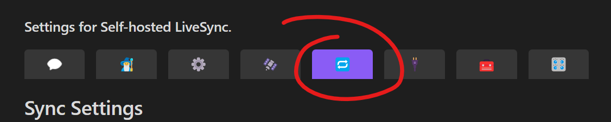
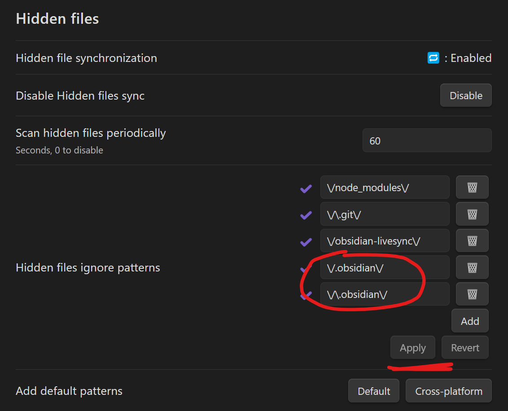

# NAS & 옵시디언(도커)

> **Summary**
> 옵시디언을 도커와 포르테이너를 사용하여 설치하고 동기화하는 방법에 대한 안내가 포함되어 있으며, 외부 접속을 위해 포트 포워딩 또는 역방향 프록시 설정이 필요하다는 주의사항이 있습니다. 플러그인 동기화를 위해 숨겨진 디렉토리인 obsidian도 함께 동기화해야 합니다.

---

# Web 버전

[https://www.scmlab.com/how-to-install-and-sync-obsidian-linuxserver-and-self-hosted-livesync-synology-using-docker-and-portainer/](https://www.scmlab.com/how-to-install-and-sync-obsidian-linuxserver-and-self-hosted-livesync-synology-using-docker-and-portainer/)

# 로컬 버전

> 💡 **주의!) Self-hosted LiveSync를 외부접속이 가능하도록 하려면, **
> 위의 5984포트를 포트포워딩하거나, 역방향 프록시 설정을 사전에 해주셔야 됩니다.!
>
>

[https://www.scmlab.com/installing-obsidian-real-time-synchronization-server-using-synology-docker/](https://www.scmlab.com/installing-obsidian-real-time-synchronization-server-using-synology-docker/)

# 옵시디언 웹 배포

[https://www.scmlab.com/obsidian-publishing-self-hosting-server-install-using-synology-docker/](https://www.scmlab.com/obsidian-publishing-self-hosting-server-install-using-synology-docker/)

# 플러그인도 동기화하기

숨겨진 디렉토리인 obsidian도 함께 동기화하면, 플러그인도 정상적으로 동기화된다!

