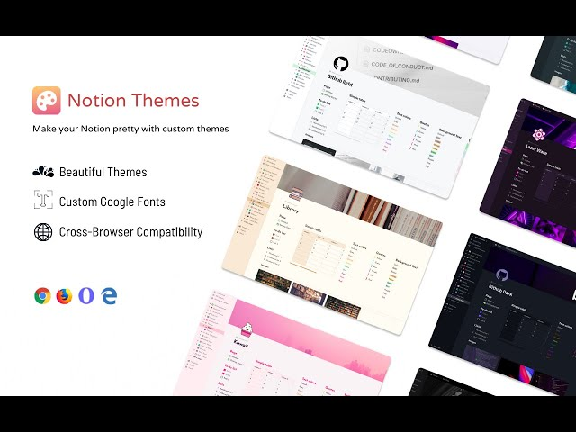

# Notion 커스텀 테마

> **Summary**
> Notion의 커스텀 테마에 대한 정보와 관련 링크를 제공하며, notion-enhancer를 사용하여 Notion의 기능을 향상시킬 수 있는 방법을 제시합니다.

---

🔗 [https://github.com/notionblog/NotionThemes](https://github.com/notionblog/NotionThemes)

🔗 [https://notion-enhancer.github.io/](https://notion-enhancer.github.io/)

🔗 [https://chrome.google.com/webstore/detail/notion-enhancer/dndcmiicjbkfcbpjincpefjkagflbbnl/related](https://chrome.google.com/webstore/detail/notion-enhancer/dndcmiicjbkfcbpjincpefjkagflbbnl/related)

