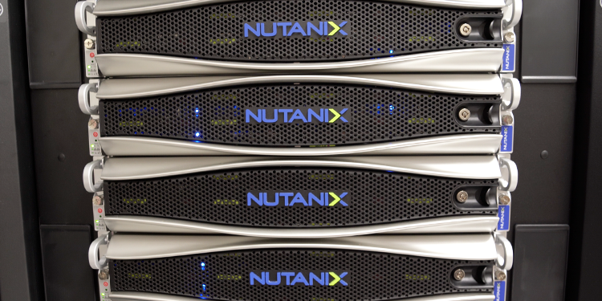

# Nutamix : HCI개념을 알아보다가, 스토리지도 사실은 OS가 있다고? 이게 무슨말인가!

> **Summary**
> Nutanix의 HCI는 각 서버 노드가 독립적인 스토리지 컨트롤러 역할을 수행하여 성능 병목을 해소하고, 간편한 확장성과 데이터 안정성을 제공한다. 소프트웨어 정의 기술을 통해 서버, 스토리지, 네트워크를 통합하여 운영 효율성을 극대화하며, 하이브리드 멀티클라우드 환경에서의 유연한 관리가 가능하다. 이는 기존의 복잡한 인프라 구조를 혁신적으로 단순화하고 자동화하는 솔루션이다.

---



```plain text
결론부터 말하자면, Nutanix의 "스토리지에 OS가 있다"는 말은 각 서버 노드(Node)가 독립적인 지능형 스토리지 컨트롤러 역할을 직접 수행한다는 의미입니다.

이거 결국 기존 VM은 하드웨어 기능들을 각각 패스스루를 따로 해줬어야했는데 NUTANIX 사용하면 이걸 다 간단하게 한곳에서 전부 설정할 수 있다는 의미같은데?
```

🔗 [https://claude.ai/share/75edb50c-4d9f-4c6c-b8a9-6690e9423a36](https://claude.ai/share/75edb50c-4d9f-4c6c-b8a9-6690e9423a36)

### 클라우드 시대의 IT 인프라, HCI와 뉴타닉스로 완성되다

과거 데이터 센터의 IT 인프라는 서버, 스토리지, 네트워크가 각자의 역할에 따라 분리된 '3-Tier 아키텍처'를 기반으로 했다. 이러한 구조는 각 영역의 전문가가 별도로 필요하고, 시스템 확장 시 모든 요소를 개별적으로 고려해야 하는 등 운영의 복잡성이 높았다. 디지털 전환이 가속화되면서 기업들은 이러한 복잡성을 해결하고 민첩성을 확보해야 하는 과제에 직면했다.

이러한 문제의 해결책으로 등장한 것이 바로 HCI(Hyper-Converged Infrastructure)이다. HCI는 서버, 스토리지, 네트워킹, 가상화 등 데이터 센터의 핵심 요소를 하나의 통합된 플랫폼으로 결합한 소프트웨어 정의 인프라이다.

**HCI의 심장, 소프트웨어 정의 기술**

HCI의 가장 큰 특징은 '소프트웨어 정의(Software-Defined)' 기술을 통해 인프라를 통합하고 자동화하는 데 있다. 값비싼 전용 하드웨어 대신, 업계 표준의 x86 서버와 그 위에서 동작하는 지능형 소프트웨어가 모든 것을 제어한다.

특히 스토리지의 경우, 과거에는 전용 컨트롤러와 운영체제(OS)를 갖춘 고가의 외장 스토리지를 사용했다. 하지만 HCI에서는 각 서버에 내장된 디스크들을 소프트웨어 정의 스토리지(SDS) 기술로 묶어 하나의 거대한 공유 스토리지 풀(Pool)처럼 활용한다. 이를 통해 각 서버 노드가 스토리지 컨트롤러의 역할을 분담하여 수행하므로, 특정 지점에 병목 현상이 발생하는 것을 방지하고 관리의 복잡성을 획기적으로 낮춘다.

**HCI와 가상머신(VM)의 관계: 효율성을 극대화하는 기반**

HCI는 가상머신(VM)과 대립하는 개념이 아니라, VM을 보다 효율적으로 운영하기 위한 최적의 기반 인프라이다. 전통적인 환경에서는 VM을 실행하는 서버와 데이터를 저장하는 스토리지가 분리되어 있었지만, HCI는 이들을 하나의 장비처럼 통합하여 제공한다. 그 결과, VM 생성과 확장이 노드 추가만으로 간편해지며, 단일 관리 콘솔을 통해 모든 자원을 제어할 수 있어 운영 효율성이 극대화된다.

**HCI의 선구자, 뉴타닉스가 제시하는 하이브리드 멀티클라우드의 미래**

이러한 HCI 시장을 선도하는 기업이 바로 뉴타닉스(Nutanix)다. 뉴타닉스는 HCI의 개념을 정립하고 대중화했으며, 이제는 단순한 인프라 통합을 넘어 하이브리드 멀티클라우드 환경의 핵심 동력으로 자리매김하고 있다.

뉴타닉스의 경쟁력은 **단순함, 유연성, 그리고 통합 관리**에 있다.

- **단일 플랫폼의 단순함:** 100% 소프트웨어 기반으로 서버, 스토리지, 네트워크, 가상화를 통합하여 단일 관리 도구(Prism)로 손쉽게 운영할 수 있다.
- **하드웨어와 하이퍼바이저 선택의 유연성:** 특정 하드웨어에 종속되지 않으며, 자체 하이퍼바이저인 AHV를 추가 비용 없이 제공할 뿐만 아니라 VMware ESXi, Microsoft Hyper-V 등 다양한 하이퍼바이저를 지원한다.
- **클라우드 경계를 허무는 통합 관리:** 온프레미스(사내 데이터센터)와 퍼블릭 클라우드의 경계를 허물어, 마치 하나의 클라우드처럼 일관된 방식으로 관리하고 운영할 수 있는 환경을 제공한다.
오늘날 많은 기업은 특정 클라우드에 종속되지 않고 여러 퍼블릭 클라우드(AWS, Azure 등)와 온프레미스를 넘나들며 워크로드를 최적의 위치에 배치하는 '멀티클라우드' 전략을 채택하고 있다. 뉴타닉스는 이러한 흐름의 중심에서 핵심적인 역할을 수행한다.

특히 '뉴타닉스 클러스터(Nutanix Clusters)' 서비스를 통해 AWS와 같은 퍼블릭 클라우드에서도 뉴타닉스 HCI 환경을 그대로 구현할 수 있다. 이를 통해 기업은 온프레미스에서 운영하던 VM이나 데이터를 코드 변경 없이 손쉽게 퍼블릭 클라우드로 이전하거나, 반대로 가져올 수 있다. 이는 마치 오프라인 매장(온프레미스)의 상품을 필요에 따라 온라인 창고(퍼블릭 클라우드)로 옮기고, 하나의 시스템으로 재고를 통합 관리하는 것과 같다.

이러한 자유로운 워크로드 이동성은 비즈니스 요구 변화에 유연하게 대응하고, 재해 복구(DR) 체계를 간편하게 구축하며, 클라우드 비용을 최적화하는 강력한 기반이 된다.

결론적으로, HCI는 복잡한 레거시 인프라를 단순화하고 자동화하는 혁신적인 솔루션이며, 뉴타닉스는 이를 바탕으로 온프레미스와 클라우드의 경계를 허무는 진정한 하이브리드 멀티클라우드 플랫폼을 제공한다. 이를 통해 기업은 인프라 관리 부담에서 벗어나 비즈니스 핵심 가치에 집중하고, 디지털 시대의 경쟁력을 한층 더 강화할 수 있다.

# 그러면, 스토리지에도 OS가 있다는것은 무엇을 의미하는가?

결론부터 말하자면, Nutanix의 "스토리지에 OS가 있다"는 말은 **각 서버 노드(Node)가 독립적인 지능형 스토리지 컨트롤러 역할을 직접 수행한다**는 의미입니다.

이것이 왜 중요한지 전통 방식과 비교해서 설명해 드리겠습니다.

---

### 1. 전통적인 스토리지: '중앙집중형 두뇌' 방식

- **구조:** 데이터 센터에 SAN이나 NAS 같은 고가의 **외장 스토리지 장비**가 별도로 존재합니다.
- **두뇌(OS)의 위치:** 이 외장 스토리지 장비 내부에 있는 **2개의 전용 컨트롤러**에 스토리지 OS(펌웨어)가 설치되어 있습니다. 이 두 개의 컨트롤러가 모든 데이터 입출력(I/O)을 처리하는 '중앙 두뇌' 역할을 합니다.
- **문제점:**
  - **성능 병목:** 모든 서버의 데이터 요청이 단 두 개의 컨트롤러에 집중되므로, 시스템이 커질수록 이 컨트롤러가 병목 지점이 됩니다.
  - **복잡한 확장:** 용량이나 성능을 늘리려면 값비싼 스토리지 장비를 통째로 교체하거나 증설해야 하는 '고비용 저효율' 방식입니다.
### 2. Nutanix HCI: '분산된 자율 두뇌' 방식

- **구조:** 별도의 외장 스토리지 장비가 **없습니다.** 각 서버 노드 안에 디스크(SSD, HDD)가 내장되어 있습니다.
- **두뇌(OS)의 위치:** 각 서버 노드마다 **컨트롤러 VM(CVM, Controller VM)**이라는 특별한 가상머신이 실행됩니다. 이 CVM이 바로 '스토리지 OS'의 역할을 합니다. 즉, **모든 노드가 각자의 스토리지 두뇌를 가지고 있는 것**입니다.
- 이 CVM들이 서로 통신하며, 모든 노드에 흩어져 있는 디스크들을 묶어 **하나의 거대한 공유 스토리지 풀(Pool)**처럼 보이게 만듭니다. Nutanix는 이 기술을 '분산 스토리지 패브릭(DSF, Distributed Storage Fabric)'이라고 부릅니다.
---

### 그렇다면 "스토리지에 OS가 있다"는 사실의 진짜 의미는 무엇일까요?

이 아키텍처 차이는 다음과 같은 핵심 장점을 제공합니다.

**1. 성능 병목 해소**
단일 컨트롤러 의존 대신, **노드 증가에 따라 '스토리지 두뇌(CVM)'도 함께 증가합니다.** 10개 노드는 10개의 컨트롤러가 병렬 작업하는 효과를 냅니다. 서버 증설 시 컴퓨팅과 스토리지 성능이 동시에 선형적으로 증가해 병목 현상이 발생하지 않습니다.

**2. 간편한 확장성**
용량이나 성능 부족 시 **노드 한 대만 추가하면 됩니다.** 새 노드의 CVM이 자동으로 클러스터에 합류해 스토리지 풀을 즉시 확장합니다. 고가의 외장 스토리지 교체 과정이 불필요합니다.

**3. 강화된 데이터 안정성**
노드나 디스크 장애 발생 시에도 데이터는 다른 노드에 이미 복제되어 있으며, 남은 CVM들이 즉시 데이터를 재구성(Self-Healing)해 서비스 연속성을 보장합니다. 중앙 집중식 구조가 없어 단일 장애점도 없습니다.

**4. 하드웨어 독립성**
Nutanix의 핵심은 소프트웨어(CVM)입니다. Dell, HP, Lenovo 등 다양한 제조사의 x86 서버에서 동일한 HCI 환경을 구축할 수 있어 특정 하드웨어 종속성에서 벗어납니다.

요약하면, "스토리지에 OS가 있다"는 개념은 **인프라를 지능적이고 자율적인 분산 시스템으로 전환했다는 의미**입니다. 이는 단순한 구조 변화를 넘어, 성능, 확장성, 안정성, 관리 측면에서 기존 인프라의 한계를 극복하는 혁신입니다.

