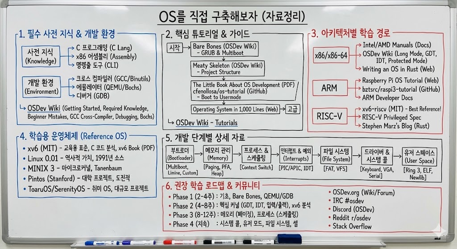

# OS를 직접 구축해보자 (자료정리)

> **Summary**
> 운영체제 개발을 위한 필수 지식, 튜토리얼, 아키텍처별 학습 경로, 학습용 프로젝트, 개발 단계별 자료, 교재 및 강좌, 개발 환경과 디버깅, 커뮤니티 지원, 권장 학습 로드맵, 아키텍처 선택 가이드를 포함한 포괄적인 자료를 제공. 각 단계에서 필요한 리소스와 링크를 통해 운영체제 구축의 기초부터 고급 기능까지 체계적으로 학습할 수 있도록 안내.

---

[https://www.perplexity.ai/search/0dc30e87-9cb3-4b9f-9b3e-6718de2710bc](https://www.perplexity.ai/search/0dc30e87-9cb3-4b9f-9b3e-6718de2710bc)

[https://claude.ai/public/artifacts/5542f2f9-02e3-42ad-a26d-38f791034188](https://claude.ai/public/artifacts/5542f2f9-02e3-42ad-a26d-38f791034188)

## 1. 필수 사전 지식 및 개발 환경 구축

커널 코드를 작성하기 전에 반드시 갖춰야 할 세 가지 요소가 있습니다: 크로스 컴파일러 툴체인, 테스트용 에뮬레이터, 그리고 C와 어셈블리에 대한 기초 지식입니다.

| 자료명 | 링크 | 비고 |
| --- | --- | --- |
| OSDev Wiki - Getting Started | https://wiki.osdev.org/Getting_Started | OS 개발의 출발점. 필수 전제조건과 일반적인 실수들을 정리. 모든 초보자가 반드시 먼저 읽어야 할 문서 |
| OSDev Wiki - Required Knowledge | https://wiki.osdev.org/Required_Knowledge | C 프로그래밍, x86 어셈블리 기초, 16진수 표기법, 명령줄 도구 숙달 등 구체적인 선행 지식 명시 |
| OSDev Wiki - Beginner Mistakes | https://wiki.osdev.org/Beginner_Mistakes | 거의 모든 초보자가 빠지는 함정들을 문서화. 시스템 GCC 대신 크로스 컴파일러를 사용해야 하는 이유 등 핵심 실수 방지 |
| OSDev Wiki - GCC Cross-Compiler | https://wiki.osdev.org/GCC_Cross-Compiler | 크로스 컴파일러 빌드 가이드. 32비트는 `i686-elf`, 64비트는 `x86_64-elf` 타겟 사용. Binutils와 GCC를 소스에서 컴파일하는 전체 과정 안내 |
| OSDev Wiki - Kernel Debugging | https://wiki.osdev.org/Kernel_Debugging | QEMU+GDB 디버깅 워크플로우 설명. `qemu-system-x86_64 -s -S` 옵션으로 GDB 원격 연결 가능 |
| OSDev Wiki - Bochs | https://wiki.osdev.org/Bochs | 명령어 단위 스테핑과 내장 그래픽 디버거를 제공하는 Bochs 에뮬레이터 설정 가이드. 부트 시퀀스 버그 추적에 탁월 |
| OSDev Wiki - Linker Scripts | https://wiki.osdev.org/Linker_Scripts | 커널 메모리 레이아웃 지정을 위한 링커 스크립트 작성법. 섹션 정렬, 심볼 정의, Higher-half 커널 구현에 필수 |

---

## 2. 핵심 튜토리얼 및 단계별 가이드

체계적인 학습을 위한 최고 수준의 튜토리얼 자료들입니다.

| 자료명 | 링크 | 비고 |
| --- | --- | --- |
| The Little Book About OS Development | https://littleosbook.github.io/ | 스웨덴 왕립공과대학에서 개발. 부트부터 유저 모드까지 14개 챕터로 완전한 경로 제시. 프레임버퍼 드라이버, GDT 설정, 인터럽트, 페이징, 시스템 콜까지 작동하는 코드 예제 포함 |
| cfenollosa/os-tutorial (GitHub) | https://github.com/cfenollosa/os-tutorial | 약 29,600 스타. 24개의 5-15분짜리 점진적 레슨으로 구성. GRUB 없이 원시 부트 섹터부터 시작하여 인터럽트 처리와 키보드 입력을 갖춘 C 커널까지 빌드. 빠른 시작에 이상적 |
| Operating System in 1,000 Lines | https://operating-system-in-1000-lines.vercel.app/en | 컨텍스트 스위칭, 페이징, 셸, 파일 I/O를 갖춘 기능적 커널이 놀랍도록 적은 코드로 가능함을 보여줌. 디버깅 기법 강조. 자신감 구축에 최적 |
| OSDev Wiki - Bare Bones | https://wiki.osdev.org/Bare_Bones | GRUB과 Multiboot을 사용한 최소 32비트 커널 생성. OSDev Wiki의 공식 시작점으로 권장되는 첫 번째 튜토리얼 |
| OSDev Wiki - Limine Bare Bones | https://wiki.osdev.org/Limine_Bare_Bones | 모던 64비트 Higher-half 커널 접근법. Limine 부트로더 사용. 64비트 개발 시작점으로 추천 |
| OSDev Wiki - Meaty Skeleton | https://wiki.osdev.org/Meaty_Skeleton | 실제 성장하는 OS에 필요한 적절한 프로젝트 구조 확립. Bare Bones 이후 진행할 두 번째 튜토리얼 |
| OSDev Wiki - Tutorials 목록 | https://wiki.osdev.org/Tutorials | 모든 OSDev 튜토리얼의 종합 목록. 주제별로 분류되어 필요한 특정 기능 구현 시 참조 |
| BrokenThorn OS Development Series | http://www.brokenthorn.com/Resources/OSDevIndex.html | 매우 상세한 x86 OS 개발 시리즈. 부트로더부터 메모리 관리, 파일 시스템까지 30개 이상의 챕터로 구성 |

---

## 3. 아키텍처별 학습 경로

### 3.1 x86/x86-64 아키텍처

수십 년간의 하위 호환성으로 인해 복잡한 부트 시퀀스를 가지지만, 자료가 가장 풍부합니다.

| 자료명 | 링크 | 비고 |
| --- | --- | --- |
| Intel Software Developer Manuals | https://www.intel.com/content/www/us/en/developer/articles/technical/intel-sdm.html | x86/x86-64의 권위 있는 참조 문서. Volume 3: System Programming Guide가 OS 개발에 핵심. GDT, IDT, 페이징, 인터럽트 등 모든 세부사항 수록 |
| AMD64 Architecture Programmer's Manual | https://developer.amd.com/resources/developer-guides-manuals/ | Long Mode(64비트) 세부사항에 필수. AMD 고유 기능과 SYSCALL/SYSRET 명령어 문서화 |
| OSDev Wiki - Setting Up Long Mode | https://wiki.osdev.org/Setting_Up_Long_Mode | 64비트 전환 과정 설명. PAE 페이징 활성화, EFER.LME 비트 설정 등 단계별 가이드 |
| OSDev Wiki - GDT Tutorial | https://wiki.osdev.org/GDT_Tutorial | Global Descriptor Table 설정 가이드. C 코드 생성기 포함. 메모리 세그먼테이션 이해에 필수 |
| Writing an OS in Rust (os.phil-opp.com) | https://os.phil-opp.com/ | Rust 기반이지만 x86-64 개념 설명이 탁월. Long Mode 진입, 페이징, 인터럽트 처리의 깔끔한 구현 예시. C 개발자도 참고 가치 높음 |
| OSDev Wiki - Protected Mode | https://wiki.osdev.org/Protected_Mode | Real Mode에서 Protected Mode로의 전환 과정 상세 설명 |
| OSDev Wiki - Interrupt Descriptor Table | https://wiki.osdev.org/Interrupt_Descriptor_Table | IDT 설정 및 인터럽트 핸들러 등록 방법 |

### 3.2 ARM 아키텍처

Exception Level 모델(EL0-EL3)이 x86의 Ring 시스템보다 깔끔한 권한 분리를 제공합니다. Raspberry Pi를 통한 실제 하드웨어 학습이 가장 접근성이 좋습니다.

| 자료명 | 링크 | 비고 |
| --- | --- | --- |
| Raspberry Pi OS Tutorial | https://s-matyukevich.github.io/raspberry-pi-os/ | OS 개념을 가르치면서 Linux 커널 구현과 명시적으로 비교. 부트, UART, 인터럽트, 프로세스 스케줄링, 가상 메모리를 Raspberry Pi 3 AArch64 모드로 구현 |
| bztsrc/raspi3-tutorial (GitHub) | https://github.com/bztsrc/raspi3-tutorial | Raspberry Pi 3 부트 프로세스, GPU 메일박스 통신, 인터럽트 처리의 포괄적인 커버리지 |
| babbleberry/rpi4-osdev (GitHub) | https://github.com/babbleberry/rpi4-osdev | Raspberry Pi 4의 Cortex-A72 프로세서 타겟. 초보자 친화적 설명과 함께 실제 하드웨어에서 OS 개발 경험 |
| ARM Developer Documentation | https://developer.arm.com/documentation | AArch64 예외 모델, TTBR0/TTBR1 레지스터를 통한 MMU 구성, 벡터 테이블 설정 등 공식 문서 |
| Circle C++ Library (GitHub) | https://github.com/rsta2/circle | Raspberry Pi용 완전한 베어메탈 환경. 특정 컴포넌트에 집중하고 싶을 때 모든 것을 직접 빌드하지 않고 사용 가능 |
| OSDev Wiki - ARM Overview | https://wiki.osdev.org/ARM_Overview | ARM 아키텍처 OS 개발 개요. 부트 프로세스, 메모리 맵, 인터럽트 컨트롤러 등 기본 개념 |

### 3.3 RISC-V 아키텍처

깔끔하고 현대적인 설계로 x86의 역사적 복잡성 없이 OS 기본 원리를 배우기에 이상적입니다.

| 자료명 | 링크 | 비고 |
| --- | --- | --- |
| xv6-riscv (MIT) | https://github.com/mit-pdos/xv6-riscv | RISC-V OS 교육의 황금 표준. MIT 6.S081 과정에서 사용. 약 10,000줄의 Unix-like 커널. 동반 교재가 모든 측면을 설명 |
| RISC-V Privileged Specification | https://riscv.org/technical/specifications/ | Sv32, Sv39, Sv48, Sv57 페이징 스킴 문서화. `satp` CSR이 주소 변환 제어, `stvec`과 `sepc`가 트랩 처리 관리 |
| Stephen Marz's OS Blog | https://osblog.stephenmarz.com/ | RISC-V OS를 Rust로 빌드하는 과정. 부트로딩, 페이징, 프로세스 스케줄링, 파일시스템을 탁월한 명확성으로 설명. C 개발자도 개념 이해에 유용 |
| RISC-V GNU Toolchain (GitHub) | https://github.com/riscv-collab/riscv-gnu-toolchain | RISC-V용 GCC 크로스 컴파일러 빌드를 위한 공식 저장소 |
| Five EmbedDev - RISC-V Privileged Manual | https://five-embeddev.com/riscv-priv-isa-manual/ | RISC-V 특권 아키텍처 매뉴얼의 웹 버전. Machine/Supervisor/User 모드와 CSR 인터페이스 상세 설명 |
| OSDev Wiki - RISC-V | https://wiki.osdev.org/RISC-V | RISC-V OS 개발 개요. 부트 프로세스, OpenSBI, QEMU virt 머신 사용법 |

---

## 4. 학습용 운영체제 프로젝트

실제 OS 코드를 분석하며 배우는 것이 가장 효과적인 학습 방법입니다.

| 자료명 | 링크 | 비고 |
| --- | --- | --- |
| xv6-public (MIT x86 버전) | https://github.com/mit-pdos/xv6-public | 전 세계 100개 이상 대학에서 사용되는 교육용 OS. 약 10,000줄 C 코드로 프로세스, 가상 메모리, 파일시스템, 멀티프로세서 지원 구현. 동반 교재가 소스 코드를 라인별로 해설 |
| xv6 Book (PDF) | https://pdos.csail.mit.edu/6.828/2023/xv6/book-riscv-rev3.pdf | xv6 공식 교재. 모든 주요 서브시스템을 상세히 설명. OS 개발자 필독서 |
| Linux 0.01 Source | https://cdn.kernel.org/pub/linux/kernel/Historic/ | 1991년 리누스 토르발즈의 최초 Linux 릴리스. 약 10,000줄로 부트스트랩 시퀀스, 프로세스 스케줄러, MINIX 파일시스템 지원, 기본 시스템 콜 포함. 역사적 관점 학습에 유용 |
| MINIX 3 | https://www.minix3.org/ | 마이크로커널 아키텍처 시연. 드라이버가 유저 공간에서 실행. 메시지 패싱 IPC, 재생성 서버를 통한 자가 치유 기능. Andrew Tanenbaum이 개발 |
| MINIX 공식 Wiki | https://wiki.minix3.org/ | MINIX 3 문서 및 개발 가이드 |
| Pintos (Stanford) | https://pintos-os.org/ | Stanford의 교육용 OS. 스레드 스케줄링, 유저 프로그램, 가상 메모리, 파일시스템의 도전적인 프로젝트 제공. 50개 이상 대학에서 사용. 프로젝트당 40시간 이상 소요되지만 진정한 커널 해킹 스킬 개발 |
| ToaruOS (GitHub) | https://github.com/klange/toaruos | 완전한 취미 OS. SMP 지원, 합성 윈도잉 시스템, 네트워크 스택, 커스텀 프로그래밍 언어까지 약 100,000줄 C로 외부 의존성 없이 구현. 완전한 시스템 구현의 참조 모델 |
| SerenityOS | https://serenityos.org/ | 모던 취미 OS. 완전한 데스크톱 환경, 웹 브라우저, 광범위한 문서 제공. 활발한 기여자 커뮤니티로 학습과 참여 모두 가능 |

---

## 5. 개발 단계별 상세 자료

### 5.1 부트로더 개발

| 자료명 | 링크 | 비고 |
| --- | --- | --- |
| GNU Multiboot Specification | https://www.gnu.org/software/grub/manual/multiboot/ | GRUB과 커널 간 인터페이스 정의. Multiboot 호환 커널 작성의 공식 표준 |
| Limine Bootloader (GitHub) | https://github.com/limine-bootloader/limine | 모던 부트 프로토콜 지원. GRUB의 32비트 제한 없이 64비트 개발에 적합. 활발한 개발 진행 중 |
| OSDev Wiki - Rolling Your Own Bootloader | https://wiki.osdev.org/Rolling_Your_Own_Bootloader | 커스텀 부트로더 개발 가이드. MBR 구조, BIOS 인터럽트를 통한 디스크 읽기, Protected Mode 전환 설명 |
| OSDev Wiki - Bootloader | https://wiki.osdev.org/Bootloader | 부트로더 개념 개요. BIOS vs UEFI, 부트 섹터 구조, 메모리 맵 등 |
| Writing a Simple OS from Scratch (Birmingham Univ.) | https://www.cs.bham.ac.uk/~exr/lectures/opsys/10_11/lectures/os-dev.pdf | 부트 섹터 기초부터 설명하는 PDF 강의자료. 모든 바이트를 이해하고 싶은 분들에게 추천 |

### 5.2 메모리 관리

| 자료명 | 링크 | 비고 |
| --- | --- | --- |
| OSDev Wiki - Memory Management | https://wiki.osdev.org/Memory_Management | 메모리 관리 개요. 물리/가상 메모리, 세그먼테이션, 페이징 개념 정리 |
| OSDev Wiki - Writing A Page Frame Allocator | https://wiki.osdev.org/Writing_A_Page_Frame_Allocator | 물리 메모리 할당기 구현 가이드. 비트맵 기반 및 버디 할당기 구현 전략 |
| Brendan's Memory Management Guide | https://wiki.osdev.org/Brendan%27s_Memory_Management_Guide | 메모리 관리의 포괄적인 가이드. 물리/가상 메모리 할당 전략 상세 설명 |
| OSDev Wiki - Paging | https://wiki.osdev.org/Paging | 페이지 디렉토리/테이블 생성, 커널 아이덴티티 매핑, CR0의 PG 비트 활성화 과정 설명 |
| OSDev Wiki - Higher Half Kernel | https://wiki.osdev.org/Higher_Half_Kernel | 커널을 0xC0000000(32비트) 또는 0xFFFF800000000000(64비트)에 배치하는 Higher-half 커널 구현 |
| OSDev Wiki - Heap | https://wiki.osdev.org/Heap | malloc/free 구현 가이드. sbrk 스타일 확장과 프리 리스트/슬랩 할당기 설명 |

### 5.3 프로세스 스케줄링 및 컨텍스트 스위칭

| 자료명 | 링크 | 비고 |
| --- | --- | --- |
| Brendan's Multi-tasking Tutorial | https://wiki.osdev.org/Brendan%27s_Multi-tasking_Tutorial | 컨텍스트 스위칭의 가장 포괄적인 단계별 가이드. 하드웨어/소프트웨어 태스크 스위칭 모두 커버 |
| OSDev Wiki - Context Switching | https://wiki.osdev.org/Context_Switching | CPU 상태(레지스터, 스택 포인터, 페이지 테이블 베이스) 저장/복원 과정 설명 |
| OSDev Wiki - Scheduling Algorithms | https://wiki.osdev.org/Scheduling_Algorithms | 라운드 로빈, 우선순위 기반, 다단계 피드백 큐 등 스케줄러 구현 방법 |
| OSDev Wiki - Kernel Multitasking | https://wiki.osdev.org/Kernel_Multitasking | 커널 레벨 멀티태스킹 구현 가이드 |

### 5.4 인터럽트 처리

| 자료명 | 링크 | 비고 |
| --- | --- | --- |
| OSDev Wiki - 8259 PIC | https://wiki.osdev.org/8259_PIC | 레거시 시스템의 Programmable Interrupt Controller 초기화 시퀀스. 16개 IRQ 라인, CPU 예외와의 충돌 방지를 위한 리매핑 필요 |
| OSDev Wiki - APIC | https://wiki.osdev.org/APIC | 모던 시스템의 Advanced PIC. SMP 지원과 더 많은 인터럽트 소스 제공 |
| OSDev Wiki - I/O APIC | https://wiki.osdev.org/IOAPIC | I/O APIC를 통한 모던 인터럽트 라우팅 |
| OSDev Wiki - Interrupts | https://wiki.osdev.org/Interrupts | 인터럽트 개념 개요. 하드웨어/소프트웨어 인터럽트, 예외 처리 |
| OSDev Wiki - Exceptions | https://wiki.osdev.org/Exceptions | CPU 예외(Page Fault, General Protection Fault 등) 처리 가이드 |

### 5.5 파일 시스템 구현

| 자료명 | 링크 | 비고 |
| --- | --- | --- |
| Microsoft FAT Specification (fatgen103.doc) | https://download.microsoft.com/download/1/6/1/161ba512-40e2-4cc9-843a-923143f3456c/fatgen103.doc | FAT 파일시스템 공식 스펙. 온디스크 구조, 클러스터 체인, 디렉토리 엔트리 문서화 |
| OSDev Wiki - FAT | https://wiki.osdev.org/FAT | FAT12/16/32 구현 가이드. 읽기 전용 FAT16부터 시작하여 쓰기 지원과 FAT32까지 확장 권장 |
| OSDev Wiki - Virtual File System | https://wiki.osdev.org/Virtual_File_System | VFS 레이어 구현. 다양한 파일시스템 타입 추상화 패턴 설명 |
| OSDev Wiki - Ext2 | https://wiki.osdev.org/Ext2 | Linux의 기본 파일시스템 Ext2 구현 가이드 |

### 5.6 디바이스 드라이버 및 시스템 콜

| 자료명 | 링크 | 비고 |
| --- | --- | --- |
| OSDev Wiki - PS/2 Keyboard | https://wiki.osdev.org/"8042"_PS/2_Controller | PS/2 키보드 핸들링. IRQ1 후 포트 0x60에서 스캔코드 읽기 |
| OSDev Wiki - VGA Text Mode | https://wiki.osdev.org/Text_Mode | VGA 텍스트 모드 출력. 0xB8000 메모리에 직접 쓰기 |
| OSDev Wiki - Serial Ports | https://wiki.osdev.org/Serial_Ports | COM1(0x3F8)을 통한 시리얼 포트 디버깅. QEMU 터미널에 출력 가능 |
| OSDev Wiki - System Calls | https://wiki.osdev.org/System_Calls | 시스템 콜 구현. 전통적 INT 0x80 방식과 모던 SYSENTER/SYSCALL 비교 |
| OSDev Wiki - SYSENTER | https://wiki.osdev.org/SYSENTER | Intel의 빠른 시스템 콜 명령어 SYSENTER/SYSEXIT 구현 |

### 5.7 유저 스페이스 및 셸 구현

| 자료명 | 링크 | 비고 |
| --- | --- | --- |
| OSDev Wiki - Getting to Ring 3 | https://wiki.osdev.org/Getting_to_Ring_3 | 유저 모드 전환 가이드. 유저 스택 설정, TSS 구성, IRET을 통한 Ring 3 점프 |
| OSDev Wiki - ELF | https://wiki.osdev.org/ELF | ELF 실행 파일 포맷 개요 |
| OSDev Wiki - ELF Tutorial | https://wiki.osdev.org/ELF_Tutorial | ELF 로더 구현. 프로그램 헤더 파싱, PT_LOAD 세그먼트 로딩, BSS 제로화, 엔트리 포인트 점프 |
| OSDev Wiki - Porting Newlib | https://wiki.osdev.org/Porting_Newlib | Newlib C 라이브러리 포팅 가이드. printf, malloc 등 표준 함수 활성화를 위한 시스템 콜 스텁 구현 |
| OSDev Wiki - Creating a C Library | https://wiki.osdev.org/Creating_a_C_Library | 자체 C 라이브러리 구현 가이드 |

---

## 6. 교재 및 대학 강좌

### 6.1 필수 교재

| 자료명 | 링크 | 비고 |
| --- | --- | --- |
| Operating Systems: Three Easy Pieces (OSTEP) | https://pages.cs.wisc.edu/~remzi/OSTEP/ | 위스콘신 매디슨 대학의 **무료** OS 교재. 가상화, 동시성, 영속성을 숙제 시뮬레이터와 xv6 기반 프로젝트로 설명. 수백만 다운로드. 2023년 11월 업데이트로 보안 챕터 추가. **강력 추천** |
| Operating System Concepts (공룡책) | https://www.os-book.com/ | 업계 표준 종합 참조서. 10판. 이론적이지만 시험 준비와 광범위한 케이스 스터디에 탁월. 유료 ($100-150) |
| Modern Operating Systems (Tanenbaum) | https://www.pearson.com/en-us/subject-catalog/p/modern-operating-systems/P200000003295/ | 4판. 명확한 개념 설명과 Tanenbaum의 매력적인 글쓰기 스타일. 유료 |
| Operating Systems: Design and Implementation | PDF 검색 가능 | Tanenbaum의 또 다른 명작. 이론과 MINIX 소스 코드를 직접 연결. 추상화와 구현 사이를 연결하는 유일한 교재 |

### 6.2 대학 강좌 (무료 공개)

| 자료명 | 링크 | 비고 |
| --- | --- | --- |
| MIT 6.S081 Operating System Engineering | https://pdos.csail.mit.edu/6.S081/2022/ | 최고의 무료 OS 강좌. YouTube 강의 영상, xv6 교재, 11개 랩 과제 포함. 시스템 콜부터 네트워크 스택까지 커버. 선수과목: 컴퓨터 아키텍처, C 프로그래밍 |
| MIT 6.828 (이전 버전) | https://pdos.csail.mit.edu/6.828/2018/ | 6.S081의 이전 버전. x86 기반 xv6 사용. 추가 자료와 다른 관점 제공 |
| Georgia Tech OMSCS Open Courseware | https://sites.gatech.edu/omscsopencourseware/ | CS 6200(Introduction to OS), CS 6210(Advanced OS) 대학원 수준 콘텐츠 무료 제공. 멀티스레드 웹 서버, gRPC 분산 파일시스템 프로젝트 포함 |
| Berkeley CS162 | https://cs162.org/ | Berkeley의 OS 과정. 강의 영상, 프로젝트, 자료 일부 공개 |
| Stanford CS140 (Pintos) | https://web.stanford.edu/class/cs140/ | Pintos 프로젝트 기반 OS 과정. 도전적인 프로젝트로 유명 |

### 6.3 한국어 자료

| 자료명 | 링크 | 비고 |
| --- | --- | --- |
| KOCW 운영체제 강의 (이화여대 반효경 교수) | http://www.kocw.net/home/search/kemView.do?kemId=1046323 | 한국어로 된 OS 기초 강의. 공룡책 기반으로 핵심 개념을 명확히 설명. **무료** |
| 인프런 - 운영체제 공룡책 강의 | https://www.inflearn.com/course/운영체제-공룡책-전공강의 | Silberschatz 교재 기반 한국어 강의. WSL2를 사용한 Linux 실습 포함. 무료 |
| 혼자 공부하는 컴퓨터구조 + 운영체제 (인프런) | https://www.inflearn.com/course/혼자-공부하는-컴퓨터구조-운영체제 | 비전공자 대상 한국어 강의. 베스트셀러 한국 교재 기반. 저자 직접 강의 |
| KLDP (Korea Linux Documentation Project) | https://kldp.org/ | 한국 Linux 개발자 커뮤니티. OS 개발 주제 포함 토론 |

---

## 7. 개발 환경 및 디버깅

| 자료명 | 링크 | 비고 |
| --- | --- | --- |
| QEMU Official Documentation | https://www.qemu.org/docs/master/ | 주요 테스트 에뮬레이터. `qemu-system-x86_64 -s -S -kernel kernel.elf`로 GDB 디버깅 세션 시작. 빠른 속도와 우수한 GDB 통합 |
| GNU GDB Documentation | https://www.gnu.org/software/gdb/documentation/ | GDB 공식 문서. `target remote :1234`로 QEMU 연결, `break kmain`으로 브레이크포인트, `info registers`로 CPU 상태 확인 |
| Bochs Emulator | https://bochs.sourceforge.io/ | 명령어 레벨 스테핑과 내장 디버거 제공. `--enable-debugger --enable-debugger-gui`로 컴파일. `xchg bx, bx` 매직 브레이크포인트 지원 |
| OSDev Wiki - QEMU | https://wiki.osdev.org/QEMU | QEMU OS 개발 활용 가이드. 다양한 옵션과 디버깅 기법 |
| OSDev Wiki - GDB | https://wiki.osdev.org/GDB | GDB를 이용한 커널 디버깅 가이드 |
| GNU Make Manual | https://www.gnu.org/software/make/manual/ | Makefile 작성 공식 문서. `-ffreestanding -nostdlib` 플래그 사용 등 OS 빌드 시스템 구축에 필수 |

---

## 8. 커뮤니티 및 지원

| 자료명 | 링크 | 비고 |
| --- | --- | --- |
| OSDev.org Wiki | https://wiki.osdev.org/ | OS 개발의 주요 커뮤니티 허브. 수천 개의 문서가 모든 OS 개발 주제 커버. 경험 많은 개발자들이 지속적으로 유지보수 |
| OSDev.org Forums | https://forum.osdev.org/ | 특정 질문에 대한 도움 제공. 보통 몇 시간 내 응답. 질문 전 검색, 완전한 정보 제공, 시도한 해결책 제시 등 포럼 에티켓 준수 필요 |
| IRC #osdev on Libera.Chat | libera.irclog.whitequark.org/osdev | 20년 이상 경험의 개발자들과 실시간 토론. 로그 아카이브 제공 |
| Operating System Development Discord | https://discord.com/invite/osdev | 약 12,400명 회원. 주제와 아키텍처별 채널로 구성. IRC보다 접근성 좋음 |
| Reddit r/osdev | https://www.reddit.com/r/osdev/ | 프로젝트 쇼케이스와 질문 공유. 초보자와 베테랑 혼합 커뮤니티 |
| Stack Overflow (osdev 태그) | https://stackoverflow.com/questions/tagged/osdev | `osdev`, `kernel`, `bootloader` 태그. 높은 질문 품질 기준이지만 권위 있는 답변 제공 |

---

## 9. 권장 학습 로드맵

### Phase 1: 기초 다지기 (2-4주)

1. OSDev Wiki의 "Getting Started", "Required Knowledge", "Beginner Mistakes" 읽기
1. GCC 크로스 컴파일러 빌드 (wiki.osdev.org/GCC_Cross-Compiler)
1. "Bare Bones" 튜토리얼 완료하여 QEMU에서 최소 커널 실행
1. GDB 디버깅 워크플로우 설정
### Phase 2: 핵심 커널 구현 (4-8주)

1. "The Little Book About OS Development" 또는 cfenollosa의 os-tutorial 진행
1. GDT, IDT, PIC 프로그래밍 구현
1. 키보드 입력과 VGA 텍스트 출력 추가
1. xv6 소스 코드를 참조 구현으로 학습
### Phase 3: 메모리와 프로세스 (8-12주)

1. 페이징과 페이지 프레임 할당기 구현
1. 가상 주소 공간 생성
1. 컨텍스트 스위칭과 기본 스케줄러 추가
1. 64비트(Long Mode) 포팅 또는 ARM/RISC-V 시도
### Phase 4: 고급 기능 (지속)

1. 시스템 콜과 유저 모드 구현
1. ELF 실행 파일 로딩
1. Newlib 포팅으로 C 라이브러리 지원
1. 파일시스템(FAT) 추가
1. 간단한 셸 빌드
1. SMP 지원, 네트워킹, 그래픽 출력 탐색
---

## 10. 아키텍처 선택 가이드

| 아키텍처 | 장점 | 추천 대상 |
| --- | --- | --- |
| **RISC-V + xv6-riscv** | 현대적 설계, 탁월한 문서화, 가장 깔끔한 학습 경험 | OS 기본 원리 학습에 집중하고 싶은 분 |
| **x86-64** | 가장 풍부한 커뮤니티 자료, 모든 PC에서 실행 가능 | 실용적 지식과 광범위한 지원 원하는 분 |
| **ARM + Raspberry Pi** | 실제 하드웨어 제공, 임베디드 시스템 연관성 | 실물 장치에서 OS 실행 경험 원하는 분 |

