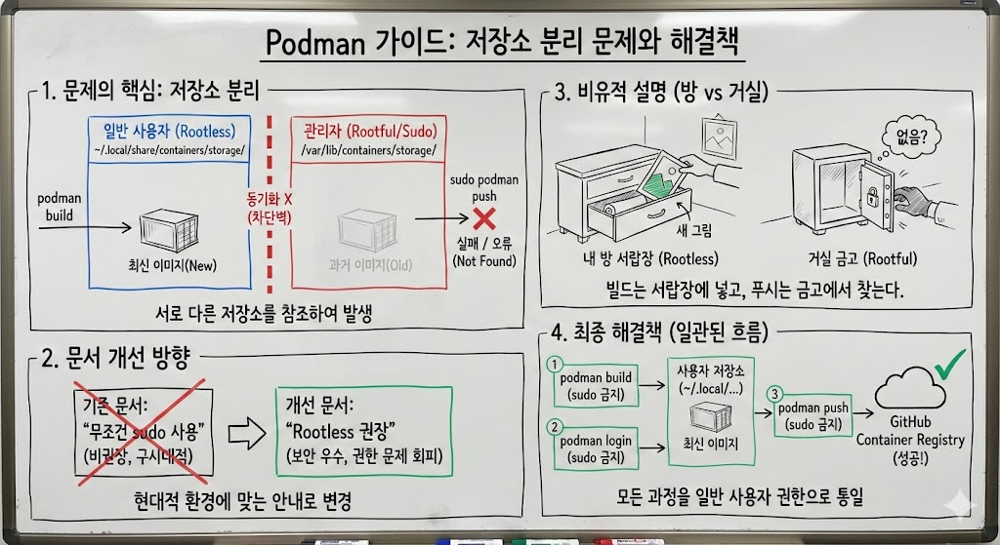
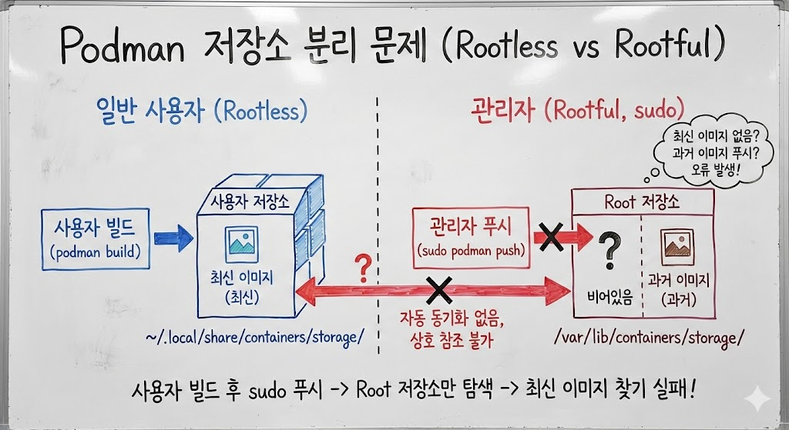

# Podman에서 sudo 붙이고 안붙이고 뭔 차이임? Rootless와 Rootful 모드 간 저장소 분리 문제

> **Summary**
> Podman의 Rootless와 Rootful 모드 간 저장소 분리 문제는 사용자 권한에 따라 이미지 저장소가 다르게 운영되어 발생한다. 사용자가 sudo 없이 이미지를 빌드하면 사용자 저장소에 저장되고, sudo로 푸시할 경우 root 저장소만 탐색하여 오류가 발생할 수 있다. 해결책은 모든 Podman 작업을 일반 사용자 권한으로 일관되게 수행하는 것으로, 이를 통해 저장소 불일치 문제를 해소할 수 있다.

---

## [주제 1: Podman의 Rootless와 Rootful 모드 간 저장소 분리 문제]

이 논의의 출발점은 컨테이너 이미지 배포 과정에서 발생한 원인 불명의 실패였다. 사용자가 `podman build` 명령으로 이미지를 생성한 뒤 `sudo podman push`로 GitHub Container Registry에 업로드하려 했으나, 예상과 다른 결과가 나타났다. 이미지가 존재하지 않는다는 오류가 발생하거나, 푸시가 성공한 것처럼 보이지만 실제로는 의도한 최신 이미지가 아닌 과거 버전이 업로드되는 현상이 관찰되었다.

문제의 근본 원인은 Podman의 저장소 아키텍처에 있었다. Podman은 일반 사용자(Rootless)와 관리자 권한(Rootful) 환경의 이미지 저장소를 물리적으로 완전히 분리하여 운영한다. 일반 사용자가 빌드한 이미지는 `~/.local/share/containers/storage/` 경로에 저장되고, root 권한으로 빌드한 이미지는 `/var/lib/containers/storage/`에 저장된다. 두 저장소 사이에는 어떠한 자동 동기화도 이루어지지 않으며, 상호 참조도 불가능하다.

따라서 사용자가 `sudo` 없이 빌드를 수행하면 이미지는 사용자 저장소에만 존재하게 된다. 이후 `sudo podman push`를 실행하면, 이 명령은 root 저장소만을 탐색하므로 방금 빌드한 이미지를 찾지 못한다. root 저장소에 동일한 태그의 과거 이미지가 남아있다면 그것이 대신 푸시되고, 아무것도 없다면 "image not known" 오류가 발생하는 것이다.

## [주제 2: 기존 문서의 한계와 개선 방향]

기존 트러블슈팅 문서(07-troubleshooting.md)에는 이미 "Rootless vs Rootful 불일치" 항목이 존재했다. 그러나 해당 문서는 해결책으로 "모든 과정에서 sudo를 일관되게 사용하라"고 권고하고 있었다. 이 조언은 기술적으로는 틀리지 않으나, 현대 RHEL/CentOS 환경에서 Rootless 모드가 기본값이자 권장 방식이라는 점을 고려하면 최선의 안내가 아니었다.

Rootless 모드는 보안상 더 안전하고, 홈 디렉토리 내 파일 권한 문제를 회피할 수 있으며, 사용자가 이미 암묵적으로 채택하고 있던 작업 방식이기도 했다. 따라서 문서를 수정하여 "둘 중 하나를 선택하되 일관성을 유지하라, 그리고 Rootless를 권장한다"는 방향으로 안내를 개선하기로 결정되었다.

## [주제 3: 개념 전달을 위한 비유적 설명]

사용자가 podman, build, push, sudo 간의 관계를 근본적으로 이해하지 못하고 있다는 점이 파악되었다. 이에 따라 기술적 용어를 물리적 공간에 대입한 비유가 제시되었다.

일반 사용자 환경은 "본인 방의 서랍장"에, root 환경은 "거실의 금고"에 비유되었다. `podman build`를 sudo 없이 실행하면 새 이미지(그림)가 본인 방 서랍장에 저장된다. 그런데 `sudo podman push`를 실행하면 시스템은 거실 금고에서 그림을 찾아 외부로 발송하려 한다. 금고에는 어제 작업한 낡은 그림만 있거나 아예 비어있으므로, 의도한 결과를 얻을 수 없다.

## [주제 4: 최종 해결책]

권장되는 해결책은 모든 Podman 작업을 일반 사용자 권한으로 일관되게 수행하는 것이다. 구체적인 명령어 순서는 다음과 같다. 먼저 `podman login ghcr.io -u [사용자명]`으로 레지스트리에 인증하고, 이후 `podman push [이미지 경로]`로 푸시를 수행한다. 두 명령 모두 sudo를 붙이지 않는다. 이렇게 하면 빌드와 푸시가 동일한 저장소를 참조하게 되어 불일치 문제가 원천적으로 해소된다. 해당 내용은 트러블슈팅 문서에 반영 완료되었다.

