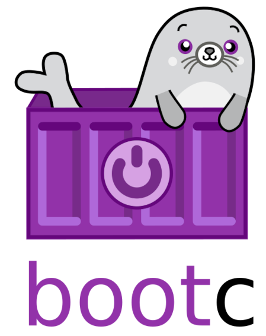

# Podman에서 sudo를 붙였을때와 붙이지 않았을때, 이미지가 저장되는 위치가 다르다고?

> **Summary**
> Podman은 rootful과 rootless 모드에 따라 이미지 저장소가 다르며, ISO 빌드를 위해서는 sudo 사용이 필수적이다. 운영체제에 따라 sudo의 의미가 달라지고, 모든 작업에서 권한 일관성을 유지해야 한다. ISO 제작 과정에서는 로그인부터 이미지 생성 및 배포까지 모든 단계를 rootful 모드로 통일하는 것이 가장 효율적이다.

---

## [주제 1: Podman의 권한 모드에 따른 이미지 저장소 분리 구조]

Podman은 실행 권한에 따라 **rootful(sudo 사용)**과 rootless(일반 사용자) 두 가지 모드로 동작하며, 각 모드는 서로 완전히 독립된 이미지 저장소를 사용한다. rootful 모드로 실행할 경우 이미지는 시스템 영역인 /var/lib/containers/storage에 저장되는 반면, rootless 모드에서는 해당 사용자의 홈 디렉터리 하위인 $HOME/.local/share/containers/storage에 저장된다. 이러한 구조적 차이로 인해 특정 권한으로 빌드한 이미지는 다른 권한 모드에서 조회하거나 사용할 수 없으며, 이는 전체 워크플로우에서 권한 일관성을 유지해야 하는 근본적인 이유가 된다.

## [주제 2: ISO 빌드 워크플로우에서 sudo 사용의 필연성]

최종 결과물로 ISO 또는 디스크 이미지를 제작하기 위해 bootc-image-builder를 사용하는 경우, 빌드 단계부터 sudo를 사용하는 것이 권장된다. ISO 생성 도구는 루프백 디바이스 마운트 및 파일시스템 제어를 위해 root 권한을 필요로 하며, 효율성을 위해 호스트의 rootful 저장소인 /var/lib/containers/storage를 컨테이너 내부에 직접 마운트하여 참조하기 때문이다. 만약 초기 빌드를 rootless로 수행한다면 ISO 빌드 도구는 이미지를 찾지 못해 실패하게 되며, 이를 해결하기 위해 이미지를 다시 빌드하거나 저장소 간에 복사하는 불필요한 공수가 발생하게 된다.

## [주제 3: 작업 환경에 따른 권한 제어 방식의 차이]

운영체제 환경에 따라 sudo의 적용 의미가 달라진다. WSL2(Windows Subsystem for Linux) 환경에서는 Podman이 리눅스 커널 상에서 직접 구동되므로, sudo 명령어 사용 여부가 곧 rootful 저장소와 rootless 저장소의 선택을 결정한다. 반면 macOS 환경에서는 Podman이 가상 머신(Podman machine) 내에서 원격으로 작동하는 구조이므로, 단순히 sudo를 붙이는 것보다는 Podman machine의 연결 모드를 rootful로 설정하거나 생성하는 것이 핵심이다. 따라서 macOS 사용자는 sudo 명령어 대신 Podman의 연결 설정(Connection)을 확인하여 ISO 빌드 도구가 참조하는 저장소에 이미지가 위치하도록 조절해야 한다.

## [주제 4: 전체 워크플로우 내 권한 일관성 유지]

이미지 빌드 단계에서 sudo를 사용했다면, 이후 이어지는 태그(tag), 푸시(push), 로그인(login) 등 모든 관련 작업에서도 반드시 sudo를 붙여야 한다. sudo podman build로 생성된 이미지는 오직 rootful 저장소에만 존재하므로, 일반 사용자 권한으로 실행하는 podman push 명령어는 해당 이미지를 인식하지 못한다. 또한 레지스트리 인증 정보 역시 각 권한 사용자별로 별도 관리되므로, sudo podman login을 통해 root 사용자의 인증 세션을 확보해야 정상적인 업로드가 가능하다. 요컨대, ISO 제작을 목적으로 하는 일련의 과정에서는 로그인부터 이미지 생성 및 배포까지 모든 단계를 rootful(sudo)로 통일하는 것이 가장 단순하고 오류가 적은 경로이다.

