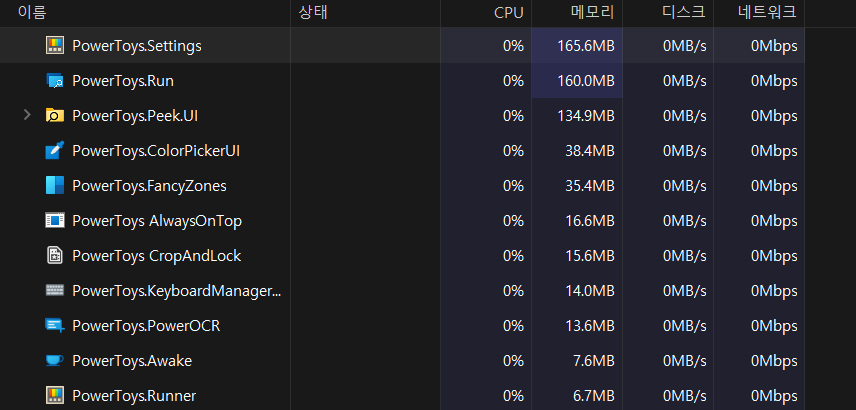

# PowerToys 잡버그 잡기 똥꼬쇼

> **Summary**
> 키보드 핫키 버그 문제를 해결하기 위해 Alt + U와 O를 사용하여 맵핑하는 방법을 제안하며, 특정 명령어가 작동하지 않는 버그를 언급합니다. 버전 0.75.1에서 발생하는 문제는 버전 다운그레이드로도 해결되지 않으며, 0.74.1로 다운그레이드할 경우 상황이 개선된 것으로 보입니다.

---

# 아오 키보드 핫키 버그 왜이렇게 많냐??

# 해결??? 

- Alt + U : home
- Alt + O : End

로 맵핑해놨었는데,,, 이거 남발하다보니

- alt + a : Ctrl + a
- alt + c,v : Ctrl + c,v
이 명령어들이 안먹는 버그들이 있었다…

이거 해결 방법은 그냥 

- alt + i j k l 혹은 
  - (W A S D 처럼 맵핑해둔거임)
- alt + u ,o
남발하니까 버그가 풀리는데,,,, 이거 원리가 뭐지?

→ alt + u 가 좀 더 이 버그에 관련이 있을 것 같다

> Alt + shift + O(home) or U(end) 를 번갈아 누르면 해결됨
이게 무슨 에러일까?

# PowerLancher.exe 의 부재가 원인?

🔗 [https://github.com/microsoft/PowerToys/issues/9017](https://github.com/microsoft/PowerToys/issues/9017)

🔗 [https://github.com/microsoft/PowerToys/issues/9018](https://github.com/microsoft/PowerToys/issues/9018)

# 버전이 문제? (버그발생 빌드 0.75.1)

### → 버전 문제도 아닙니다! 0.74.1 로 다운그레이드해도, 똑같은 문제 발생

🔗 [https://github.com/microsoft/PowerToys/releases](https://github.com/microsoft/PowerToys/releases)

0.74.1 로 다운그레이드 하니까 좀 나아진듯

