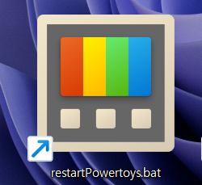
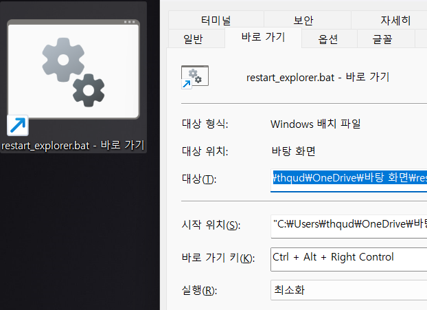

# PowerToys 재시작 배치파일 제작

> **Summary**
> 파일 탐색기 재시작을 위한 배치파일을 만들기 위해 관리자 권한을 요청하는 코드가 포함되어 있으며, PowerToys를 종료하고 다시 시작하는 방법이 설명되어 있습니다. 바탕화면에 배치파일을 두고 숨김 처리하면 깔끔하게 사용할 수 있습니다.

---




# >> 결론적으로, 해당 방법으로는 해결이 불가능했습니다.


# 관리자 권한을 부여해아합니다

🔗 [https://bebhionn.tistory.com/52](https://bebhionn.tistory.com/52)

```powershell
:: BatchGotAdmin
 :-------------------------------------
 REM  --> Check for permissions
 >nul 2>&1 "%SYSTEMROOT%\system32\cacls.exe" "%SYSTEMROOT%\system32\config\system"

REM --> If error flag set, we do not have admin.
 if '%errorlevel%' NEQ '0' (
     echo Requesting administrative privileges...
     goto UACPrompt
 ) else ( goto gotAdmin )

:UACPrompt
     echo Set UAC = CreateObject^("Shell.Application"^) > "%temp%\getadmin.vbs"
     echo UAC.ShellExecute "%~s0", "", "", "runas", 1 >> "%temp%\getadmin.vbs"

    "%temp%\getadmin.vbs"
     exit /B

:gotAdmin
     if exist "%temp%\getadmin.vbs" ( del "%temp%\getadmin.vbs" )
     pushd "%CD%"
     CD /D "%~dp0"
 :--------------------------------------

@echo off

taskkill /F /IM powertoys.exe
start "" "C:\Program Files\PowerToys\PowerToys.exe"

exit
```



> 💡 **귀찮으면 다운 ㄱ**
> ---
>
>


