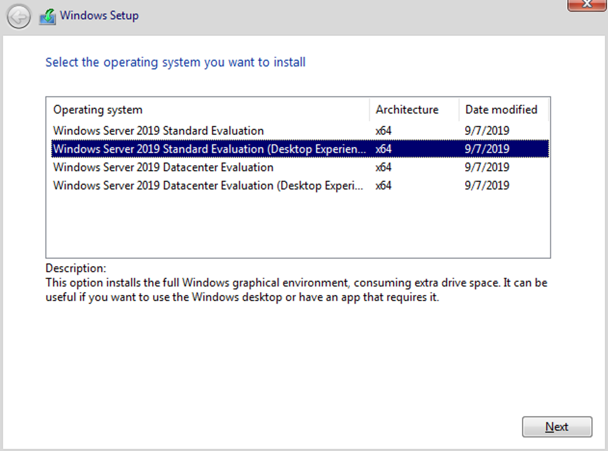

# ProxMox에 각종 VM 생성하기

> **Summary**
> ProxMox에서 다양한 가상 머신을 생성하는 방법에 대한 기초 정보와 링크를 제공하며, 헤놀로지, 데비안, 윈도우 서버, 윈도우 11, 안드로이드 x86 설치 방법과 원격 게이밍 환경 구성에 대한 자료를 포함하고 있습니다.

---

# VM 생성 기초

[https://blog.ny64.kr/posts/creating-proxmox-vm/](https://blog.ny64.kr/posts/creating-proxmox-vm/)

# 헤놀로지

[https://svrforum.com/nas/931043](https://svrforum.com/nas/931043)

[https://betwe.tistory.com/entry/Proxmox-헤놀로지Xpenology-NAS-설치부터-볼륨-생성까지](https://betwe.tistory.com/entry/Proxmox-헤놀로지Xpenology-NAS-설치부터-볼륨-생성까지) ⭐

[https://velog.io/@kisuk623/Proxmox에-Xpenology-설치하기](https://velog.io/@kisuk623/Proxmox에-Xpenology-설치하기)

[https://blog.koder.page/proxmox-xpenology/](https://blog.koder.page/proxmox-xpenology/) ⭐⭐⭐

> 💡 **모델 설정 (난 DS918+ 로 함)**
> ---
>
> [https://svrforum.com/nas/1214548](https://svrforum.com/nas/1214548)
>
>

# 데비안

[https://www.youtube.com/watch?v=XEoO1FgIel4](https://www.youtube.com/watch?v=XEoO1FgIel4)

[https://www.youtube.com/watch?v=g1FXZIvVkq4&t=559s](https://www.youtube.com/watch?v=g1FXZIvVkq4&t=559s)

# 윈도우 서버

데스크탑 버전 이거 깔아야함…

[https://youtu.be/JrIDEH9jsPg?si=uYxLFXtKejlIksbP](https://youtu.be/JrIDEH9jsPg?si=uYxLFXtKejlIksbP)

[https://www.youtube.com/watch?v=5A6pHU7f9n0](https://www.youtube.com/watch?v=5A6pHU7f9n0) ⭐

[https://hasiworld.tistory.com/entry/Windows-Server-core에-GUI-설치-방법](https://hasiworld.tistory.com/entry/Windows-Server-core에-GUI-설치-방법) ([16 이후로 막힘](https://www.sysnet.pe.kr/2/0/12339))

# 윈도우 11

[https://www.youtube.com/watch?v=LsQyS6WPhB0](https://www.youtube.com/watch?v=LsQyS6WPhB0) ⭐⭐⭐

[https://velog.io/@kisuk623/Proxmox에-가상머신-windows11-설치하기](https://velog.io/@kisuk623/Proxmox에-가상머신-windows11-설치하기)
[https://blog.koder.page/proxmox-windows11-install/](https://blog.koder.page/proxmox-windows11-install/)

## Promox에 원격게이밍

- 윈도우10 올려서 파섹으로 게이밍 환경 구성
[https://www.youtube.com/watch?v=BoMlfk397h0&t=2595s](https://www.youtube.com/watch?v=BoMlfk397h0&t=2595s)

# 안드로이드 x86

[https://benheater.com/installing-android-x86-on-proxmox-and-proxying-to-burpsuite/](https://benheater.com/installing-android-x86-on-proxmox-and-proxying-to-burpsuite/)

[https://simplificandoredes.com/en/installing-android-on-virtualbox/](https://simplificandoredes.com/en/installing-android-on-virtualbox/)

# LLAMA

